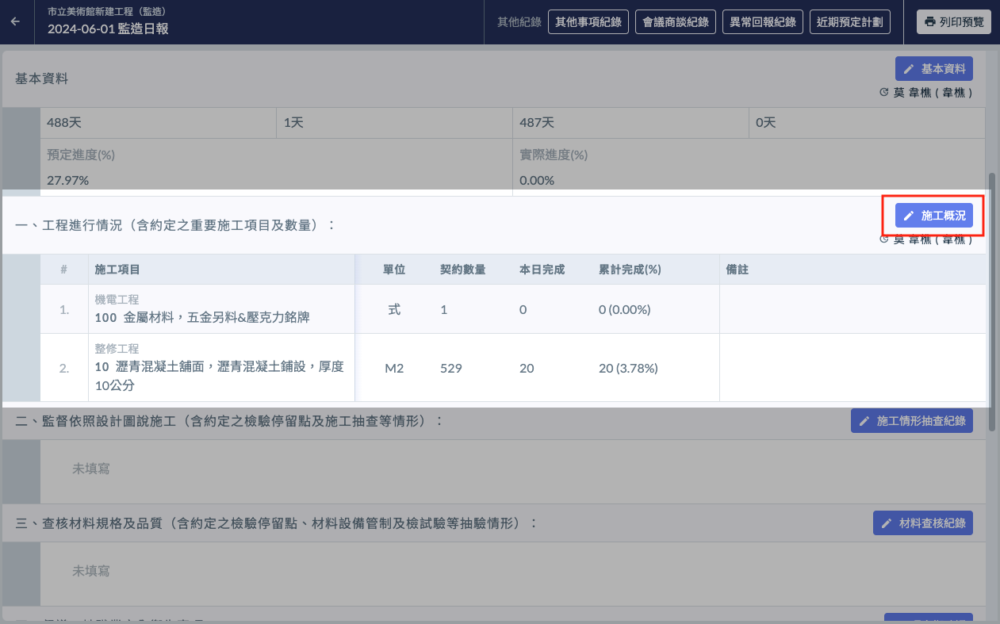
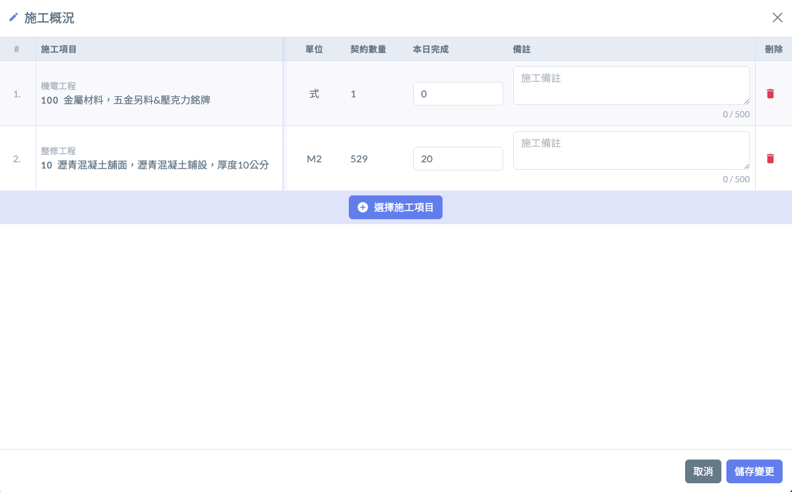
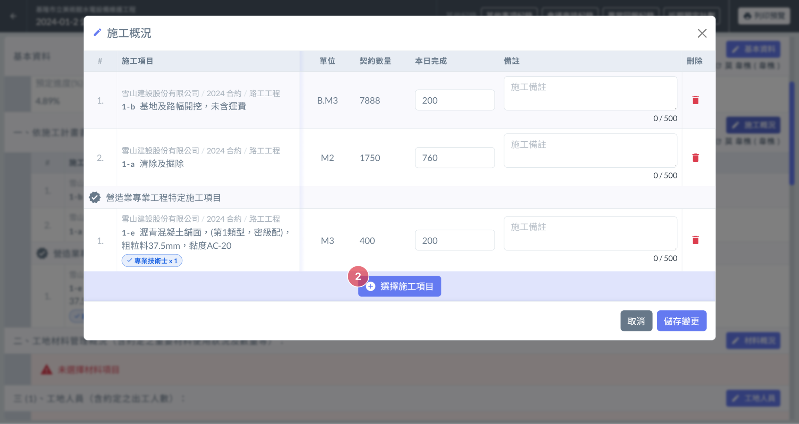
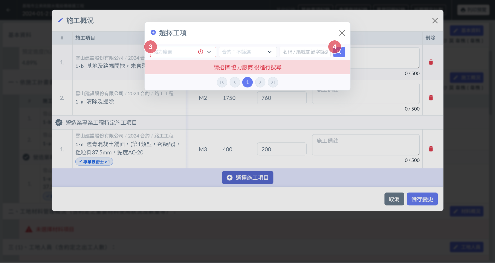
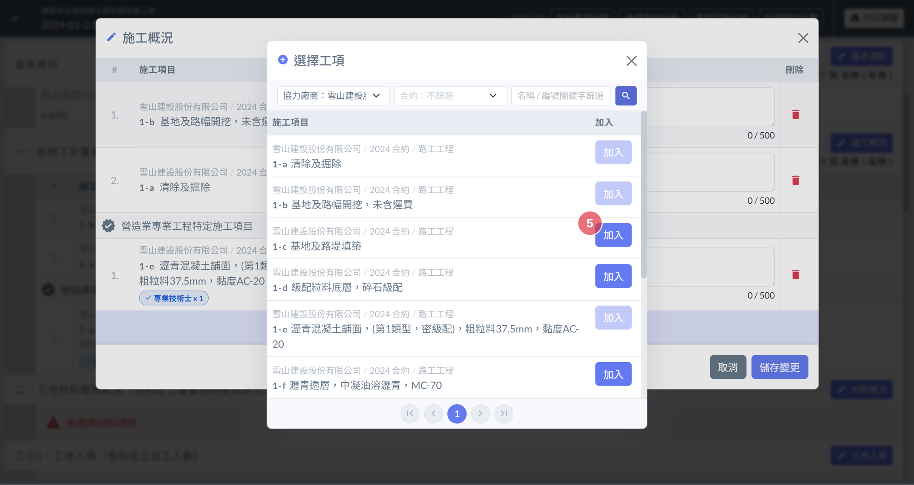
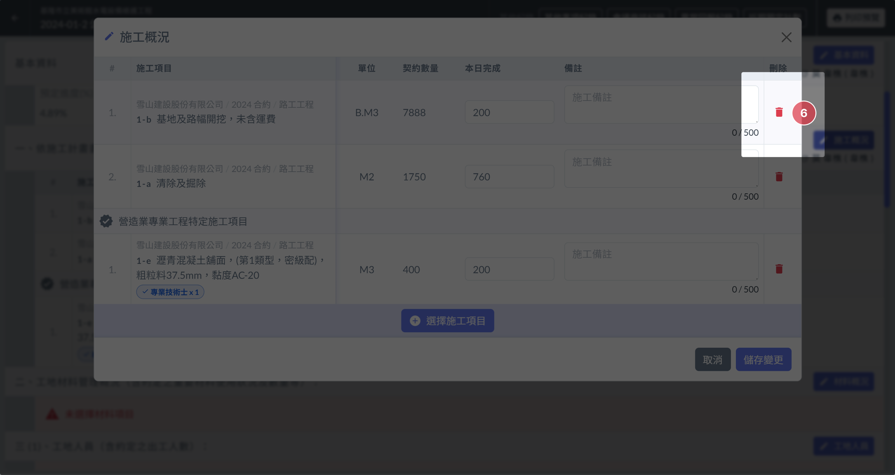
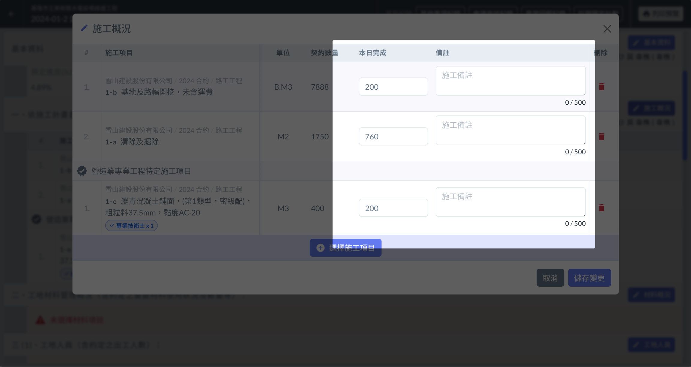
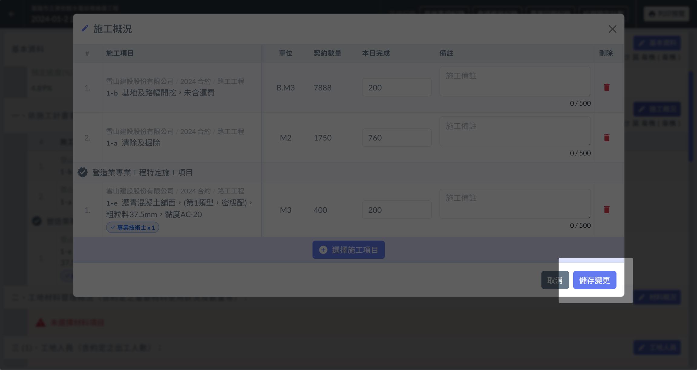

# 日報 / 施工概況

---
description: 紀錄當日施工項目、完成數量、備註的相關資訊。
---

# 日報 / 施工概況

## 📓 01｜開始編輯

區塊標題右側有個施工概況的 **編輯按鈕**（下圖 1 紅框圈起處），點選即可開啟管理介面（圖 2 ）。

在管理介面中，可以進行新增、編輯、刪除工項等等操作。

 

## 📓 02｜項目管理

### 📄 加入項目

1. 開啟 **管理介面** 後，會在介面中看到「**選擇施工項目**」的按鈕（圖 3 紅色標點2 號）。
2. 在彈出的選擇介面中，**設定篩選條件（**&#x5716; 4 紅色標點 3 號）後點選右側的 **搜尋按鈕**（圖 4 紅色標點 4 號）就會出現符合條件的施工項目。
3. 找到您想要加入的項目後，點選該項目右側的「加入」按鈕（圖 5 紅色標點 5 號），即可將其加入列表中。

  

### 📄 移除項目

於「管理介面」找到您要移除的項目，該項目的最右側會有一個 垃圾桶圖案 的按鈕。點選垃圾桶圖案 的按鈕即可移除該項目。（可參考圖 6 紅色標點 6 號）

## 📓 03｜填寫

工項選擇完成後，可以於「管理介面」中，填寫 **數量** 與 **備註訊息**。

## 📓 04｜儲存變更

填寫完成確認無誤後，點選右下角的「**儲存變更**」即可將編輯後的資訊儲存起來。

