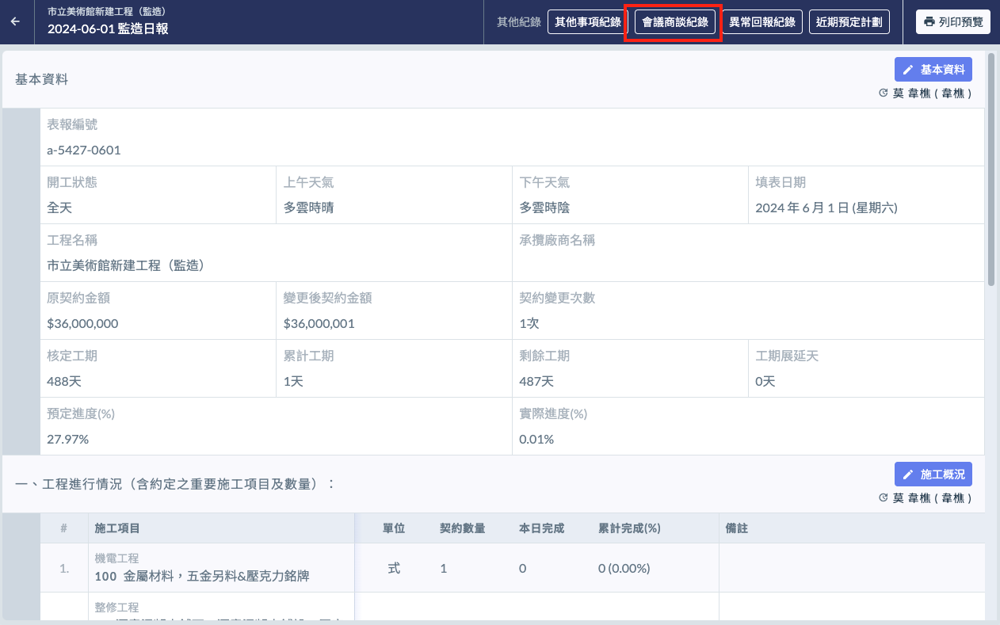
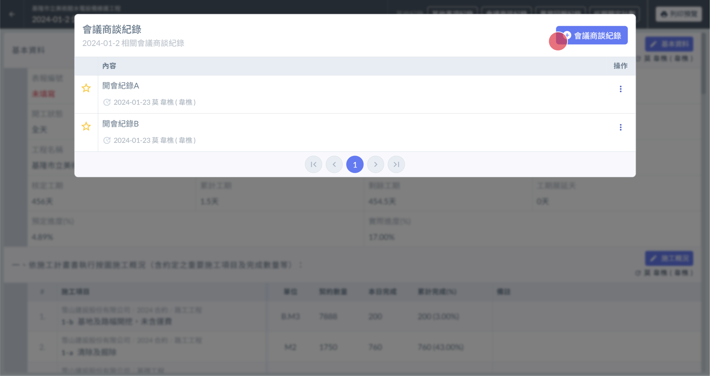
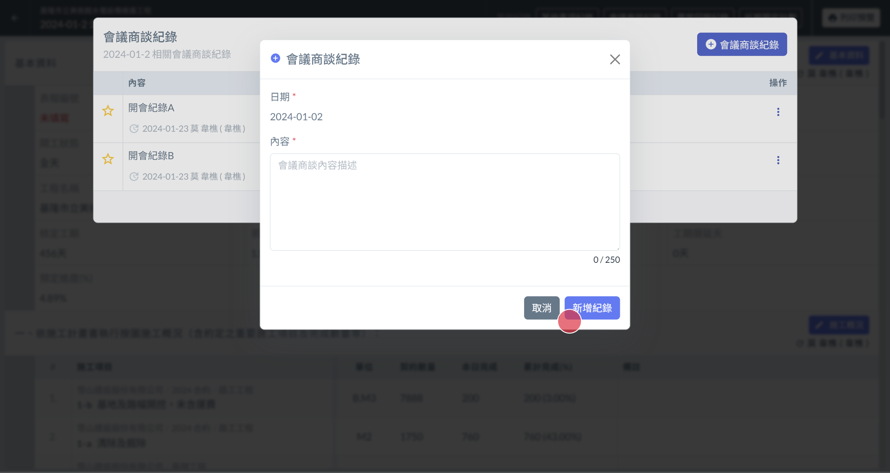
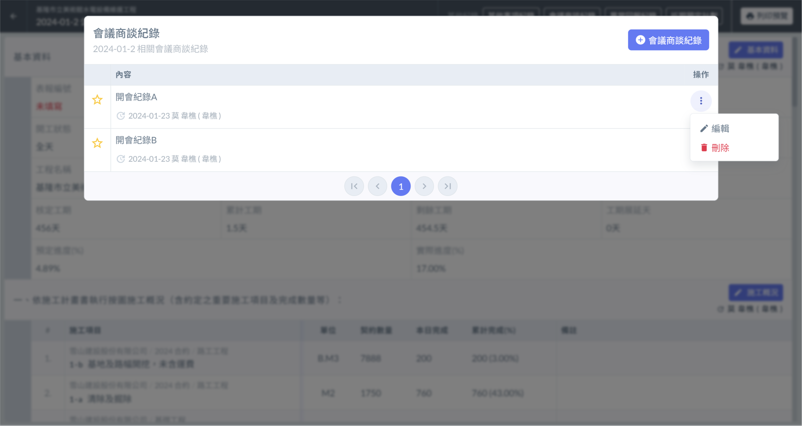

# 日報 / 會議商談紀錄

## 📓 01｜開啟介面

頁面最上方有個 **會議商談紀錄** 的按鈕（下圖紅框處），點選即可開啟檢視介面。

!!! info
    日誌中僅會顯示出當天的紀錄。
    
    如要跨日期檢視可從 [會議商談紀錄總表](../meeting-record-all) 進行檢視。

## 📓 02｜新增紀錄

* 紀錄介面右上方有個 **新增紀錄** 的按鈕（左圖 🔴）。
* 點選即可開啟編輯頁面（右圖）
* 填寫完畢後，點選右下角的 **新增紀錄**（右圖 🔴）即可新增紀錄。

!!! info
    日誌中僅允許新增當天的紀錄。
    
    如欲新增其他日期可從其他日期的日誌進行新增，或是從 [會議商談紀錄總表](../meeting-record-all) 進行新增。

 

## 📓 03｜編輯、刪除紀錄

找到您要操作的提示項目，於該項目的最右側，有個 **三個點圖案的按鈕**。點選後會出現 **編輯** 與 **刪除** 的按鈕。

* 刪除：請點選刪除按鈕。
* 編輯：請點選編輯按鈕。並於修改介面中修改完成後按下儲存按鈕。

