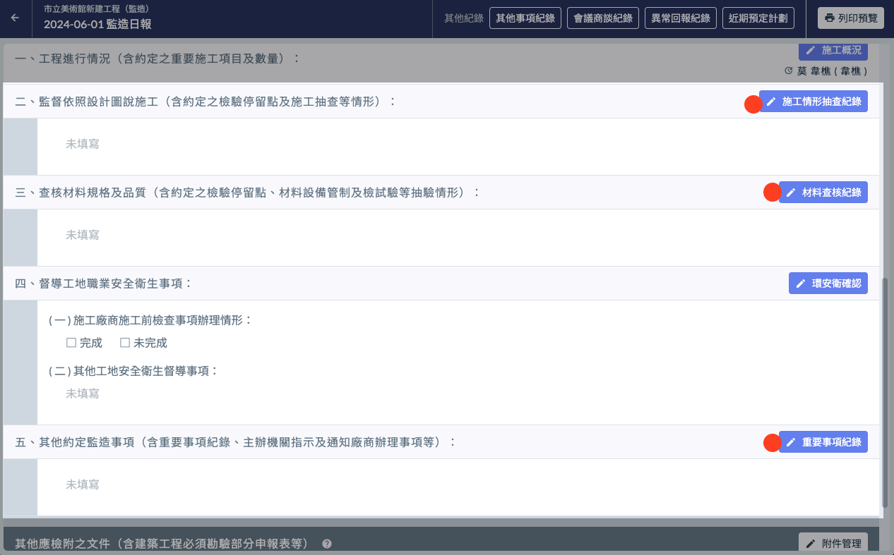
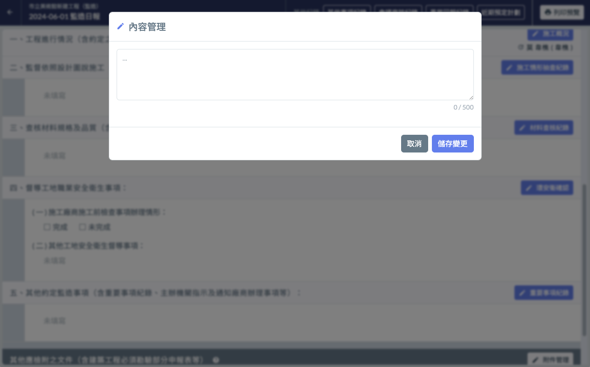
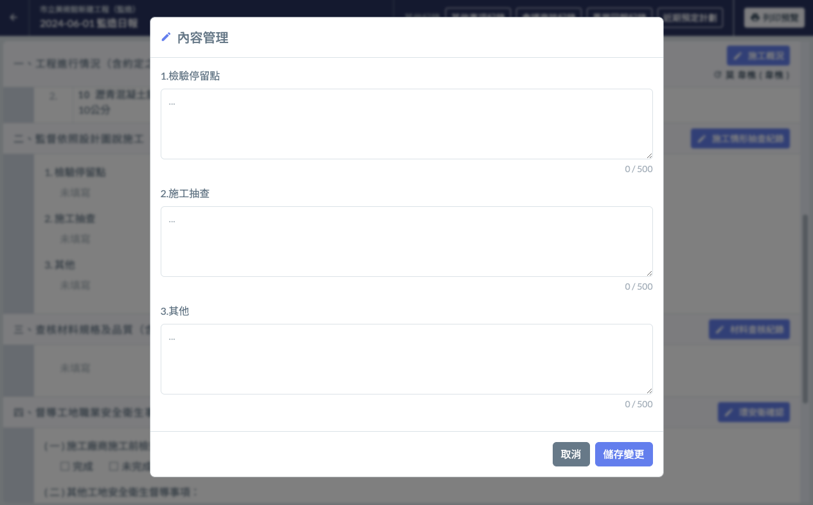

# 日報 / 監督依照設計圖說施工、查核材料規格及品質、其他約定監造事項

---
description: 提供相關填寫欄位，並透過「欄位重點提示」的功能，提醒填寫人填寫指定內容。
---

# 日報 / 監督依照設計圖說施工、查核材料規格及品質、其他約定監造事項

## 📓 01｜如何編輯

* 區塊標題右側 皆有個 **編輯按鈕**（左圖 🔴）
* 點選即可開啟管理介面（右圖）。
* 填寫完成確認無誤後，點選右下角的「儲存變更」即可將編輯後的資訊儲存起來。

 

## 📓 02｜進階應用 欄位重點提示

針對監督依照設計圖說施工、查核材料規格及品質、其他約定監造事項這三個欄位，Jobdone 額外提供了**欄位重點提示** 功能。

 

> **如何設定欄位重點提示？**
>
> 請參閱 → [欄位重點提示設定](../system-settings/hint-setting)

!!! warning
    **提示在 欄位重點提示設定 中被修改，是否會影響已經填寫好的日報？**
    
    為了確保資料填寫的正確性， 但凡該日誌的該欄位****曾經進行填寫操作**** ，該欄位的提示文字就將****不再隨設定中的異動而改變****。

