# 專案會議記錄

---
description: Project Meeting Minutes
---

# 專案會議記錄

### 💬 01｜建立會議&#x20;

進入 『會議紀錄』 主頁面後，於畫面右上方點選<kbd><mark style="color:purple;">**＋建立會議**<mark style="color:purple;"></kbd>按鈕。系統將彈出新增視窗，引導您完成會議主檔的初始化設定。

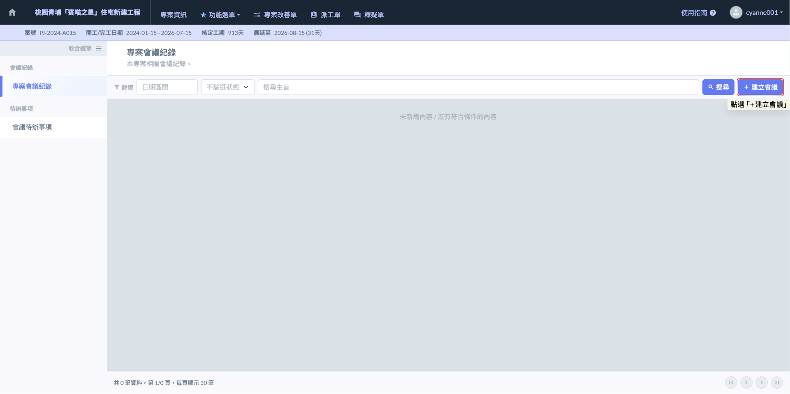

如圖二，在建立會議紀錄時，系統提供多項關鍵欄位供管理人員填寫。

請參閱下列欄位說明進行標註，詳實且精確的基礎資訊，不僅能確保後續決議追蹤的嚴謹性，更能大幅提升日後跨專案檢索的便利性。

<table><thead><tr><th width="104.728271484375">欄位名稱</th><th>說明</th></tr></thead><tbody><tr><td>會議主旨</td><td>**(必填)** 記錄會議的核心名稱。建議採統一命名慣例(如：第N次工務會議、B1樓版灌漿前協調會)，以便日後快速索引。</td></tr><tr><td>日期</td><td>**(必填)** 紀錄實際招開會議日期。此日期常作為工程法律中「知悉特定事件」的起算點，對工期展延申請至關重要。</td></tr><tr><td>時間</td><td>標注會議的具體時段。詳實的紀錄有助於還原決策當下的時序脈絡，特別是在處理緊急派工或工安事件時。</td></tr><tr><td>地點</td><td>詳列開會場所（如：二樓工務所、現地 B2 區、視訊會議）。</td></tr><tr><td>會議等級</td><td>
<strong>公開</strong> 所有專案成員均可檢視。適用於進度宣導、勞安通報等需資訊透明之事項。

------------------------------------------------------------------------------------

<strong>機密</strong> 僅限列名於「與會人」名單之人員可檢視。適用於設計合約爭議、預算變更或特定行政決策。
</td></tr><tr><td>會議類型</td><td><strong>一般</strong> 針對特定突然事件、臨時變更或單一技術問題召開的臨時性會議。 ------------------------------------------------------------------------------------ <strong>例行性</strong> 具備固定頻率的會議（如日報會、週進度會），便於系統產出週期性報表。</td></tr><tr><td>與會人</td><td>**(必填)** 紀錄所有參與討論的單位與個人。支援<strong>選擇系統帳號</strong>或<strong>自定義輸入</strong>（紀錄外部顧問、政府官員或未註冊帳號之廠商代表等）。</td></tr><tr><td>會議標籤</td><td>使用者可自定義標籤（如：#變更設計、#進度落後、#查驗缺失）。透過標籤，管理者能跨會議分析特定問題的演進與結案狀況。</td></tr><tr><td><mark style="color:blue;"><strong>關聯會議</strong></mark></td><td>可選擇本專案中過往已建立的會議紀錄進行關聯。系統將自動建立雙向連結，方便管理人員在多個相關會議間快速跳轉。</td></tr></tbody></table>

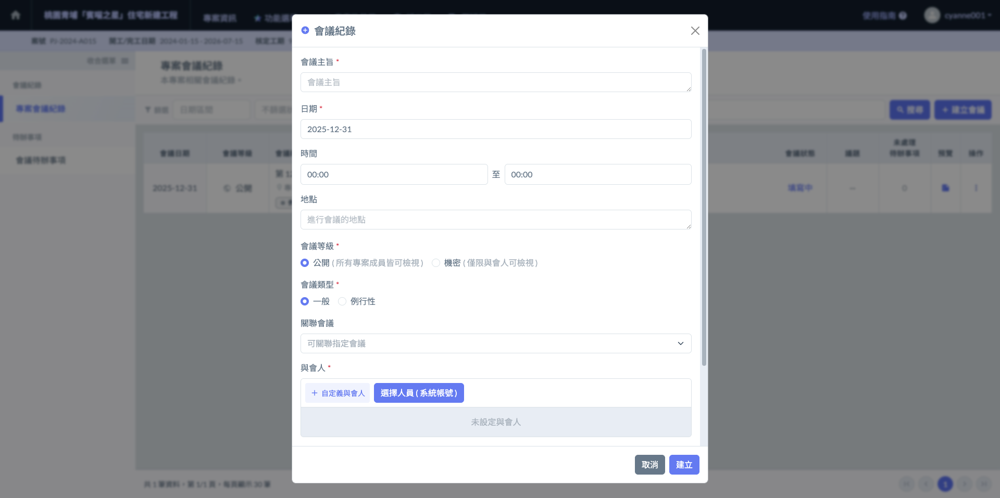

***

#### 01 - 1｜會議與會人設定與權限說明

在填寫會議紀錄時，必須為每位與會人員設定其 「會議身分」 與 「系統操作權限」，相關規則如下：

**一、會議身份設定**

不論人員來源為何，皆需從下拉選單中指派其在該次會議中的角色：



負責主持會議及裁示決議者。



參與編寫會議內容與追蹤事項者。



參與討論並接收決議之相關單位代表。



**二、權限控管邏輯（依人員類型區分）**

系統根據人員屬性，提供不同的權限配置方案：



從系統清單（包括**專案成員**/**協力廠商**、**專案相關成員**等）中選取的成員，除了設定身份外，還可進一步勾選是否給予「會議操作權限」。

<i class="fa-id-badge">:id-badge:</i> 獲取權限的帳號將具備編輯、調整該份會議紀錄之能力。

!!! info
    設定系統人員清單，請參閱 ➙ [專案成員](../../project_level/project_stakeholders/team-members)、[協力廠商](../../project_level/project_stakeholders/subcontractor)、[相關成員](../../project_level/project_stakeholders/associated-members)




若為手動輸入的外部專家、政府官員或未註冊廠商，僅需設定其「會議身份」。由於此類人員不具備Jobdone 帳號，故毋須進行操作權限之設定。



填寫範例如圖三、圖四所示：

!!! danger
    #### **🔐 機密會議存取權限：特殊例外說明**
    
    雖然系統針對「機密」等級之會議設有嚴格的存取限制，但在營建管理實務中，基於「工地負責人制」，系統設有以下權限例外規則：
    
    * 一般原則： 機密會議之紀錄僅限於「與會人名單」內的人員可以檢視與檢索。
    * 管理特權（工地主任）： 若使用者的系統職能設定為 「工地主任」，則具備最高層級之閱覽權限。不論該位工地主任是否被列入與會人名單，皆具備權限編輯、查看該專案下所有的機密會議內容。
    
    ***
    
    此設計是為了確保工地主任在處理突發爭議、工安事故檢討或高層決策時，能掌握百分之百的資訊。工地主任作為案場的第一責任人，不應因行政登載疏漏（漏列與會人）而被排除在核心資訊之外。

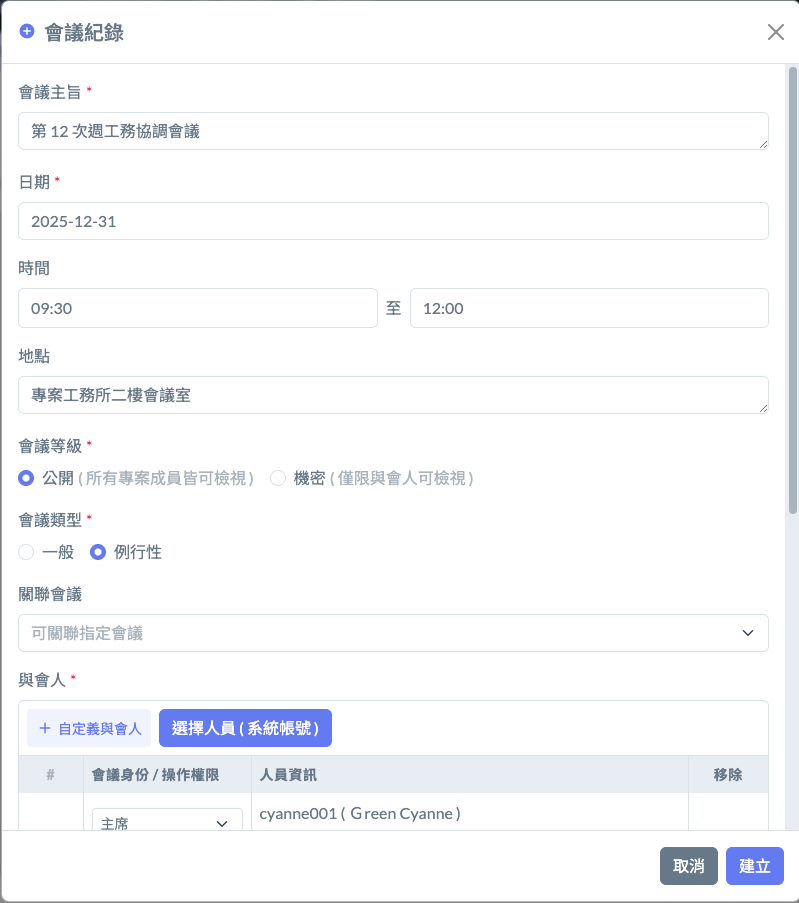 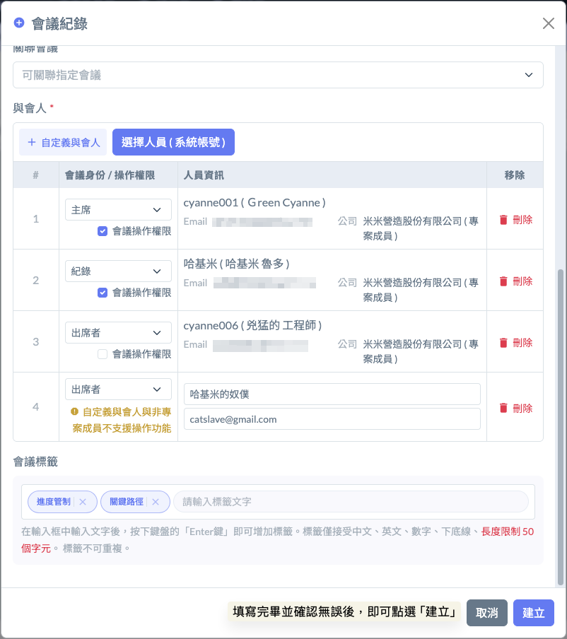

完成畫面如下：

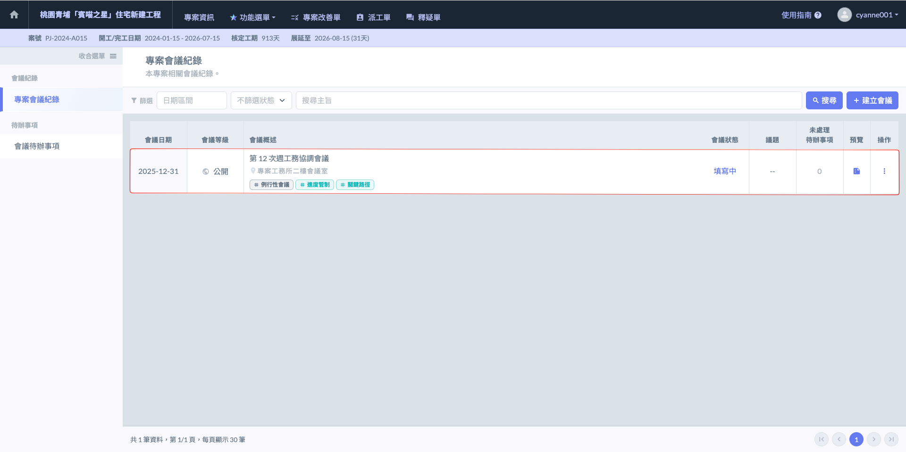

***

### ✍️ 02｜編輯會議紀錄

於 『專案會議紀錄』 主畫面中，於清單內找到欲編輯的會議項目。直接點選該會議項目，即可進入紀錄詳情頁面進行內容編寫。

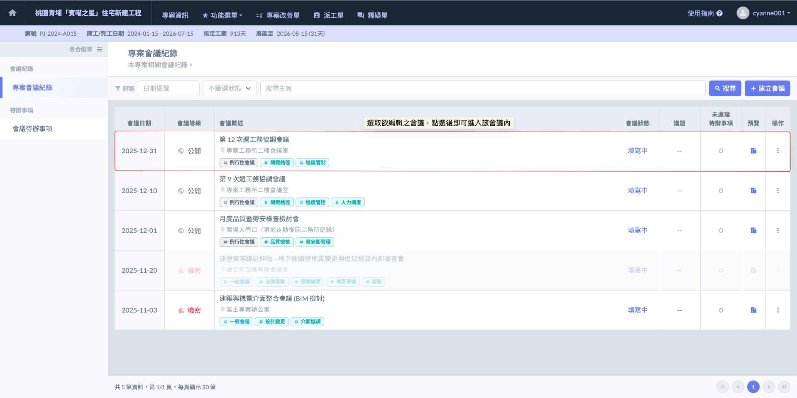

進入會議紀錄詳情後（如圖二所示），系統採用雙頁籤設計，將資訊分類為<kbd>**會議資訊**</kbd>與<kbd>**議題討論**</kbd>，方便您在基礎資料維護與決議執行紀錄間快速切換。

!!! info
    建議您先在『會議資訊』確認與會人名單無誤後，再切換至『議題討論』開始錄入決議事項，以確保資訊權限與派工對象的準確性。



此頁籤主要負責會議的靜態資料管理與權限控管，包含：

* 修改會議資訊： 調整會議主旨、時間、地點及會議等級（公開/機密）。
* 與會人管理： 設定出席名單、指派會議身分 (主席、紀錄、出席者)，並授予系統帳號之操作權限
* 管理相關釋疑單： 集中檢視與本場會議相關聯的釋疑單（RFI）狀態。
* 會議相關附件： 上傳會議簽到表、現場全景照片或參考圖說等佐證資料。
* 相關會議： 查看與過往會議的連結，梳理專案決策的演進脈絡。



此頁籤為會議紀錄的動態執行區，用於將討論內容轉化為行動指令：

* 會議總結： 填寫本次會議的整體結論（建議包含時程動態、重大決策與風險提醒三要素）。
* 會議議題： 結構化錄入各項討論議題，包含議題主旨、備註、標籤及分析屬性。
* 決議與待辦： 在個別議題下填寫最終決議，並新增待辦事項以聯動【派工單】或【釋疑單】，達成跨模組追蹤。



#### 02 - 1｜會議資訊

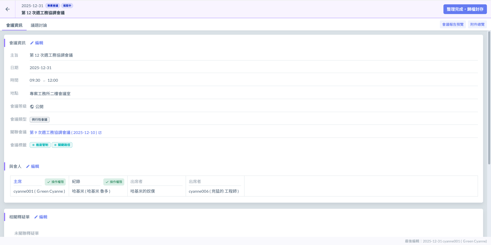



#### 相關釋疑單

如圖三，點選下方『相關釋疑單』欄位之  按鈕，即可開啟會議相關釋疑單管理頁面。在此視窗中，您可以將本次會議討論之各項議題，與系統內現有的釋疑單（RFI）進行關聯，確保技術疑義的討論與正式公文紀錄能互為佐證，達成資訊同步管理。

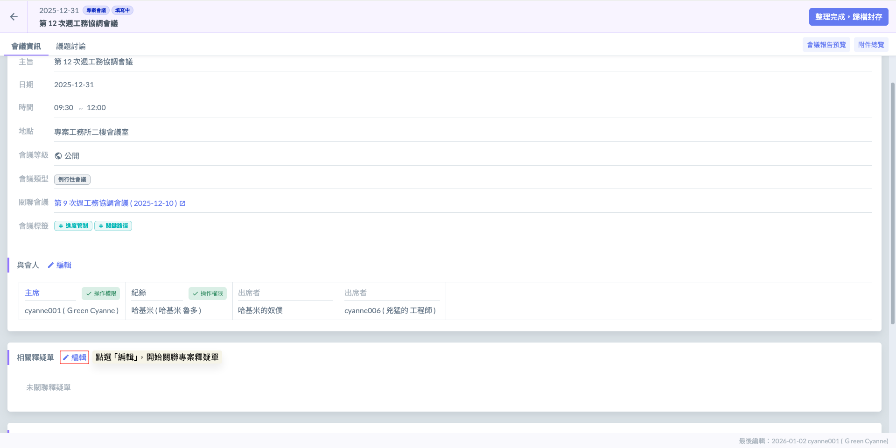

#### 查看釋疑單

進入管理畫面後，系統將顯示該專案下所有的釋疑單紀錄。

系統預設顯示為<kbd>**已送出的釋疑單**</kbd>（由公司成員對外提出的詢問）。若欲檢視由其他單位（如建築師、業主或分包商）發給公司成員之釋疑詢問，請點選上方頁籤切換至<kbd>**已接收的釋疑單**</kbd>。

這能確保會議中不論是公司對外的請求，或是他人對公司的提問，皆能完整納入追蹤。

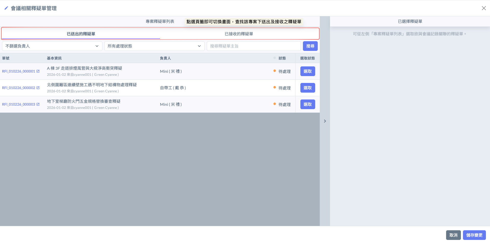

如圖五，於釋疑單列表中找到欲查看的項目後，直接點選其 ****釋疑單號****，系統將立即跳轉至該單據詳情頁面。您可以即時查看具體的詢問內容、相關附件及各方回覆紀錄。

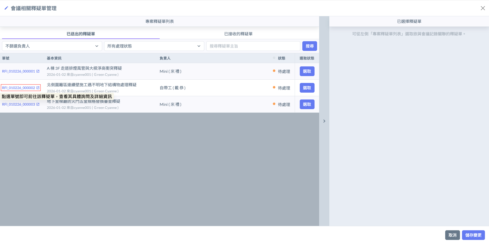

釋疑單畫面如下：

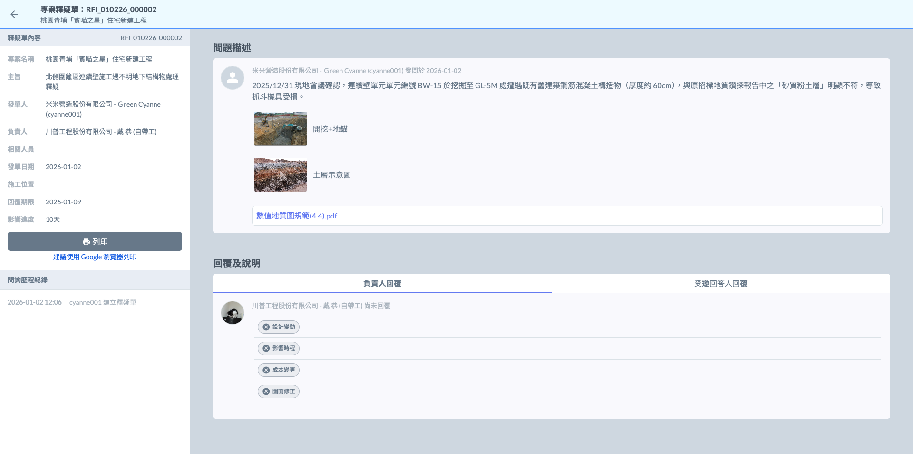

***

#### 選取釋疑單

如圖七所示，確認釋疑單內容後，於欲關聯至本次會議紀錄的項目，點選  按鈕，將該單據加入預選區。待所有相關單據選取完畢，請務必點選右下方的<kbd><mark style="color:purple;">**儲存變更**<mark style="color:purple;"></kbd>，系統即會正式建立會議與釋疑單之間的連結。

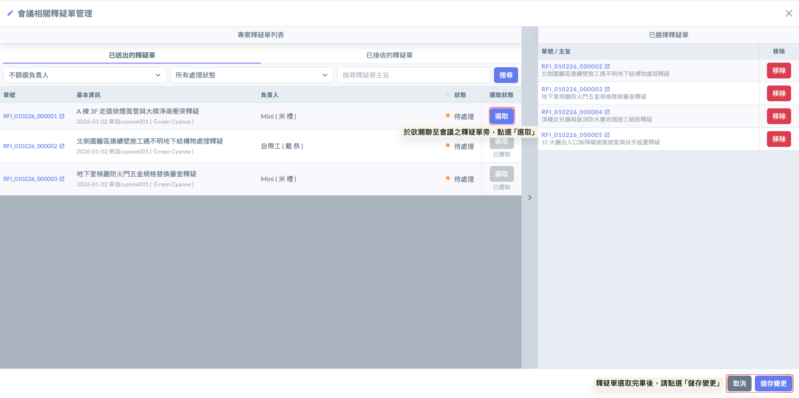

完成關聯後的畫面如下圖所示。系統會將選定的釋疑單彙整於清單中，同樣地，您只需直接點擊『釋疑單號』，即可快速跳轉至該單據詳情，詳細查看詢問內容、附件及最新的審核進度。

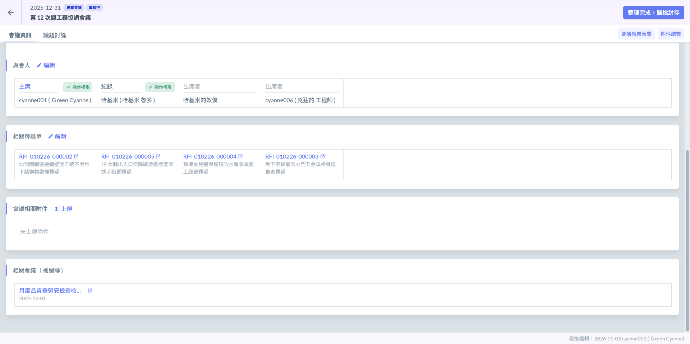



#### 會議相關附件

如圖九，若有針對「整個會議」之共通性附件（如簽到表、整體環境全景、大宗物料清單等），請於『會議相關附件』欄位右側點選  圖示，即可開啟檔案上傳視窗。

!!! warning
    **提醒：**&#x672C;區塊與「議題相關附件」不同，建議用於存放該次會議行政流程或專案整體性之資料。

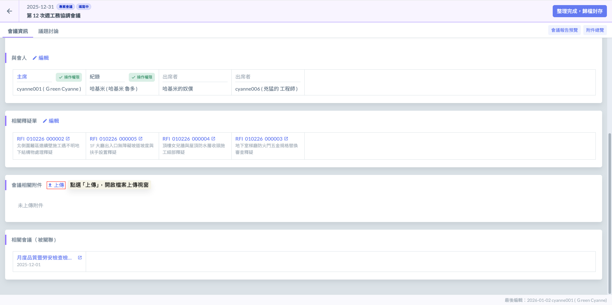

如圖十，開啟上傳視窗後，即可選取欲上傳的相關檔案。待檔案選取完畢，請點選<kbd><mark style="color:purple;">**新增附件**<mark style="color:purple;"></kbd>按鈕，系統即會將檔案正式上傳。

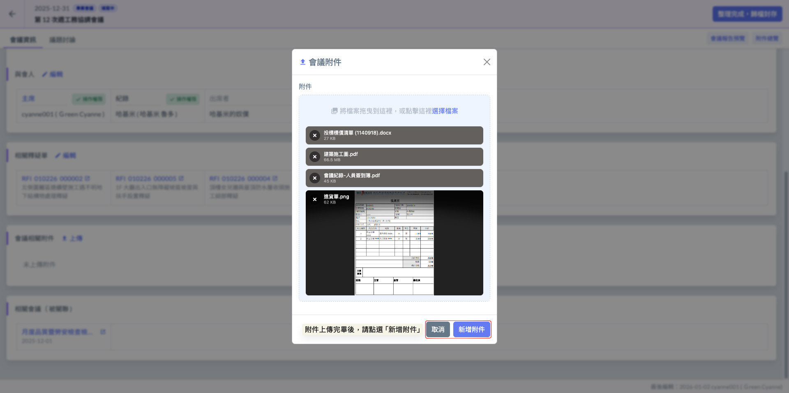

完成上傳後的畫面如圖十一所示。所有會議的附件將條列呈現，您只需點選「檔案名稱」，即可直接預覽內容。

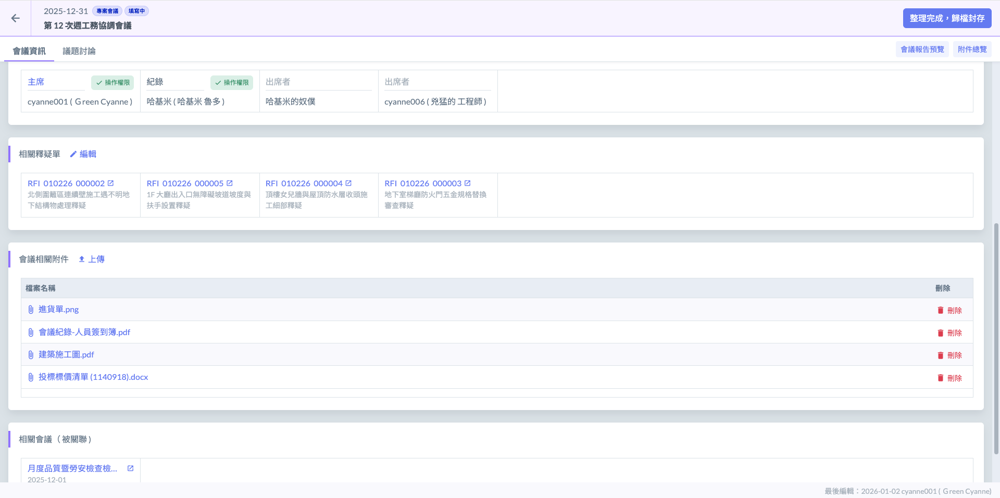



#### 相關會議（被關聯）

在『相關會議（被關聯）』欄位中，系統將自動顯示所有****「曾將本次會議設為關聯對象」****的會議紀錄清單。您只需點選會議標題或編號，即可快速跳轉查看後續或相關的會議詳情，達成跨場次、跨階段的決策追蹤。

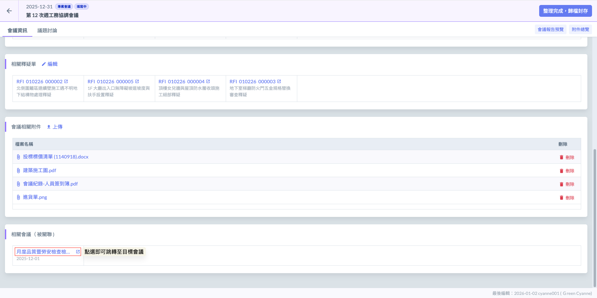

如圖十三，進入後即可查看（將本次會議設為關聯會議之會議）詳細會議資訊。

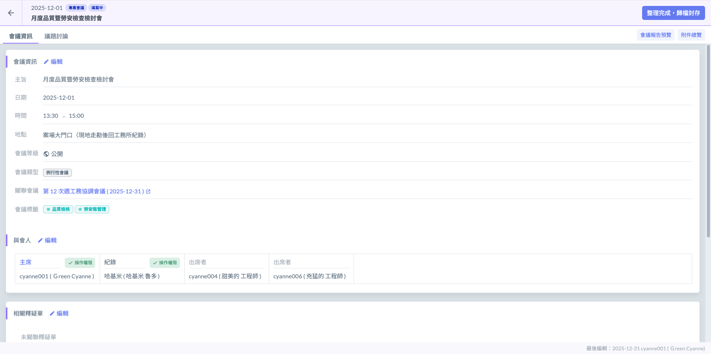



***

#### 02 - 2｜議題討論

若欲填寫會議之整體總結與各項詳細議題，請點選頁籤進行切換，進入『議題討論』視窗開始編寫。

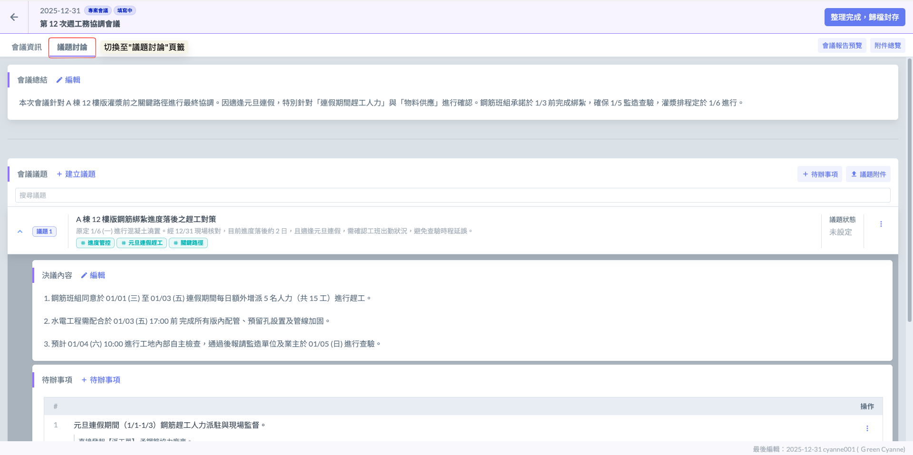



#### 填寫會議總結

進入<kbd><mark style="color:purple;">**議題討論**<mark style="color:purple;"></kbd>頁籤後，於『會議總結』欄位右側點選 圖示，即可開始撰寫本次會議的核心摘要與重點結論。

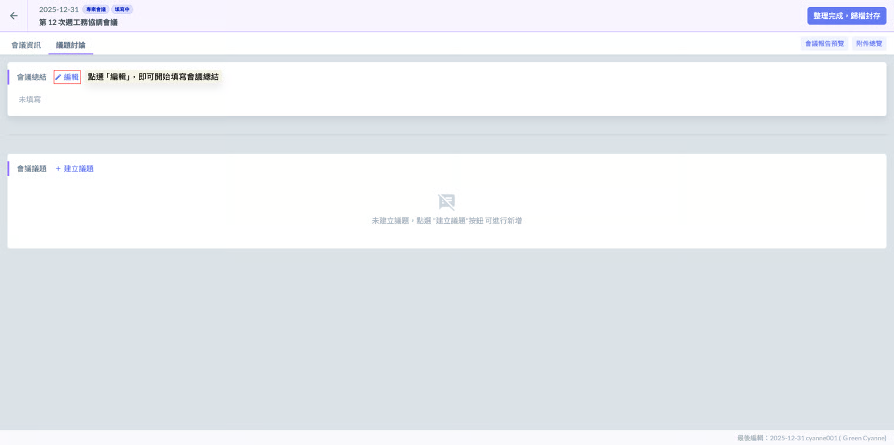

開啟編輯視窗後，請詳細填寫本次會議的整體結論。填寫完畢並確認內容準確無誤後，點選右下方的<kbd><mark style="color:purple;">**儲存變更**<mark style="color:purple;"></kbd>即可完成更新。

!!! info
    針對「會議整體總結」，與細節導向的議題決議不同，總結必須具備全局觀與管理高度。在營建業中，總結通常是給專案總監、業主代表或高層主管快速掌握專案動向用的。
    
    以下是建議的會議總結：
    
    **1. 關鍵時程與路徑動態 (Critical Milestone & Path)**
    
    * 總括本次會議對專案「大時程」的影響。 應包含重大里程碑的變動、停檢點（Hold Points）的達成狀況，或是關鍵路徑（Critical Path）是否有受阻風險。
    
    如：「本次會議確認 A 棟 12F 灌漿日定於 1/6，目前結構工程進度符合基準計畫；惟元旦連假期間之鋼筋人力需專案追蹤。」
    
    ***
    
    **2. 重大變更與爭議決策**
    
    * 紀錄涉及金額（成本）、設計重大修改或各方權責界定的核心決議。應提煉出最需各方注意的契約異動，特別是那些會影響到後續計價或合約權利的事項。
    
    如：「針對地下室地質異常議題，各方達成共識啟動變更設計程序，並由承商於下週前提報影響評估報告。」
    
    ***
    
    **3. 交辦事項與高風險控管**
    
    * 針對安全（勞安）、品質缺失或緊急待辦事項的指示。點出當前專案最迫切需要解決的風險點，作為下週會議追蹤的頭條項目。
    
    如：「嚴格執行連假期間之工地門禁與動火管理；另針對本月查驗之結構缺失，廠商需於 1/5 前完成整改並報請複驗。」

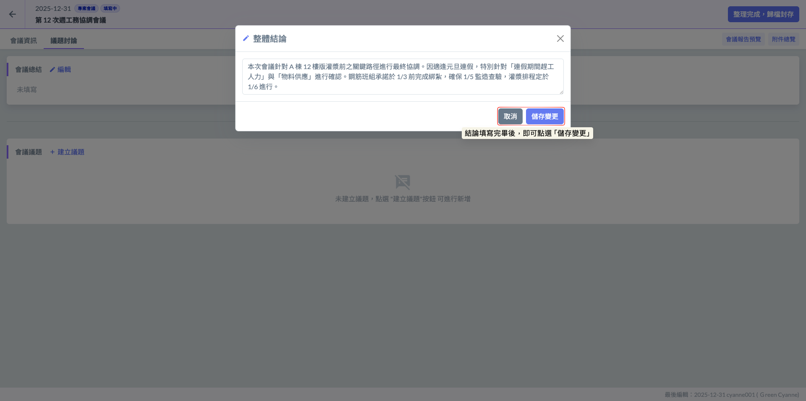

完成畫面如下：

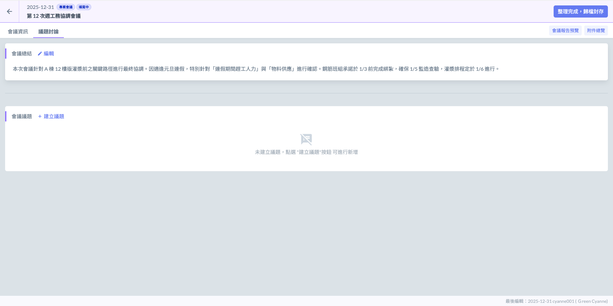



#### 新建會議議題

會議總結填寫完畢後，即可於『會議議題』欄位右側點選  圖示，開始建立具體的討論議題。透過將會議內容拆解為獨立議題，能有效落實專業分工管理，並確保每一項決議都能精確對接到後續的執行單據。

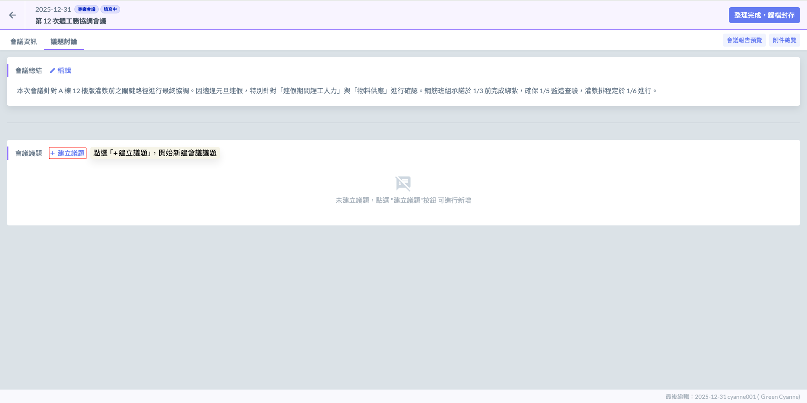

開啟新增視窗後，請詳實填寫會議議題的基本資訊。除了『議題主旨』與詳細『備註』外，您還可以利用『自訂標籤』進行彈性分類，並選定『議題分析屬性』，這將有助於系統在後端自動彙整工程大數據，提升專案控管的精確度。

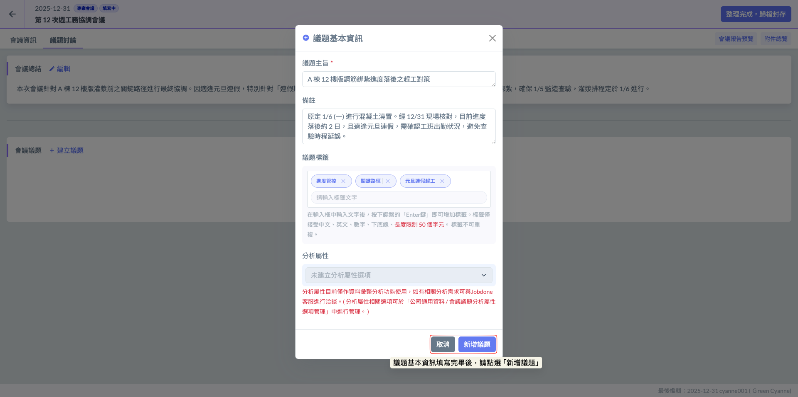

完成畫面如下：

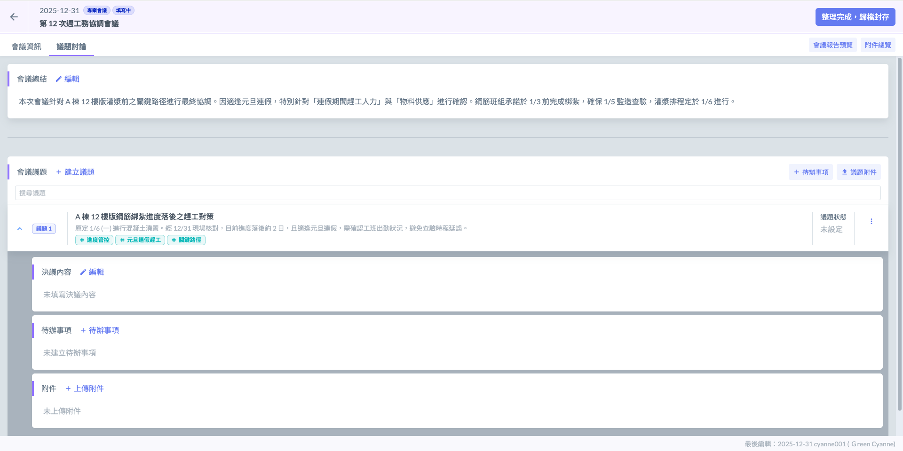



#### 填寫決議內容

議題基礎資訊建立完畢後，請於下方的『決議內容』欄位點選  圖示。此處用以精確記錄該項議題最終達成的共識、工法裁示或時程承諾，是後續發起派工與釋疑作業的核心依據。

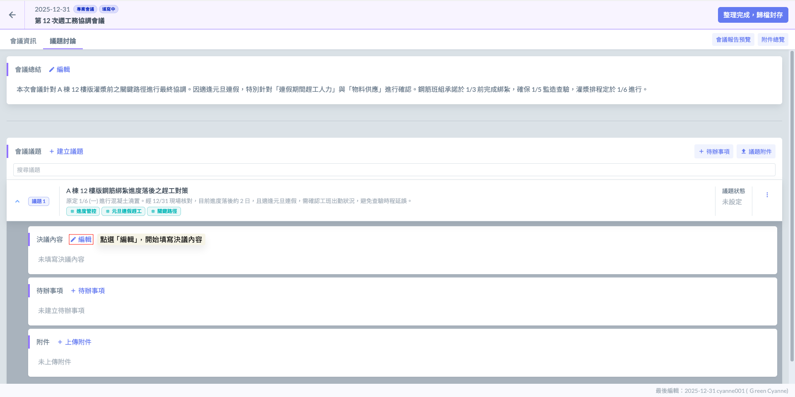

開啟編輯視窗後，即可針對該議題撰寫最終決議內容。填寫完畢並確認資訊精確無誤後，點選右下方的<kbd><mark style="color:purple;">**儲存變更**<mark style="color:purple;"></kbd>，系統將即時更新該議題的執行狀態。

!!! info
    #### 撰寫專業決議的三要素
    
    為了確保會議紀錄具備法律證據力並能有效指導現場施工，建議決議內容應包含：
    
    1. 具體執行動作： 採用何種工法、材料或程序（例如：採無收縮水泥灌漿、預留孔補強）。
    2. 權責執行單位： 明確指定負責的協力廠商或部門（例如：機電分包、土建班組）。
    3. 明確完工期限： 設定精確的時點（例如：2026/01/03 17:00 前），而非模糊的「盡速辦理」。

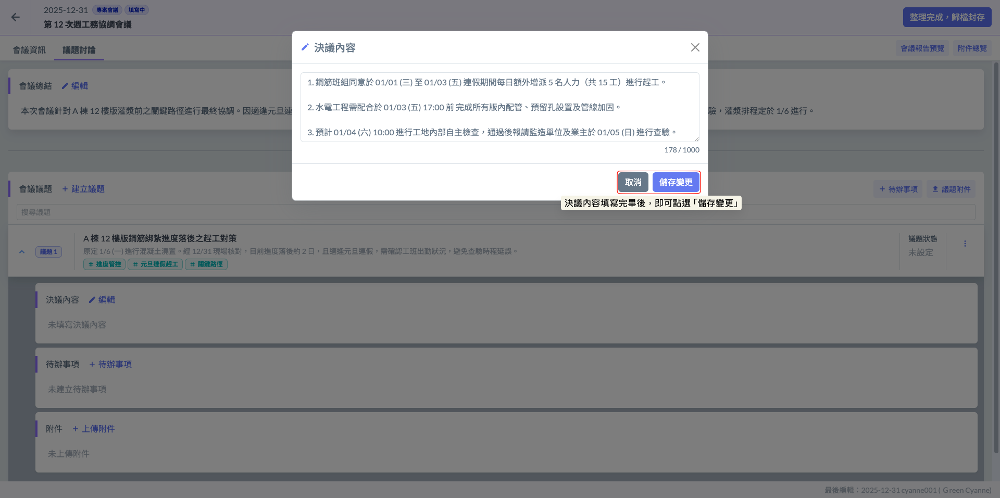

完成畫面如下：

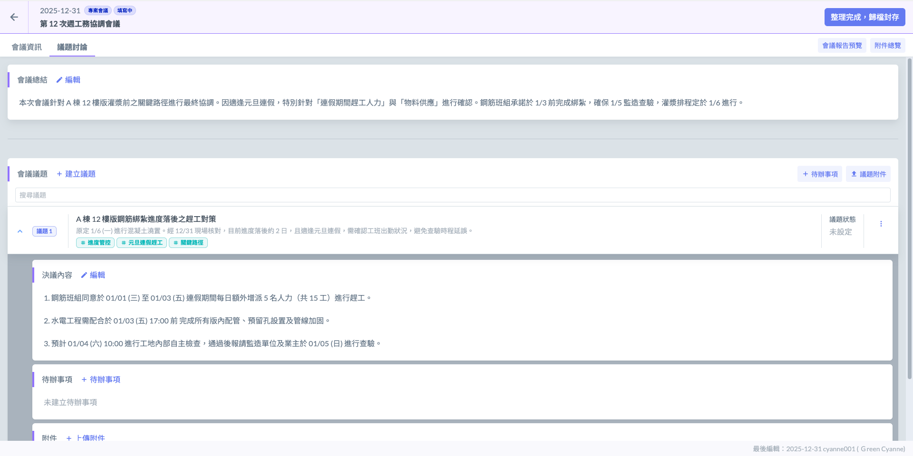



#### 新增待辦事項

將決議內容填寫完畢後，即可點選待辦事項欄位旁的  圖示。此動作能將靜態的會議文字，進階拆解為具備執行對象、期限與單據連動功能的動態任務，確保決議事項能精確落地執行。

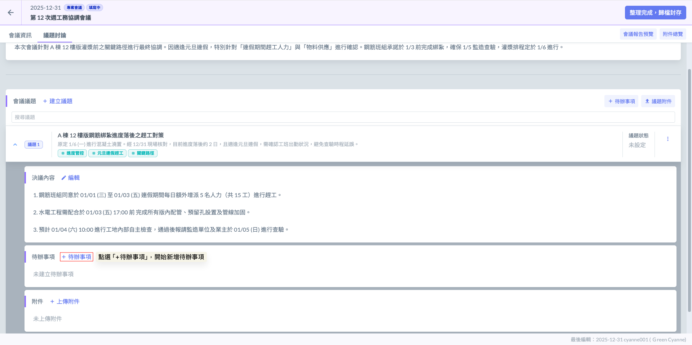

開啟待辦事項填寫視窗後，即可將決議轉化為具體任務。請詳實填寫『待辦事項主旨』與『備註』，並確認『相關議題』之關聯性，填寫完畢並確認無誤後，即可點選<kbd><mark style="color:purple;">**新增待辦事項**<mark style="color:purple;"></kbd>。

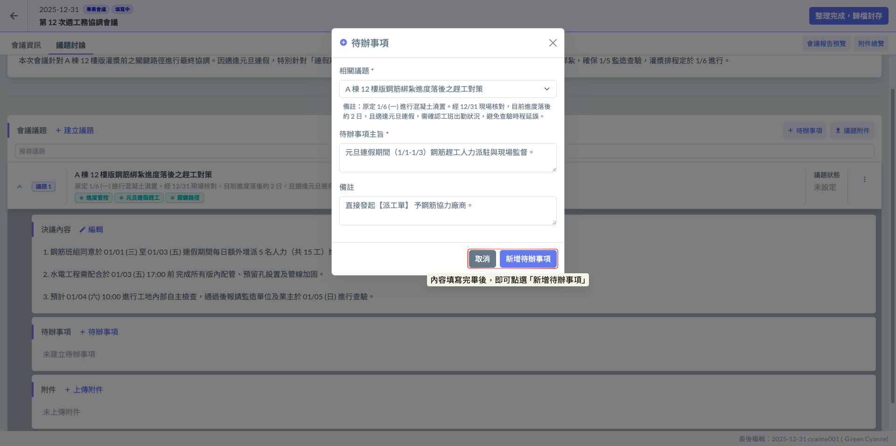

完成畫面如下：

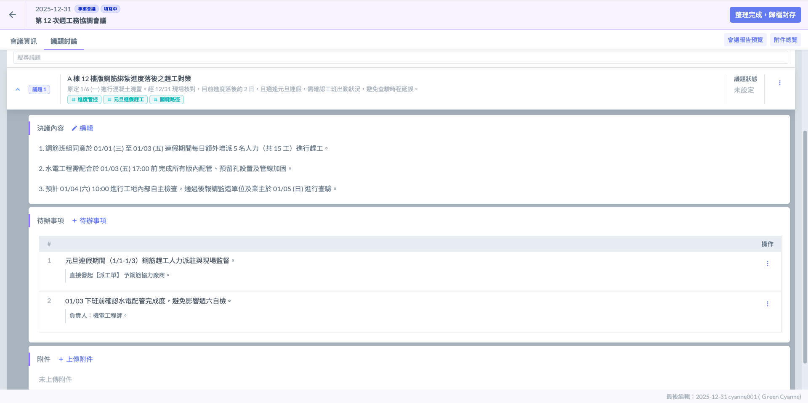



#### 新增附件

待辦事項填寫完畢後，即可點選附件欄位旁的  圖示，針對各項議題上傳相關佐證資料。系統支援照片、PDF 圖說、Office 文件等多種檔案類型，協助您將會議討論與現場實況連結。

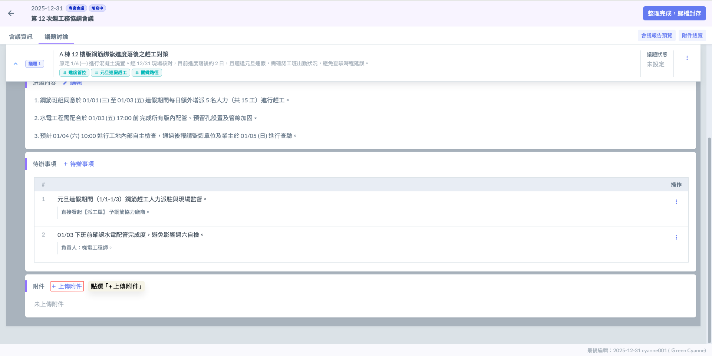

開啟『議題附件』視窗後，您可以精確選擇欲對應的議題，並支援一次批次上傳多筆檔案。資料上傳完畢並確認無誤後，即可點選視窗右下方之<kbd><mark style="color:purple;">**新增附件**<mark style="color:purple;"></kbd> 按鈕**。**

!!! tip
    系統內建智慧優化技術，能在完整保留高畫質細節的同時，對照片進行高效壓縮。

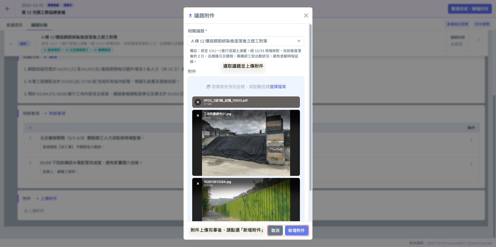

附件上傳成功後的畫面如下圖所示：

若欲檢視檔案詳情或確認照片細節，只需直接點選該檔名，系統即會開啟預覽模式供您查閱。

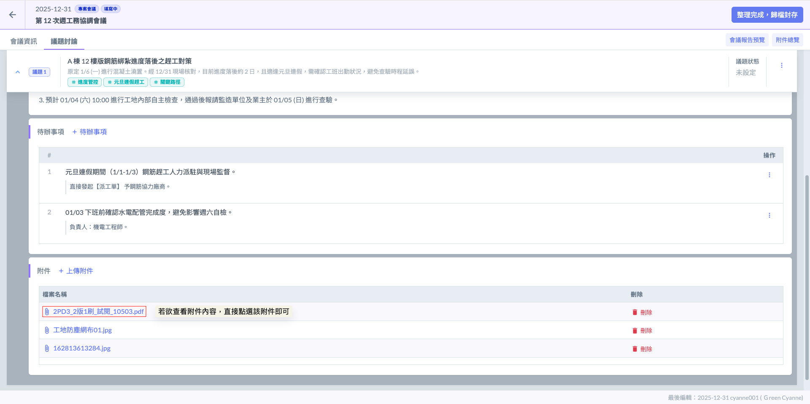


