# 材料設備管制總表

您可於此處選&#x64C7;**「材料管理」**&#x5167;之添加材料，增添至材料設備管制總表中。

並查看材料的所有詳細資訊，包括：

 檢驗材料相關資訊

契約數量/單位&#x20;

協力廠商

合約名稱

是否取樣試驗

使用位置

預定/實際送審日

驗廠日期

預定送審資料

預定/實際進場日

進場數量

抽樣日期

抽樣數量

規定取樣頻率

送樣日期

檢驗日期

{% embed url="https://files.gitbook.com/v0/b/gitbook-x-prod.appspot.com/o/spaces%2FEqUCL3D5WQfpxJw8NL3P%2Fuploads%2FIg8MCVqqOmeghG3haZ94%2F%E6%9D%90%E6%96%99%E6%AA%A2%E8%A9%A6%E9%A9%97%E5%BD%B1%E7%89%87.mp4?alt=media&token=661324fa-422f-4ebd-aaf6-24b90307bea1" %}

***

## 01｜檢驗流程

### 01 - 1｜選擇材料

於材料設備管制總表中點&#x64CA;**「****」**，即可開啟材料篩選器，選擇相應的協力廠商，繼而增添尚未加入管制列表的材料。

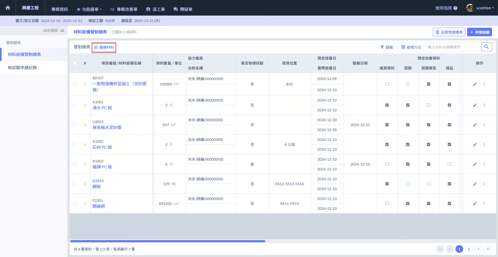 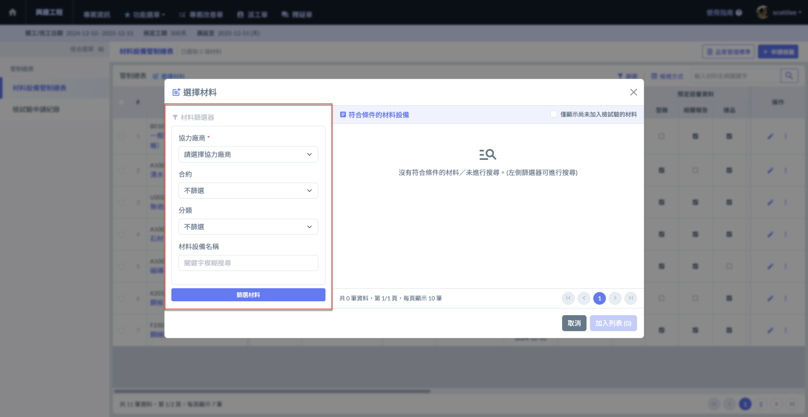

勾選材料加入您的管制列表內。

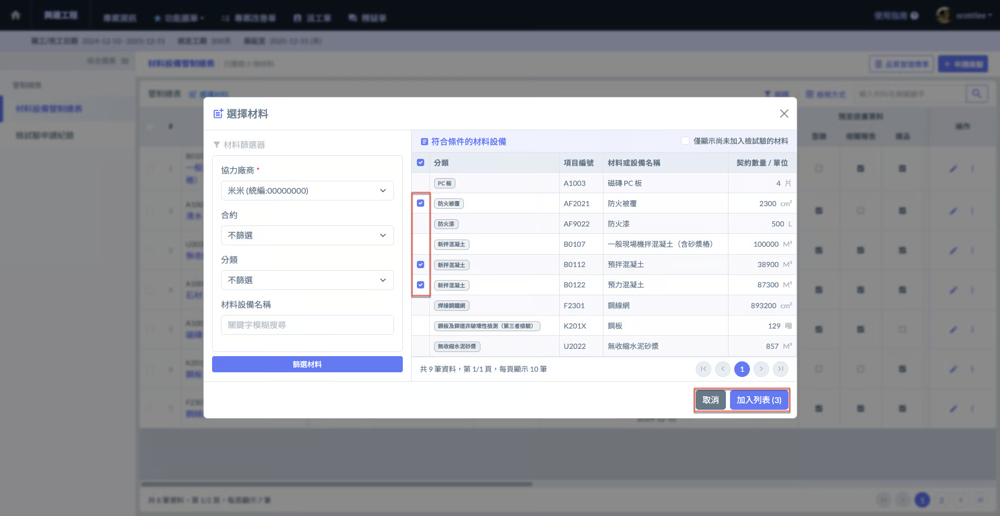

***

### 01 - 2｜申請檢驗

勾選欲申請檢驗的材料，再於右上方點&#x64CA;**「+申請檢驗」**，即可開始填寫檢試驗申請單。

 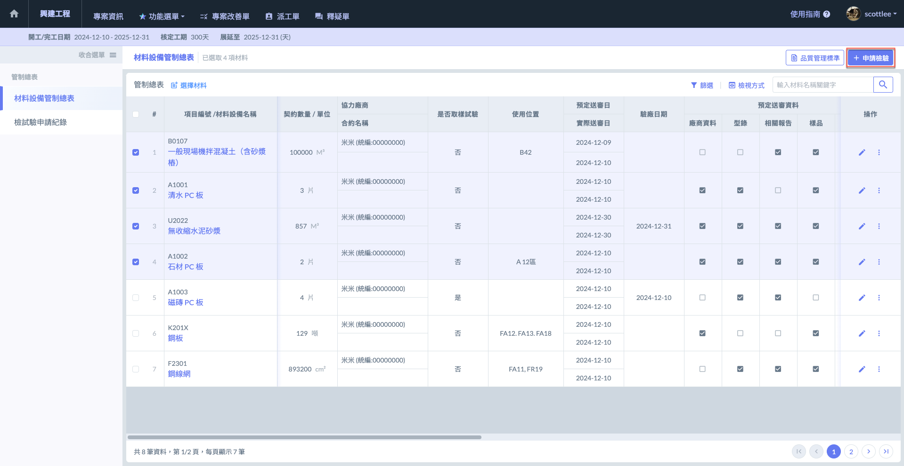

系統將顯示申請檢驗的材料目前累積的檢驗次數。

您需填寫以下資料申請檢驗單，包括：申請日期、預定進場日期、預定取樣時間、取樣地點及檢附資料等。

***

## 02｜材料篩選 & 檢視

### 02 - 1｜篩選材料

當您的材料數量過多時，可透過材料篩選器幫您快速找到欲查看/使用的材料。

點選下圖紅框處&#x4E4B;**「篩選」**，即可開啟材料器，透過<kbd>**是否取樣試驗**</kbd>、<kbd>**預定進場日**</kbd>、<kbd>**實際進場日**</kbd> 等查找。

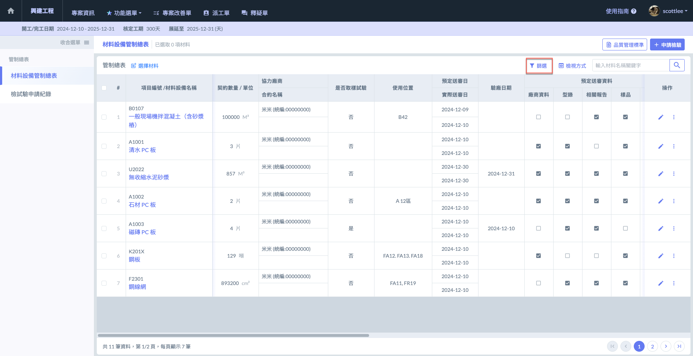 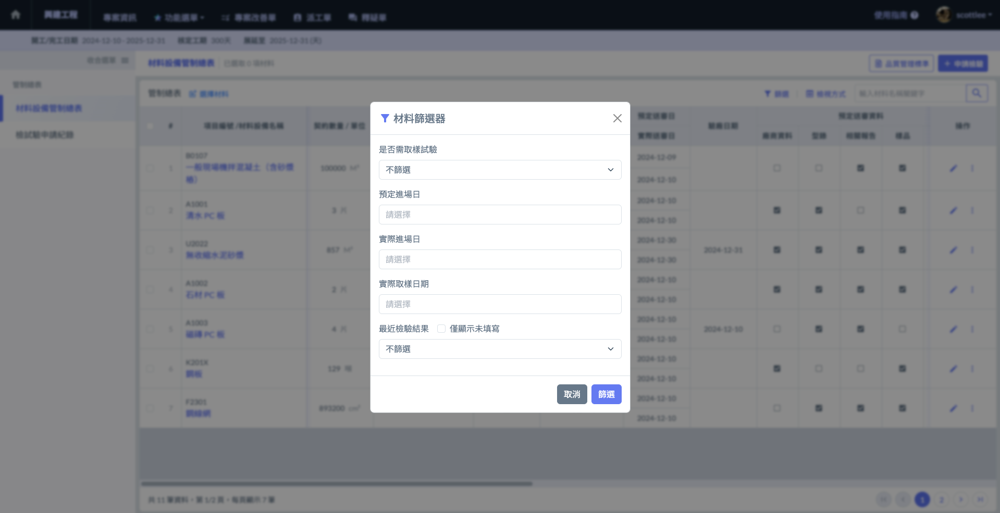

#### 範例影片

{% embed url="https://files.gitbook.com/v0/b/gitbook-x-prod.appspot.com/o/spaces%2FEqUCL3D5WQfpxJw8NL3P%2Fuploads%2FSpz2fbhGErK1iPwtOVZ6%2F%E7%AF%84%E4%BE%8B%E5%BD%B1%E7%89%87.mp4?alt=media&token=14cfba9e-e43d-469b-b536-d25297e65591" %}
範例影片


***

### 02 - 2｜檢視方式

點選下圖紅框處&#x4E4B;**「檢視方式」**，即可選擇檢視模式。

可選擇全部或是<kbd>**送審管制表**</kbd>、<kbd>**檢試驗管制表**</kbd>兩種模式。



僅顯示送審相關資訊。如：驗廠日期、預定/實際送審日、預定送審資料及使用位置等等。



僅顯示檢試驗相關資訊。如：預定/實際進場日、進場數量、抽樣/送樣日期與數量等等。



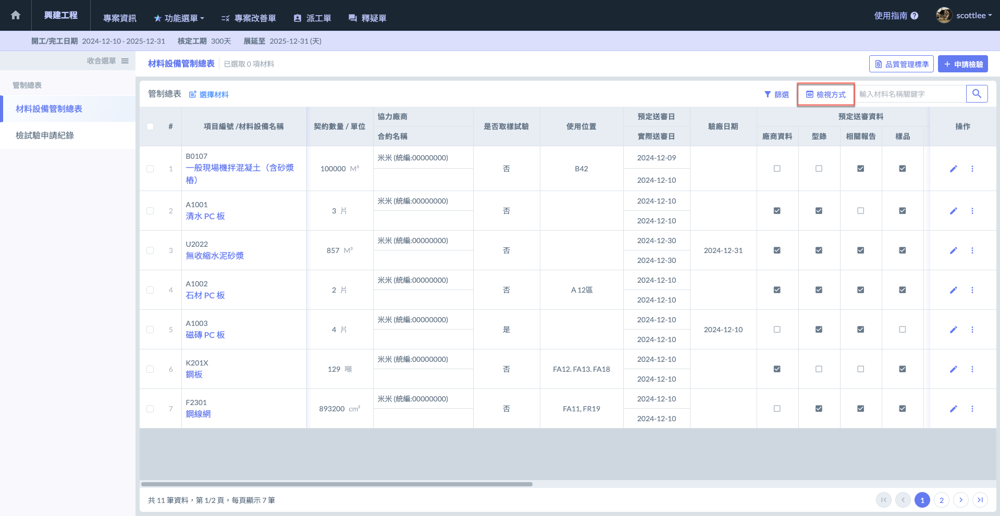 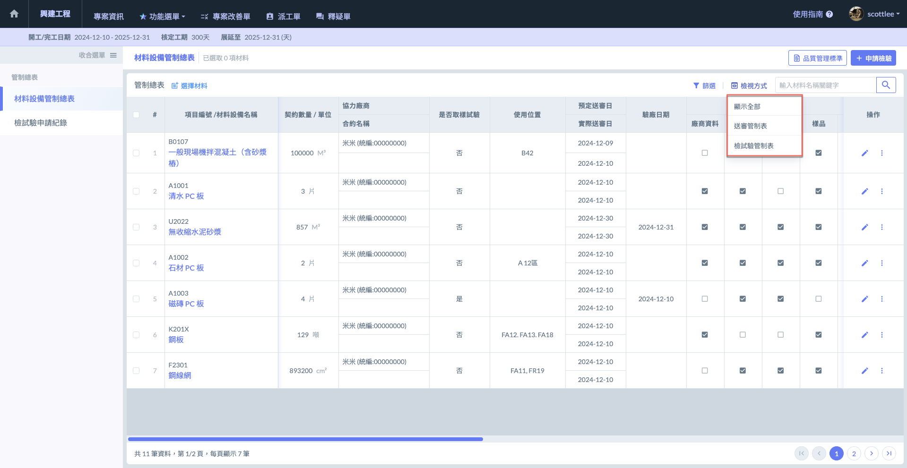

#### 送審管制表

送審管制表模式顯示之資訊如下圖：

 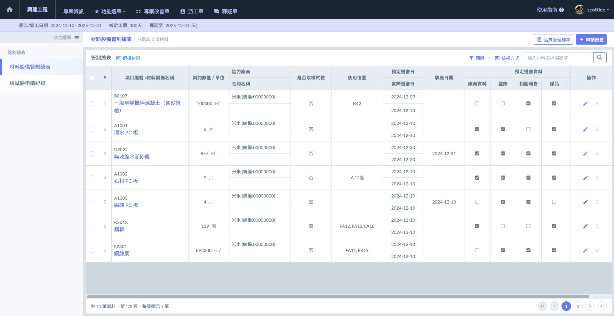

#### 檢試驗管制表

檢試驗管制表模式顯示之資訊如下圖：

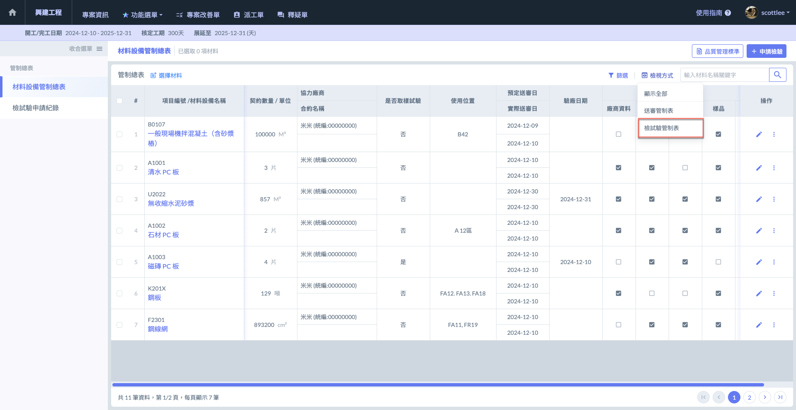 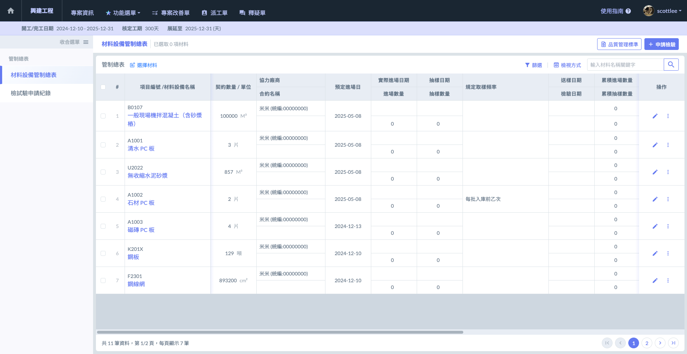

