# 檢試驗申請紀錄

---
description: Material Testing Request Records
---

# 檢試驗申請紀錄

## 01｜編輯檢試驗紀錄

於檢試驗申請紀錄列表中，選取欲編輯之申請單。點&#x9078;**「**」即可查看細部內容，並針對各項檢驗材料填寫檢試驗紀錄。

選定申請單後，於內部檢驗材料設備之右側。點&#x9078;**「編輯紀錄」**，即可填寫檢試驗紀錄。

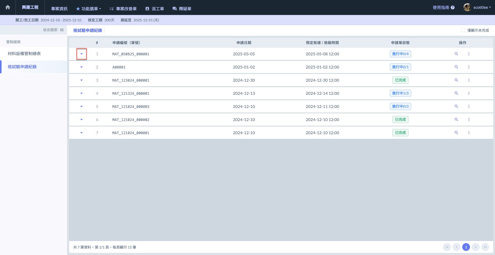 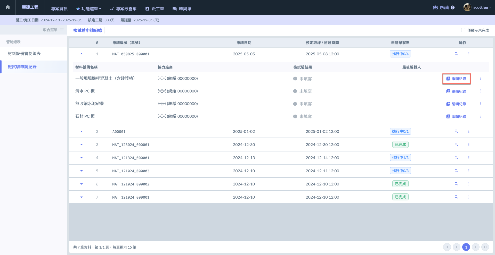

系統將紀錄填寫分為兩個步驟，<kbd>**取樣**</kbd>**&#x20;&&#x20;**<kbd>**回填檢驗結果**</kbd>&#x20;

!!! tip
    您可於材料取樣檢驗後，先行填&#x5BEB;**「取樣」**&#x8CC7;料 (無需同時填寫)。待檢驗結果出爐，再回填材料檢驗是否合格。



取樣資料包括：實際進場數量與日期、檢視方式、取樣項目與日期、送樣方式與日期等等。



回填檢驗結果檢驗結果資料包括：試驗日期、會驗人員、試驗機構名稱、營造初判結果、監造複判結果等等。



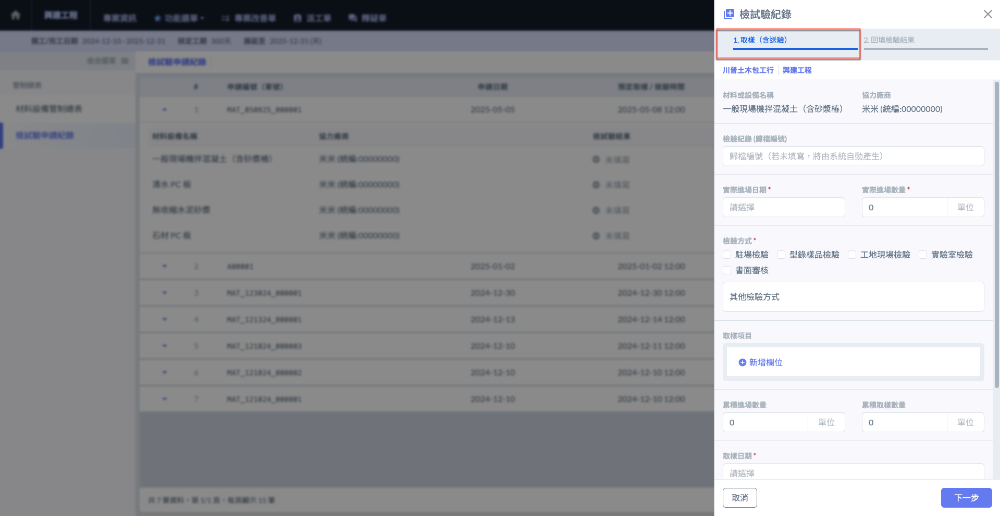 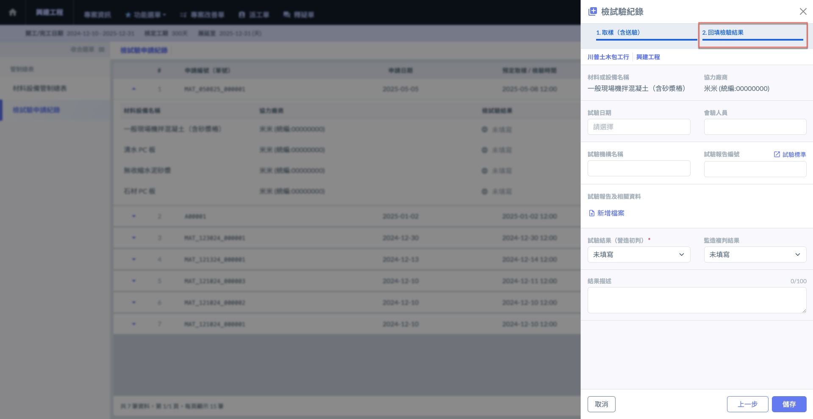

***

### 01 - 1｜查看品質管理標準

如下圖所示，您可隨時於<kbd>**回填檢驗結果**</kbd> 查看品質管理標準。點&#x9078;**「試驗標準」**&#x5373;可查看。(對應上傳之檔案)

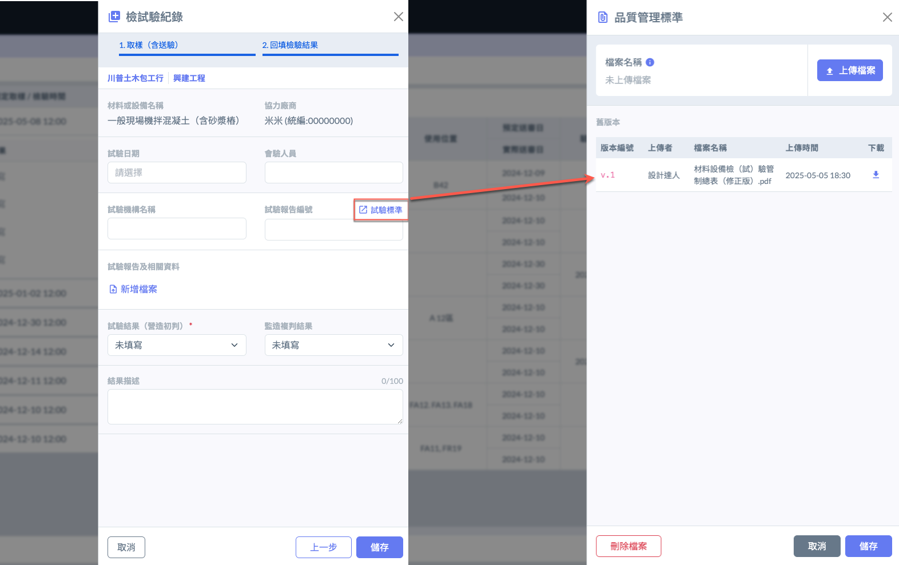

***

## 02｜檢試驗申請單

### 02 - 1｜列印

進入「<kbd>**檢試驗申請紀錄**</kbd>」，於欲列印之檢試驗申請單右側操作欄位，點&#x9078;**「列印申請單」**。

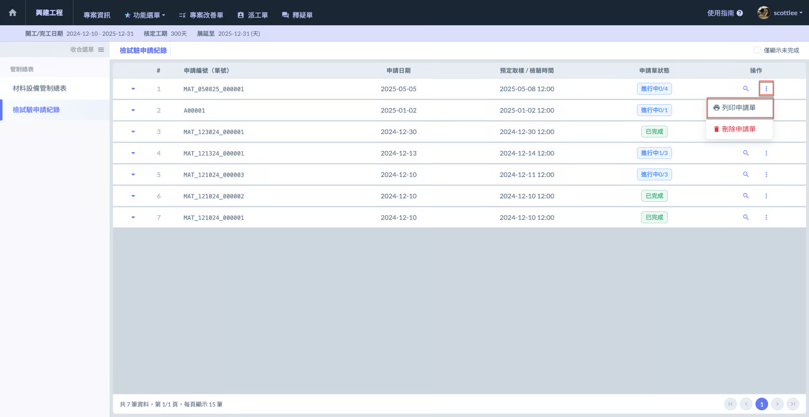 

!!! tip
    將檢試驗申請單印出後，就可以將紙本文件提交給監造單位審核。
    
    列印格式提供兩個欄位：**營造廠商** & **監造廠商**。供廠商簽認用。

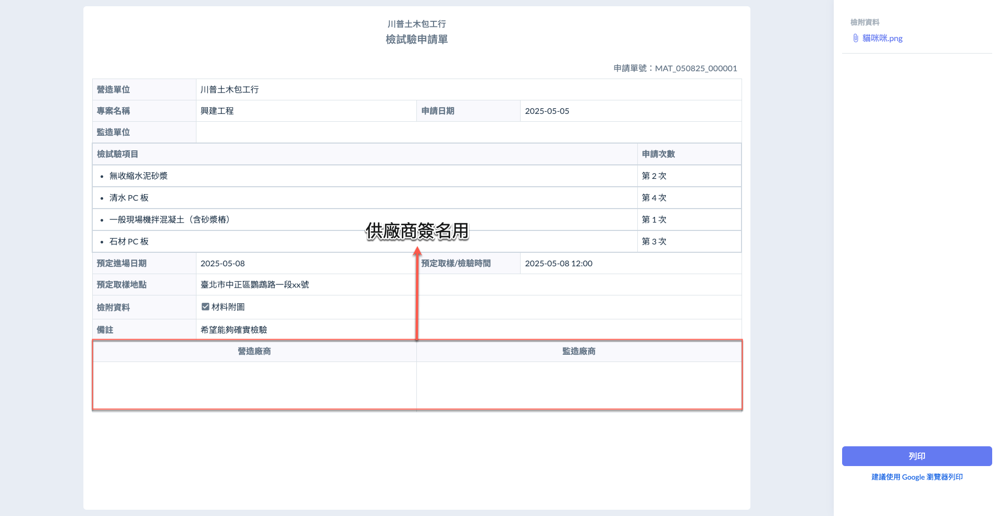

### 02 - 2｜刪除

進入「<kbd>**檢試驗申請紀錄**</kbd>」，於欲列印之檢試驗申請單右側操作欄位，點&#x9078;**「刪除申請單」**。

!!! warning
    請注意，包含該申請單內所有材料之檢驗紀錄都將一併刪除，且刪除後即無法復原，務必謹慎操作。

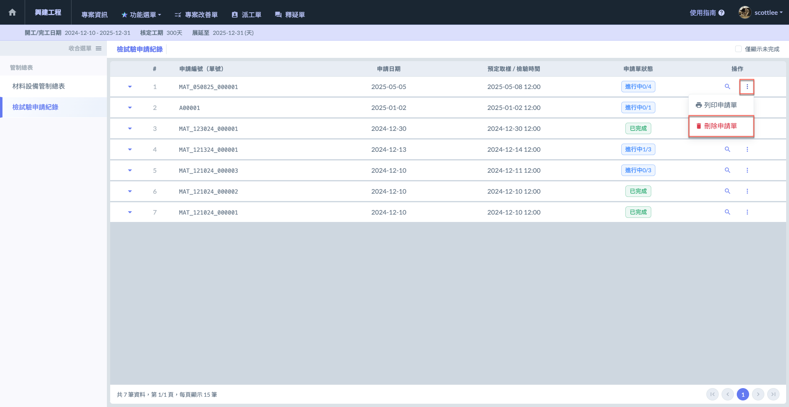 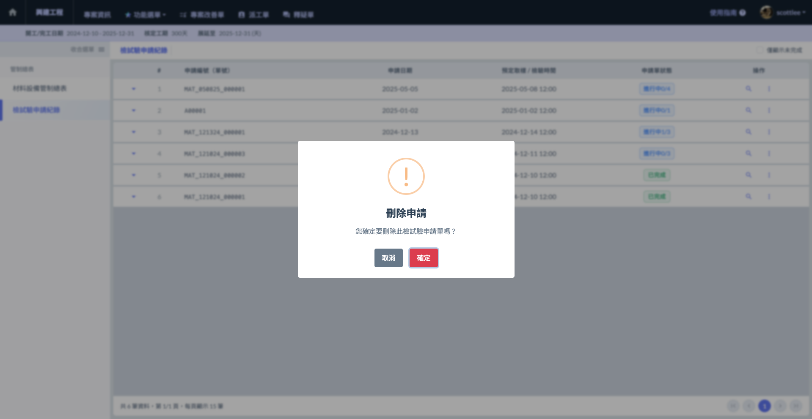

***

## 03｜檢試驗紀錄

### 03 - 1｜列印

開啟檢試驗申請單後，於欲列印之檢驗材料右側。點&#x9078;**「⋮」**&#x4E4B;**「列印檢試驗紀錄」**，您即可列印單內檢驗材料之檢試驗紀錄/結果。

 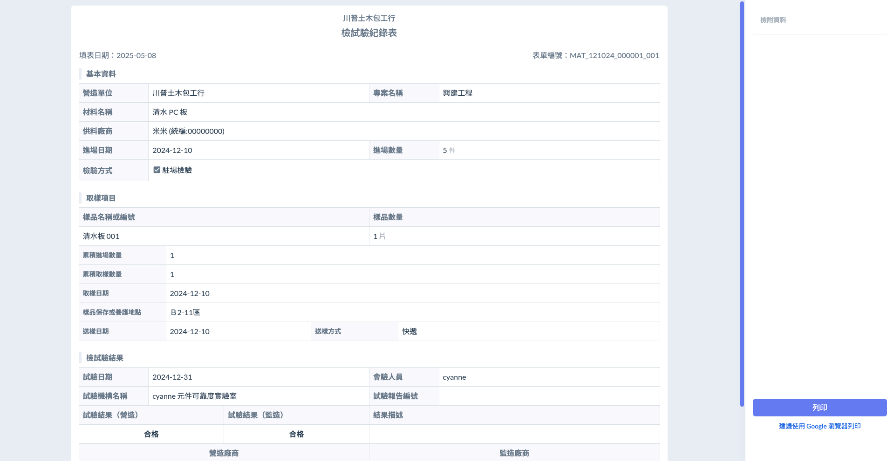

!!! tip
    列印格式提供兩個欄位：**營造廠商** & **監造廠商**。供廠商簽認用。

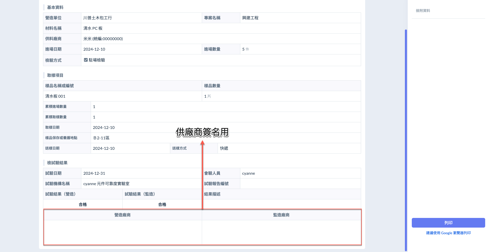

### 03 - 2｜刪除

開啟檢試驗申請單後，於欲刪除之檢驗材料右側。點&#x9078;**「⋮」**&#x4E4B;**「刪除檢試驗紀錄」**。

!!! warning
    請注意，選定材料之檢驗紀錄都將一併刪除，且刪除後即無法復原，務必謹慎操作。

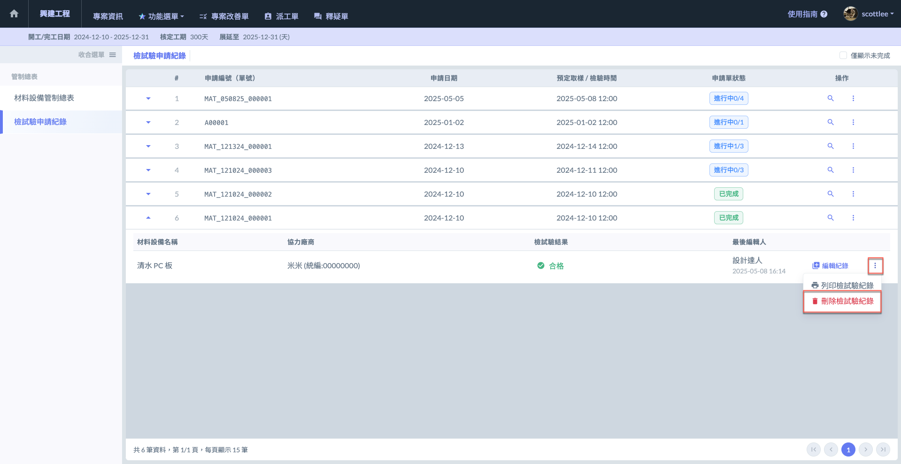 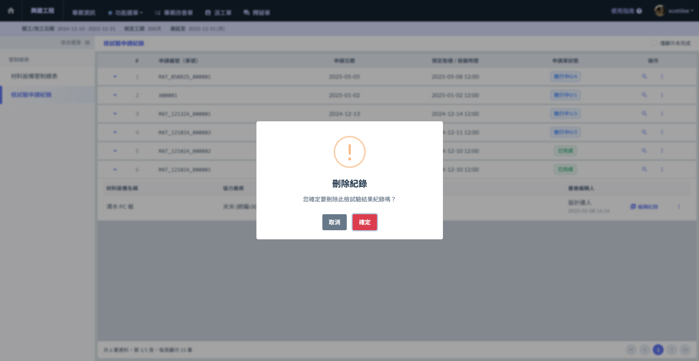

***

## 04｜建立改善單

無論是營造初判或是監造複判之結果，針對**不合格**的材料檢驗紀錄，即可直接建立改善單。

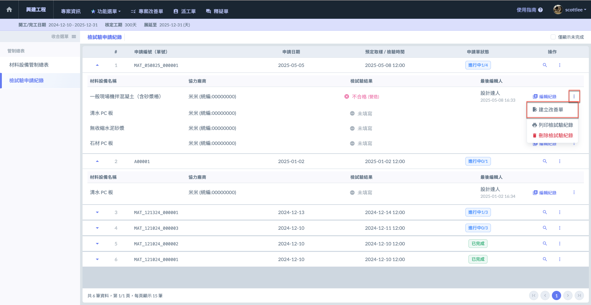 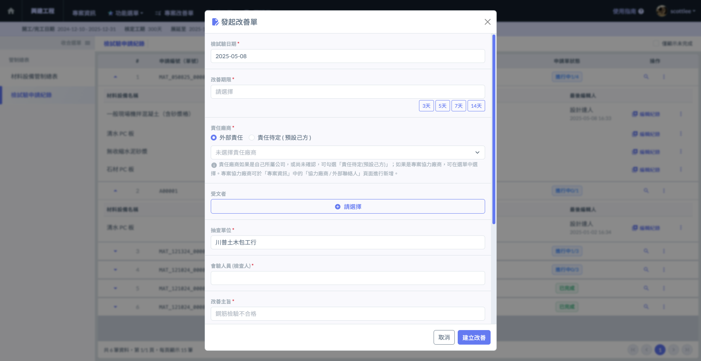

若一不合格材料已建立其改善單，可直接查看<kbd>**改善單進度**</kbd> / <kbd>**重新發起改善**</kbd>。

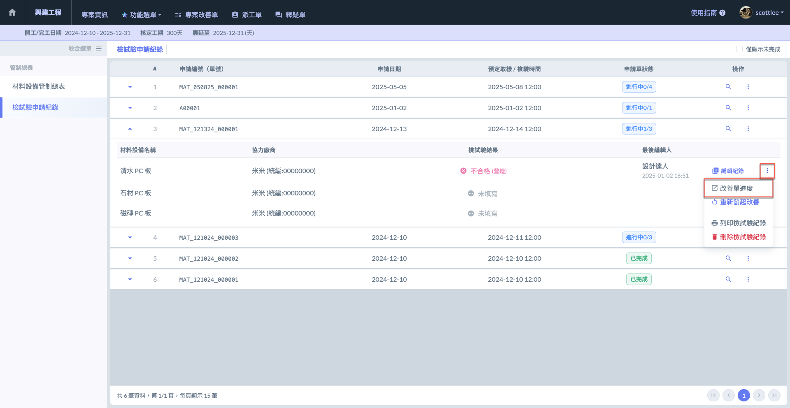 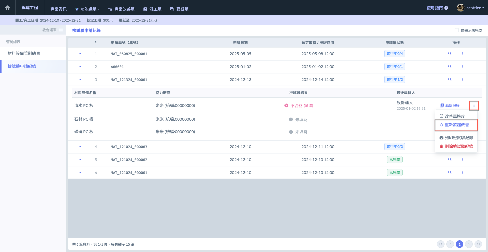

***

## 05｜申請單狀態說明

系統將申請單分為<kbd>**進行中**</kbd>與<kbd>**已完成**</kbd>兩種狀態。



材料檢驗結果尚未填寫完成。所&#x6709;**「未填寫」**&#x53CA;**「僅填寫取樣」**&#x8CC7;料的材料皆會顯示此狀態。、



已將所有材料&#x7684;**「送驗」**&#x8CC7;料&#x53CA;**「回填檢驗結果」**&#x8CC7;料填寫完畢，申請單才會顯示此狀態。



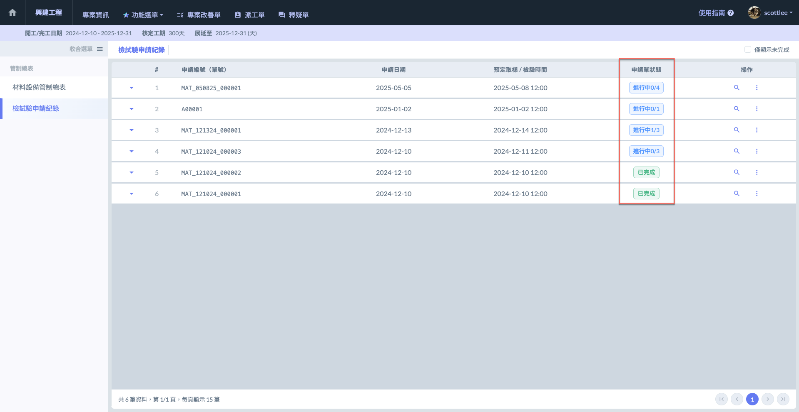
