# 驗收單列表

---
description: Acceptance Form List
---

# 驗收單列表

## 01｜操作流程簡介



### 執行檢查

驗收階段共分為：<kbd>**自驗**</kbd>、<kbd>**初驗**</kbd>及<kbd>**複驗**</kbd>三大階段。詳細操作說明，請參閱 ➙ [conduct-inspection](../../../bc/acceptance/app/acceptance-form-list/conduct-inspection "mention")

於欲作業之驗收標的欄位，點&#x9078;**「執行檢查」** (圖一)，並選擇驗收狀態。

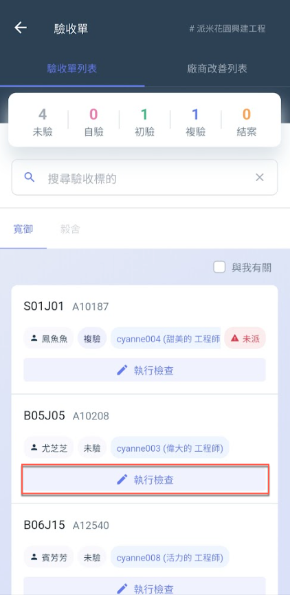 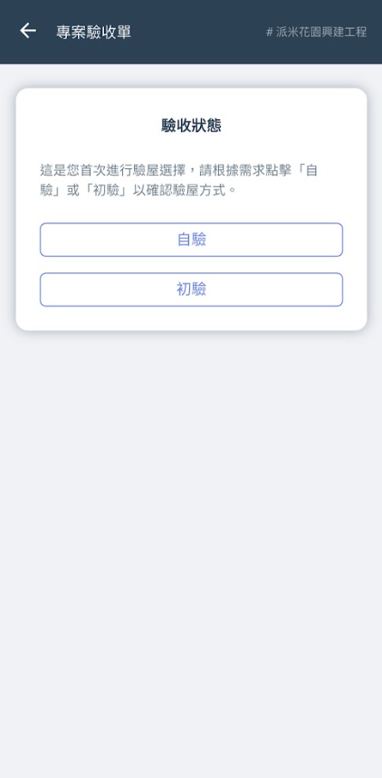 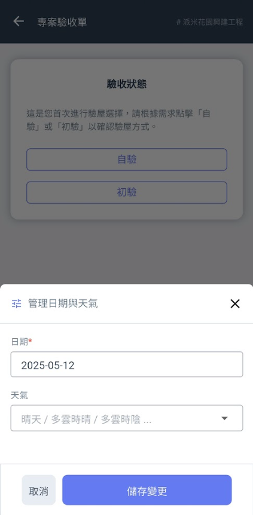 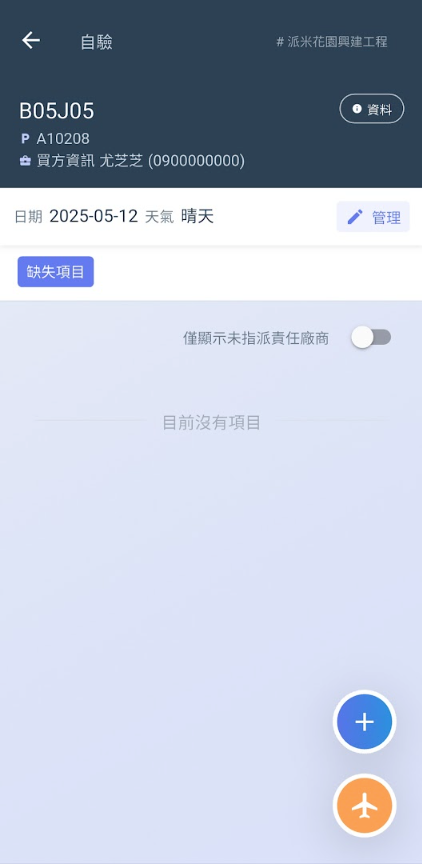

將日期與天氣設置完畢後，於右下角點&#x9078;**「+」** (圖五)，即可新增紀錄項目。完成畫面如 (圖八)。

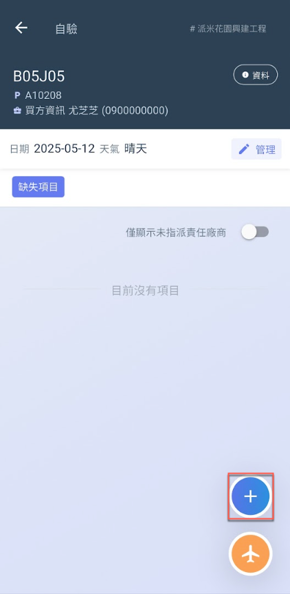 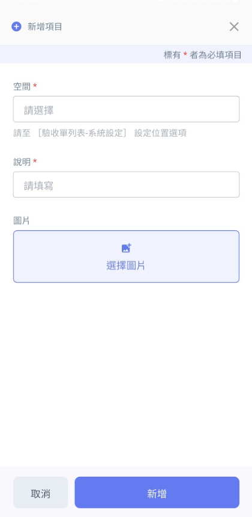 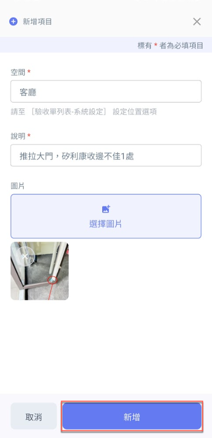 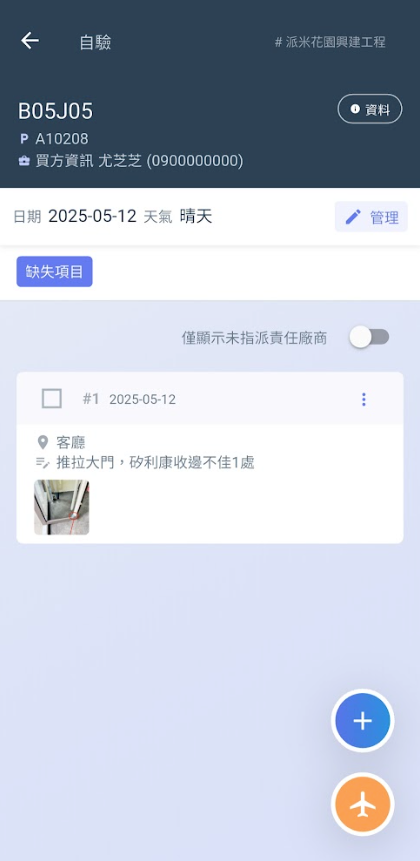




### 選擇責任廠商

當缺失紀錄完成後，您可針對各個缺失將其歸屬於責任廠商下，以利改善作業與驗收流程的進行。

於各驗收缺失右側，點&#x9078;**「⋮」**&#x4E4B;**「編輯」**&#x529F;能，即可為該缺失選擇責任廠商，完成畫面如 (圖四)。

!!! tip
    由於新增缺失紀錄時，實務上可能尚未確認該項缺失之實際責任廠商，為確保操作流程順暢，系統於新增階段**不提供廠商選擇功能**。
    
    待後續確認責任歸屬後，您可透過「編輯紀錄項目」功能，**個別指定該缺失之協力廠商**；亦可透過「批次選擇責任廠商」功能，**統一指派多筆缺失項目之負責單位**，提升作業效率並強化後續追蹤管理。
    
    詳細操作流程，請參閱 ➙ [que-ren-que-shi-gui-shu](../../../bc/acceptance/app/acceptance-form-list/conduct-inspection/que-ren-que-shi-gui-shu "mention")

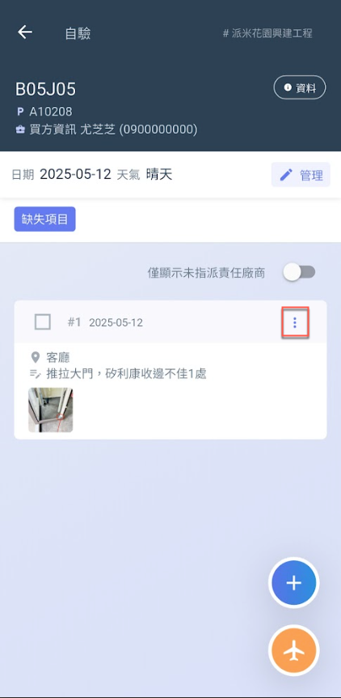 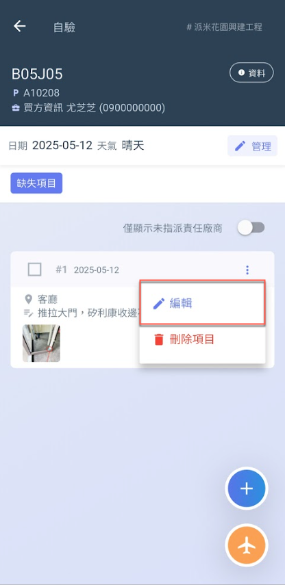 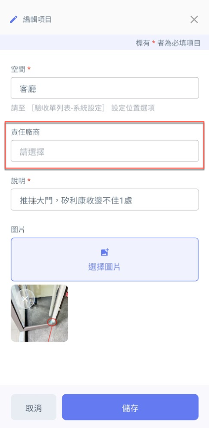 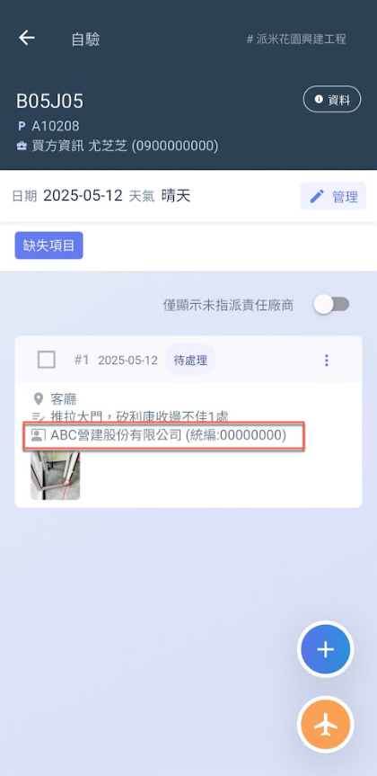




### 驗收報告之簽認 (缺失確認)

點選欲簽認之驗收標的，進入其專案驗收單頁面後，於右上角點&#x9078;**「驗收報告」**，即可選擇欲執行的驗收報告 (初驗/複驗)。

詳細操作說明，請參閱 ➙ [report](../../../bc/acceptance/app/acceptance-form-list/project-acceptance-form/report "mention")

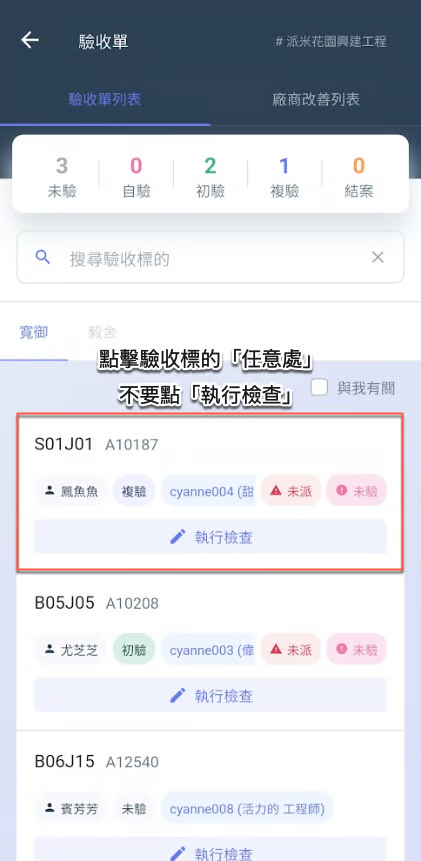 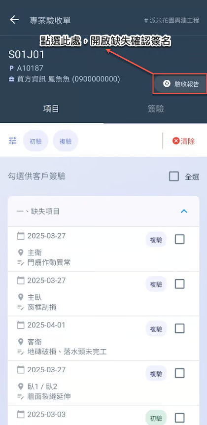 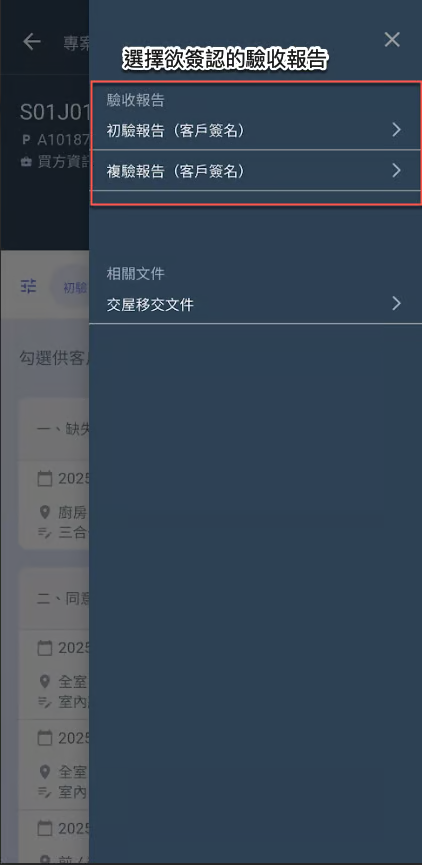 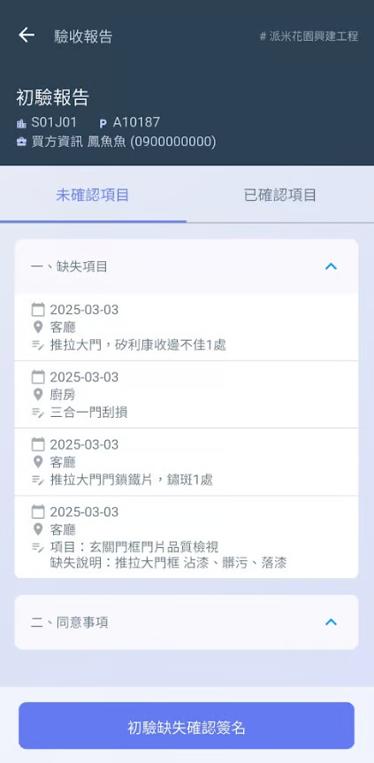

點選 (圖四) 下方&#x4E4B;**「初(複)驗缺失確認簽名」**&#x5F8C;，即可開啟 (圖五) 簽名板，請客戶手寫簽名。




### 確認責任廠商缺失清單

若缺失已改善完畢，點選<kbd>**廠商改善列表**</kbd>頁籤，您即可看到該專案內所有協力廠商。點選任一協力廠商，即可查看該責任廠商之缺失清單 (其檢驗項目)，並針對各項目進行改善確認。

如 (圖二、圖三)，開&#x555F;**「批次確認」**&#x5F8C;，即可同時對所有項目確認改善作業 (勾選/取消勾選)。

詳細操作說明，請參閱 ➙ [chang-shang-gai-shan-lie-biao](../../../bc/acceptance/app/chang-shang-gai-shan-lie-biao "mention")

!!! warning
    請注意：
    
    1. 缺失一經改善後，即無法再從廠商缺失列表內退回。
    2. 已勾選 (已改善) 之項目經客戶驗收完成簽名前，仍可取消其勾選狀態。&#x20;

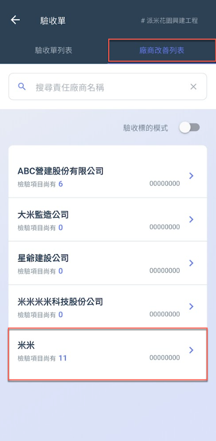 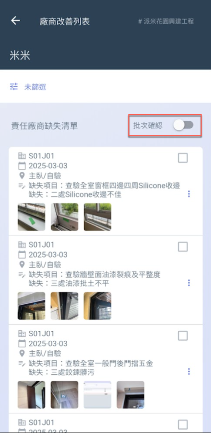 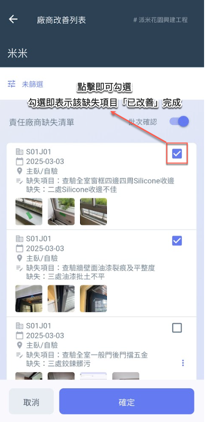




### 交屋點交文件之簽認

點選欲簽認之驗收標的，進入其專案驗收單頁面後，於右上角點&#x9078;**「驗收報告」**&#x5167;&#x4E4B;**「交屋移交文件」**。

詳細操作說明，請參閱 ➙ [jiao-wu-dian-jiao-wen-jian](../../../bc/acceptance/app/acceptance-form-list/project-acceptance-form/jiao-wu-dian-jiao-wen-jian "mention")

 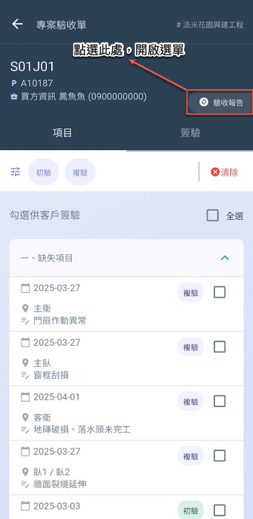 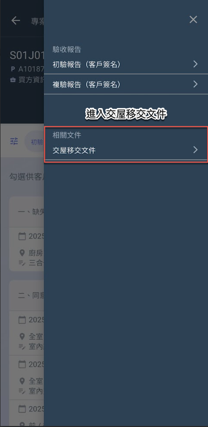 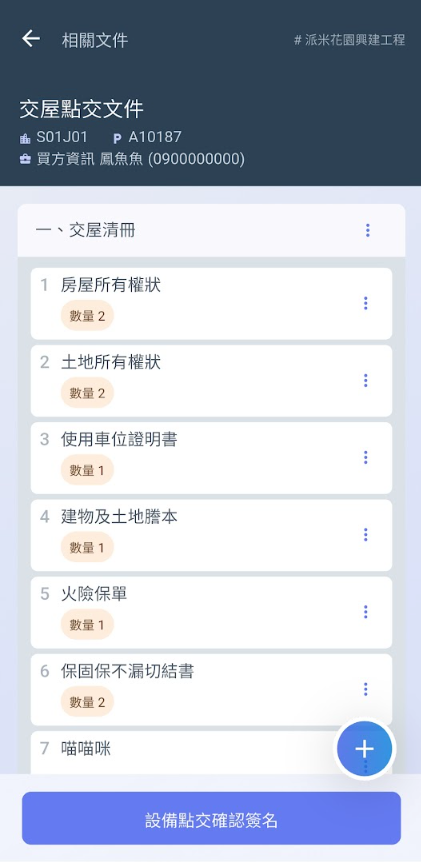

點選 (圖四) 下方&#x4E4B;**「設備點交確認簽名」**&#x5F8C;，即可開啟 (圖五) 簽名板，請客戶手寫簽名。

!!! tip
    由於交屋文件可能因應現場需求而不時更動。因此，交屋文件經簽名後，仍可取消並重新簽名。

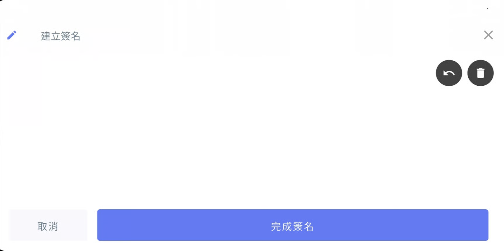



### 勾選項目予客戶驗收簽名

點選欲簽認之驗收標的，進入其專案驗收單之<kbd>**項目**</kbd>頁籤，即可勾選項目至<kbd>**簽驗**</kbd> 頁面供客戶驗&#x6536;**。**

詳細操作說明，請參閱 ➙ [xiang-mu-que-ren-yu-qian-yan](../../../bc/acceptance/app/acceptance-form-list/project-acceptance-form/xiang-mu-que-ren-yu-qian-yan "mention")

!!! warning
    請注意，僅已改善 (即批次確認) 之項目才會顯示於此，並可供勾選予客戶驗收簽名。

 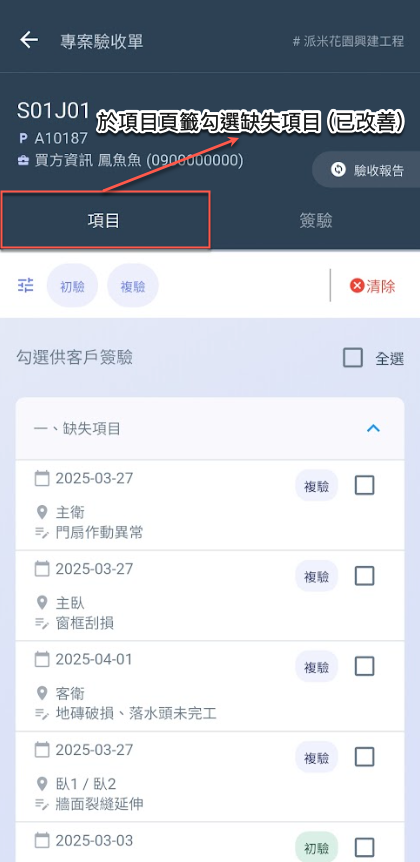

圖三為勾選操作說明，您於<kbd>**項目**</kbd>頁勾選之項目將會一併於<kbd>**簽驗**</kbd>頁中顯示。

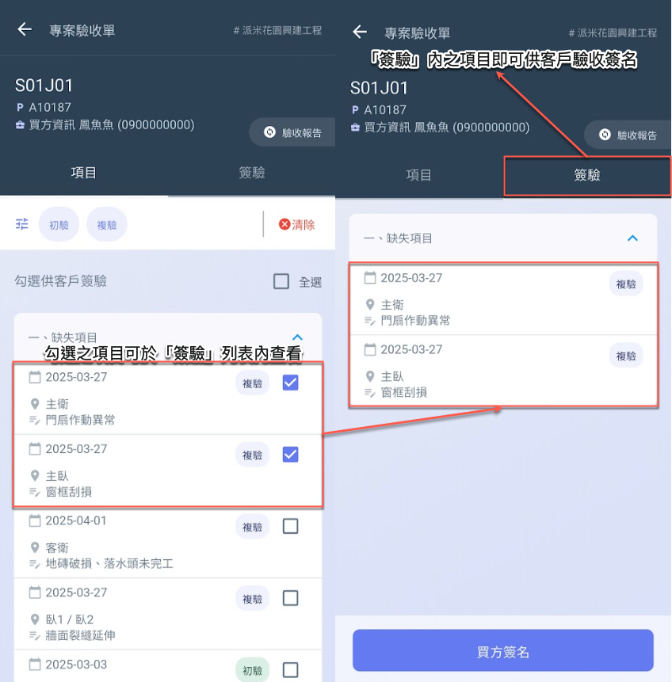

點選 (圖三-右圖) 下方&#x4E4B;**「買方簽名」**&#x5F8C;，即可開啟 (圖四) 簽名板，請客戶手寫簽名。




