# 項目紀錄

---
description: Item Record
---

# 項目紀錄

!!! info
    請先進入各驗收標的之專案驗收單，方能使用項目紀錄功能。
    
    (如何進入專案驗收單？請參閱 **➙** [project-acceptance-form](../../../../../bc/acceptance/web-based/inspection-form-list/project-acceptance-form "mention") )

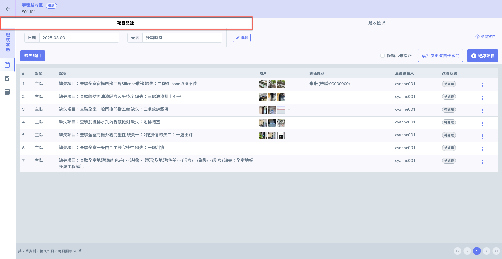

***

## 01｜操作流程簡介

以下為操作**流程概述**：



### 編輯相關資訊

進入專案驗收單頁面後，點選右上角之「」，即可開始修改驗收相關資料，包括：**代驗公司**、**附件**及**買方資訊**。

!!! info
    以下僅說明 **1-1｜代驗公司** 與 **1-2｜附件** 之操作流程 (買方資訊操作雷同，不多贅述)。&#x20;

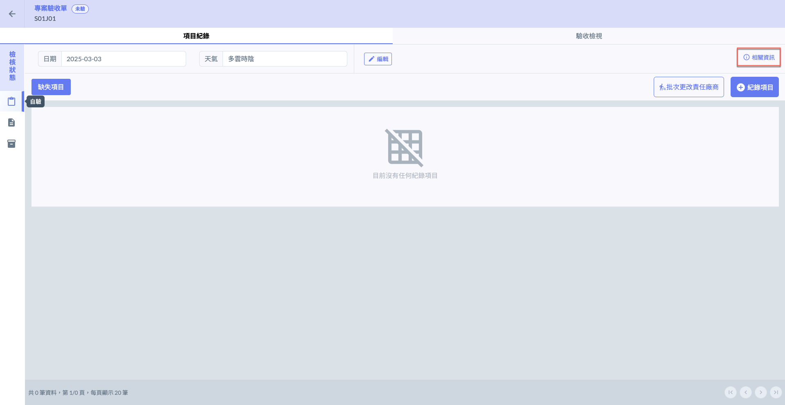 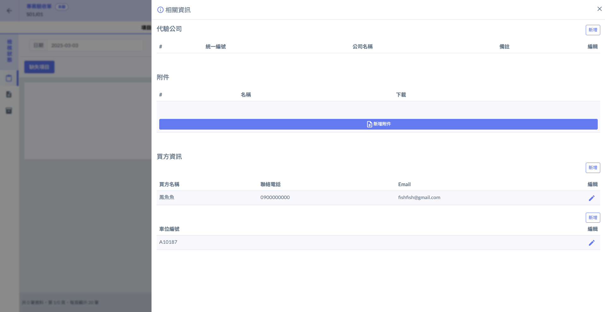

#### 1-1｜代驗公司

於代驗公司欄位右側點&#x9078;**「新增」**，即可新增負責驗收工作之公司。並填寫其相關資料，包括：統一編號、公司名稱及備註。

!!! warning
    每次操作只能新增一筆代驗公司資料，欲編列多個代驗公司，請重複執&#x884C;**「新增」**&#x64CD;作。

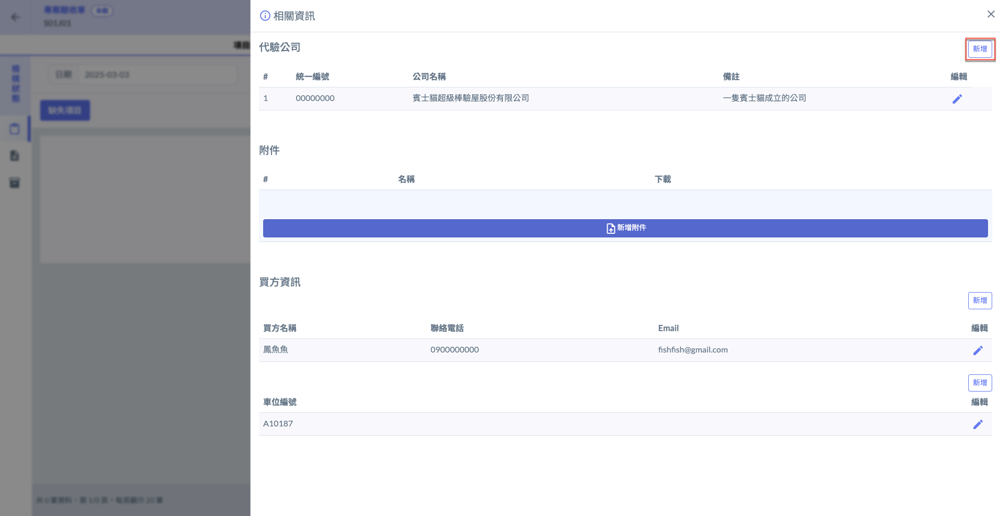 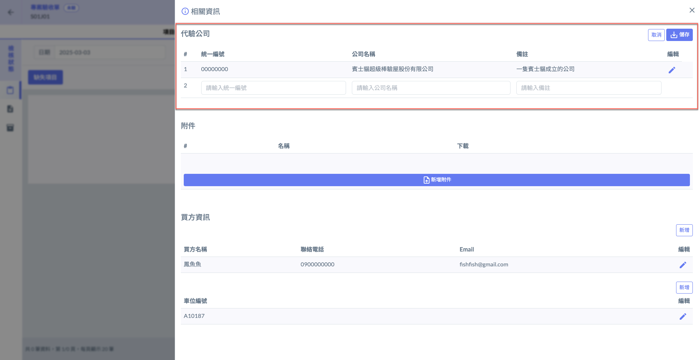

於已建立之代驗公司右側編輯欄位，點選「」，即可修改/刪除該代驗公司。

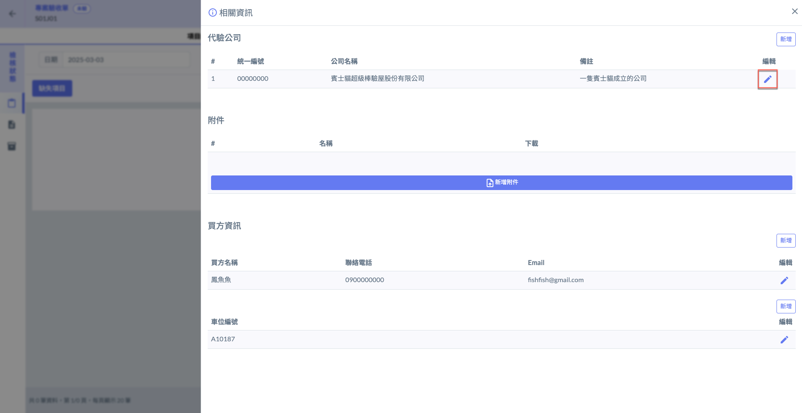 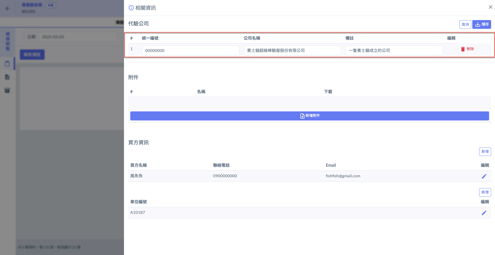

#### 1-2｜附件

如下圖紅框圈選處，於附件欄位點&#x9078;**「新增附件」**，即可開啟(圖八)視窗選擇欲上傳之檔案。

!!! tip
    若上傳檔案時，已有先前上傳之同名檔案，則會自動更新該檔案版本(以最新上傳之檔案為主)。

 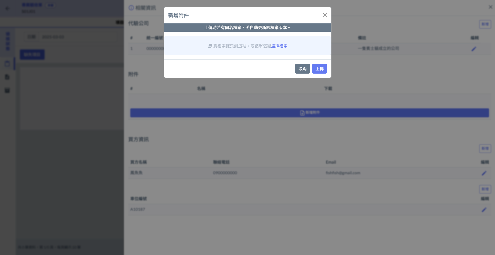

如圖九，您可於已上傳之檔案右&#x5074;**「下載/刪除」**&#x8A72;附件。

(圖十)為上傳同名檔案時，更改檔案版本之範例。

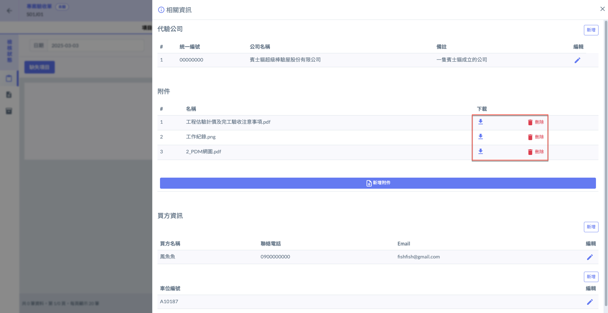 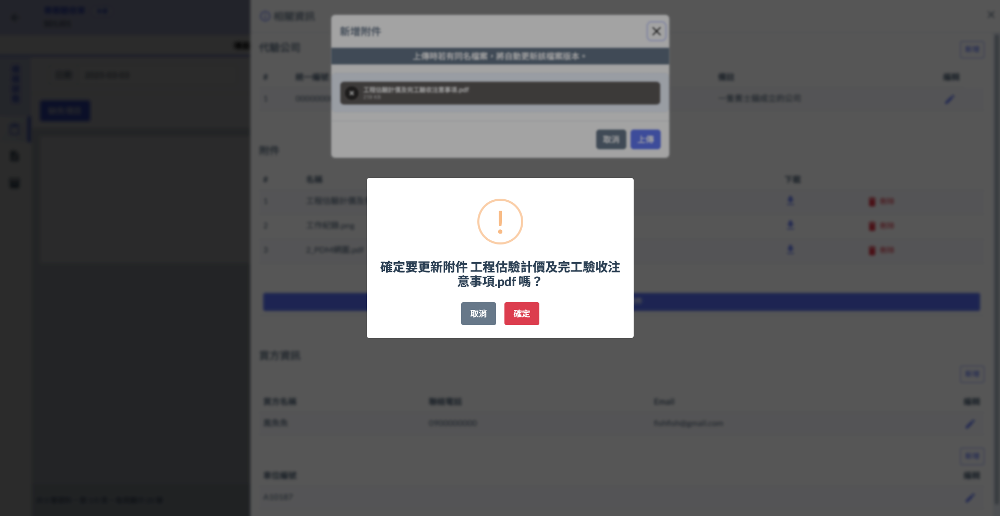




### 選定檢核狀態

在填寫各項驗收紀錄前，請先確認目前所處之驗收階段為正確的檢核狀態(自驗/初驗/複驗)，以確保所填寫之資料對應正確階段，避免影響後續作業與紀錄準確性。

如下圖所示，您可&#x65BC;**「檢核狀態」**&#x6B04;位選擇狀態：

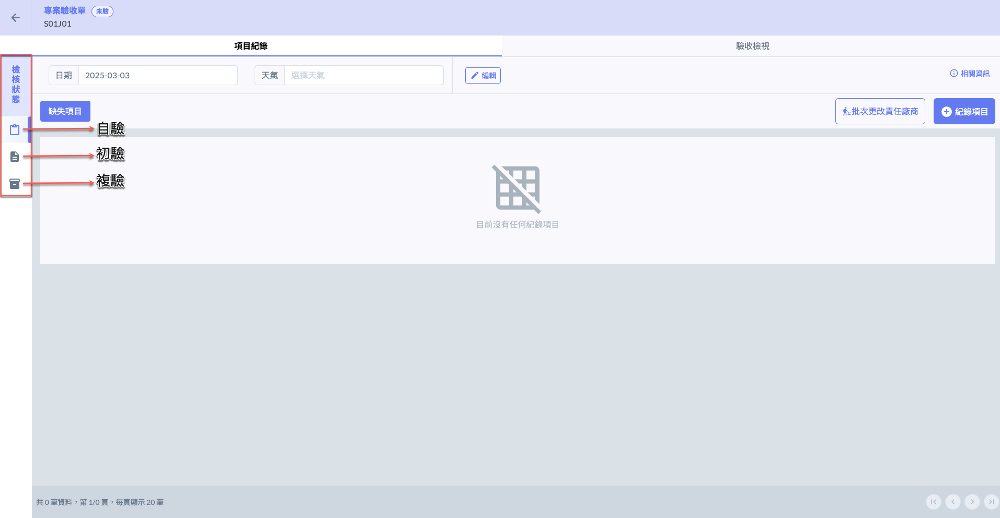



### 選擇驗收日期&天氣

請先選擇驗收日期，系統將會自動將後續新增的紀錄項目對應至此日期。

!!! info
    在實務操作中，自驗與初驗的各項檢核紀錄通常會集中於同一日完成，因此執行日期會以您此處所設立的日期為主。
    
    然而，**複驗階段**常因應實際缺失項目之處理狀況，導致部分項目需進行二次、甚至多次檢查，故其紀錄日期可能會與前次不同。因此，當您於複驗階段新增紀錄時，系統將允許您**針對每筆紀錄個別選擇對應的驗收日期**，以確保資料符合實際作業流程與時間節點，利於後續查閱與追蹤。

如圖二紅框圈選處，點選「」開啟(圖十三)視窗，填寫日期與天氣狀態。

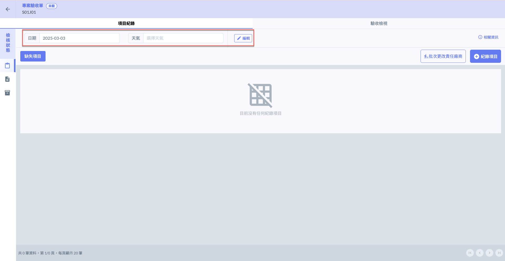 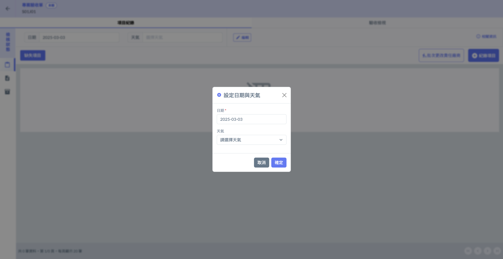

#### 3-1｜選擇日期

點選日期欄位後，即可開啟月曆視窗(圖十五），選擇欲執行驗收作業的日期。

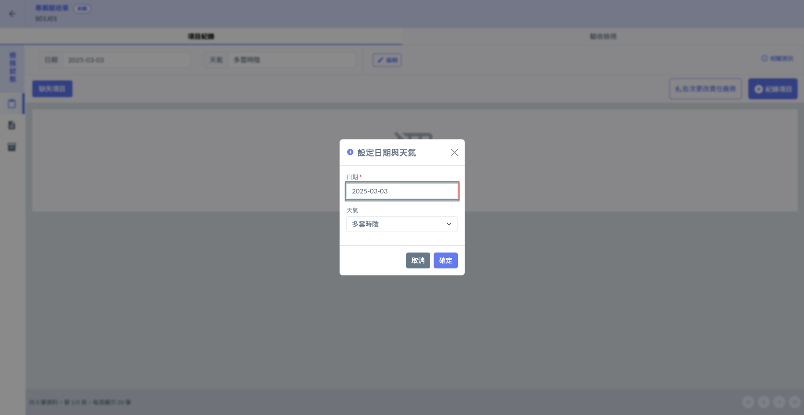 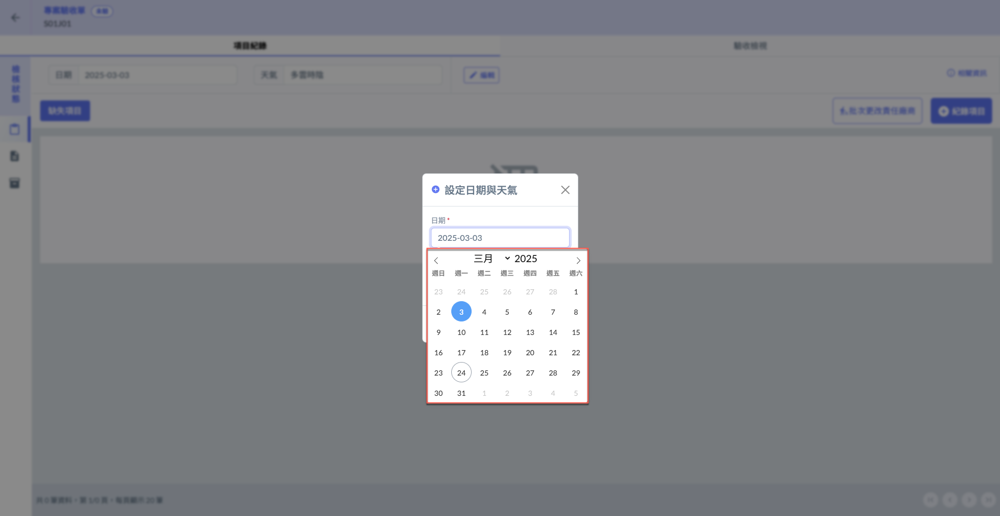

#### 3-2｜選擇天氣

點選天氣欄位後，即可開啟選單(圖十七)，選單當日天氣狀態。

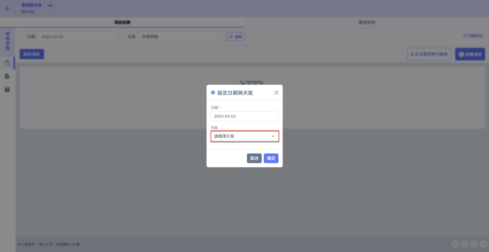 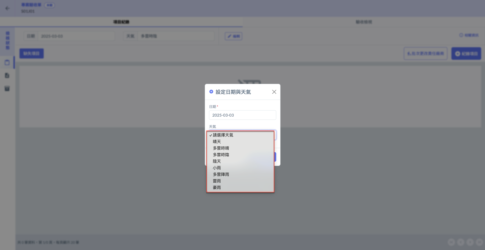




### 新增驗收紀錄項目

(圖十八 - 十九為自驗之範例)

由於各檢核狀態操作略有不同。詳細操作說明，請參閱 **➙** [record-item](../../../../../bc/acceptance/web-based/inspection-form-list/project-acceptance-form/item-record/record-item "mention")

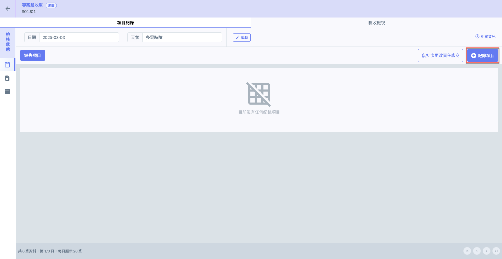 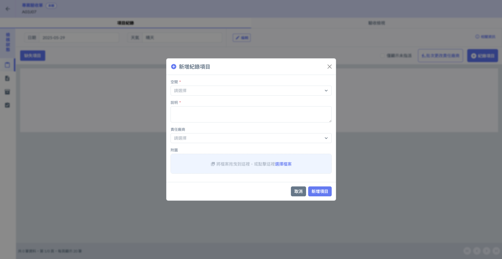



