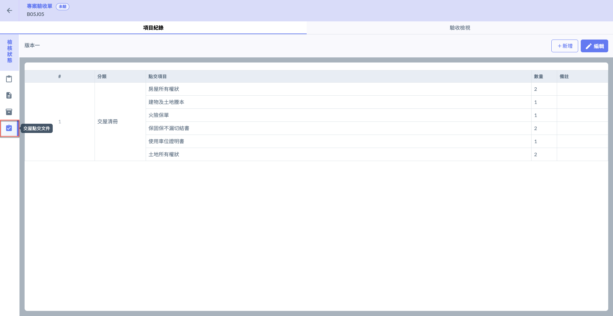
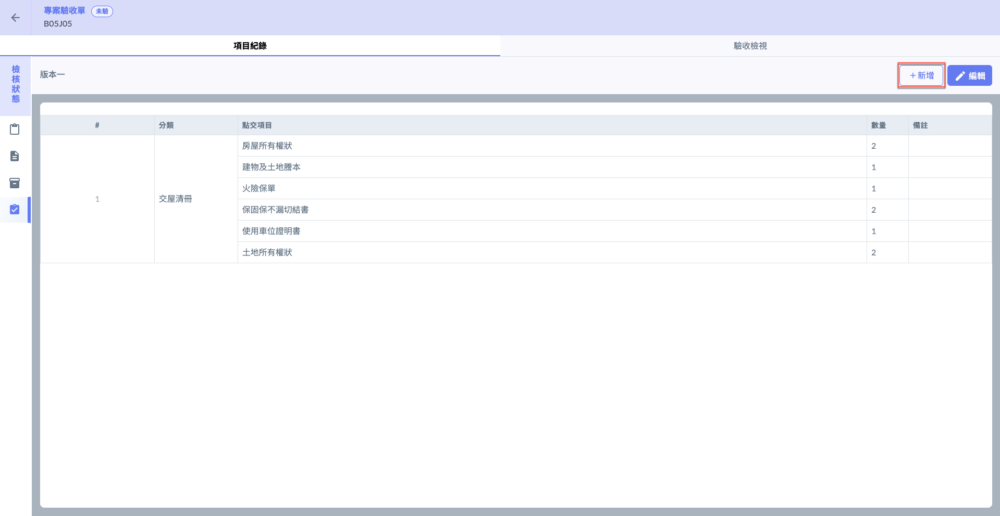
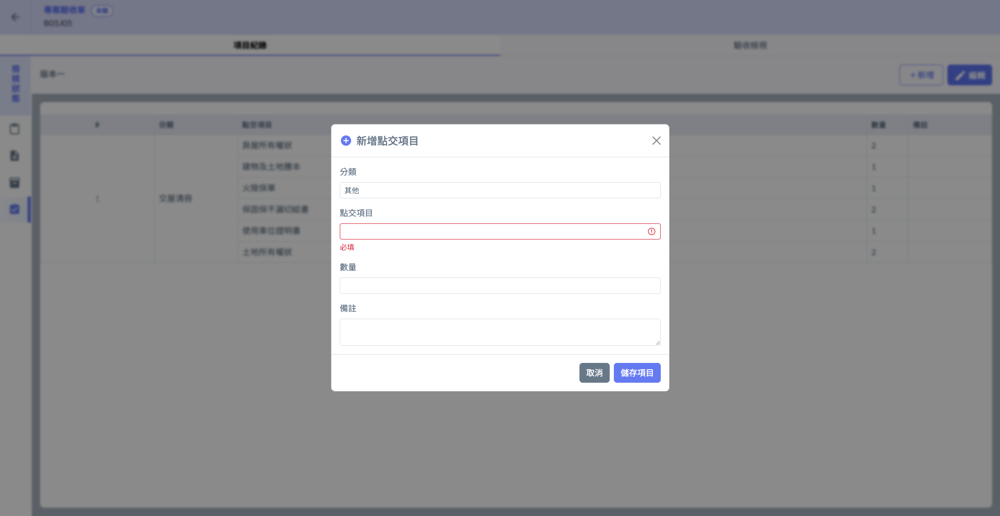
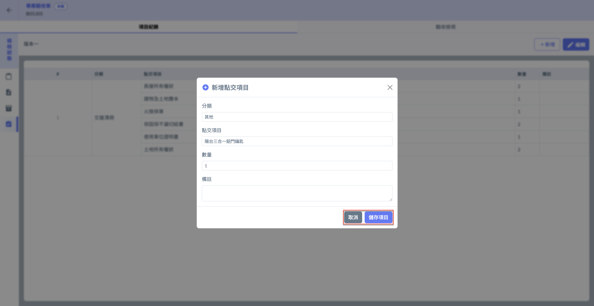
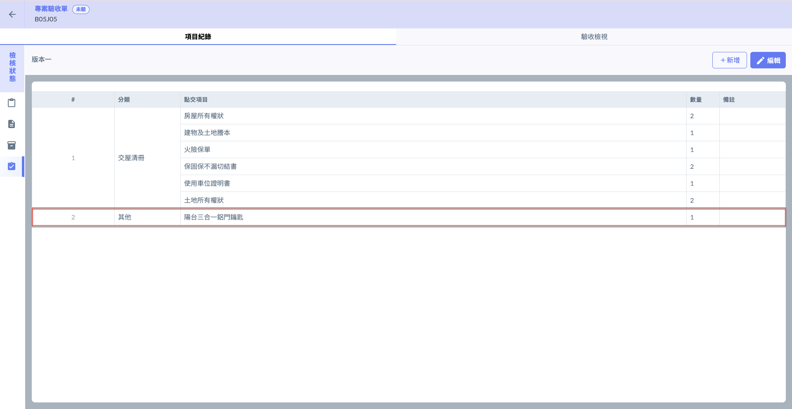
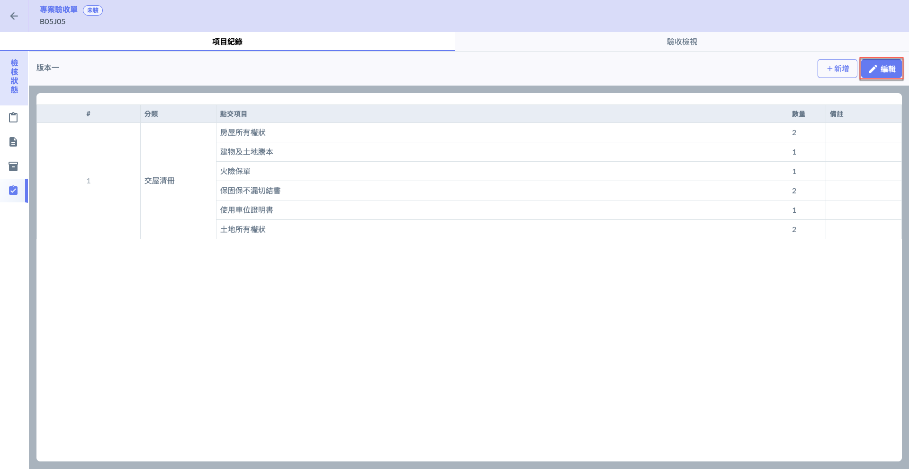
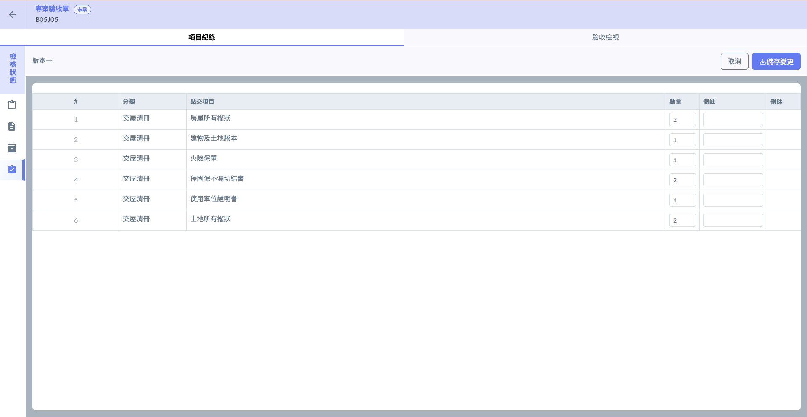

# 交屋點交文件 (標的內)

---
description: Handover and Acceptance Documents
---

# 交屋點交文件 (標的內)

不同於[handover-and-acceptance-documents](../../../../../../bc/acceptance/web-based/system-settings/handover-and-acceptance-documents "mention")， <kbd>**項目紀錄**</kbd>模式中之交屋點交文件，僅針對該驗收標的套用之特定版本資料操作，您只能編輯已有資料之數量、備註；不可修改/刪除點交項目之名稱及分類。

!!! warning
    欲修改點交項目名稱、分類等資料，請參閱 [handover-and-acceptance-documents](../../../../../../bc/acceptance/web-based/system-settings/handover-and-acceptance-documents "mention")。請注意，修改完畢後，請務必再重新套用版本。

!!! warning
    請注意，務必於進行操作前，先將該驗收標的套用特定文件版本，否則相關功能無法使用。

***

## 01｜新增

如圖一紅框圈選處，點選右上角之「+新增」，即可開啟 (圖二) 視窗填寫欲新增之點交項目資料。

!!! warning
    在項目紀錄模式下，新增之點交項目其分類欄位恆&#x70BA;**「其他」**，如需修改分類請至 [handover-and-acceptance-documents](../../../../../../bc/acceptance/web-based/system-settings/handover-and-acceptance-documents "mention") 進行操作。    (修改/選取分類後，務必重新將版本套用標的。)

 

將資料填寫完畢並確認無誤後，點&#x9078;**「儲存項目」**&#x5373;可保留此筆資料，完成畫面 (見圖四)。&#x20;

 

***

## 02｜編輯

如圖五紅框圈選處，點選右上角&#x4E4B;**「編輯」**，即可修改點交項目之**數量**、**備註**。

編輯完畢並確認資料無誤後，點&#x9078;**「儲存變更」**&#x5373;可保留此次修改資料。

!!! warning
    請注意，於<kbd>**項目紀錄**</kbd>模式下，您無法刪除文件版本任一點交項目，亦無法更改**分類**及**點交項目名稱**。

 

