# 驗收檢視

---
description: Acceptance Review
---

# 驗收檢視

**「驗收檢視」**&#x529F;能，提供使用者查閱單一驗收標的之完整驗收紀錄。於此模式下，系統將顯示該標的內所有缺失項目、同意事項及建議事項，並依各查驗進度（自驗、初驗、複驗）分類列示。

同時，系統亦呈現下列資訊，以協助使用者全面掌握驗收缺失之驗收進度與改善情形：

✔️ 缺失改善狀態（廠商 - 待處理／已改善）。

✔️ 缺失確認簽名（驗收人員將缺失列表記錄完畢後，供客戶確認(初驗/複驗)之缺失列表，並請客戶簽收。

✔️ 驗收完成簽名（客戶確認所有驗收作業、點交流程皆如實完善並簽署。）。

本功能旨在協助工程人員即時、清晰地檢視各驗收標的之缺失處理與簽認狀態，確保驗收流程之完整性與透明度。

!!! info
    先進入各驗收標的之專案驗收單，方能使用項目紀錄功能。(如何進入專案驗收單？請參閱 **➙** [project-acceptance-form](../../../../../bc/acceptance/web-based/inspection-form-list/project-acceptance-form "mention") )

#### 相關欄位說明



指的是該驗收缺失所屬之負責廠商。



指最後一次變更此筆項目資料(缺失項目/同事事項/建議事項)的使用者。



改善狀態分&#x70BA;**「待處理」**&#x8207;**「已改善」**&#x5169;種：

**待處理**：該驗收缺失**尚未**經責任廠商或相關人員完成改善。

**已改善**：該驗收缺失**已由**責任廠商或相關人員完成改善作業。



表示該驗收缺失由驗收人員紀錄完畢後，客戶已確認所有紀錄項目，確保沒有錯誤的紀錄與遺漏之項目，並進行簽認。



**「驗收完成簽名」**&#x8868;示該驗收缺失已由相關人員完成改善，並經負責人核可。於最終客戶驗收階段，客戶亦確認缺失確實改善無誤，且完成簽收程序。



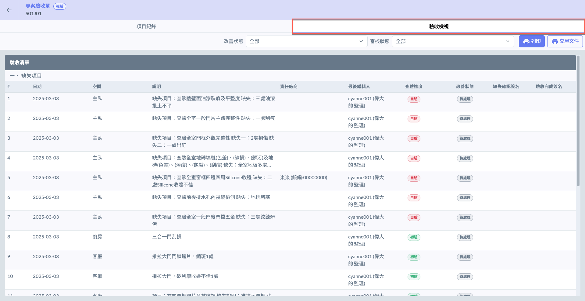

***

## 01｜列印

如圖一所示，進&#x5165;**「驗收檢視」**&#x9801;面後，點選右上角&#x7684;**「列印」**&#x6309;鈕，即可開啟視窗如(圖二），開始設定欲列印之資料。

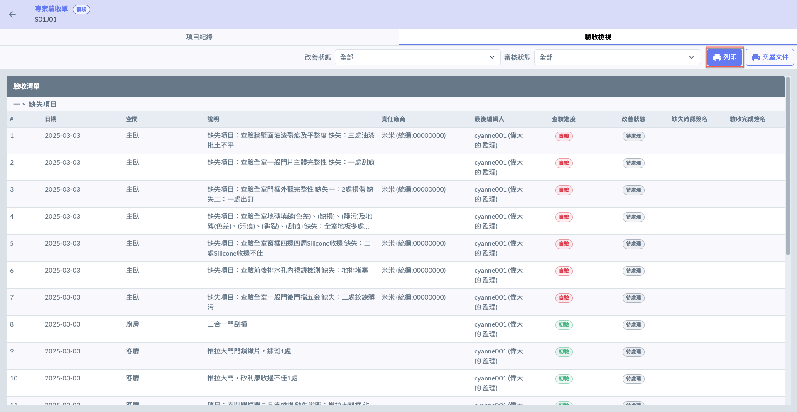 

### 01 - 1｜篩選列印條件

如下紅框圈選處，可透過**是否列印列印圖片**、**查驗進度**、**是否顯示責任廠商**及**驗收階段**等條件，篩選欲列印之資料。

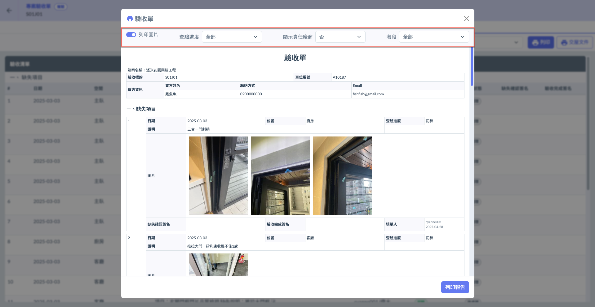

#### 以查驗進度篩選為例

如圖四，點&#x9078;**「查驗進度」**&#x6B04;位以開啟選單，使用者可選擇進度為**初驗**或**複驗**之項目進行列印(圖五)。

!!! warning
    請注意，列印時僅會包含查驗進度為**初驗**或**複驗**之缺失項目、同意事項與建議事項，**「自驗」**&#x968E;段的資料將不列入列印內容。

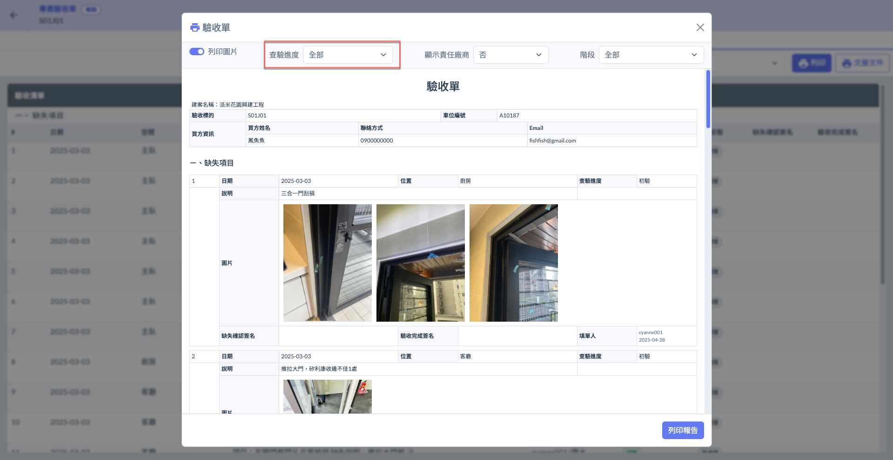 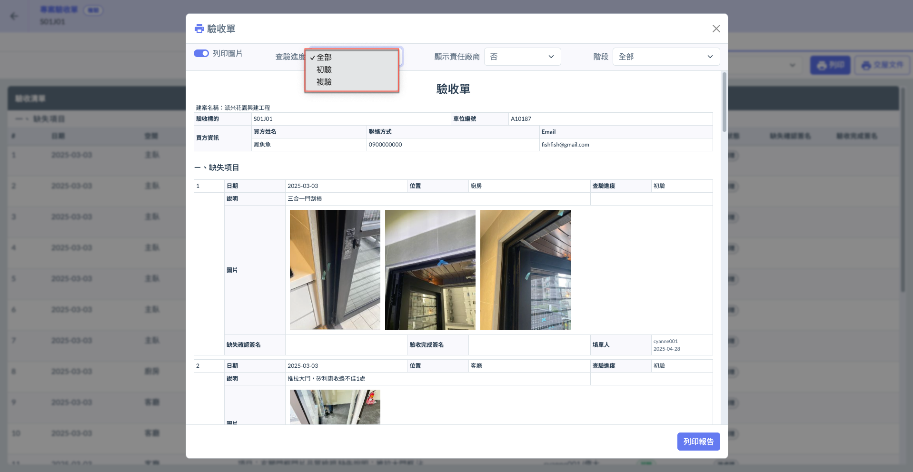

#### 以階段篩選為例

如圖六，點&#x9078;**「階段」**&#x6B04;位以開啟選單，使用者可選擇**缺失確認**或**驗收完成**之項目進行列印(圖七)。



指已由相關人員完成改善，並經負責人核可簽認（完成缺失確認簽名），但尚未經客戶驗收之項目。



指已由相關人員完成改善，並經負責人核可（完成缺失確認簽名），且於最終客戶驗收階段，客戶亦完成簽收（驗收完成簽名）之項目。



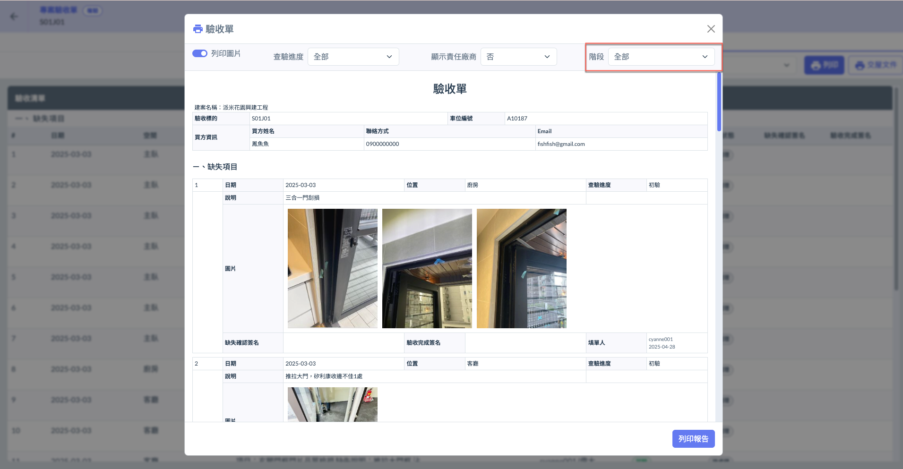 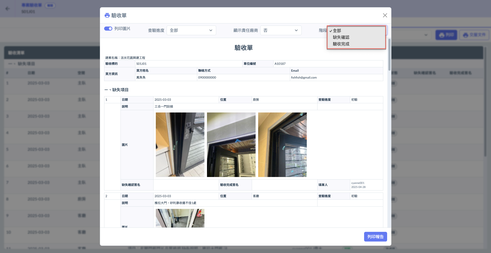

{% embed url="https://files.gitbook.com/v0/b/gitbook-x-prod.appspot.com/o/spaces%2FEqUCL3D5WQfpxJw8NL3P%2Fuploads%2FMQrCSDUdViZsFBmjtlNp%2F%E5%88%97%E5%8D%B0%E5%BD%B1%E7%89%87.mp4?alt=media&token=c9fad5b2-240d-4012-8e8d-8b850f09ef1f" %}
範例影片


***

## 02｜交屋文件

如圖八，進入<kbd>**驗收檢視**</kbd>模式後，點選右上角&#x4E4B;**「交屋文件」**，即可查看列印資料 (圖九)。(包括：買方是否已對該交屋資料確認簽名)

!!! warning
    請注意，此處資料依據您&#x65BC;**「交屋點交文件」**&#x6240;套用之文件版本內容。相關操作，請參閱 [handover-and-acceptance-documents](../../../../../bc/acceptance/web-based/system-settings/handover-and-acceptance-documents "mention")

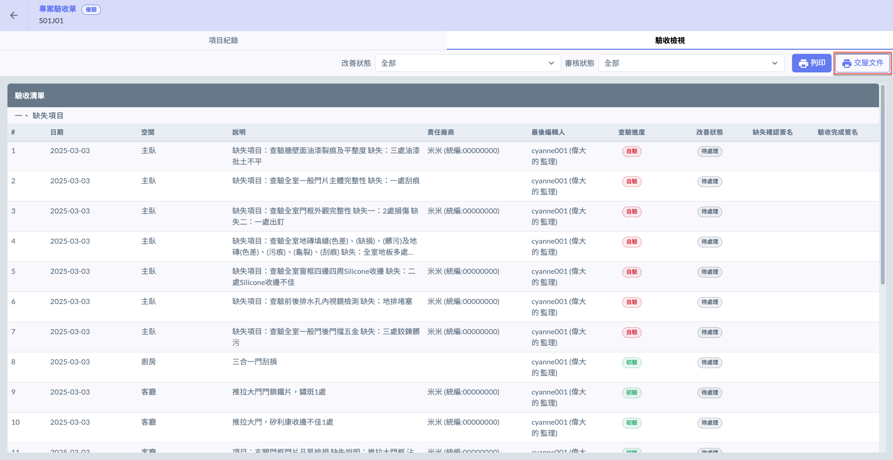 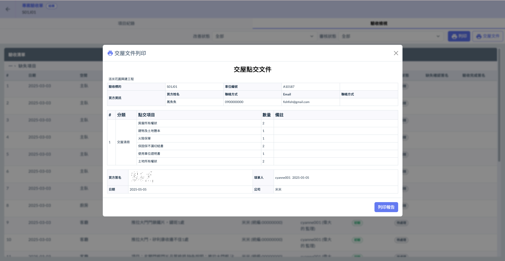

***

## 03｜篩選驗收清單

如圖十，進入<kbd>**驗收檢視**</kbd>模式後，您可於右上角選&#x64C7;**「改善狀態」**&#x53CA;**「審核狀態」**&#x7BE9;選欲列印之驗收清單資料。

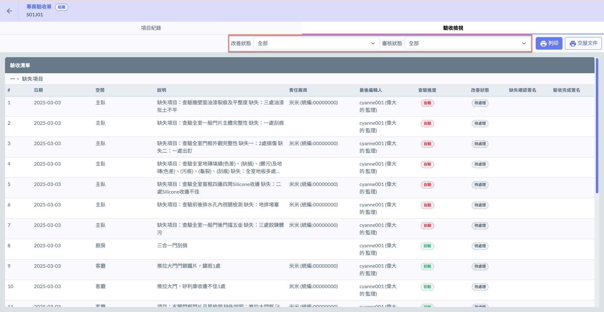



改善狀態分&#x70BA;**「待處理」**&#x8207;**「已改善」**&#x5169;種：

**已改善**：該驗收缺失**已由**責任廠商或相關人員完成改善作業。

**待處理**：該驗收缺失**尚未**經責任廠商或相關人員完成改善。



**驗收完成未簽**：客戶尚未完成驗收確認簽名之項目。

**驗收完成已簽**：客戶已完成驗收確認簽名之項目。



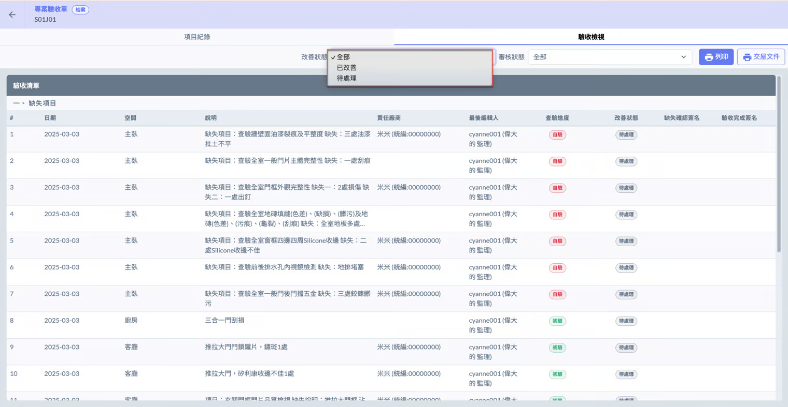 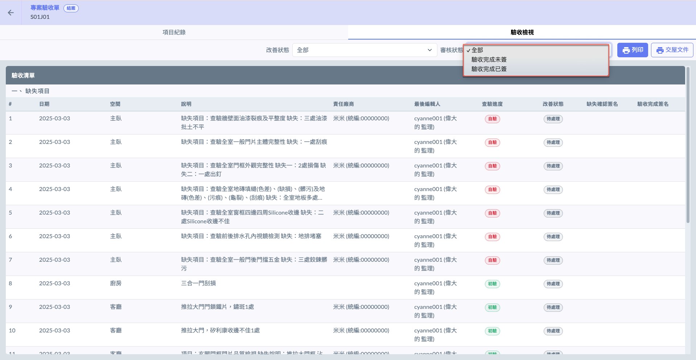

