# 外部專案(new)

#### <kbd><mark style="background-color:green;">**專案可以邀請外部的(不同公司)人員參與！**<mark style="background-color:green;"></kbd>

!!! warning
    #### 請注意
    
    1. 專案之擁有權（Ownership）歸屬於發起並建立該專案之公司單位。
    2. 建議由業主（建設單位）或統包商（營造單位）為主控方，由其主導專案的運行與監控。
    3. 基於管理複雜度與權責劃分考量，不建議直接將各級小包或承攬商加入專案核心。
    4. 此跨公司組成專案功能，其目標用戶主要涵蓋：業主（建設）、統包（營造）、監造（建築師）及特監（專業技師）等核心管理單位。
    5. 目前跨公司協作之功能權限仍持續進行滾動式調整；若您在操作或權限分配上遇任何疑問，歡迎隨時與我們的技術支援團隊聯繫。

***

### 01｜如何建立外部專案？



#### 建立專案

進入**專案清單**頁面後，點選右上角的<kbd><mark style="color:purple;">**+新建專案**<mark style="color:purple;"></kbd>，即可開始建立工程專案(一般建案、公共工程)。

!!! info
    有關新建專案的詳細操作流程，本手冊先前已有專章說明，不再覆述。請參閱 ➙ [**新建專案**](management/create)

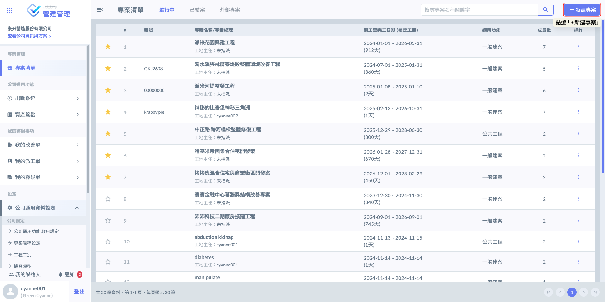



#### 進入專案

如圖二，於專案清單點選指定專案，即可進入該專案並使用相關功能。

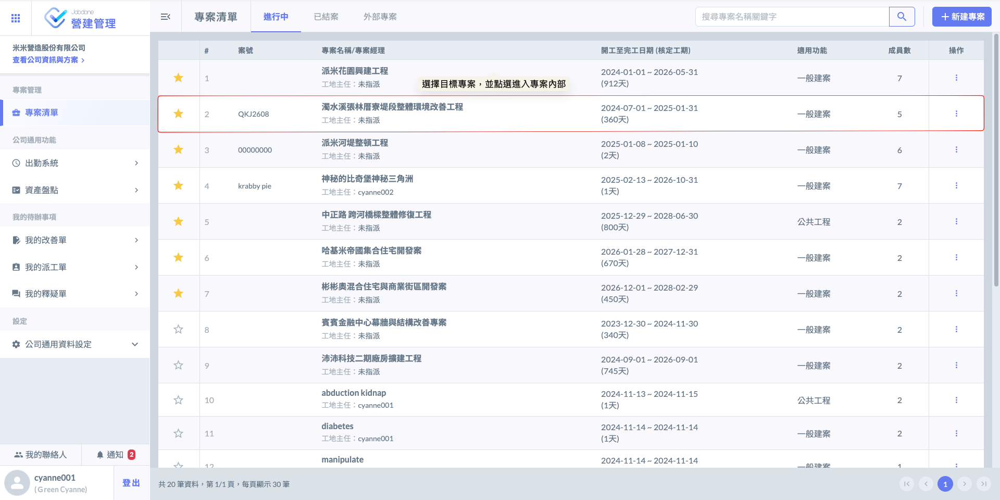

如圖三，進入專案後，請點選左上角  圖示即可開啟選單。

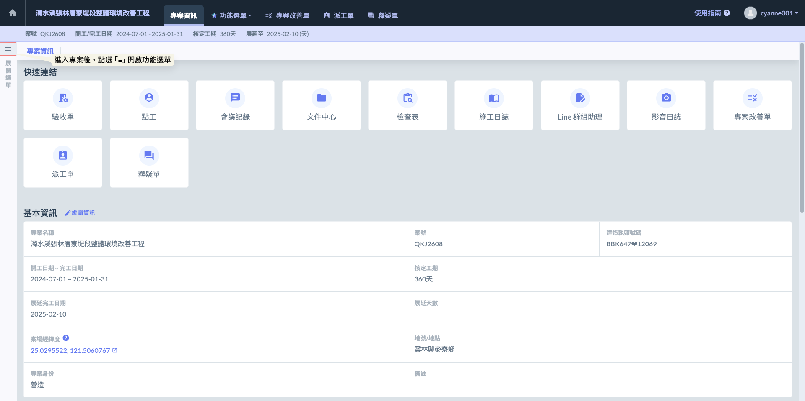

如圖四，開啟選單後，請於『專案相關人員』項下點選<kbd>**專案成員**</kbd>，即可編輯該專案之內部成員與外部人員。

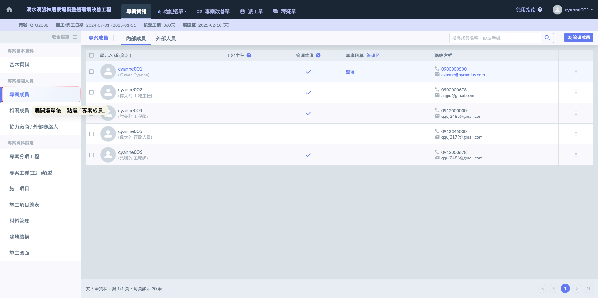



#### 新增外部人員

功能預設顯示為內部成員，如欲管理外部人員，請於專案成員欄位點選<kbd>**外部人員**</kbd>頁籤進行切換。

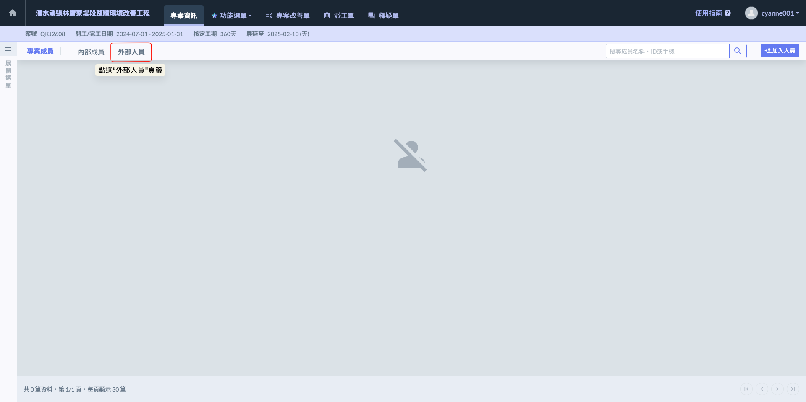

切換至**外部人員**頁籤後，點選右上角的<kbd><mark style="color:purple;">**加入人員**<mark style="color:purple;"></kbd>，即可在彈出的視窗中輸入目標人員的手機號碼。

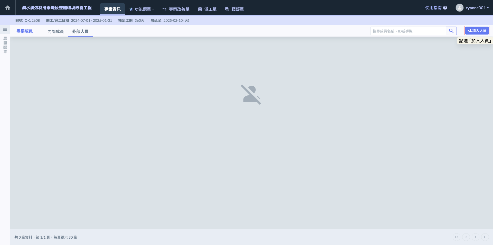

於指定區域輸入目標人員的手機號碼後，請點選  圖示，系統將自動進行查找與比對。

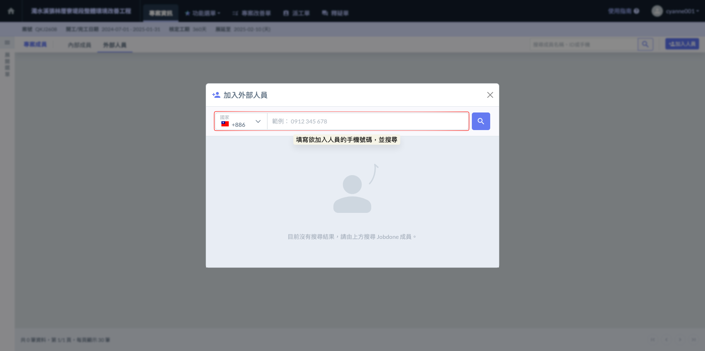

如圖八，確認查找到目標成員後，點選該成員右側的<kbd><mark style="color:purple;">**選擇**<mark style="color:purple;"></kbd>按鈕，即可進入資料填寫頁面。

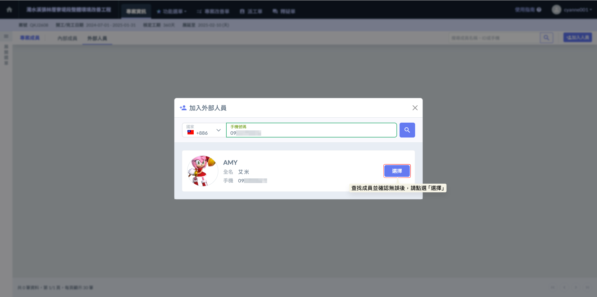



#### 填寫人員資料

選擇該外部成員於此專案中的角色性質，並填寫備註。完成相關欄位設定後，即可正式將其加入專案中。

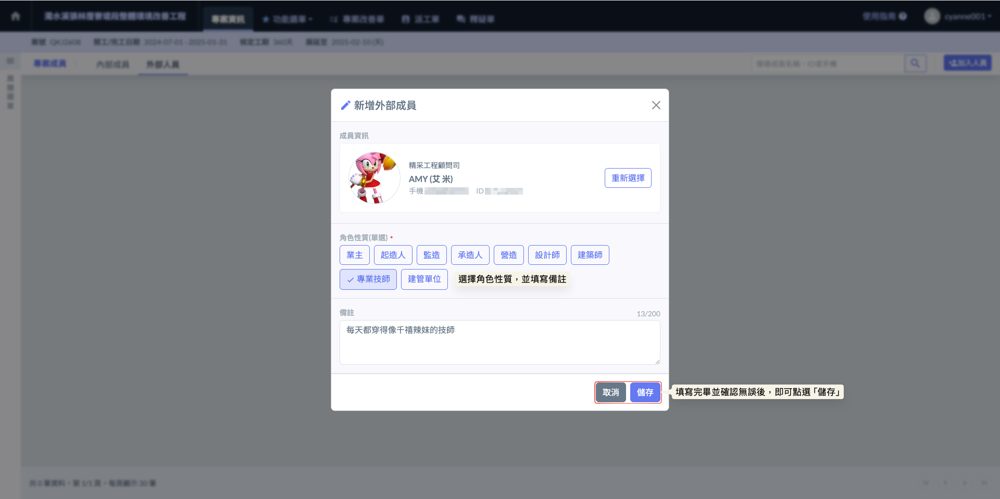

完成畫面如下：

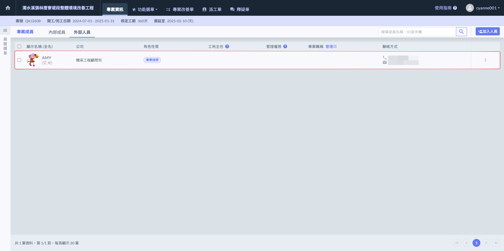



#### 設定職稱與權限

於成員右側點選 <kbd>**⋮**</kbd>圖示開啟功能選單，點選<kbd>**查看詳細資訊**</kbd>即可進入編輯頁面，針對該人員的各項資訊進行調整或補充。

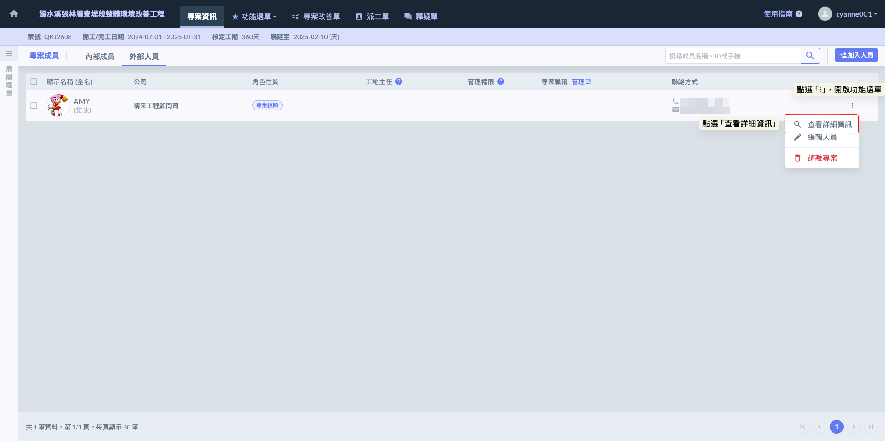

專案權限配置主要區分為 **專案管理** 與 **工地主任** 兩大權限，其管理方式如下：

：代表該成員已獲取此專案權限，再次點選即可關閉此權限。

：代表該成員不具此專案權限，再次點選即可開啟此權限。

!!! info
    有關專案職稱相關設定之說明，請參閱 ➙ [專案職稱](../../company_configuration/project-role)

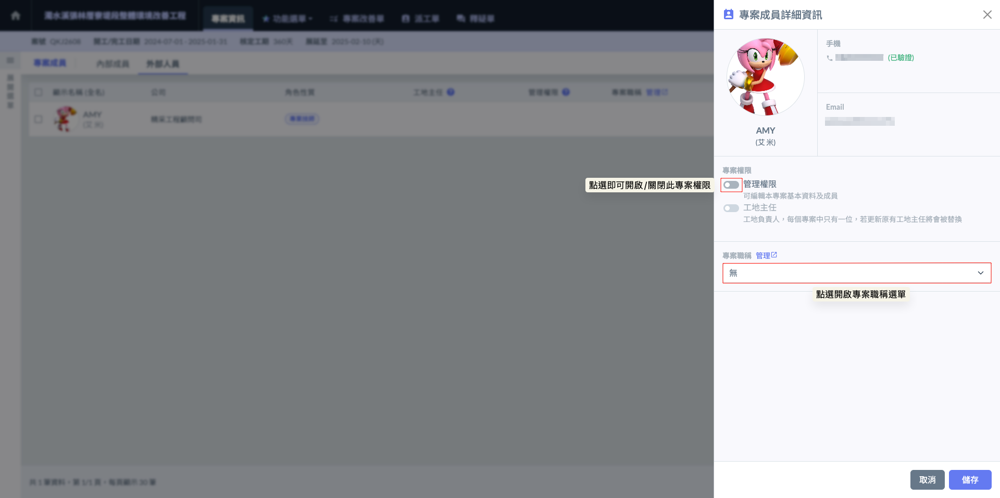

當成員職稱與權限設定調整完畢，並經最終核對無誤後，點選<kbd><mark style="color:purple;">**儲存**<mark style="color:purple;"></kbd>即可正式套用設定並完成更新。

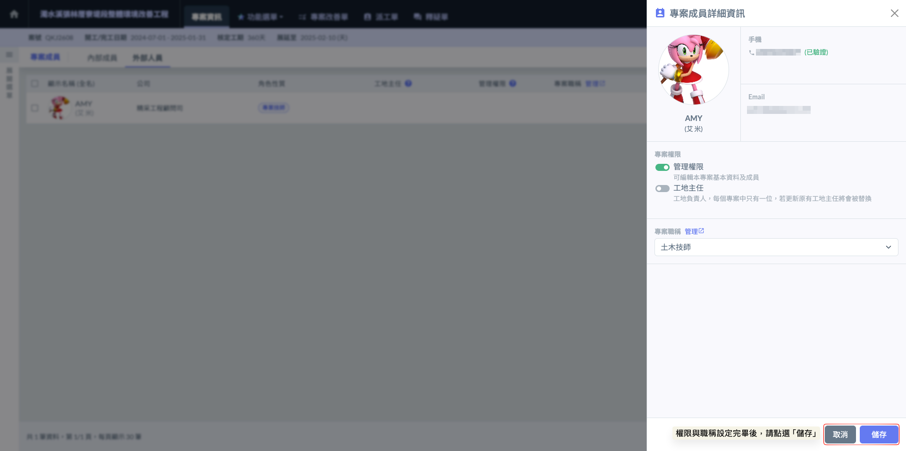

完成畫面如下：

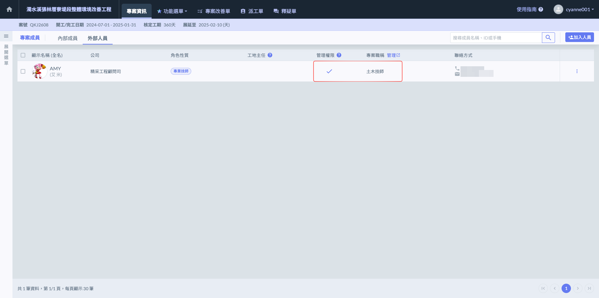



***

### 02｜如何查看外部專案？

進入系統主頁後，預設將顯示<kbd><mark style="color:purple;">**進行中**<mark style="color:purple;"></kbd>之專案列表。您可以依據管理需求，點選上方標籤自由切換其他頁籤(<kbd>**進行中**</kbd>/<kbd>**已結案**</kbd>/<kbd>**外部專案**</kbd>)，以便查閱不同狀態下的專案紀錄。

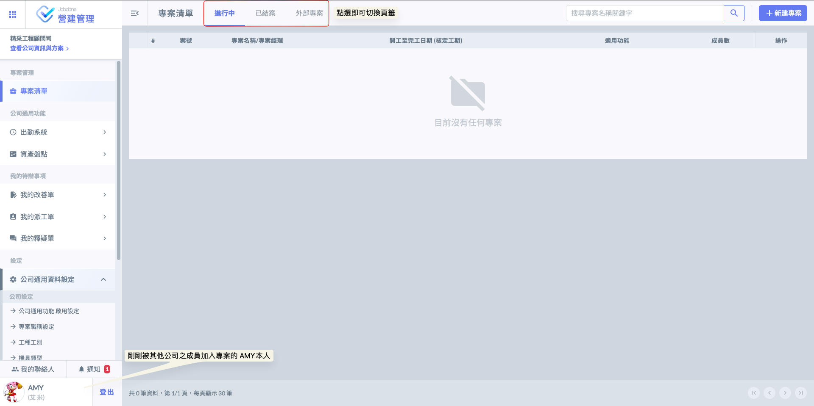

切換至<kbd><mark style="color:purple;">**外部專案**<mark style="color:purple;"></kbd>頁籤後，AMY即可找到該專案(濁水溪張林厝寮堤段整體環境改善工程)。

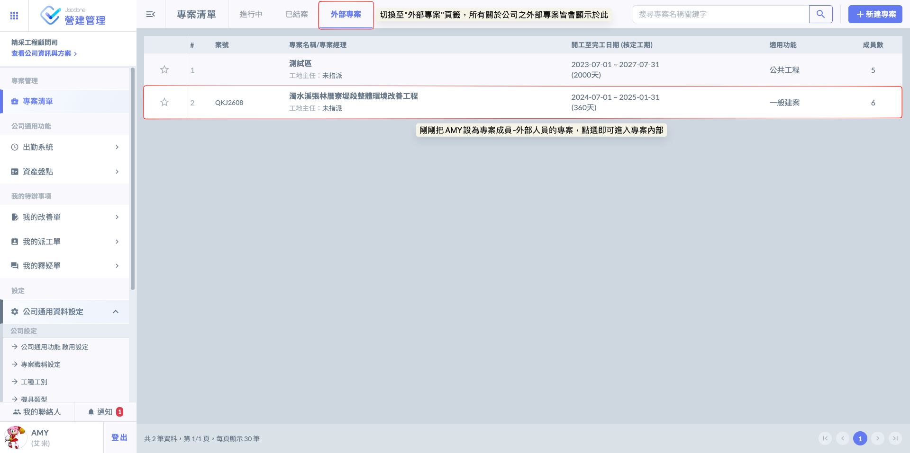

進入專案畫面如下：

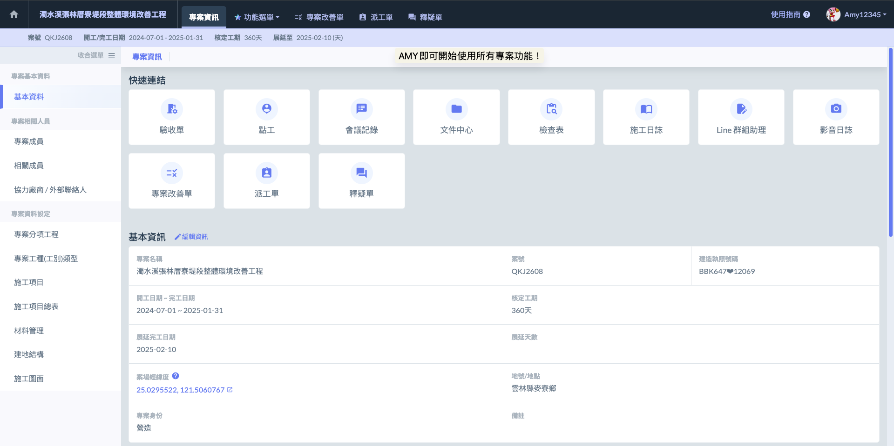
