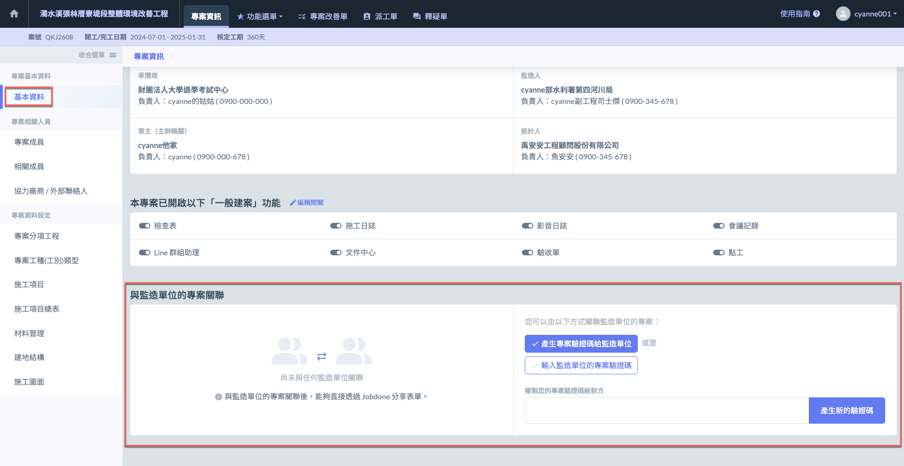
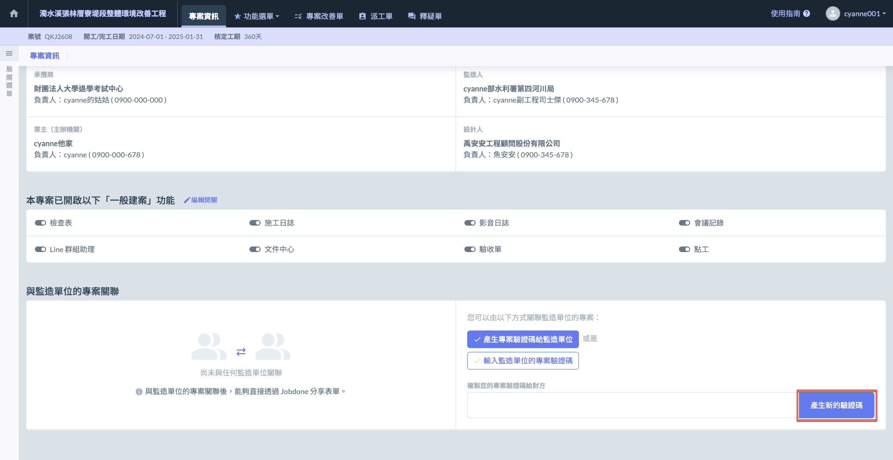
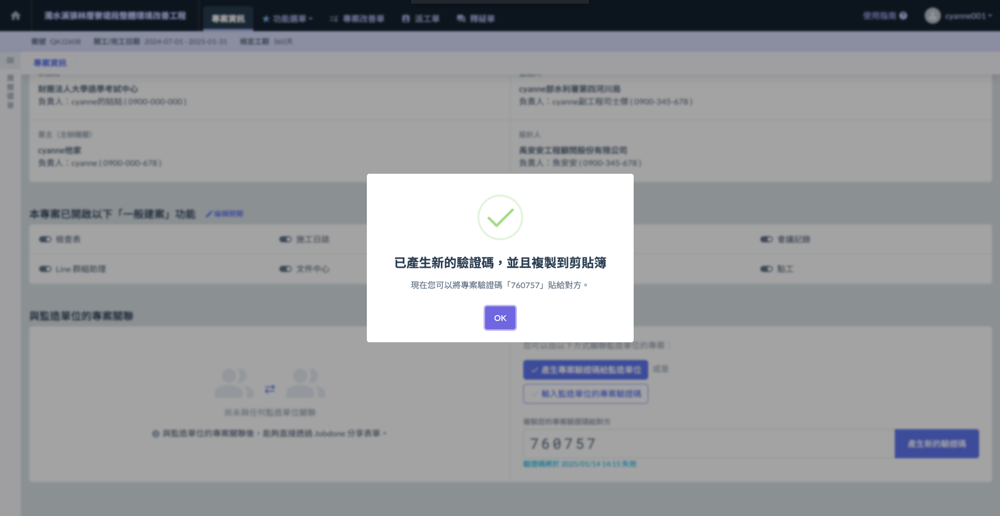
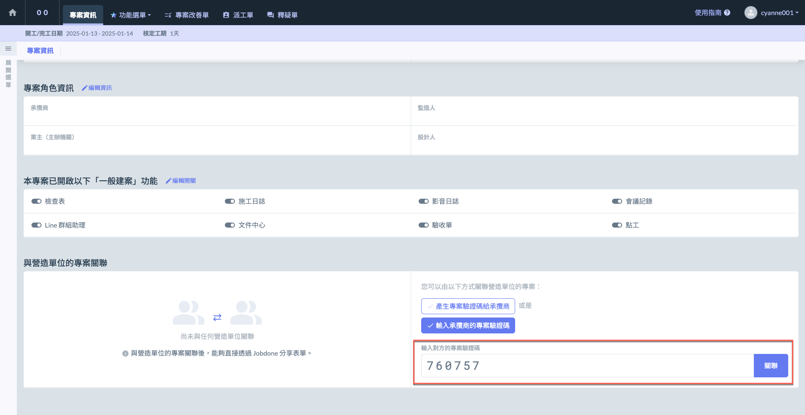
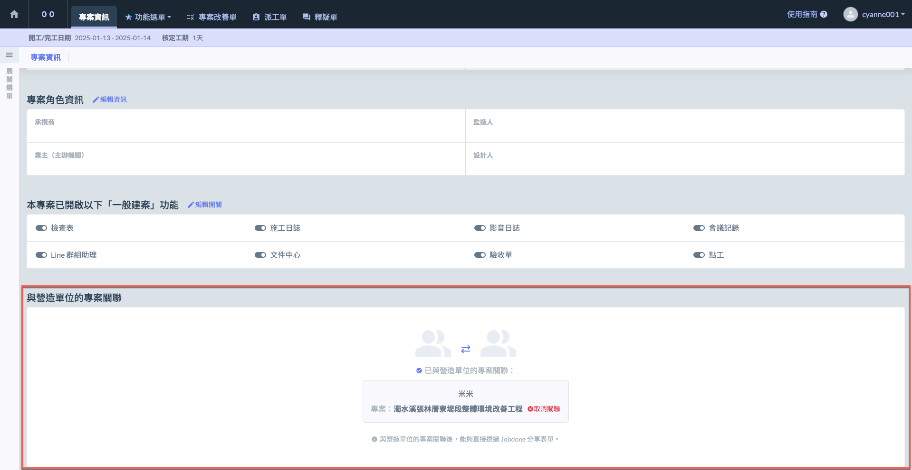

# 專案關聯

## 與營造/監造單位關聯

與監造/營造單位的專案關聯後，您可以直接透過 **Jobdone** 分享表單，如施工日誌和監造日報，這將大大簡化工地現場的資料管理與溝通流程，提升專案管理的效率與透明度。

!!! tip
    專案關聯功能，除提供營造與監造雙方&#x4E4B;**「施工日誌」**、**「監造日報」**&#x5206;享。
    
    監造單位亦可選擇是否複製營造單位&#x4E4B;**「施工項目」**、**「施工項目總表」**。

有兩種方式可以關聯監造/營造單位的專案，分別為：



系統會自動生成一個專案驗證碼，並提供給監造或營造單位，使用此驗證碼來關聯專案。

以營造單位為例：**營造單位產生驗證碼** **➙ 營造單位給予監造單位該驗證碼 ➙ 監造單位輸入該驗證碼**



監造或營造單位收到對方給予之驗證碼後，可將其輸入系統中，從而完成專案的關聯。

以營造單位為例：**營造單位產生驗證碼** **➙ 營造單位給予監造單位該驗證碼 ➙ 監造單位輸入該驗證碼**



下圖&#x4EE5;**「營造單位」**&#x70BA;例：

***

### 產生驗證碼

點&#x9078;**「產生新的驗證碼」**&#x6309;鈕後，系統將生成一組具有時效性的驗證碼。使用者可將此代碼複製並分享給營造/監造單位，讓該單位輸入該驗證碼完成專案關聯。

***

### 輸入驗證碼

收到來自營造/監造單位的驗證碼後，您可於下圖的輸入框中輸入或貼上該代碼，然後點&#x9078;**「關聯」**&#x4EE5;完成專案的關聯設定。

關聯成功後，畫面如下：

