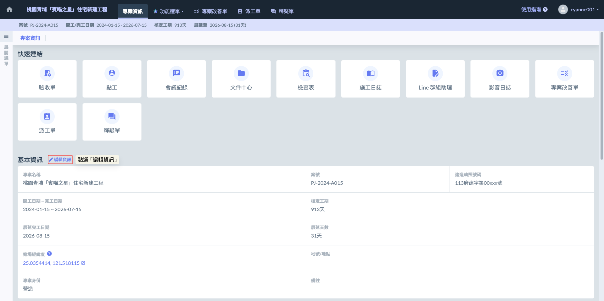
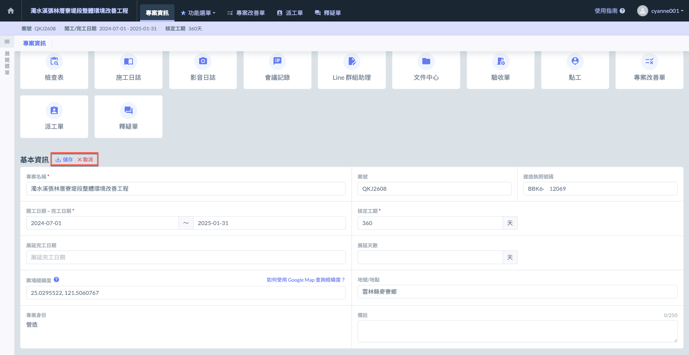
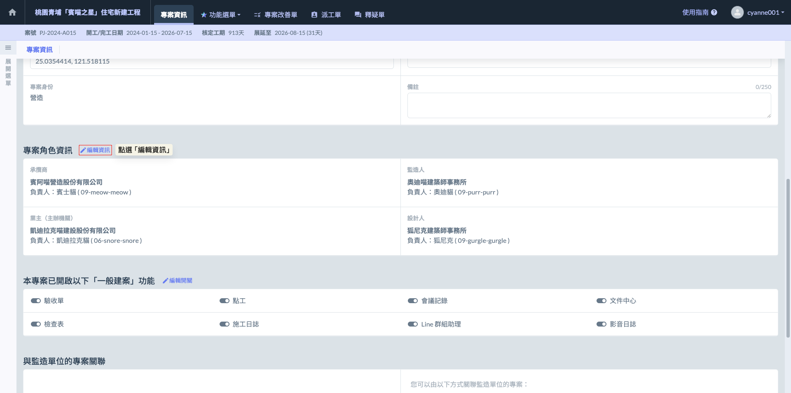
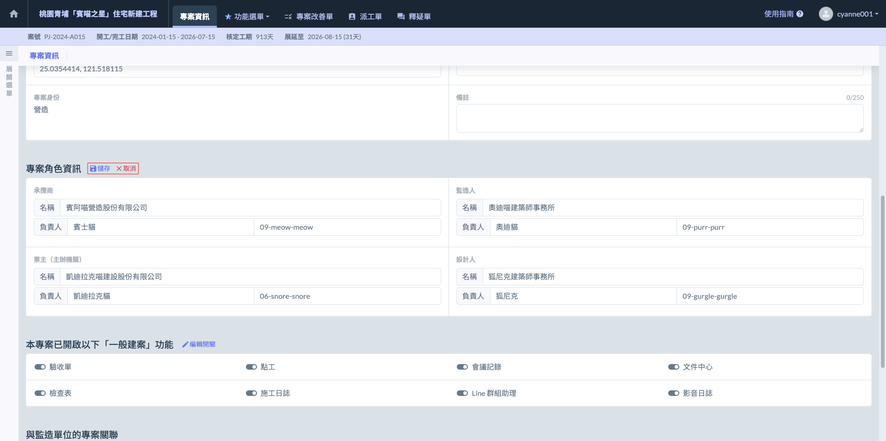
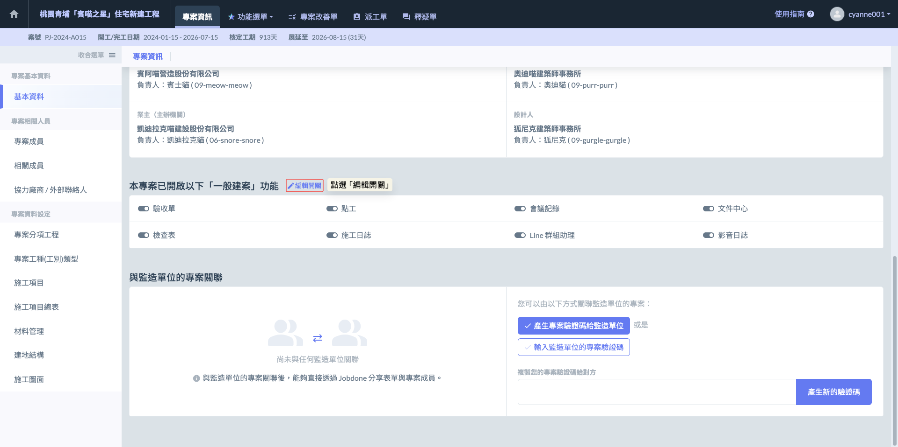

# 網頁版

---
description: Web-based Version
---

# 網頁版

## **資料填寫**



### 基本資訊

進入專案後，請務必先完善『專案基本設定』。填寫內容包含：專案名稱、案號、建築執照、開工與完工日期，以及案場經緯度等關鍵資訊。

!!! warning
    #### 請注意
    
    精確的資料輸入是確保後續自動化管理發揮綜效的基石，尤其是：
    
    1. **工期與展延：** 填寫準確的合約工期與核定展延天數，將直接影響『施工日誌』的期程計算與累計進度精確度。
    2. **案場經緯度：** 座標設定將與氣象測站同步，直接自動生成『晴雨表』紀錄，節省人工登載氣候資訊的時間。



* 請輸入與合約書一致的正式工程名稱。
* 此名稱將自動帶入所有施工日誌、影音報表及輸出文件的表頭，確保文件的一致性。



* 填寫公司內部編號或投標案號。



* 輸入政府主管機關核發的建造執照字號（如：112中都建字第xxxx號）。
* **重要性：**&#x6B64;欄位與申報開工、階段驗收及日後的使用執照申請掛鉤，是法律合規的關鍵標記。



反映合約規定的預計施工天數。是經過批准的工程總工期，通常由業主或相關主管機構根據項目的規模、預算、資源等因素進行核准。核定工期是後續進度控制的基準。



當發生不可歸責於承包商之事由（如天災、變更設計、行政審查延遲）時，核定增加的天數。

!!! info
    #### 補充說明
    
    本系統採 「動態工期管理」 邏輯。當您在專案基本資訊中輸入或更新「展延天數」後，系統將自動重新計算專案總期程，並同步更新後續所有日誌報表的基準。
    
    當展延天數生效後，系統後台會自動調整日誌模組的參數：
    
    * **累計天數自動校正：** 施工日誌中的「開工後累計天數」與「剩餘工期」將自動重新計算。
    * **日誌生成區間延伸：** 系統會根據展延後的完工日期，自動開放對應天數的日誌填寫權限（例如：原定 300 天，展延 10 天後，系統將自動允許產生至第 310 天的日誌表單）。
    * **進度百分比重新分攤：** 若系統涉及預定進度曲線（S-Curve），展延天數將作為分母的一部分，重新計算每日應達成的預定進度比率。
    
    > 在儲存變更前，請務必確認已取得正式核定公文，避免造成日誌報表數據頻繁變動。




如圖一，於「專案基本資訊」欄位中點選  圖示，即可針對各項參數進行修改。

如圖二，完成修改後，按下  即可更新並套用所有變更；若欲放棄修改，按下  即可返回原資料狀態，不會保留任何更動。




### 專案角色資訊

完成基礎資訊後，請接續填寫『專案角色資訊』。此處定義了專案的核心參與單位，包括：承攬商 (Contractor)、監造單位 (Supervisor)、業主/承辦機關 (Client/Owner) 及 設計人 (Designer)。



承攬商是負責專案施工執行的單位或公司，負責按照設計圖紙與規範進行建設工作，並確保施工品質、進度和安全。



監造人是負責監督專案施工質量、進度及安全的專業人員或公司。其職責是確保施工過程符合既定的設計方案、技術規範及法律法規。



業主是專案的主要出資方或最終受益方，通常負責提供資金支持並確定專案的最終目標。



設計人是負責專案設計工作的工程師或設計單位。該角色負責專案的結構設計、系統規劃及其他技術規範，確保專案設計滿足技術、安全及法律要求。



如圖三，於『專案角色資訊』欄位，點選  圖示，即可修改各項資料。

如圖四，完成修改後，按下  即可更新並套用所有變更；若欲放棄修改，按下  即可返回原資料狀態，不會保留任何更動。




### 專案功能

專案管理人員可依據案場特性與管理需求，在此處彈性勾選專案欲開啟的功能模組。凡未啟用的功能，系統將自動於『快速連結』與『功能導覽選單』中隱藏。

下圖以「一般建案之營造單位」之配置作為示範：

點選  按鈕，管理人員即可進入客製化配置模式，依據專案現況靈活調整功能模組。您可以視需求即時開啟或關閉特定功能，確保系統介面始終維持在最精簡、高效的狀態。

如圖六，透過系統介面的圖示色彩，您可以快速辨識目前各項功能的啟用狀態，操作邏輯如下：

*  圖示： 表示該功能『已啟用』。若需停用此模組，再次點選即可關閉，系統將從選單中隱藏該項功能。
*  圖示： 表示該功能『未啟用』。若需使用此模組，點選即可開啟，該功能將立即出現在您的功能選單與快速連結中。



