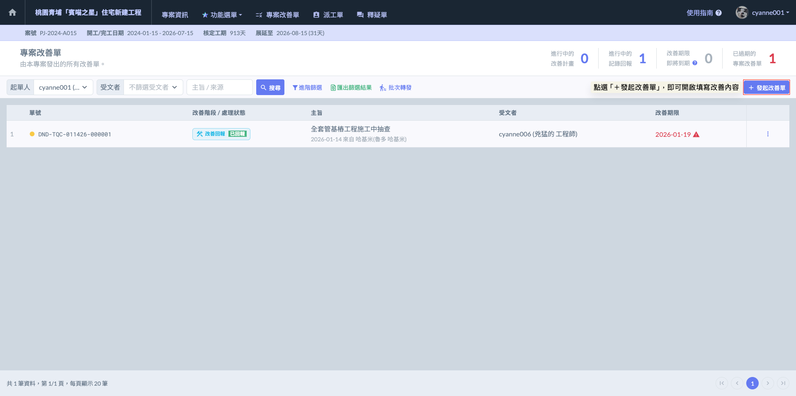
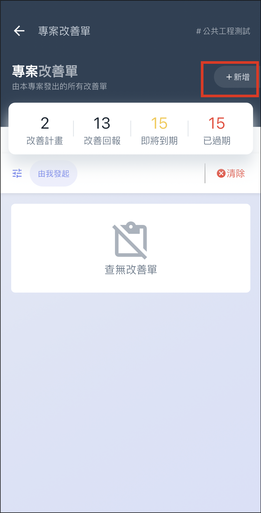
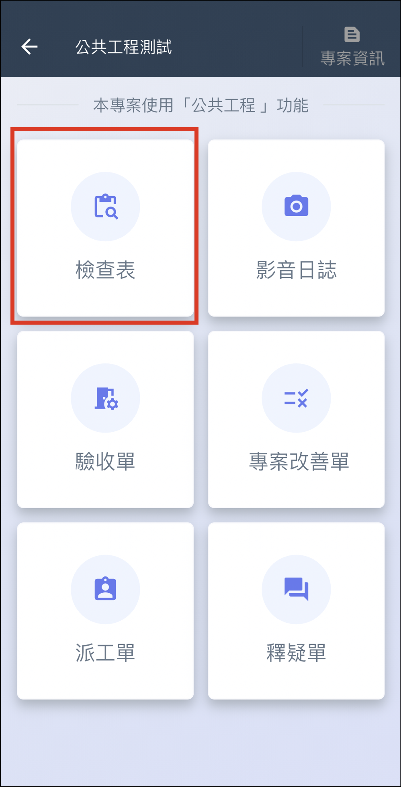
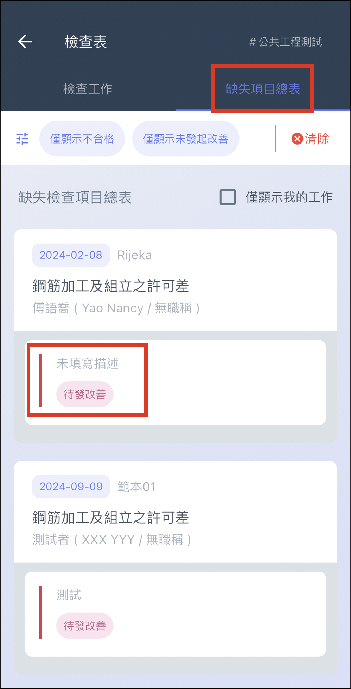

# 發起改善單

---
description: Corrective Action
---

# 發起改善單

專案改善單的來源主要分為兩大路徑：您可以直接『改善單功能』內手動建立並發起，或是透過『檢查表』查驗出缺失後，由系統自動將不合格項目轉化發送為改善單。



* **適用情境：**&#x73FE;場隨機發現的缺失（如巡場時發現工人未戴安權帽、臨時性的環境髒亂），不屬於特定檢查表範疇內的事項。
* **優點：**&#x53CD;應速度快，可隨時隨地針對單一問題點進行紀錄與指派。



* **適用情境：**&#x57F7;行正式查驗程序（如基樁鋼筋籠檢查、沈澱池規格測量）後，針對判定為『不合格』的項目進行整改追蹤。
* **優點：**&#x5177;備嚴謹的查驗背景與數據佐證，且能透過『一鍵發起改善單』功能批次處理，確保缺失紀錄與原始檢查表完美對應。



如圖一，進入『專案改善單』頁面後，點選右上角的  圖示即可開啟編輯視窗。

如圖二，開啟改善發起視窗後，為了確保缺失能被精確追追蹤與改善，請詳細填寫以下資訊：



填寫改善單時，請根據缺失的嚴重程度選擇正確的『改善類型』，這將觸發不同的管理機制：

**一般缺失（DND - Defect Notification / Disposition）**

* 定義：程度較輕微、可立即修正的現場問題。
* 流程：整改人收到後可直接進行修復，並上完改善後的照片進行結案申請。

***

**不符合事項（NCR - Non-Conformity Report）**

* 定義：情節較嚴重、涉及結構安全或違反合約規範之項目。
* 強化流程：系統會啟動更嚴密的控管邏輯 ➙ 『先審核、後執行』。

> 1. 提交改善計畫：受文者收到 NCR 後，無法直接回報改善，必須先填寫並填寫詳細的改善計畫。
> 2. 管理端審核：改善計畫須經由管理人員審核通過後，廠商才可獲得權限開始執行實質改善。
> 3. 結案回報：改善完成後，再依循標準程序上傳佐證資料進行最終核可。



* **責任廠商：**&#x8ACB;選擇負責整改的廠商名稱。若現場已能明確歸屬責任，請直接選取對應的『外部廠商』；若缺失成因複雜或尚待釐清，則可暫時選取『責任待定』。
* **受文者：**&#x6307;定具體的接收人員（如廠商現場負責人或工務窗口）。該對象除了會收到系統的同步通知外，意識負責在系統內提交該『缺失改善回報』的負責人。透過此設定，能確保缺失從『發現』到『改善完成』都有明確的責任對應，避免互推皮球。



紀錄發現缺失的當下時間。系統預設為當前時間，亦可根據實際查驗狀況手動調整，確保紀錄與現場實況完全符合。



明確要求廠商須完成修復並提交回報的截止日期。若屆期未結案，系統將自動標示為『過期缺失』，即可請受文者儘速辦理。



* **主旨：**&#x61C9;簡潔扼要，讓收件人在清單中一眼辨識問題點（例如：`B1區柱筋間距不符` ）。
* **描述：**&#x6B64;欄位則應詳述缺失細節與具體改善要求（例如：`實際間距 20cm，請調整回原設計值 15cm` ），避免資訊斷層。



* **附圖附件：**&#x652F;援直接拍照、從相簿選取多圖或夾帶 PDF 等相關文件。

!!! info
    #### 💡 專業技巧
    
    1. 於手機使用App版時，強烈建議使用內建的『手繪功能』、『浮水印相機』等，直接在照片上標記出缺失位置或標註量測數據，能讓改善人在複雜的工地現場迅速損定問題，實現看圖即懂的高校溝通。
    2. 在執行查驗並填寫檢查紀錄時，完善的影像佐證是品質管理的核心。系統提供『暫存媒體庫』，讓您可直接從系統內部的媒體空間選取照片。
       * **來源說明：**&#x6B64;處可選取的照片，是同步自該專案&#x4E2D;**『******影音日誌內的暫存媒體庫******』**。
       * **適用情境：**
         * 避免重複拍攝： 若工程師在巡視現場時，已先透過「影音日誌」大量拍攝了當日的施工狀況，在進入「檢查表」時，只需從暫存媒體庫中勾選對應照片即可，無需重新開相機拍照。
         * 資料一致性： 確保施工紀錄與自主檢查表使用的是同一組影像來源，強化資料的互證性。




 

***

## APP

### 直接發起改善單

進入 APP 後，點選 「 我的專案」，選擇 「 專案改善單 」，即可點選右上角 「 + 新增 」 直接發起改善單。

!!! warning
    若此介面未選擇受文者，可以至專案改善單清單再挑選受文者，並可指定受文者完成改善後需交由指定人員進行**改善單審核**。也可以選擇 「 免審核 」。

 

### 透過功能發起改善單

* 以**檢查**表為例

進入檢查表後，選擇 「 缺失項目總表 」 分頁，點選缺失項目的 「 待發改善 」 即可開始填寫改善單類型及發起改善單。若須修改發出的改善單，或改派給其它人，還可以選擇 「 重發改善 」。

!!! warning
    若此介面未選擇受文者，可以至專案改善單清單再挑選受文者，並可指定受文者完成改善後需交由指定人員進行**改善單審核**。也可以選擇 「 免審核 」。

 

