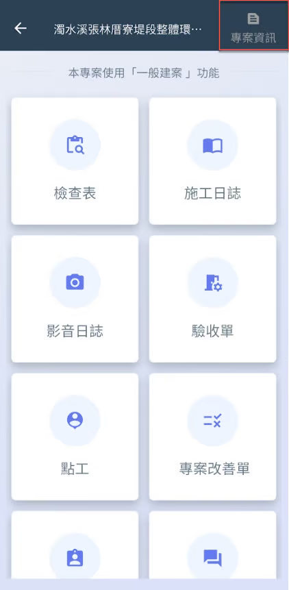
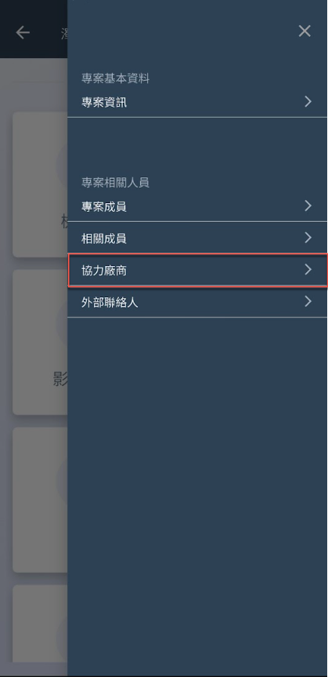
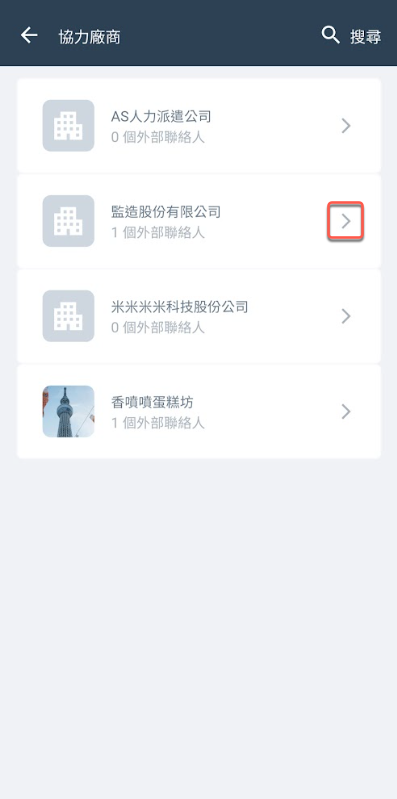
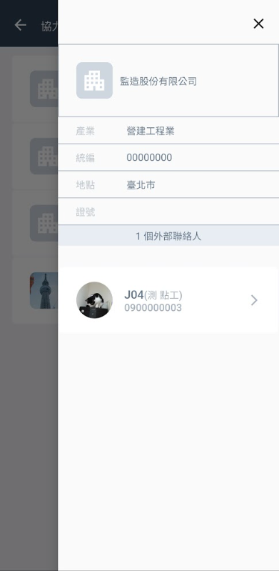
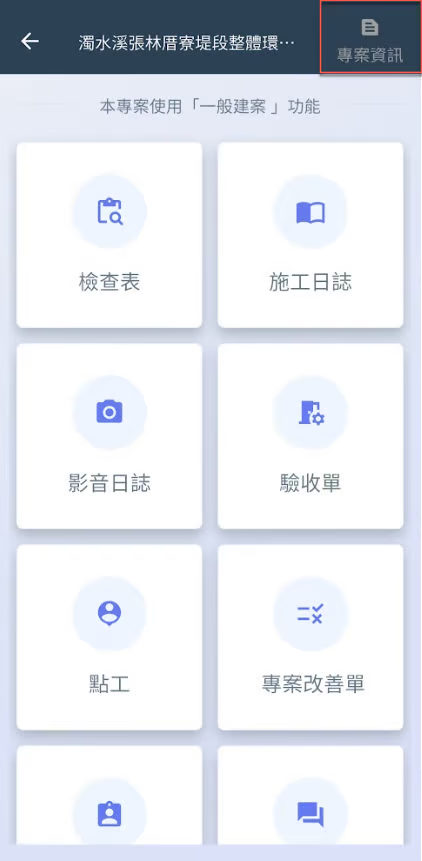
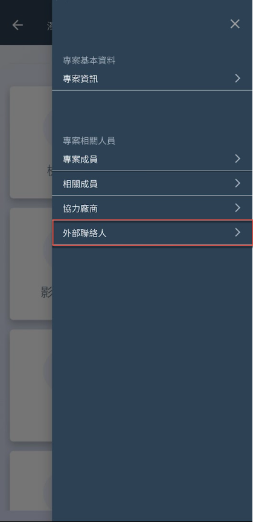
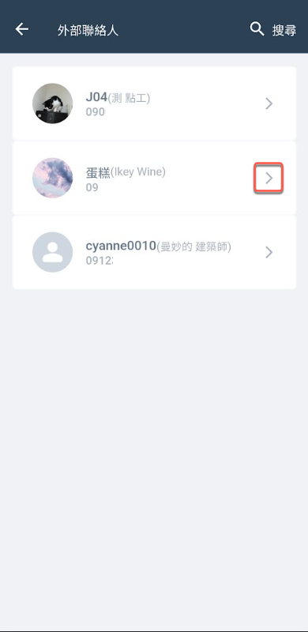
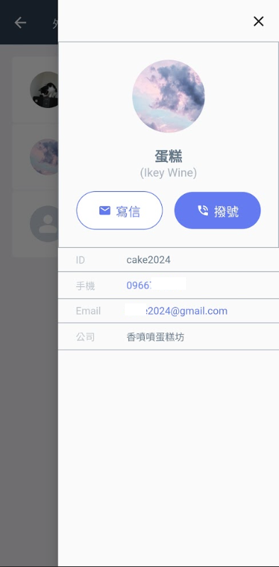

# APP 版

## 01｜協力廠商

進入專案後，點選「專案資訊」，再選擇<kbd>**協力廠商**</kbd>，即可查看所有協力廠商，並檢視其個別資料。

 

 

***

## 02｜外部聯絡人

進入專案後，點選「專案資訊」，再選擇<kbd>**外部聯絡人**</kbd>，即可查看所有外部聯絡人，並檢視其個別資料。

 

您可看到所有外部聯絡人，點擊欲查看的成員，並&#x53EF;**「寫信」**&#x6216;**「撥號」**&#x7D66;該成員。

 

