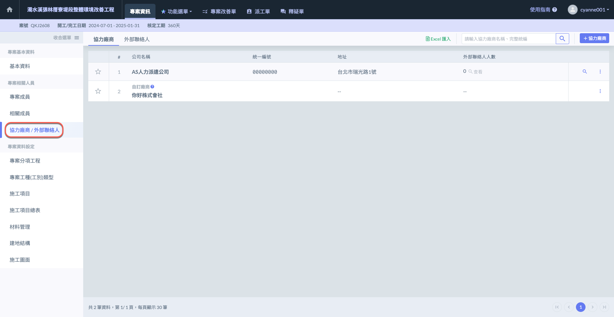

# 協力廠商 / 外部聯絡人

**「協力廠商 / 外部聯絡人」**&#x529F;能提供使用者一個系統化的方式來管理專案中所有協力廠商及其聯絡人資訊。使用者可透過此功能有效登錄、整理與專案相關的協力廠商資料。

將分&#x70BA;**「網頁版」**&#x8207;**「APP 版」**&#x5169;種說明，兩者功能略有不同。



可新增/刪除協力廠商及外部聯絡人。



僅能查看協力廠商及其聯絡人資訊，亦可撥號、寫信給其聯絡人。



!!! warning
    使用其他功能，&#x5982;**「檢查表」**、**「材料管理」**、**「施工工項」**&#x53CA;**「影音日誌」**&#x7B49;功能時，將會運用到此處資料，務必妥善填寫。

