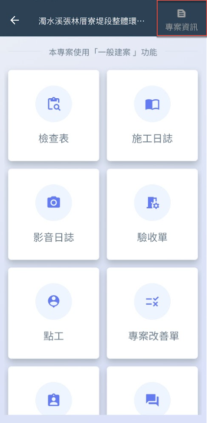
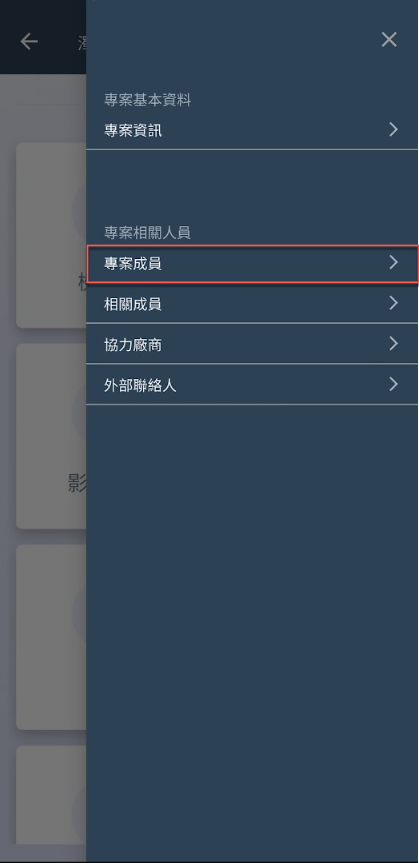
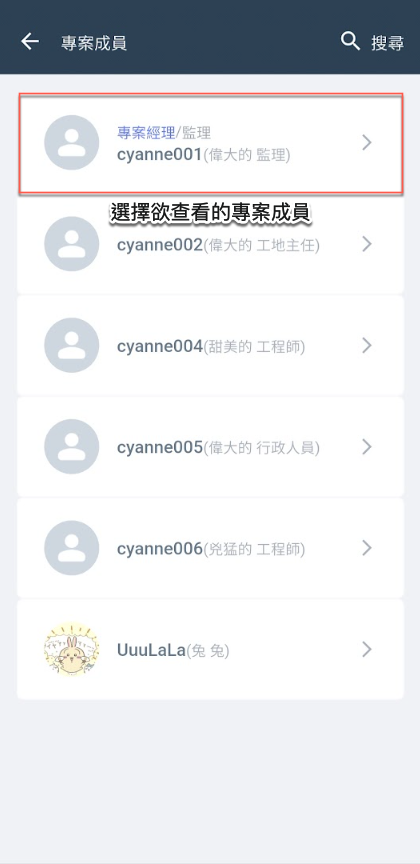
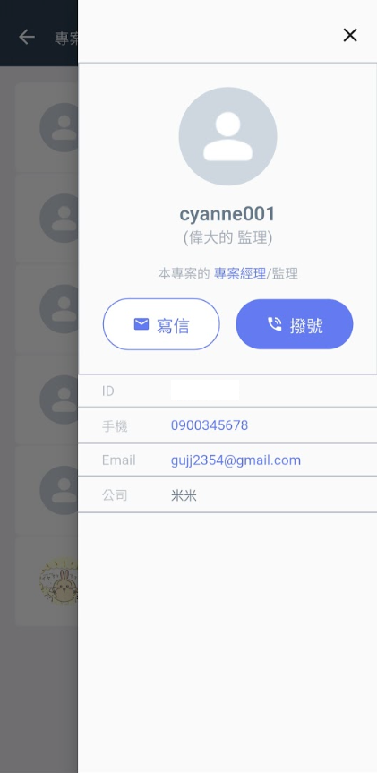

# APP 版

進入專案後，點選「專案資訊」，再選擇<kbd>**專案成員**</kbd>，即可查看所有專案成員，並檢視其個別資料。\
點選欲查看之成員，您可進一步透過<kbd><mark style="color:blue;">**寫信**<mark style="color:blue;"></kbd>或<kbd><mark style="color:purple;">**撥號**<mark style="color:purple;"></kbd>功能，直接聯繫該成員。

!!! warning
    請注意，專案成員之權限與職稱設定僅能透過網頁版進行操作。

   

