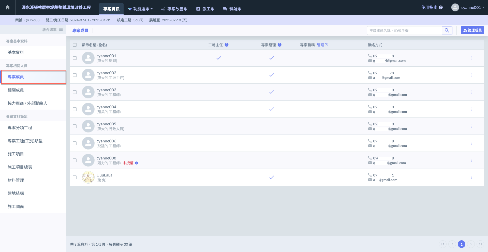

# 專案成員

於此功能中，您可編輯各專案成員&#x4E4B;**「專案職稱」**、給&#x4E88;**「專案經理/工地主任權限」**&#x53CA;將成員加入/移出專案。

將分為**網頁版**與**APP 版**兩種說明，兩者功能略有不同。



**「專案經理」**&#x53EF;給予權限、編輯成員職稱、將成員加入/移出專案等。



僅能查看成員資訊，可發送信件或撥號給該成員。



***

## 01｜職位介紹

大致分為以下三種職位介紹，分別為**專案經理**、**工地主任**、**專案成員**：



可編輯專案所有資訊、管理專案成員、授予功能權限、審核檢查表、管理文件中心等等。



每個專案中僅限設置一位，可另行審核改善回報。



可查看專案資料，但僅能變動部分資料，如檢查表之檢查填寫、改善單回報、施工日誌填寫等等。



