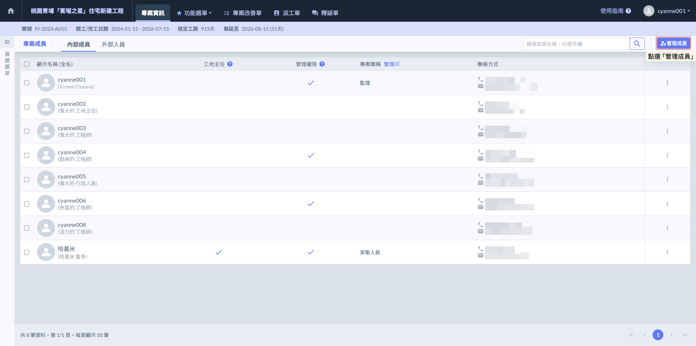
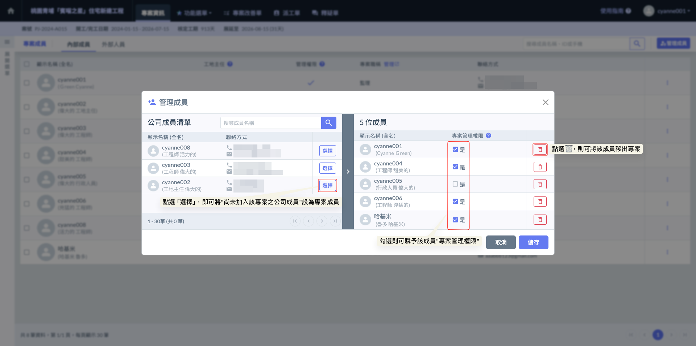
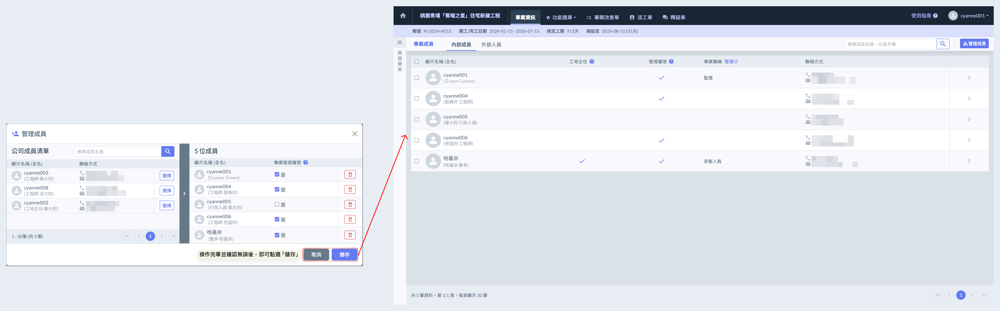
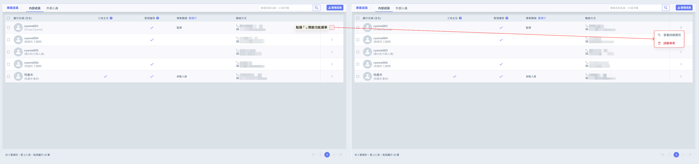
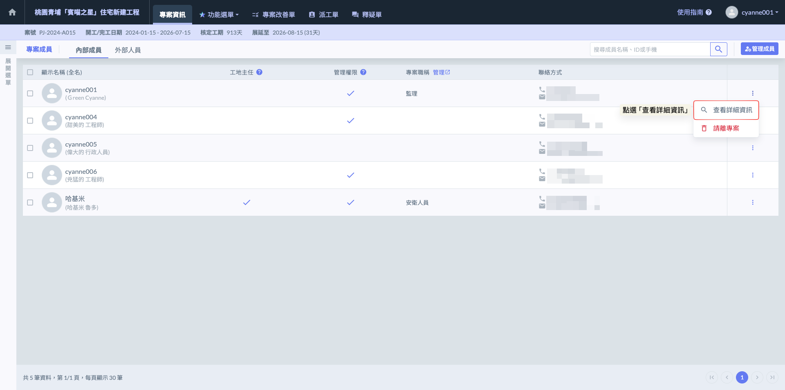
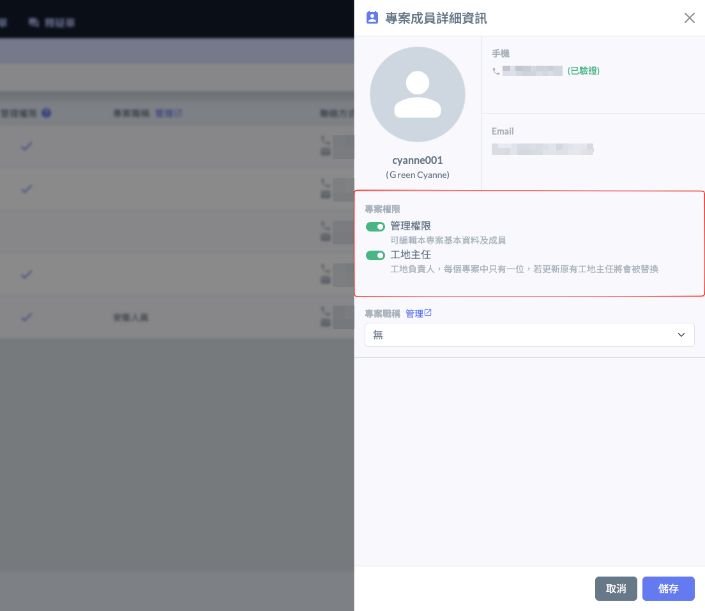
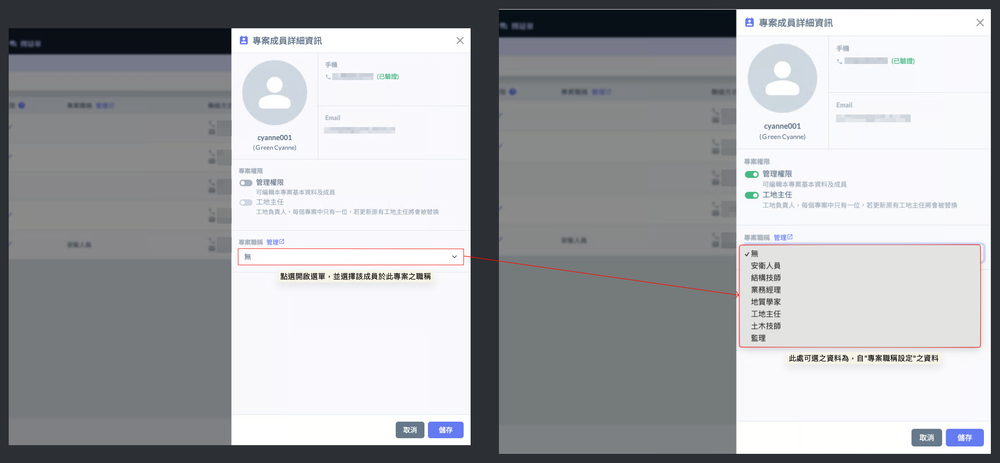
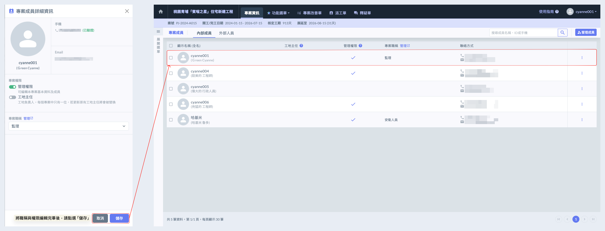
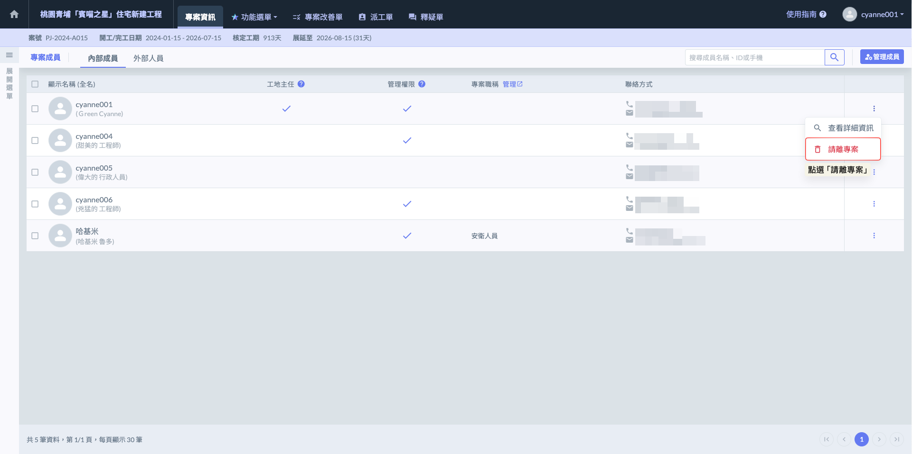
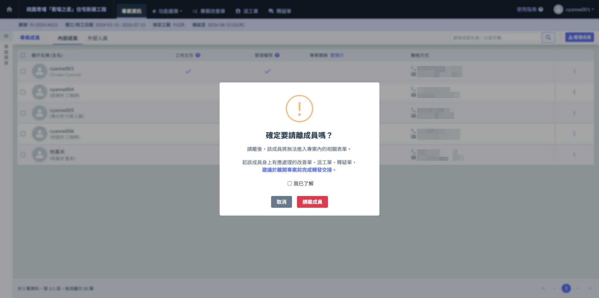

# 網頁版

---
description: Web-based Version
---

# 網頁版

## 01｜管理所有成員

如圖一所示，進入「專案成員管理」頁面後，點選右上方的<kbd><mark style="color:purple;">**管理成員**<mark style="color:purple;"></kbd>按鈕，即可開啟專案成員編列視窗。您可在此進行公司成員的移入或移出操作，並針對個別成員設定是否授予****專案管理權限****。

如圖二所示，於尚未加入該專案的公司成員右側點選，即可將該成員加入為專案成員；若欲將成員移出專案，則可於其右側點選，即可完成移除操作。

!!! warning
    #### 注意事項
    
    1. 僅有具備「管理權限」身份之使用者，方可執行權限指派及設定專案成員之職稱。
    2. 請注意，專案成員之權限與職稱設定僅能透過網頁版進行操作。

完成畫面如下：

***

## 02｜管理個別成員

如圖一所示，於欲管理之成員右側點選「⋮」，即可開啟功能選單，選擇<kbd>**查看詳細資訊**</kbd>/<kbd><mark style="color:red;">**請離專案**<mark style="color:red;"></kbd>，進行該成員相關管理操作。

### 02 - 1｜查看詳細資訊

如圖二所示，開啟功能選單後，請點選<kbd>**查看詳細資訊**</kbd>，即可開始編列該成員所屬之專案資訊，包括是否為專案經理、工地主任等身份，以及設定其在專案中之職稱。

如圖三所示，表示該成員擁有該項管理權限，則表示未擁有該權限。

!!! warning
    請注意：每個專案內僅能指定一位工地主任，系統將限制同一專案中不得重複設定，請於編列時特別留意。

 

如圖四所示，點選「專案職稱」欄位，即可開啟下拉選單，選擇該成員於此專案中的職稱身份。

有關專案職稱管理操作說明，請參閱 ➙ [project-role](../../../../company_configuration/project-role "mention")

將權限與職稱設定完成並確認無誤後，即可點選「儲存」。完成畫面如圖六：

***

### 02 - 2｜請離專案

如圖七 \~ 圖八所示，開啟選單後，請點選<kbd><mark style="color:red;">**請離專案**<mark style="color:red;"></kbd>，系統將跳出確認視窗，請再次確認是否將該成員移出。

 

