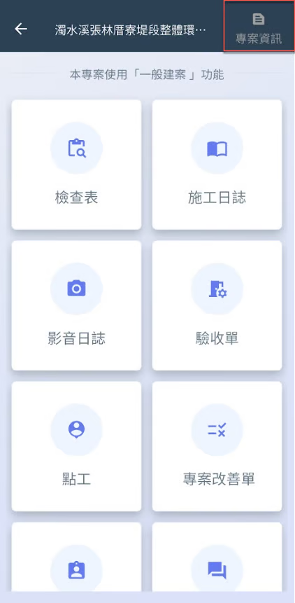
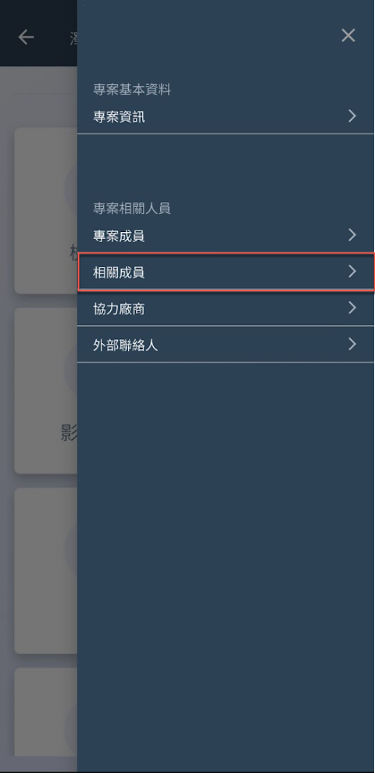
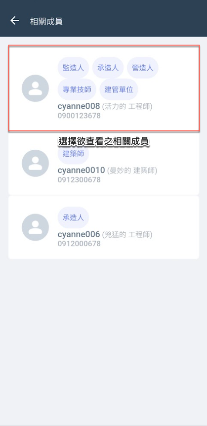
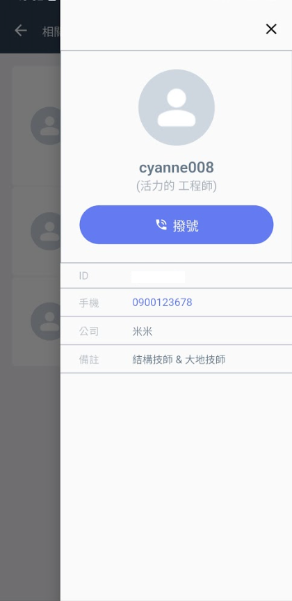

# APP 版

---
description: App Interface
---

# APP 版

進入專案後，點選「專案資訊」，再選擇<kbd>**相關成員**</kbd>，即可查看所有相關成員，並檢視其個別資料。

點選欲查看之成員，您可進一步透過<kbd><mark style="color:purple;">**撥號**<mark style="color:purple;"></kbd>功能，直接聯繫該成員。

!!! warning
    請注意，相關成員之角色性質與備註設定僅能透過網頁版進行操作。

   

