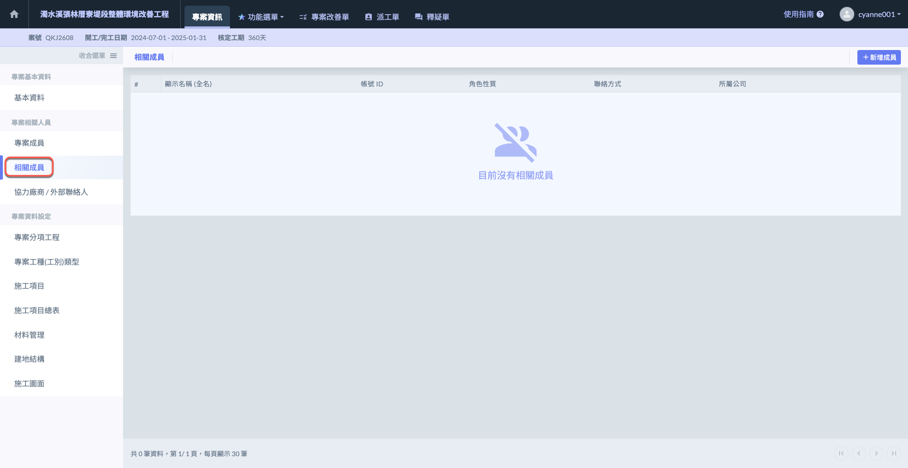

# 相關成員

相關成員是專案的外部人員，用來記錄與公司密切關聯的利害關係人，包括**業主**、**起造人**、**監造人**、**承造人**、**營造人**、**設計師**、**建築師**、**專業技師**、**建管單位**等。

將分&#x70BA;**「網頁版」**&#x8207;**「APP 版」**&#x5169;種說明，兩者功能略有不同。



可新增/編輯外部相關成員。



僅能查看成員資訊，可撥號給該成員。



