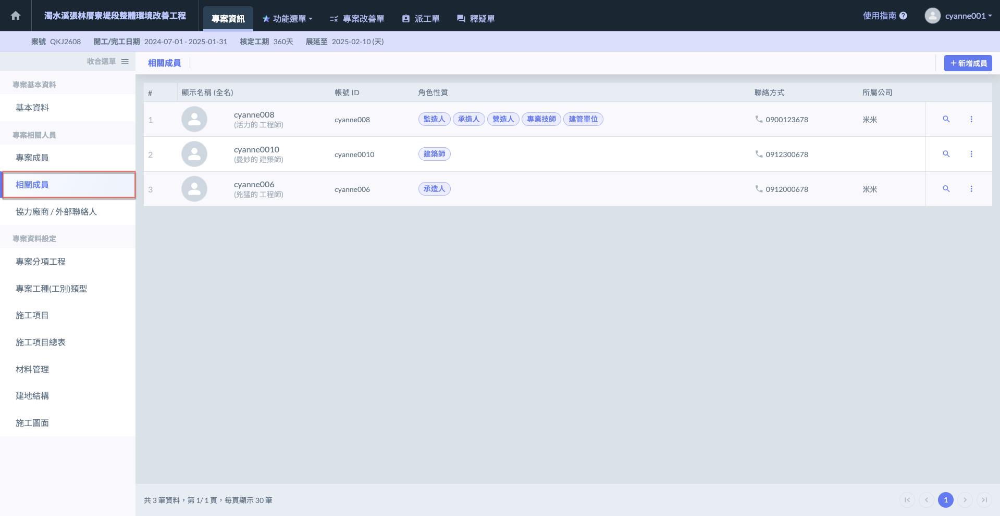
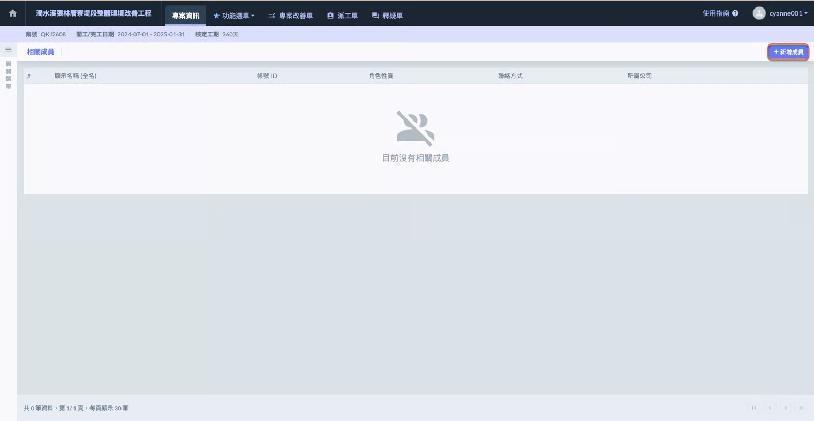
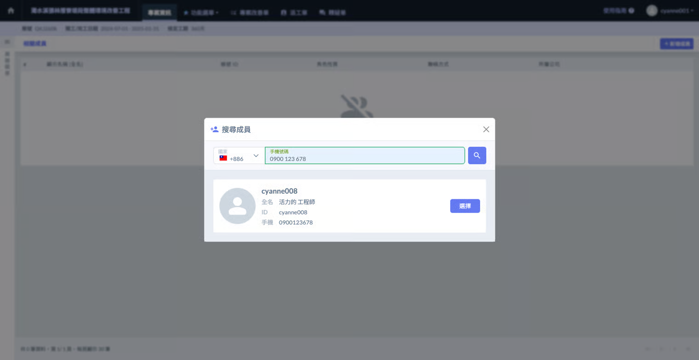
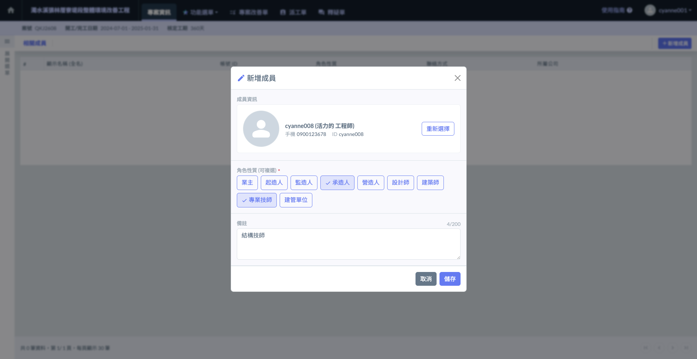
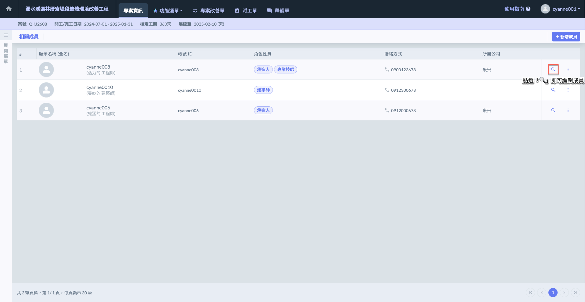
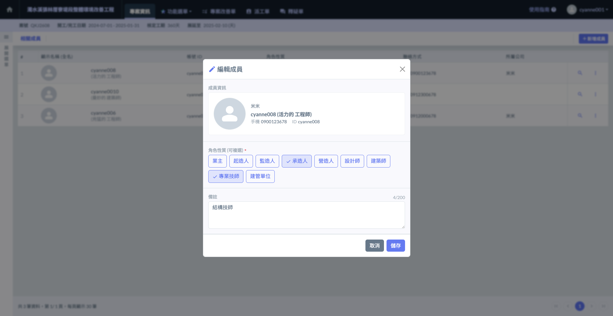
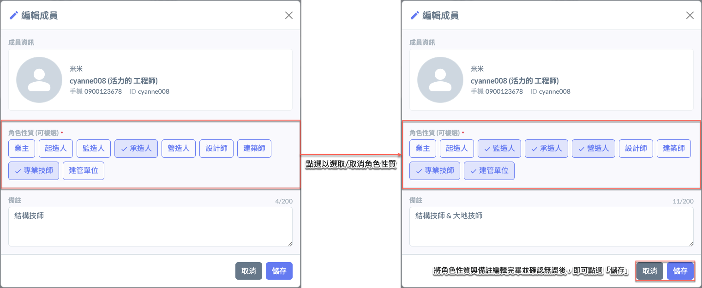
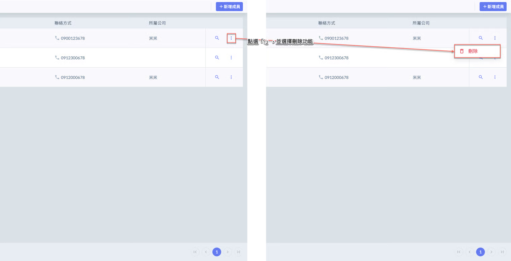
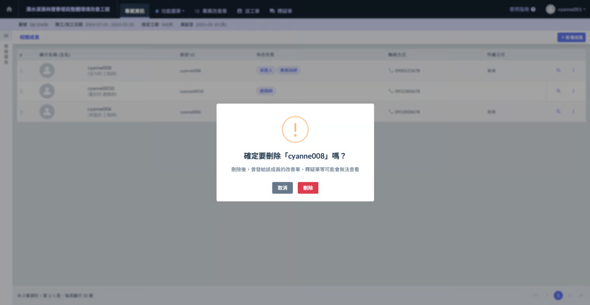

# 網頁版

## 01｜相關成員

所有專案成員皆可新增或編輯其他成員資料，方便團隊彈性調整人員配置與聯繫資訊。

***

### 01 - 1｜新增成員

點選<kbd><mark style="color:purple;">**+新增成員**<mark style="color:purple;"></kbd>後，請輸入欲加入成員之手機號碼。系統將自動查詢該帳號是否已註冊 Jobdone，若查詢成功，即可進行後續新增作業。

!!! warning
    請注意，新增相關成員前，該成員必須已註冊 Jobdone 帳號，否則將無法加入至專案中。

確認相關成員無誤後，即可點選<kbd><mark style="color:purple;">**選擇**<mark style="color:purple;"></kbd>，將該成員加入至專案相關成員名單中，並可進行角色性質與備註之設定。

點選<kbd><mark style="color:purple;">**選擇**<mark style="color:purple;"></kbd>後，即會進入新增視窗，您可於此選擇該相關成員之角色性質 (如業主、監造人、設計師等)，並可視需要填寫備註欄位，補充相關說明或聯繫資訊。完成後請點選「儲存」，即完成新增。

!!! tip
    統提供多種角色性質選項，包含：業主、起造人、監造人、承造人、營造人、設計師、建築師、專業技師、建管單位等，您可依據實際需求為相關成員指派適當角色，以利專案角色識別與後續管理作業。

***

### 01 - 2｜編輯成員

於欲編輯之相關成員右側，點選圖示，即可開啟編輯視窗，調整其角色性質、補充相關備註資訊。

!!! tip
    系統提供多種角色性質選項，包含：業主、起造人、監造人、承造人、營造人、設計師、建築師、專業技師、建管單位等，您可依據實際需求為相關成員指派適當角色，以利專案角色識別與後續管理作業。

 

如圖三所示，將角色性質與相關備註編輯完成並確認無誤後，請點&#x9078;**「儲存」**，系統即會套用更動，並於相關成員清單中更新顯示。

***

### 01 - 3｜刪除成員

如圖四 \~ 圖五所示，點&#x9078;**「⋮」**&#x4E26;選擇<kbd><mark style="color:red;">**刪除**<mark style="color:red;"></kbd>，系統將跳出確認視窗，請再次確認是否刪除該相關成員。

