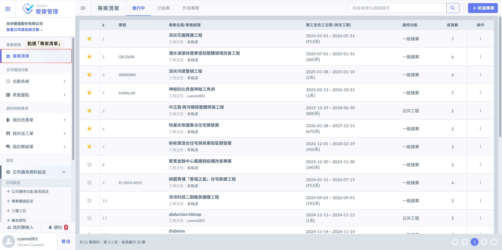
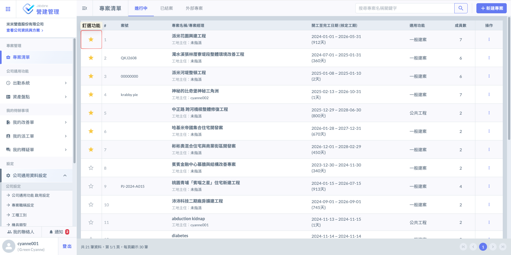
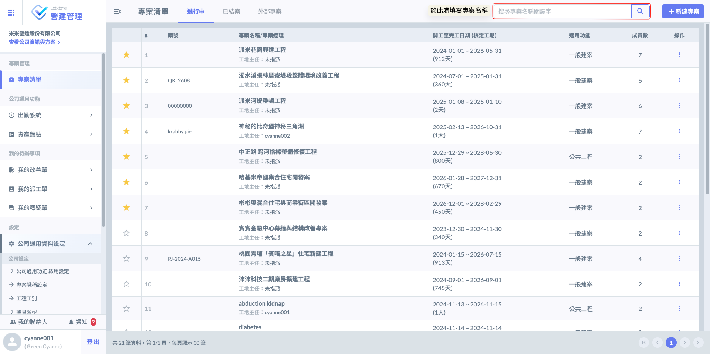
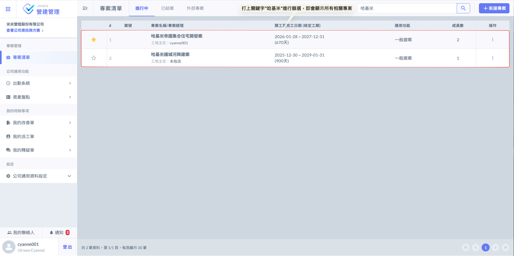
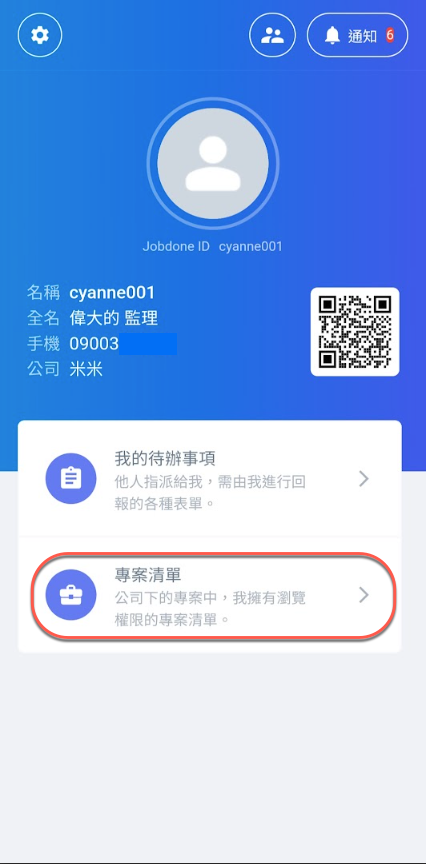
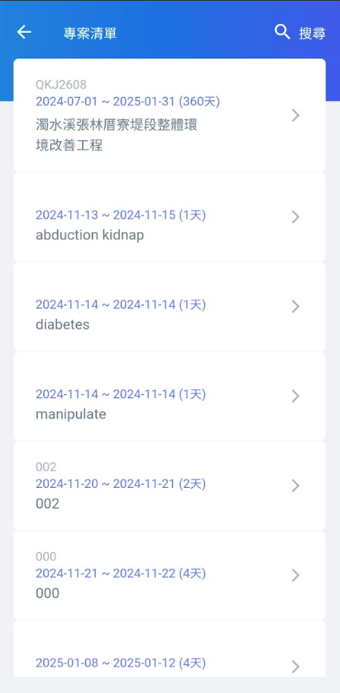

# 專案管理

---
description: Project Management
---

# 專案管理

「專案」功能為本系統的核心支柱，旨在建立數位化的管理框架，全方位提升工程執行的可控性、透明度與協作效率。

透過本系統，管理者能針對工程規劃、進度監控、資源配置及風險控管進行精準決策與動態優化。我們致力於為工程參與各方提供專業級的技術支援，打破資訊孤島，確保專案從開工到交付的每一階段皆能順利推進，達成卓越的營運績效。

!!! tip
    本功能支援使用者針對不同案場建立專案，並依據管理需求與施工階段進行精確的維度細分。每個專案皆可設定為獨立的運作單元，同時保有跨專案間的資訊關聯與資料整合能力。從精緻的小型建設案到複雜的大型基礎設施，皆能透過本系統實現高度靈活的數位化管理。

***

### 網頁版

系統將根據帳號是否具備『專案管理權限』，配置不同的作業範疇；具體差異如下表：

!!! warning
    基於資安與權責分立原則，若未被加入特定專案的成員清單中，即便具備『專案管理權限』亦無法進入該專案內部

<table><thead><tr><th width="152.150634765625">功能項目</th><th>具備管理權限 (PM)</th><th>一般成員</th></tr></thead><tbody><tr><td>專案基本資料</td><td>可新增、修改、刪除</td><td>僅供查看</td></tr><tr><td>成員管理</td><td>可管理專案成員、調整成員權限等</td><td>僅供查看名單</td></tr><tr><td>報表審核</td><td>具備最終核定與退回權限</td><td>僅供填寫與提交</td></tr><tr><td>專案狀態</td><td>可執行結案或刪除</td><td>無操作權限</td></tr></tbody></table>

#### 01 ｜專案清單

如圖一，登入系統後，首頁即為『專案清單』主儀表板。此處將彙整並分類顯示公司名下所有的專案紀錄，包含<kbd>**進行中**</kbd>、<kbd>**已結案**</kbd>及<kbd>**外部專案**</kbd>之分頁，方便您快速切換並掌握各案場狀態。

***

#### 01  - 1｜我的最愛

登入系統後，於專案清單中點選專案左側的『星號圖示』，即可將該專案釘選至列表頂端。

此功能如同『我的最愛』，能讓您將頻繁存取或需優先處理的重點案場固定於首位，省去搜尋時間，大幅提升日常作業的檢視效率。

：表示該專案已加入我的最愛，將優先顯示於清單頂部。

：表示該專案尚未釘選，再次點擊後即可快速釘選。

***

#### 01  - 2｜查詢專案

如圖三所示，當專案數量較多時，您可善用頁面右上方的『搜尋框』，直接輸入專案關鍵字或完整名稱後，請點選 圖示，系統將即時篩選並呈現符合條件的案場，助您快速查找目標。

完成畫面如下：

***

### APP 版

在APP畫面中，點&#x9078;**「專案清單」**，即可查看自己所加入的所有專案。

!!! info
    在APP內，使用者僅能看到自己所屬的專案。

 

