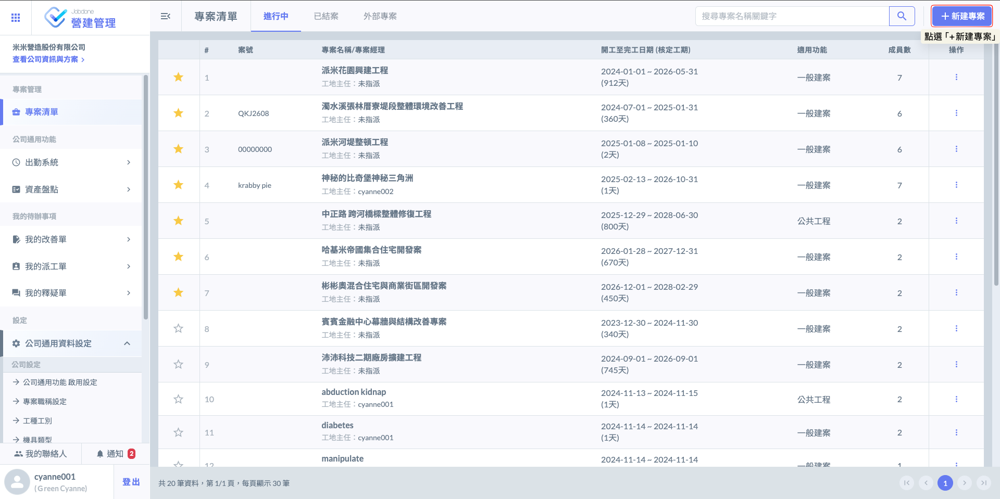
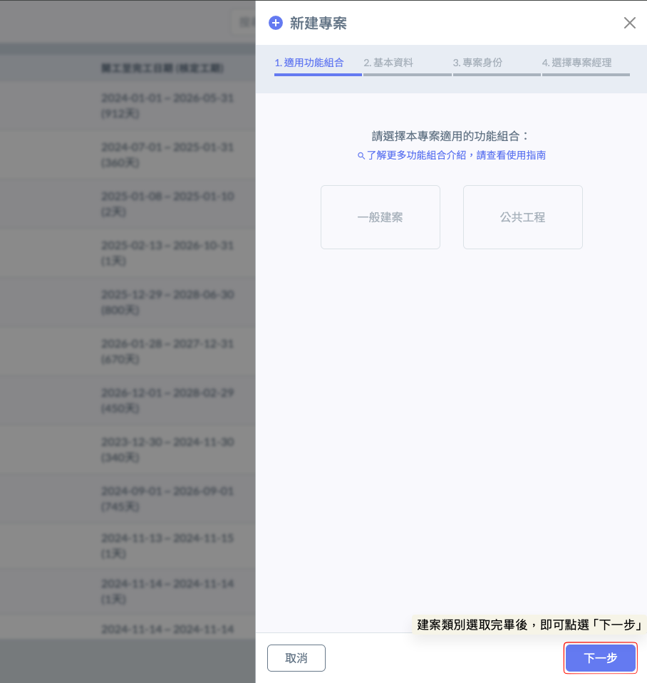
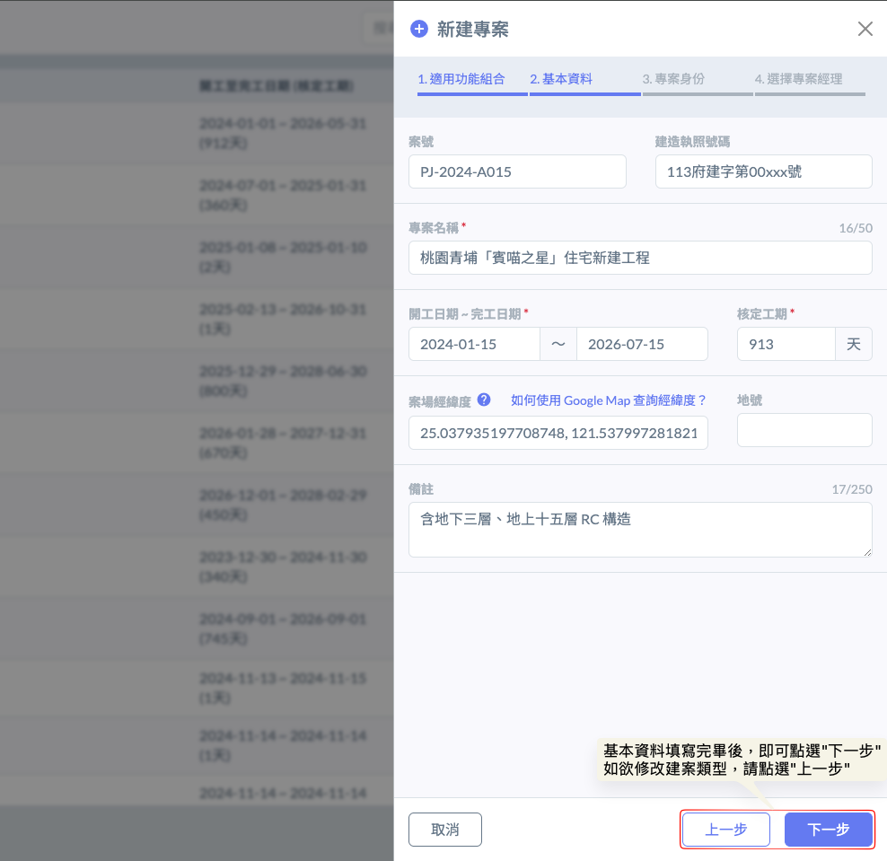
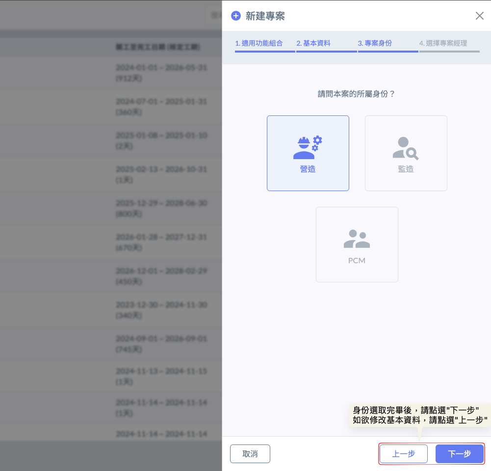
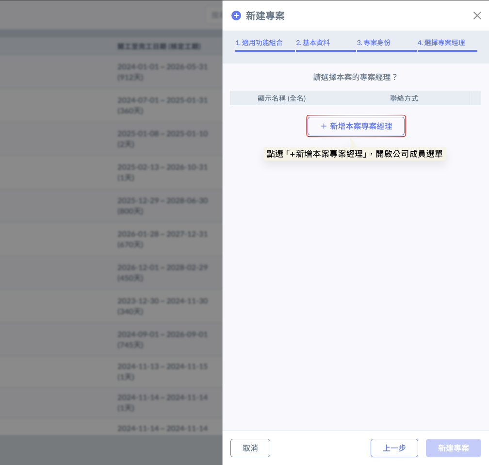
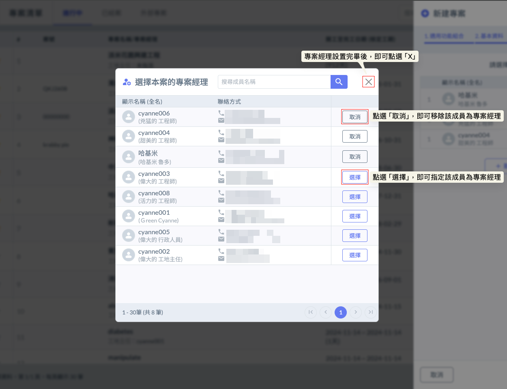
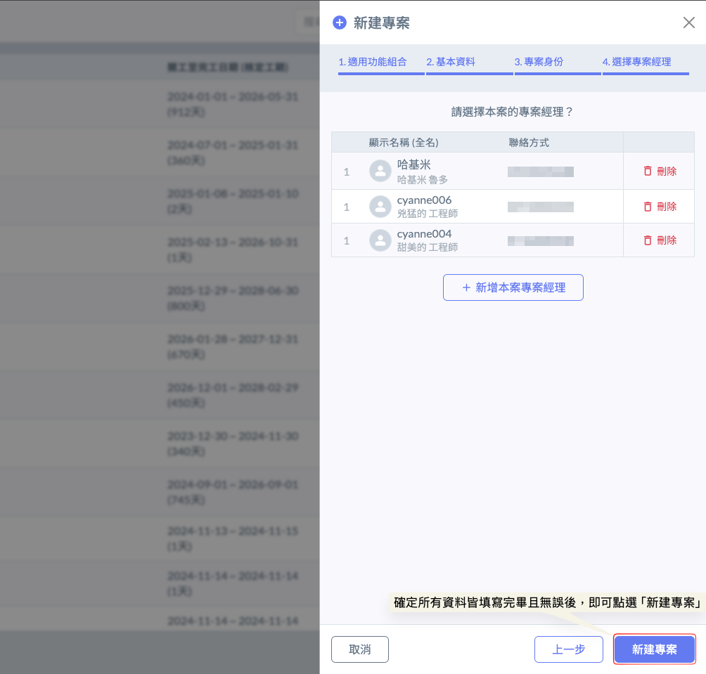
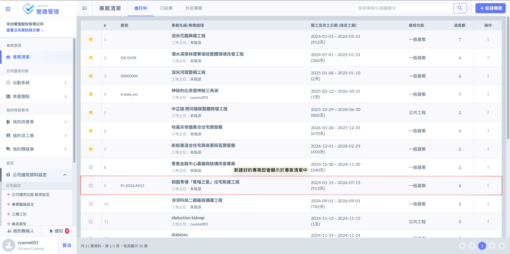

# 新建專案

---
description: Create a New Project
---

# 新建專案

### 01｜如何建立專案？

於網頁版『專案清單』頁面中，點選右上角的<kbd><mark style="color:purple;">**+新建專案**<mark style="color:purple;"></kbd>按鈕，並依照下列步驟完成設定，即可正式建立新專案：

!!! warning
    請注意，新建專案功能僅限具備**專案經理**權限之人員，且須登入**網頁版**方可進行操作；APP 版目前僅提供專案資訊之查閱功能，不支援新增專案。

完成以下步驟後，即可順利建立新專案。



#### 選擇建案類型 (適用功能組合)

系統目前提供<kbd>**一般建案**</kbd>與<kbd>**公共工程**</kbd>兩大類別；您可以根據實際專案屬性進行選擇，以利後續的分類管理與數據統計。



1. 適用對象： 民間住宅、商辦、工廠興建或其他私人工程。
2. 提供彈性較高的管理介面，各項報表與紀錄欄位以****實務通用、精簡高效****為原則，適合自定義管理流程的專案。



1. 適用對象：政府標案、基礎建設等須受公共工程規範監督之專案。
2. 規範標準化：系統內建之**施工日誌**、**監造日報**及各類**查驗報表**，均嚴格遵循**行政院公共工程委員會**所頒布之正式範本。
3. 系統將自動代入規範要求的必填欄位（如：氣候紀錄、出工統計、施工項目等），確保產出的 PDF 或紙本報表符合法規稽核需求。






#### 填寫基本資料

請詳實填寫專案的基本資料，包含：案號、建造執照號碼、專案名稱、施工地點及核定工期等。




#### 選擇專案身份

請依據實際合約身份選擇專案角色，目前系統支援<kbd>**營造**</kbd>、<kbd>**監造**</kbd>及<kbd>**PCM(專案管理)**</kbd>三種設定。

系統將根據所選角色，自動配置對應的功能權限與作業流程，藉此明確釐清各方權責，確保專案執行符合標準程序。



側重於施工日誌填報、自主檢查表執行與現場進度回報。



側重於監造日報撰寫、施工品質抽查審核與缺失追蹤改善。



具備跨單位協調權限，可查閱整體進度、管理各方報表及彙整專案績效。






#### 選擇專案經理

點選<kbd><mark style="color:purple;">**＋新增本案專案經理**<mark style="color:purple;"></kbd>，即可從公司成員清單中指派該專案的負責人；透過明確的經理指派，確保專案具備專責人員進行全方位的執行監控與行政管理。

!!! info
    此處之專案經理名單係連動自**公司成員**資料庫；您可以根據專案規模與管理需求，指派一位或多位專案經理共同作業。

如圖六所示，開啟公司成員清單後，即可勾選指派特定成員為專案經理。確認人員選取無誤後，直接點選視窗右上角的   圖示即可關閉並完成選擇。

如圖七所示，請對照確認所有資訊 (包含**專案類型**、**基本資料**、**角色身份**及**專案經理)** 皆填寫正確無誤；隨後點選右下角的<kbd><mark style="color:purple;">**新建專案**<mark style="color:purple;"></kbd>即可完成建立。

!!! tip
    即使專案已完成建置，後續仍可隨時針對各項資訊與權限進行編輯與調整。

完成畫面如下：



