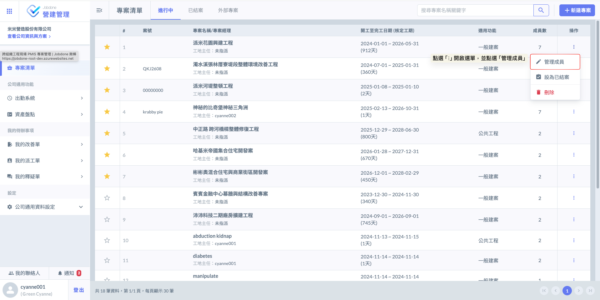
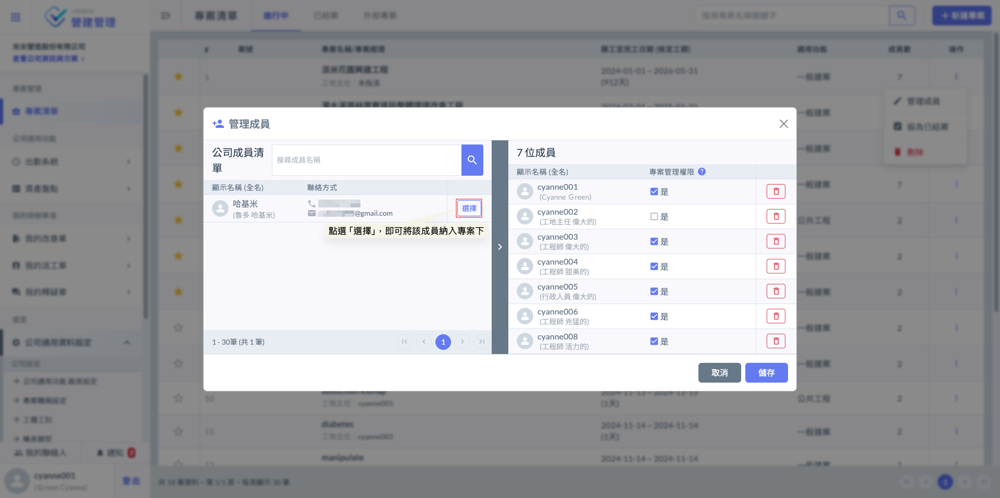
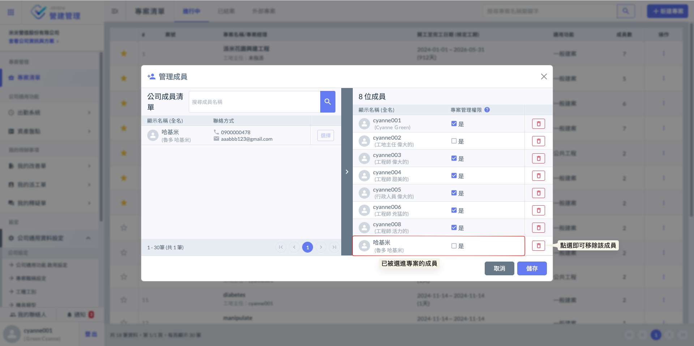

# 管理成員

---
description: Edit Team Members
---

# 管理成員

於「專案清單」中找到目標專案，點選右側操作欄位的『⋮』圖示，並從選單中選擇<kbd>**編輯成員**</kbd>。

在彈出的設定視窗中，您可以根據需求將公司成員加入專案團隊，並彈性設定**專案經理**權限；透過靈活的人員與權限控管，確保專案協作過程精確且順暢。

!!! info
    「專案職稱」與「工地主任」相關設定，請參閱 ➙ [專案成員](../../project_stakeholders/team-members)

如圖二，開啟<kbd>**管理成員**</kbd>視窗後，您可直接從公司成員清單中選取人員加入專案，並依據職責分工，彈性授予各成員**專案經理**權限。

!!! tip
    專案經理擁有該專案的最高管理權限，可完整執行專案的新增、刪除及結案操作。
    
    其職能範疇包含：編輯專案各項基本資訊、管理團隊成員與授予功能權限，以及統籌管理個資料文件等核心任務，確保專案全程受控並高效運行。

如圖三，被選取的成員將列入專案名單。您可於**專案管理權限**欄位中，決定是否勾選授予其專案經理權限；若需調整成員，點選該成員旁的  按鈕即可將其移出專案。

