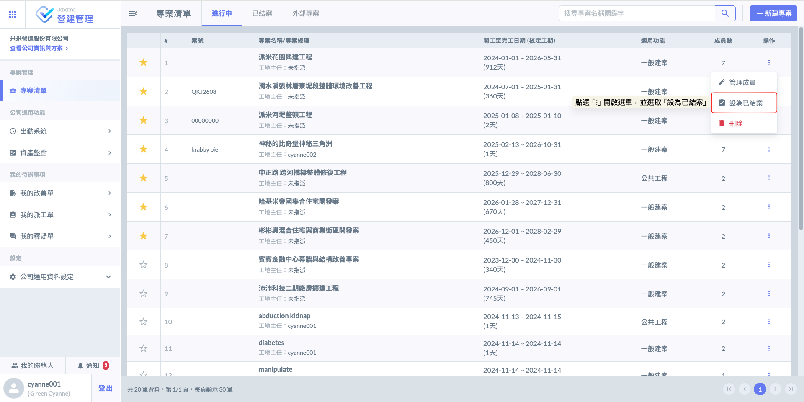
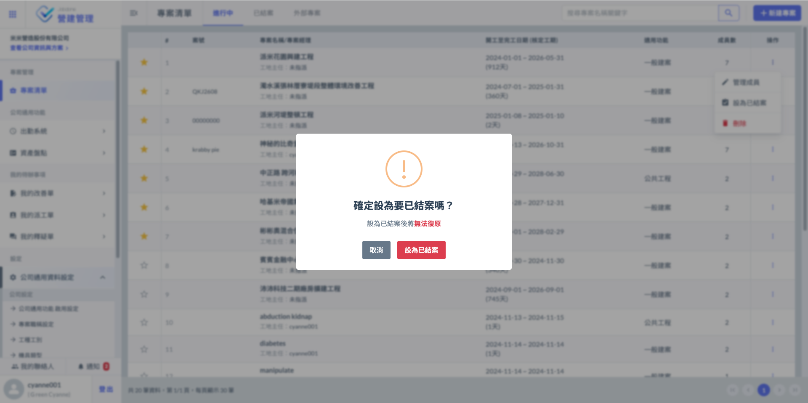
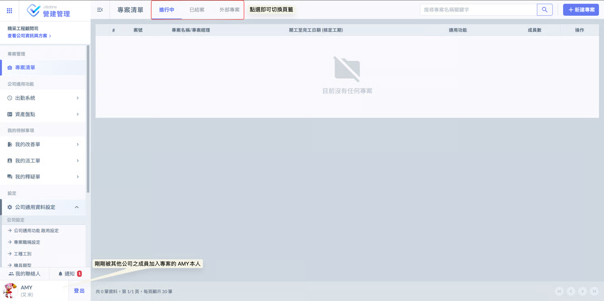
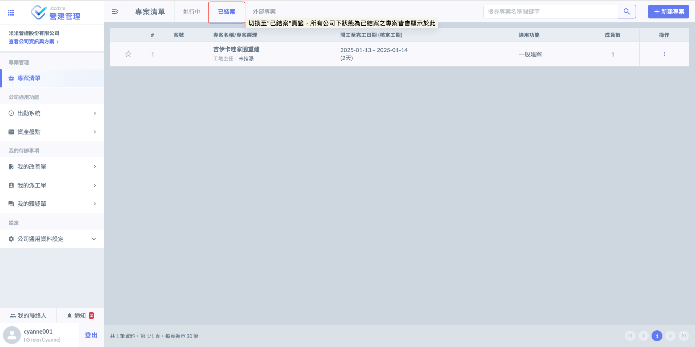
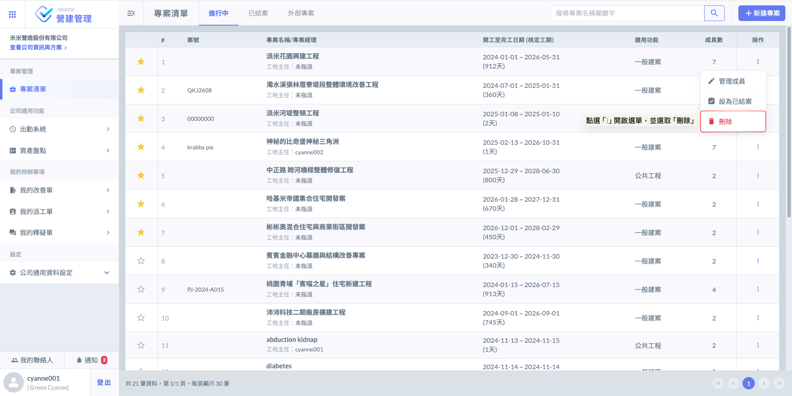
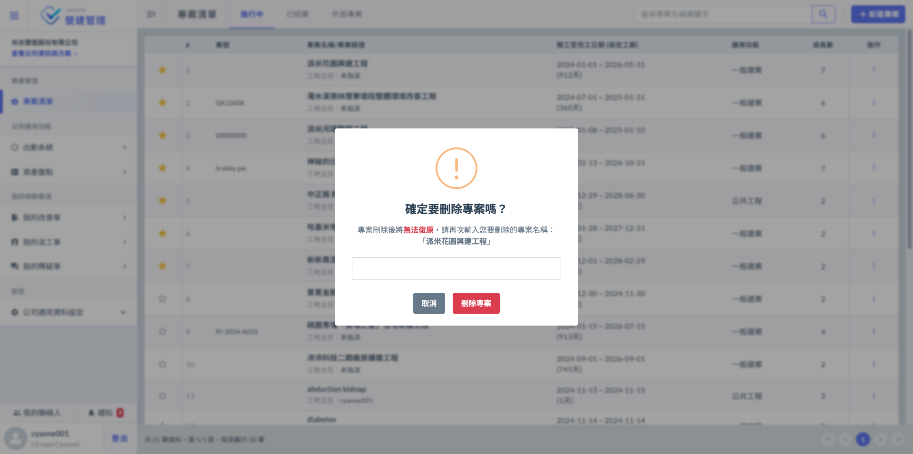

# 結案 / 刪除專案

!!! warning
    請注意，專案之結案與刪除功能僅限具備**專案經理**權限之人員，且須登入**網頁版**方可進行操作；APP 版目前僅提供專案資訊之查閱功能，不支援結案與刪除。

***

### 01｜結案

如圖一所示，於專案清單的<kbd>**進行中**</kbd>頁籤內，找到欲結案的專案，並點選操作欄位之「⋮」開啟功能選單，並選取 。

!!! danger
    #### 【⚠️ 重要提醒】
    
    專案一旦設為『已結案』，系統將轉為唯讀模式且無法再重新開啟編輯；雖然專案資料皆會完整留存，並支援隨時查閱、列印與下載，但將無法進行任何資料的新增或更動，請於操作前務必確認。

如圖二，系統將彈出二次確認視窗，請再次核對專案狀態，確認無誤後點選<kbd><mark style="color:red;">**設為已結案**<mark style="color:red;"></kbd>送出，即可正式完成結案程序。

***

#### 01 - 1｜查看已結案之專案

進入系統主頁後，預設將顯示<kbd><mark style="color:purple;">**進行中**<mark style="color:purple;"></kbd>之專案列表。您可以依據管理需求，點選上方標籤自由切換其他頁籤(<kbd>**進行中**</kbd>/<kbd>**已結案**</kbd>/<kbd>**外部專案**</kbd>)，以便查閱不同狀態下的專案紀錄。

如圖四，切換至<kbd><mark style="color:purple;">**已結案**<mark style="color:purple;"></kbd>頁籤後，系統將彙整並顯示公司名下所有已歸檔的結案專案，方便您隨時查閱過往的歷史紀錄與報表。

***

### 02｜刪除專案

如圖一所示，於專案清單的<kbd>**進行中**</kbd>頁籤內，找到欲刪除的專案，並點選操作欄位之「⋮」開啟功能選單，並選取 。

!!! danger
    #### 🛑 請注意
    
    專案一旦刪除，系統將永久移除所有相關紀錄且『完全無法復原』。執行刪除前，請務必再三確認是否有備份需求或操作之必要性。

如圖二，為確保資料安全並防止誤刪，執行刪除操作時，系統將彈出二次確認視窗，要求您手動輸入完整的專案名稱。唯有輸入資訊完全一致，系統方能啟動刪除程序，以確保此動作為您的深思熟慮後的決策。

