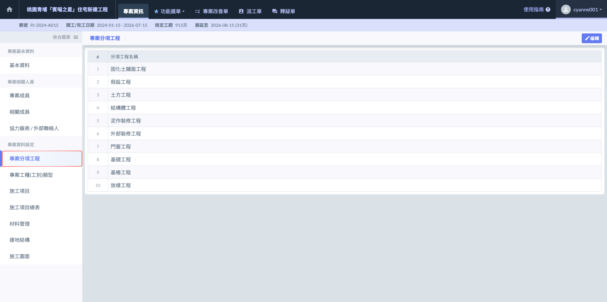
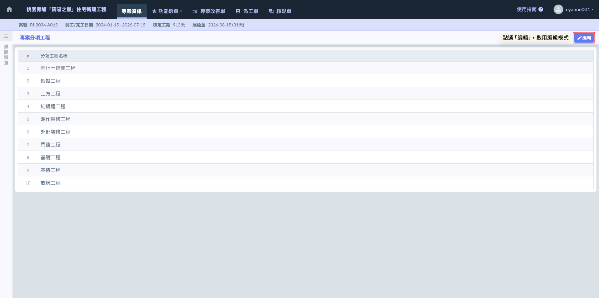
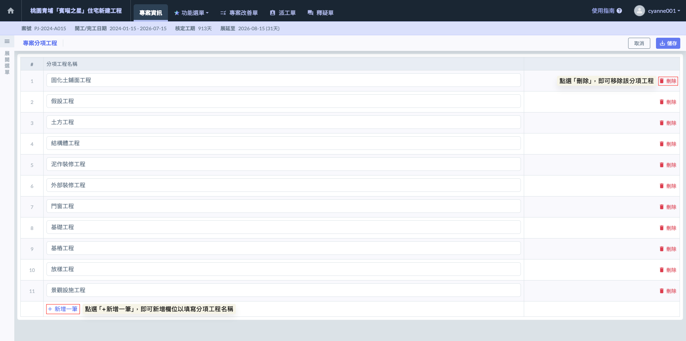
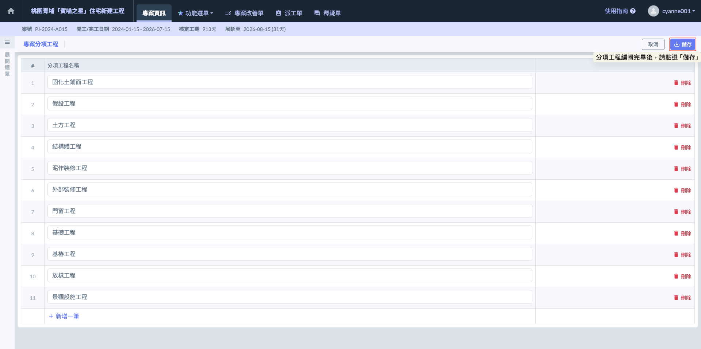

# 專案分項工程

---
description: Project Subdivisional Work
---

# 專案分項工程

**「專案分項工程」**&#x529F;能允許使用者填寫並編輯專案中的各項子工程，便於詳細規劃和管理專案的各個施工階段與任務。透過此功能，使用者可以根據專案需求添加、修改或刪除分項工程，確保每個階段的工作都能夠精確跟蹤與管理。

!!! info
    若在公司通用設定中已設定🔗[**分項工程**](../../../company_configuration/subdivision)，會自動帶入到專案分項工程中。

***

### 01｜編輯 

如圖一，進入**專案分項工程**頁面後，點選右上角的  按鈕，可根據各專案需求，新增/刪除專案中的分項工程。

如圖二，點選 ，即可增加新的分項工程；亦可於欲刪除的分項工程旁，點選  圖示以刪除分項工程。

!!! warning
    刪除分項工程時，與該分項工程相關的所有資料（如進度、資源分配、報告等）將一併被刪除。請特別留意，操作前務必確認該分項工程不再需要，以免造成無法復原的資料損失。

如圖三，完成修改後，按下  即可保存所做的變更並完成修改；若需放棄變更，按下  即可恢復原有資料，無需儲存任何更動。

