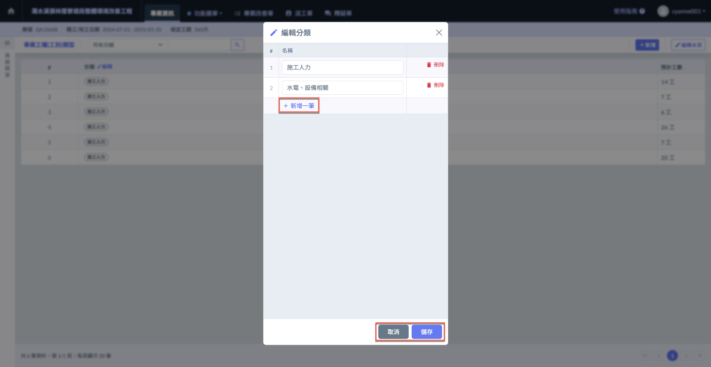
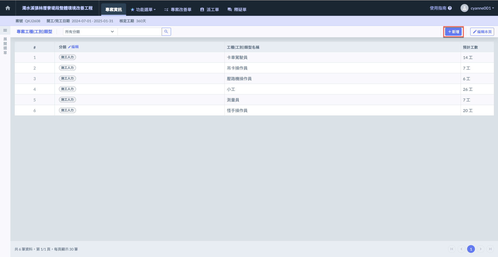
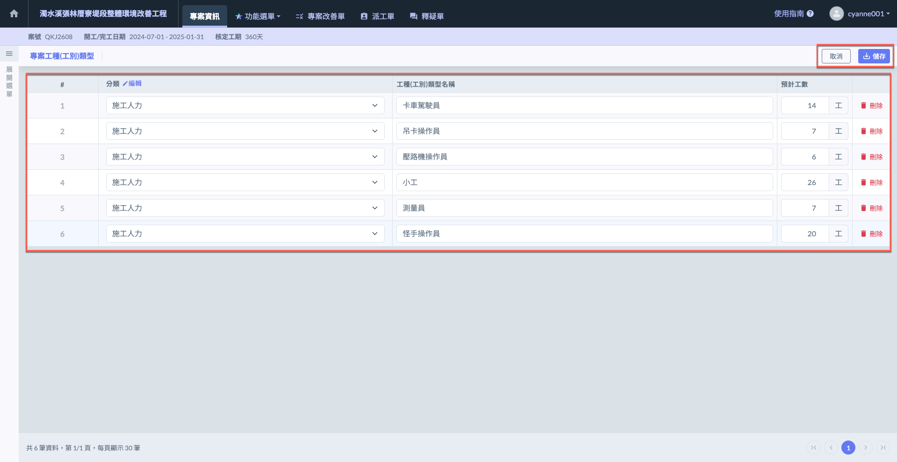

# 專案工種(工別)類型

---
description: Project Trade Category
---

# 專案工種(工別)類型

**「專案工種(工別)類型」**&#x529F;能可讓使用者為每個專案選擇並填寫該專案中所需的各項工別。這些工別包括但不限於土建工程、結構工程、機電工程、管線安裝等，系統可根據專案需求，讓使用者進一步定義或選擇具體的工種分類，為專案的各個施工階段提供清晰的框架。

!!! info
    公司通用設定中已設定🔗[**工種(工別)類型**](../../../company_configuration/worktype)，會自動帶入到專案分項工程中。

!!! warning
    關於工種，還有另一種使用方式，你可以將下包的協力廠商建立為你的工種，這樣在施工日誌的填寫時，可以直接以廠商的出工數作為您的工種統計。這也是部份營造廠常見的用法。

!!! tip
    此處編列之資料會於其他功能中使用，&#x5982;**「施工日誌」**。

***

系統提&#x4F9B;**「手動新增」**&#x53CA;**「Excel 匯入」**&#x5169;種方式，讓您增列專案工種(工別)類型資料。

## 01｜手動新增

請根據以下流程操作：



### 編輯分類

進入專案工種類型頁面後，點選分類旁的  按鈕，即可進行工種分類的新增或刪除操作。

點&#x9078;**「新增一筆」**&#x586B;寫分類名稱，確認完畢點&#x9078;**「儲存」**&#x5373;可保存所做的變更；若需放棄變更，按&#x4E0B;**「取消」**&#x5247;可恢復原有資料，無需儲存任何更動。




### 新增工種

進入專案工種類型頁面後，點選右上角的 ，即可開啟工種新增視窗。

點選 ，即可新增空白欄位以填寫工種名稱。

選用已設定好之工&#x7A2E;**「分類」**，並詳細填&#x5BEB;**「工種名稱」**&#x8207;**「預計工數」**。

確認完畢點&#x9078;**「新增」**&#x5373;可保存資料；若需放棄新增，按&#x4E0B;**「取消」**&#x5247;可恢復原有資料，無需儲存任何更動。




### 編輯工種

如圖六，於欲編輯的頁面，點選右上角的 ，即可進入編輯模式。

您可修改**工種類型**、**工種名稱**、**預計工數**及**刪除工種**。

確認完畢點&#x9078;**「儲存」**&#x5373;可保存所做的變更；若需放棄變更，按&#x4E0B;**「取消」**&#x5247;可恢復原有資料，無需儲存任何更動。




***

## 02｜Excel 匯入

!!! warning
    Excel 匯入功能僅能在尚未新增任何工種（工別）資料時使用，匯入後則無法再匯入。
    
    因此，透過Excel匯入後，若您需要更動/增加工種資料，則需透過手動編輯。
    
    由於檔案僅能上傳一次，若您需要重新匯入Excel資料，則需先將原有資料全部刪除。



### 下載 Excel 模板

進入專案工種類型頁面後，點選右上角之「Excel 匯入」(圖一)。

進入(圖二)頁面後，開始下載Excel工種類型模板。

開啟 Excel 工種模板 視窗後，於畫面中的『Excel 模板下載』欄位，點選  圖示，即可將標準範本儲存至您的電腦。

填寫資料：開啟下載的 Excel 檔案，依據格式填入案場預計派出的工種列表。

檔案畫面如下所示，依據模板表格填&#x5BEB;**「工種分類」、「工種類型名稱」**&#x8207;**「預計工數」**。




### 填寫 Excel 模板

!!! warning
    由於系統判讀資料之因素，**「務必使用」**&#x4E0A;述提供的模板填寫，並依照格式妥善填寫。
    
    填寫預計工數時，務必以阿拉伯數字填寫。




### 上傳 Excel 檔案

系統將在送出時給予提醒(圖二)，上傳成功後，系統匯入&#x65BC;**「步驟二」**&#x6240;填寫之資料(見圖三)。



