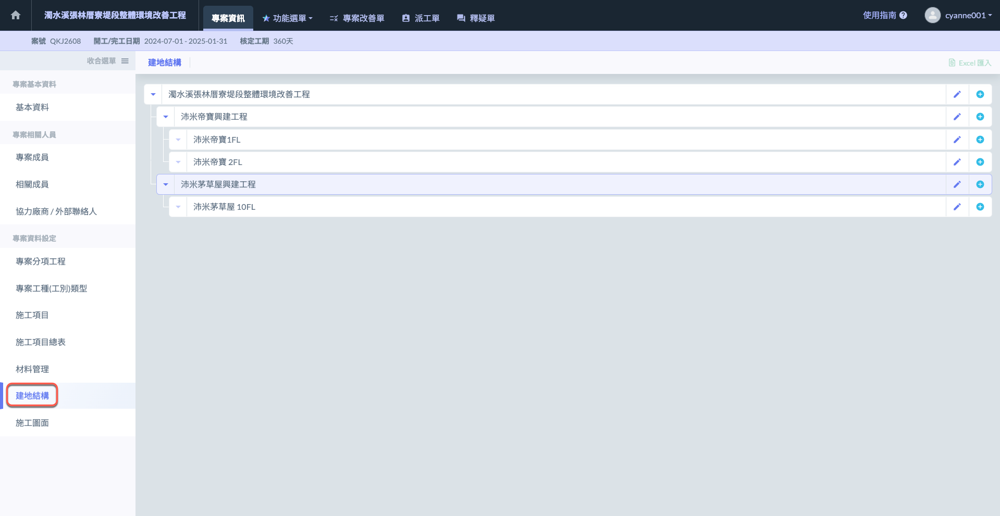
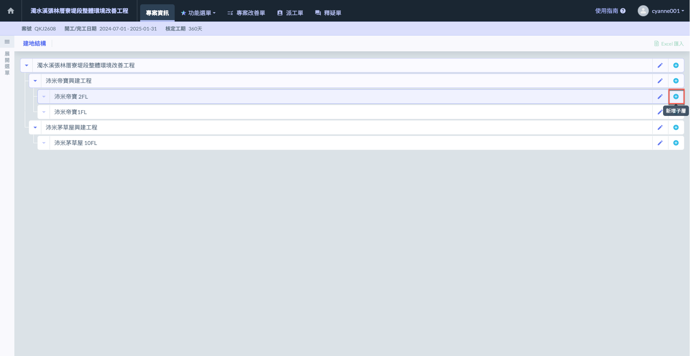
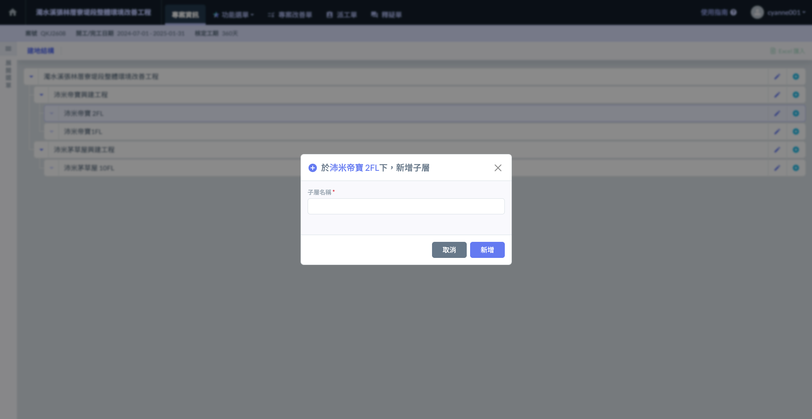
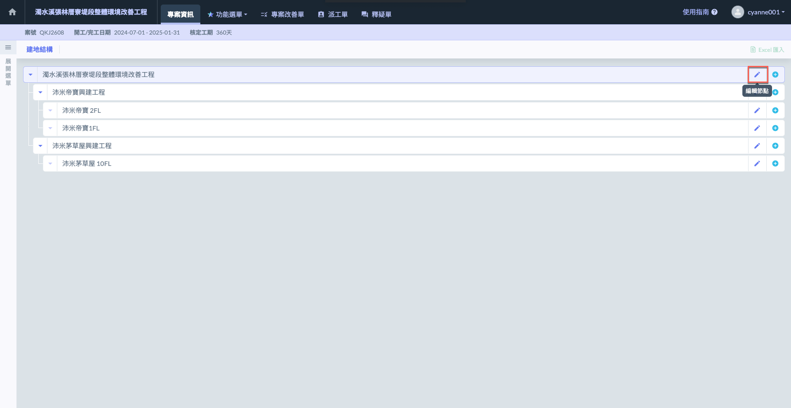
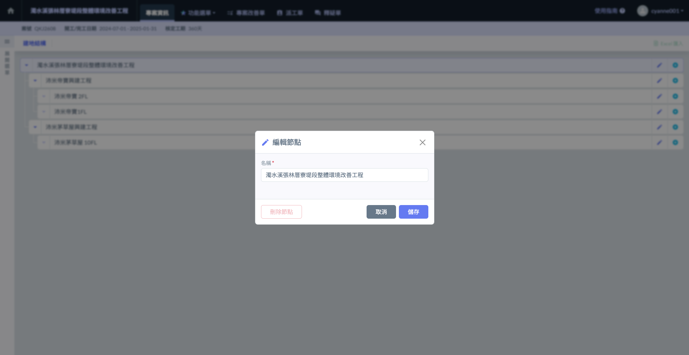

# 建地結構

**「建地結構」**&#x529F;能旨在幫助使用者精確描述及劃分建物的組成結構，並依據專案需求建立符合實際情況的建地結構架構。透過此功能，工程人員可以清楚規劃與管理各種結構層級，包括基礎結構、主體結構、樓層結構及附屬設施等，確保各項工程施工按照設計圖及施工計畫進行。

!!! tip
    此處編列之結構會於其他功能中使用，&#x5982;**「檢查表」**、**「影音日誌」**&#x7B49;等。

***

## 01｜新增子層

第一層級不可刪除，您可於其下增列多個子層，並且支持多層次結構的設置。

如下圖紅框圈選處，點&#x9078;**「＋」**&#x6309;鈕，即可於特定的層級建立節點。

填寫子層名稱，確認無誤後點&#x9078;**「新增」**&#x5373;會保留此筆資料。

***

## 02｜編輯節點

第一層級不可刪除。

如下圖紅框圈選處，點&#x9078;**「🖊️」**&#x6309;鈕，即可進行節點名稱編輯與刪除。

!!! warning
    其下有子層之層級亦不可刪除。如需刪除，請先刪除其下所有子層。

完成修改後，按&#x4E0B;**「儲存」**&#x5373;可保存所做的變更並完成修改；若需放棄變更，按&#x4E0B;**「取消」**&#x5247;可恢復原有資料，無需儲存任何更動。

