# 施工圖面

---
description: Construction Drawings
---

# 施工圖面

**「施工圖面」**&#x529F;能是為了幫助使用者高效、精確地管理施工圖檔（如建築平面圖、電氣圖、結構圖等等），並確保圖面與專案的其他資訊（如分項工程、建地結構等）無縫對接。透過此功能，使用者可以輕鬆上傳、更新及管理各類施工圖面，並可將每張圖面與相應的分項工程及建地結構關聯，從而實現精確的施工管理與追蹤。

***

## 功能優勢

✔ **精確對接項目需求**：每張施工圖面都可以與具體的分項工程及建地結構關聯，確保施工過程中每個細節都能得到正確執行與監控。

✔ **版本管理**：提供施工圖面版本管理功能，避免版本混亂，確保每次改版都能在原始紀錄上進行更新，保留完整的修改歷程。

✔ **高效管理**：簡單直觀的操作流程，讓工程管理人員能快速上傳、更新、刪除圖面，並方便地查詢相關資料，提升工作效率。

!!! tip
    此處編列之圖面會於其他功能中使用，&#x5982;**「檢查表」**、**「影音日誌」**&#x7B49;等。

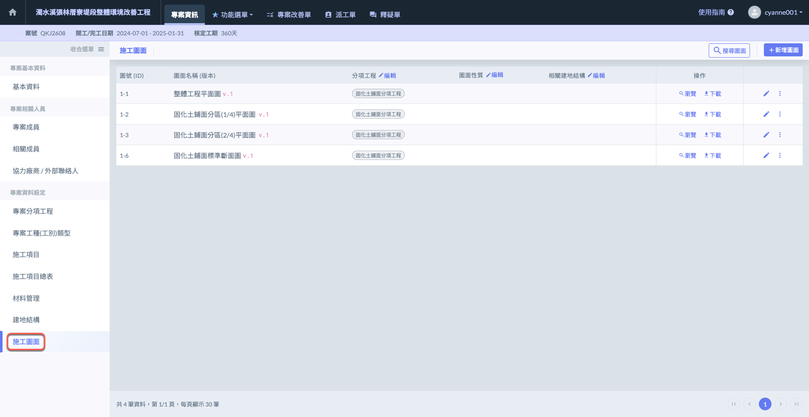

***

## 01｜前置作業流程

由於使&#x7528;**「施工圖面」**&#x6642;，會需要使用到下列資料，包括：**「分項工程」**、**「圖面性質」**、**「建地結構」**。因此務必確認下列資料已妥善填寫完畢。

!!! info
    若尚未設定分項工程及建地結構，請參考 **➙** 🔗[**專案分項工程**](zhuan-an-fen-xiang-gong-cheng) **＆** 🔗[**建地結構**](construction_structure)



### 確保分項工程資料已填寫完畢

進入施工圖面頁面後，可直接點選分項工程旁&#x4E4B;**「編輯」**，進&#x5165;**「專案分項工程」**&#x9801;面開始編輯。

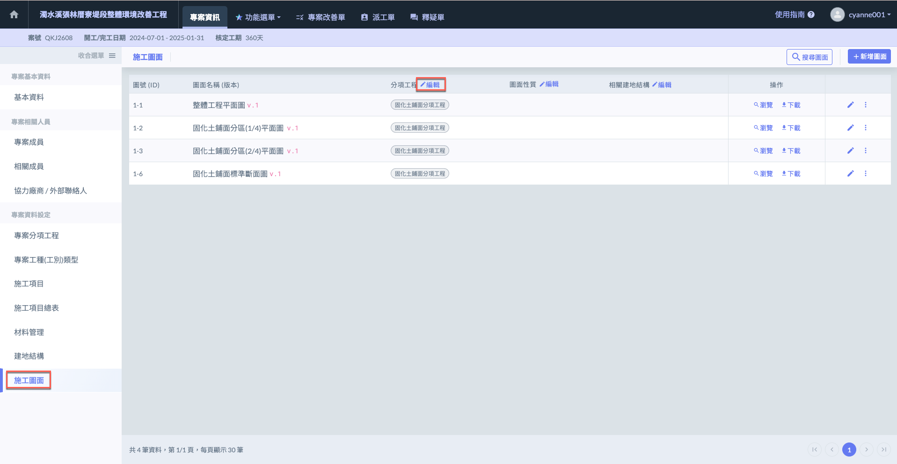

點選後，將直接進入專案分項工程頁面，如下圖。

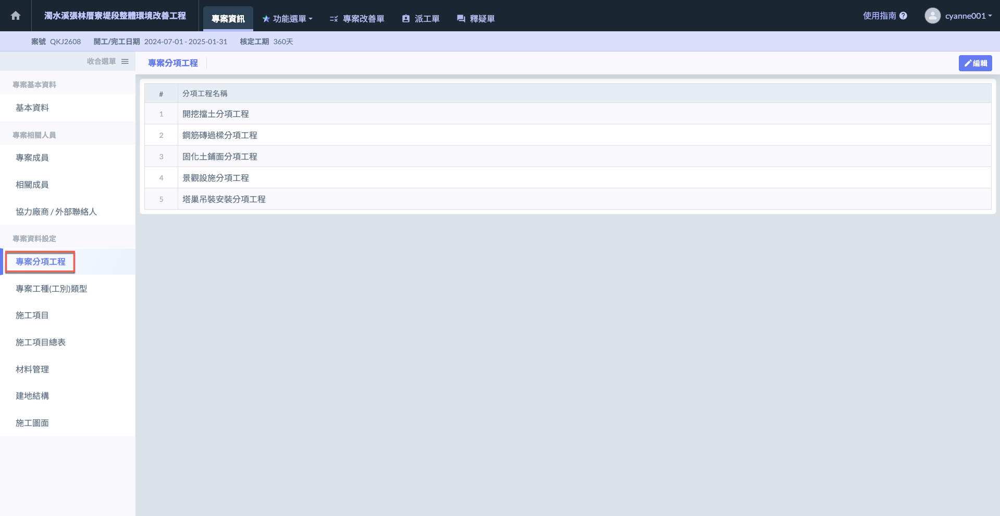



### 確保建地結構資料已填寫完畢

進入施工圖面頁面後，可直接點選相關建地結構旁&#x4E4B;**「編輯」**，進&#x5165;**「建地結構」**&#x9801;面開始編輯。

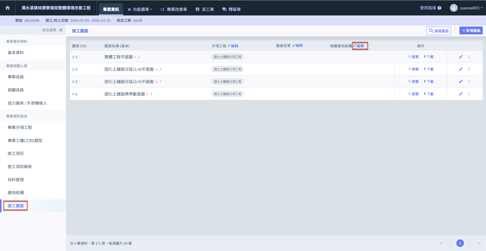

點選後，將直接進入建地結構頁面，如下圖。

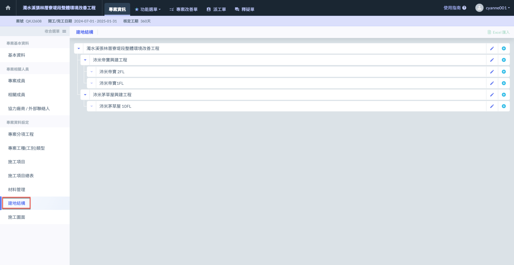



### 編輯圖面性質

進入施工圖面頁面後，點選圖面性質旁&#x7684;**「編輯」**&#x6309;鈕，即可進行圖面性質的新增或刪除操作。

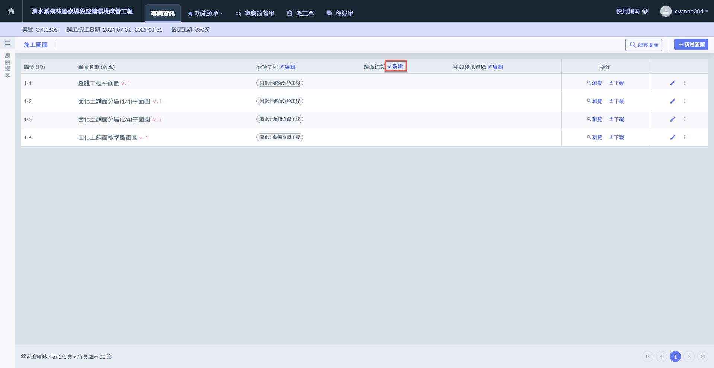

點&#x9078;**「新增一筆」**&#x586B;寫圖面名稱，確認完畢點&#x9078;**「儲存」**&#x5373;可保存所做的變更；若需放棄新增，按&#x4E0B;**「取消」**&#x5247;可恢復原有資料，無需儲存任何更動。

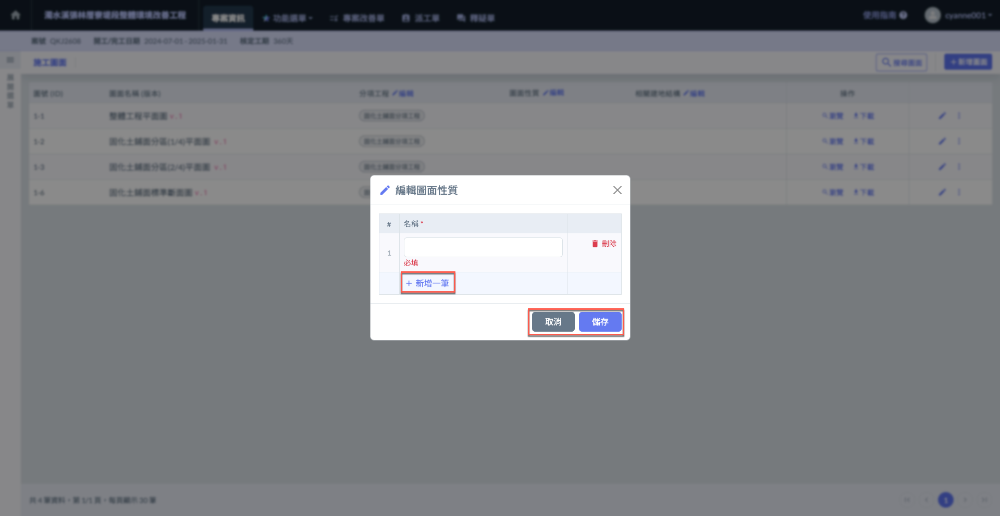



***

## 02｜新增圖面

點選右上角&#x7684;**「新增圖面」**，輸入圖號、圖面名稱等相關資訊後，點&#x9078;**「選擇圖檔」**&#x9032;行施工圖面的上傳。

同時，您可以選擇對應的分項工程、圖面性質及建地結構，進行相關設定。

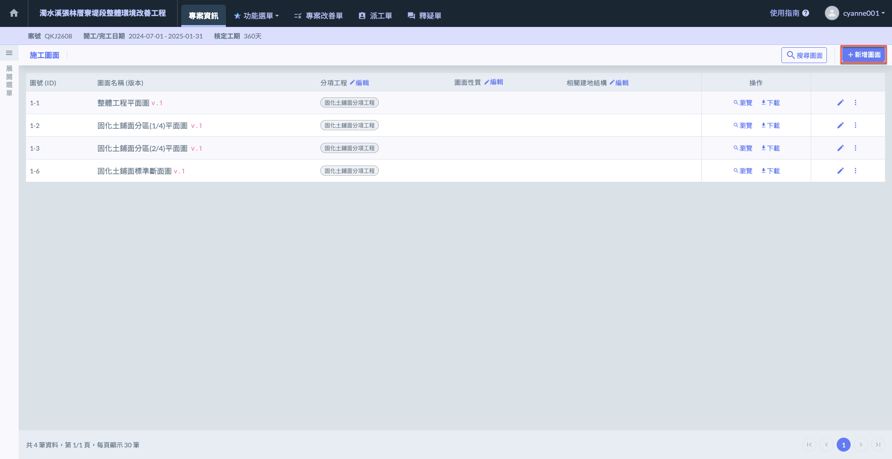

填寫**圖號**、**圖面名稱**並**選擇圖檔**，並選擇該施工圖面對應之**分項工程**、**圖面性質**、**建地結構**。

確認資料無誤，即可點&#x9078;**「新增圖面」**&#x4FDD;存該筆資料。

!!! tip
    系統提供 PDF 及 JPG 兩種檔案類型，供您上傳圖檔。

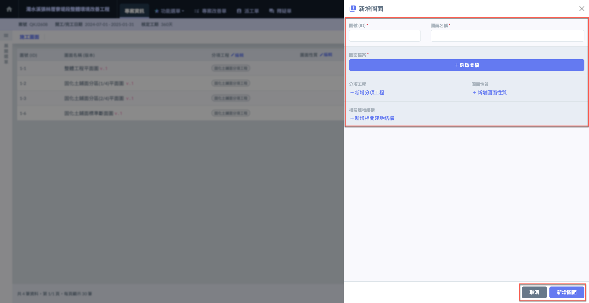

***

## 03｜更新施工圖面與資料

若施工圖面需要改版，您可以直接在既有紀錄上更新施工圖面。

如下圖紅框圈選處，點選欲更新圖面右方&#x4E4B;**「🖊️」**&#x5716;示，進入詳細資訊頁面。

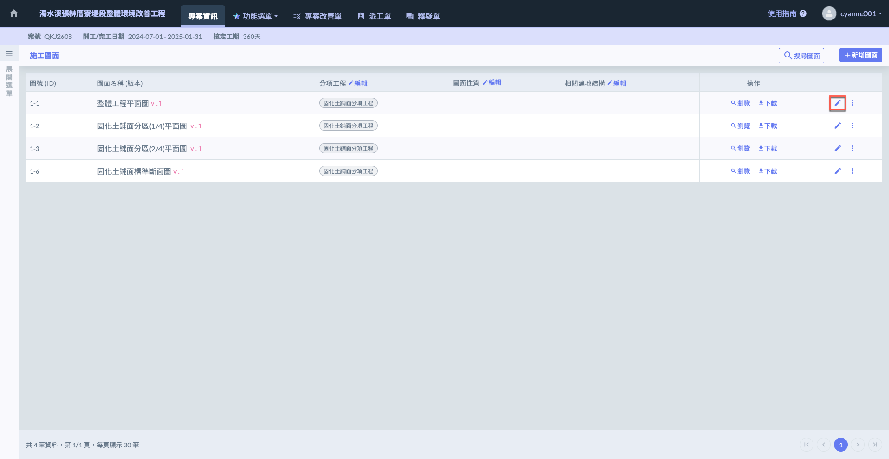

然後點&#x9078;**「＋加入新版本，選擇檔案」**&#x5373;可上傳新的圖面並更新相關資訊。

您亦可於此處更新其他圖面資料，如：**圖號**、**圖面名稱**、**分項工程**、**圖面性質**與**相關建地結構**。

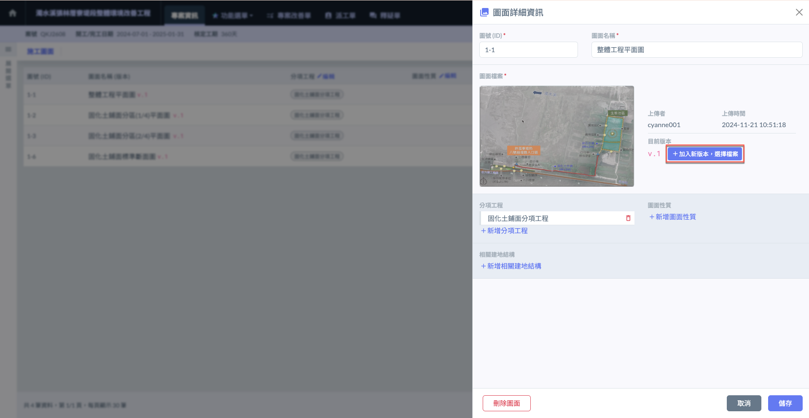

***

## 03 - 1｜刪除施工圖面

如下圖紅框圈選處，點選施工圖面紀錄右方&#x4E4B;**「⋮」**&#x5716;示，選&#x64C7;**「刪除」**，即可移除該施工圖面紀錄。

!!! warning
    請注意，圖面刪除即無法復原，且相關資料亦一併消失，務必謹慎操作。

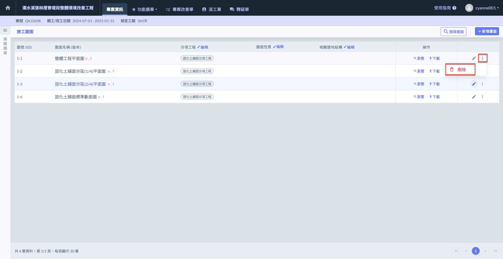

***

## 03 - 2｜圖面瀏覽 / 下載

進入施工圖面頁面後，於各項圖面&#x4E4B;**「操作」**&#x6B04;位即可選擇瀏覽與下載。

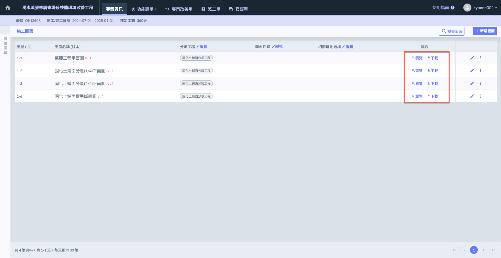
