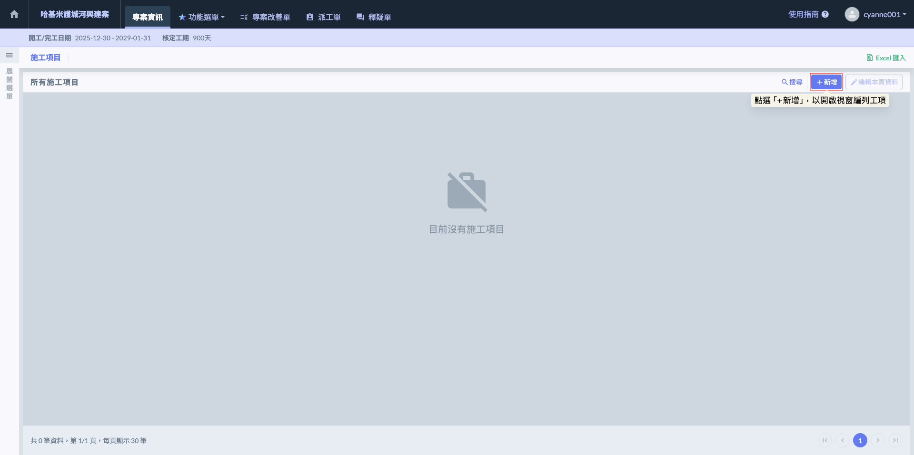
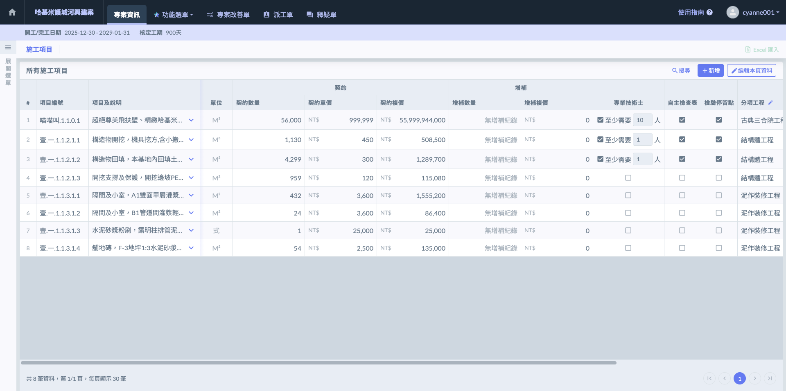
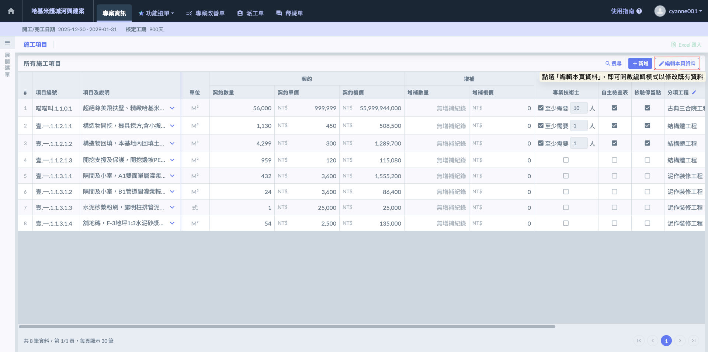
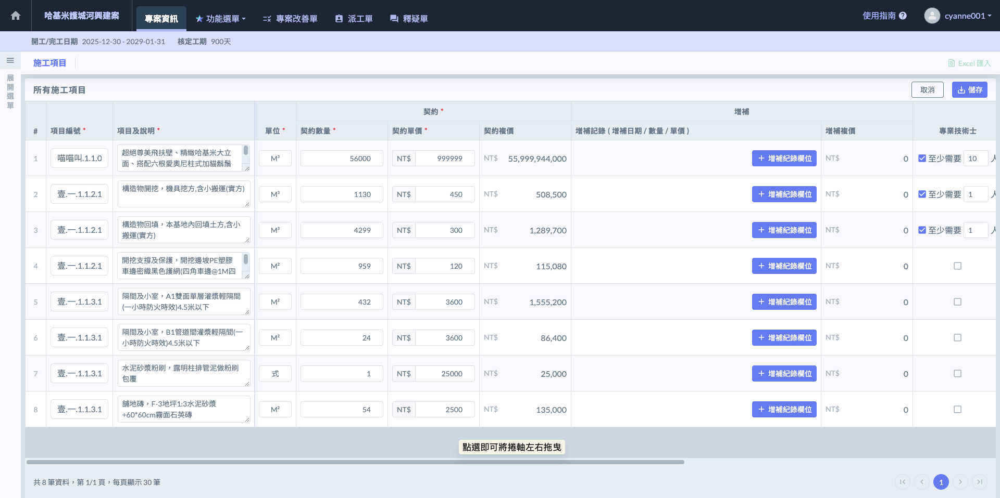
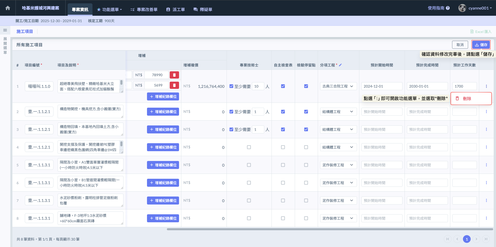
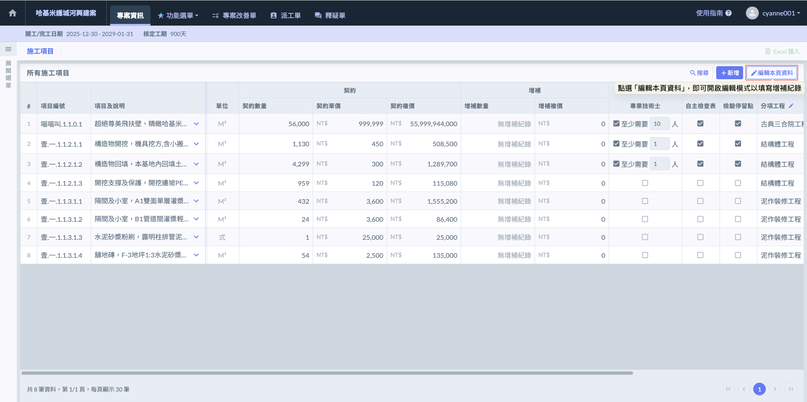
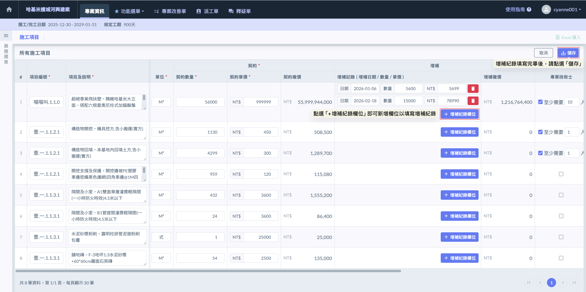
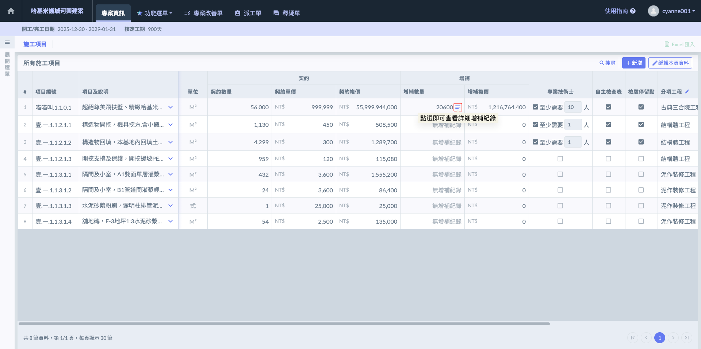
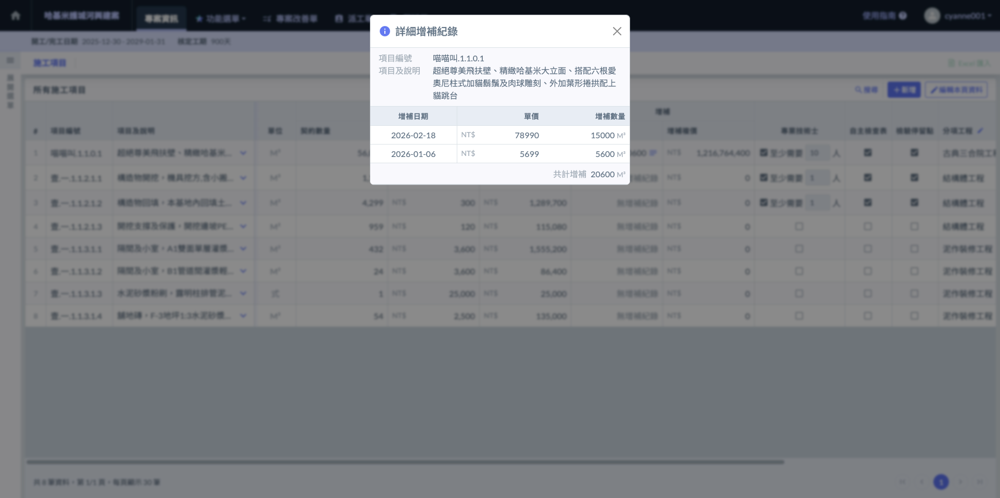

# 單純工項格式

---
description: 無廠商/合約的分類
---

# 單純工項格式

### 01｜新增施工項目 

在一般格式下，由於系統不具備『協力廠商』與『合約』的層級架構，所有的施工項目將會統一在同一個清單介面中呈現。

進入施工項目頁面後，請點選畫面右上方的  按鈕即可開啟編輯視窗。

新增工項時，請依序填寫以下欄位：

<table><thead><tr><th width="126.1630859375">欄位</th><th>說明</th></tr></thead><tbody><tr><td>編號</td><td>此欄位用於識別工項順序，亦或可以填寫<mark style="color:red;"><strong>工項編碼</strong></mark>。</td></tr><tr><td>項目及說明</td><td>請填寫具體的施作內容（如：B1F 柱鋼筋綁紮、3000psi 混凝土澆置）。此名稱會直接顯示在『標準版』施工日誌中，供現場人員選取。</td></tr><tr><td>選擇分項工程</td><td>將工項歸類至所屬的大項目（如：結構工程、裝修工程）。</td></tr><tr><td>單位</td><td>系統已內建多組營建業常用單位（如：m^2、m^3、T、式、才、口、樘等，多達56種），您可直接從下拉選單中選取，亦可手動輸入所需的單位。</td></tr><tr><td>契約數量與單價</td><td>

<ul><li>契約數量： 填入該工項在原始合約中的總量。</li><li>契約單價： 填入該工項的單價。</li></ul><blockquote>
系統會根據『數量 × 單價』自動算出契約複價。這些數值是系統後續計算「價金權重」的基礎，關係到施工日誌回報進度時的百分比換算。
</blockquote></td></tr><tr><td>專業技術士</td><td>若該工項依法需具備特定證照人員（如：吊車、焊接、高壓電作業）方可施作，請勾選此項。</td></tr><tr><td>自主檢查表</td><td>標記該工項於施作過程中必須執行自主檢查。</td></tr><tr><td>檢驗停留點</td><td>針對必須經監造或業主查驗合格後，方可進行下一步的關鍵節點（如：隱蔽工程灌漿前）。勾選此項可強化查驗程序的強制性，確保品質不漏失。</td></tr><tr><td>預計施工時間</td><td>

<ul><li>預計開始時間 / 預計完成時間： 由管理員根據施工計畫先行標註。</li><li>預計工作天數： 填入該工項預計施作的日曆天數或工作天。</li></ul><blockquote>
這些時間欄位主要是給工務人員「對時間」參考使用，方便比對合約預定進度與現場實際進度的落差。系統真正的實作數據與完成日期，仍以施工日誌的真實回報為準。
</blockquote></td></tr></tbody></table>

完成畫面如下：

***

### 02｜編輯施工項目 

如需修改現有的施工項目內容，請依循以下步驟執行：

1. **開啟編輯模式：**&#x65BC;施工項目頁面右上方點選  圖示，系統即會切換至編輯狀態。

2. **修改資料：**&#x5728;此模式下，您可以直接針對各工項的「編號」、「項目及說明」、「單位」、「數量與單價」以及「管理標籤」進行即時修正。

3. **刪除工項：**&#x82E5;該工項已不需施作且尚未有施工日誌回報紀錄，可點選該列最右側的  圖示進行移除。
4. **儲存變更：**&#x4FEE;改完畢後，請務必點選右上方的  按鈕，系統將自動依照修正後的數值重新跑算全案的進度權重。

***

### 03｜增補紀錄 

工項建置完畢後，若後續因變更設計、追加項或其他合約變更事宜，您可針對該工項持續回報『增補紀錄』。系統支援單一工項建立多筆增補，每筆紀錄皆須詳實附上三個關鍵數據：增補日期、增補數量、增補單價。



系統對於施工進度(%)的計算並非採取全案齊頭式修正，而是具備『時間軸』的動態計算：

1. 分段計算邏輯：系統會以『增補日期』作為切割點。在該日期之前的施工日誌進度，仍維持原契約的權重計算；自增補日期當日（含）以後，該工項的進度分母與權重才會根據新的總量（原契約 + 增補量）進行即時變動。
2. 價金權重校正：由於增補的單價可能與原契約不一致，系統會自動將『原契約複價』與『所有增補複價』進行加權計算。這能精確反映該工項在合約總價值中的真實佔比，確保產出的數據具備法律與財務上的嚴謹度。



當您填寫增補紀錄後，整體的預定與實際進度曲線將會產生動態位移：

1. **曲線下降趨勢：**&#x7531;於該次增補之數量追加，導致分母（總價）變大，在已施作量不變的情況下，累計進度百分比（%）會出現****合理下降****。
2. **權重重新分配：**&#x589E;補後的 S-Curve 將自動依據新的價金權重重新分布。免除了人工手動修正進度表與權重分配的繁瑣與誤差。

!!! danger
    關於施工項目中設定的契約量、單價以及後續的「增補紀錄」，其對累積進度與 S-Curve 的動態影響，僅會在 『標準版施工日誌』 中呈現（因精簡版日誌無進度計算）。




當專案發生變更或追加項時，請依據以下步驟在系統中反映數據異動：

1. 開啟編輯模式(圖七)：於施工項目頁面右上方點選  圖示，進入編輯狀態。

2. 新增紀錄(圖八)：找到欲填寫增補的工項，在其『增補』欄位內點選 。
3. 填寫數據：在彈出的視窗中，填寫增補日期、增補數量、單價等資訊。若該工項涉及多階段變更，可持續點選  以新增多筆紀錄。
4. 確認與儲存：確認所有增補資訊填寫無誤後，務必點選畫面右上方的  按鈕。

!!! info
    #### 重要規範與實務提醒
    
    * **施工日誌即時連動：**&#x8ACB;務必注意，增補紀錄一旦儲存，系統將立即重新計算進度分母。這會直接影響到施工日誌端呈現的『累計完成量』與『進度百分比（%）』，建議在取得核定公文或正式變更單後再行登錄。
    * **資料的可修正性：**&#x70BA;因應營建實務中可能發生的單價調整或核定數量差異，日後若有異動，一樣可以回來修正已儲存的增補紀錄。系統會根據修正後的數值，自動校正該工項在 S-Curve 中的價金權重。
    * **增補日期生效規則：**&#x518D;次提醒，增補對進度的影響是從『增補日期』當天（含）開始生效。若您需要追溯先前的進度權重，請確認日期填寫的準確性，以確保專案歷史進度軌跡的真實性。

如圖九，完成增補紀錄的填寫並儲存後，在施工項目列表的『增補數量』欄位中，會出現  圖示。您只需點選該圖示，即可隨時開啟詳細視窗，查看該工項歷次變更的完整數據。

如圖十，開啟該工項的『詳細增補紀錄』視窗後，系統會完整呈現該項目自開工以來的所有變更軌跡。這是一個動態的履歷表，詳細記錄了每一筆因變更設計或追加項所產生的數據異動。

