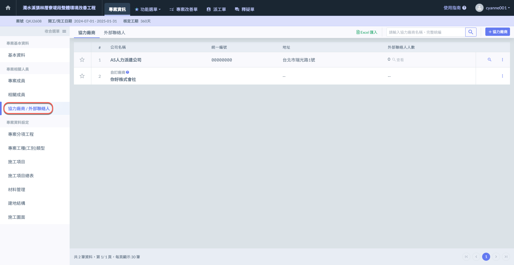
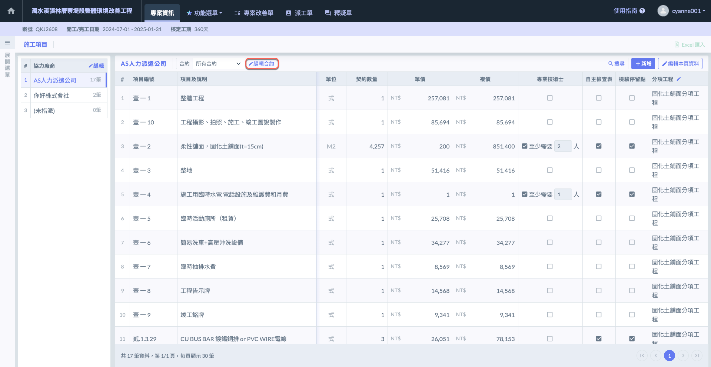
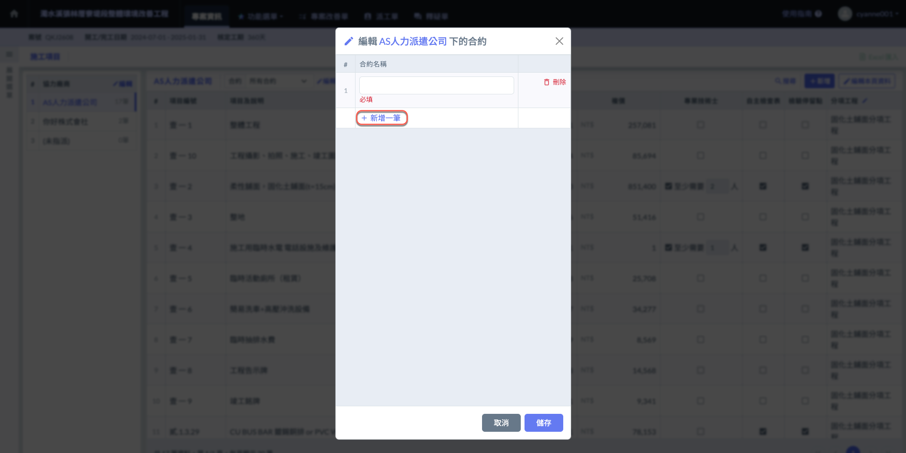

# 廠商 > 合約格式

填寫材料資&#x6599;**「廠商 > 合約格式」**&#x9700;要設定您&#x7684;**「協力廠商」**，若材料尚未選定協力廠商則會處&#x65BC;**「未指派」**。

系統提&#x4F9B;**「手動新增」**&#x53CA;**「Excel匯入」**&#x5169;種方式編列您的施工材料資料。

以下操作流程&#x4EE5;**「手動新增」**&#x8AAA;明。

## 操作流程



### 確保協力廠商資料已填寫完畢




### 確認專案分項工程資料已填寫完畢




### 選取協力廠商

若工項尚未發包，可不選擇協力廠商，先行&#x65BC;**「未指派」**&#x586B;寫施工項目。

!!! tip
    您可於確認承包商後，&#x5C07;**「未指派」**&#x4E4B;工項各自設定其廠商。請參&#x8003;**「工項發包」**。




### 編輯廠商合約




