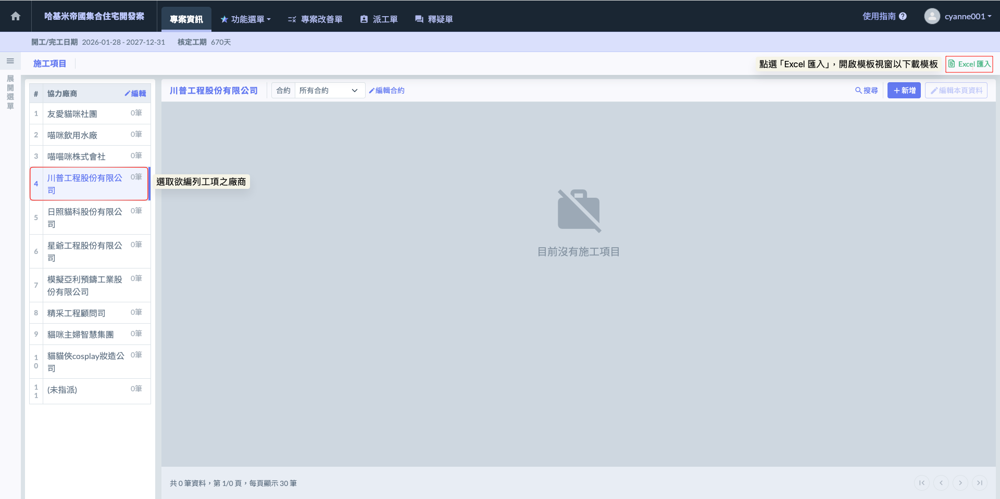
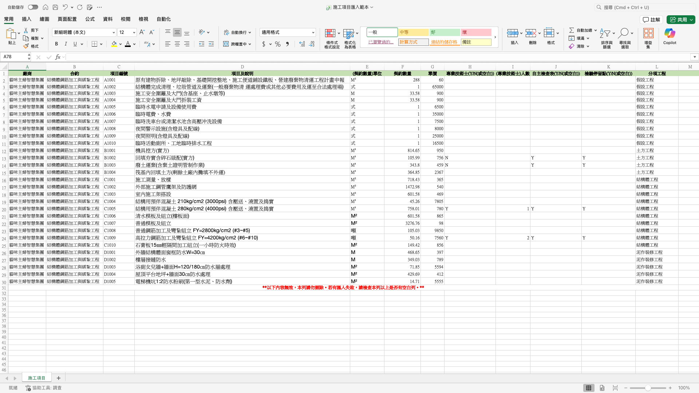
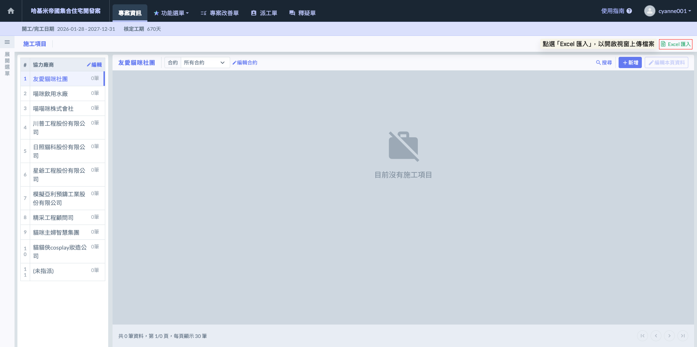
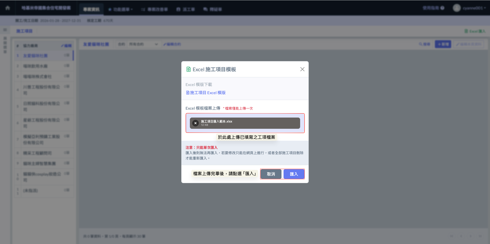
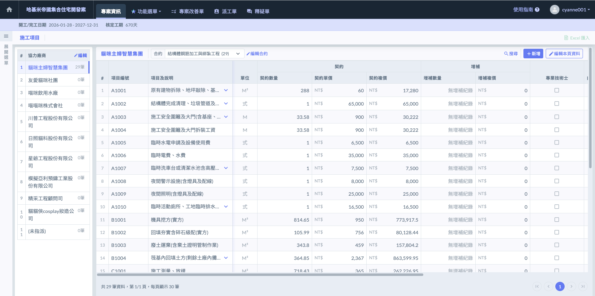

# Excel匯入



### 下載 Excel 模板

進入施工項目頁面後，請遵循以下步驟執行匯入作業：

1. 開啟下載視窗：點選畫面右上方的  圖示。

!!! danger
    #### 【重要限制】檔案匯入功能使用規範
    
    檔案匯入功能僅限於該專案『沒有任何合約』及『沒有任何施工項目』的狀態下使用。

2. 下載標準模板：在開啟的視窗中，點擊 。請****務必使用****系統提供的原始模板進行資料填寫，以確保資料格式能精確對應。

**【Excel 模板填寫規範與補充】**

<table data-header-hidden><thead><tr><th width="145.950439453125">欄位名稱</th><th>說明</th></tr></thead><tbody><tr><td>廠商 (選填)</td><td>
此欄位為「選填」，系統會根據填寫內容執行不同的自動歸類動作：
<ul><li><strong>若欄位留白（未填寫）：</strong> 系統將自動將該筆工項歸類於『未指派』分類。這適合用於專案初期 WBS 規畫，或是尚未確定分包對象的工項建置。</li><li>
<strong>若有填寫廠商名稱：</strong> 系統將啟動自動偵測機制，並產生以下兩種結果：
<ol start="1"><li>廠商已存在： 若填寫的名稱與專案內已建置的廠商名稱<mark style="color:red;"><strong>完全一致</strong></mark>，系統會自動將工項新增至該廠商名下。</li><li>廠商不存在： 若系統偵測不到相同名稱，將會直接以您填寫的名稱「自動建立一筆新協力廠商資料」，並將工項掛載其下。</li></ol></li></ul></td></tr><tr><td>合約 (選填)</td><td>填寫該工項所屬的合約名稱。 若未填寫： 系統將自動歸類於該廠商下的「沒有合約」分類，方便後續再行手動調整歸屬。</td></tr><tr><td>項目編號 <mark style="color:red;"><strong>(必填)</strong></mark></td><td>填入工項識別碼（如：01, 02...）。 唯一性限制： 同個廠商下，編號絕對不可重複，否則將導致匯入失敗或數據勾稽異常。</td></tr><tr><td>項目及說明 <mark style="color:red;"><strong>(必填)</strong></mark></td><td>填入具體施作內容。 名稱應具辨識度（如：B1F 柱筋綁紮），此欄位將直接顯示於『標準版』施工日誌供現場人員勾選。</td></tr><tr><td>單位 <mark style="color:red;"><strong>(必填)</strong></mark></td><td>填入營建常用單位（依標案需求填寫，沒有限制）。</td></tr><tr><td>契約數量 <mark style="color:red;"><strong>(必填)</strong></mark></td><td>填入合約原始總量。 僅限填寫數字，不可包含任何文字或逗號。</td></tr><tr><td>單價 <mark style="color:red;"><strong>(必填)</strong></mark></td><td>填入合約原始單價。 系統匯入後會自動計算複價，作為後續價金權重計算的原始基準值。</td></tr><tr><td>專業技術士 (選填)</td><td>填寫「Y」或「N」（或空白）。 標記該工項是否需具證照人員施作，以利職安人員在日誌端進行核對。</td></tr><tr><td>自主檢查表 (選填)</td><td>填寫「Y」或「N」（或空白）。 標記該項目在施工過程中必須執行自主檢查。</td></tr><tr><td>檢驗停留點 (選填)</td><td>填寫「Y」或「N」（或空白）。 標記該項目為關鍵節點，強化現場「查驗合格方可繼續」的管理邏輯。</td></tr><tr><td>分項工程 (選填)</td><td>填寫所屬大項目（如：結構工程）。 若有填寫，匯入後該分項工程將同步儲存至<a href="../../zhuan-an-fen-xiang-gong-cheng">專案分項工程</a>中。</td></tr></tbody></table>




### **填寫 Excel 模板**

**【重要警告】Excel 模板規範與格式限制**

由於系統必須精確判讀各項資料，請在填寫 Excel 工項模板時，務必嚴格遵守以下規範：



* **勿自行添加欄位：**&#x8ACB;勿在模板中插入任何自訂的欄位、欄位名稱或備註資訊。系統後台已固定讀取位置，多出的欄位將導致資料偏移，進而引發匯入錯誤或數據錯位。
* **勿漏項必填欄位：**&#x6A19;註為「必填」的項目（如：項目編號、名稱、單位、數量、單價）絕對不可留白。一旦缺少核心數據，系統將無法建立該工項，甚至導致整份檔案匯入失敗。



* **禁止公式運算：**&#x8ACB;直接填寫「數值」，切勿在數量或單價欄位中使用 Excel 公式（如：`=SUM(...)`）。
* **禁止特殊格式化：**&#x8ACB;勿對表格進行儲存格合併、更改字體顏色或加上框線樣式。維持模板原始的純淨格式，能確保匯入過程的穩定性。



* **單位一致性：**&#x8ACB;參照系統建議的營建常用單位填寫。
* **廠商名稱精確度：**&#x5982;前所述，若欲將工項新增至已建立的廠商，名稱必須與系統內完全一致。差一個空格或符號，系統就會視為新廠商而重複建立。






### 上傳 Excel 模板

工項檔案填寫完畢並確認格式無誤後，請依序執行以下步驟完成匯入：

1. 開啟匯入視窗：點選施工項目頁面右上方之  圖示。

2. 上傳檔案：於『Excel 模板檔案上傳』欄位，選擇或拖曳您填寫完畢的 Excel 檔案。
3. 執行匯入：點選  按鈕，系統將開始判讀資料並自動建置廠商、合約與工項。

完成畫面如下：

!!! info
    #### 實務說明與最終檢查
    
    * 資料核對機制：匯入完成後，系統會自動跳轉至工項清單。建議立即核對總筆數是否正確，以及各工項的「契約複價」是否與原始 Excel 檔案一致，確保價金權重計算的原始基準值精確無誤。
    * 錯誤排除提醒：若匯入過程中出現錯誤提示，通常是因「編號重複」或「必填欄位漏項」所致。請修正 Excel 檔案後，務必先將專案內已產生的零星資料清空，再重新執行匯入，以維持資料的純淨性。
    * 標記確認：匯入成功後，可隨機抽查幾筆標註為「專業技術士」或「檢驗停留點 (HP)」的工項，確認標籤已正確啟用。這些標記將在後續填寫施工日誌時，發揮即時警示的功能。



