# 承攬商 > 合約格式

本系統支援「手動新增」與「Excel 匯入」兩種方式編列您的施工項目。

以下針對「手動新增」的操作流程進行說明：

### 01｜承攬商與合約

若您評估後決定選用『承攬商 > 合約』格式，請務必在設定施工項目之前，先行完成專案內協力廠商的基本資料建置。

若您尚未設定協力廠商，請參閱 ➙ [subcontractor](../../project_stakeholders/subcontractor "mention")

!!! info
    #### 操作建議與補充
    
    * **資料準備順序：**&#x5EFA;議遵循「建置廠商清單 > 登錄合約內容 > 設定施工項目」的標準作業流程。
    * **合約唯一性：**&#x6BCF;一筆施工項目在系統中僅能對應一個合約。若同一工項（如：混泥土澆置）由兩家包商承攬，則須在各別廠商合約下分別建立，以利後續價金權重自動計算與進度計價。

系統將自動抓取並整合該專案已建置之協力廠商資料庫，即時呈現廠商列表。管理人員只需點選列表中特定的廠商名稱，即可展開後續的合約明細登錄與工項編輯。

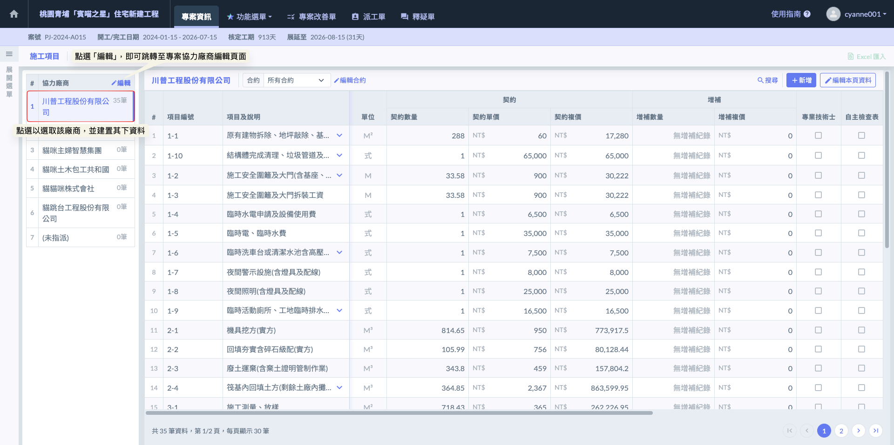

#### 01 - 1｜建置合約

如圖二，選取目標廠商後，點選合約欄位右側的  圖示，即可開啟編輯視窗。在此視窗中，系統支援單一廠商、多個合約的填寫模式。您可以根據實際發包狀況，將該廠商承攬的所有合約項目逐一登錄，確保帳務與工項歸屬精確無誤。

!!! info
    #### **補充與實務說明**
    
    * 在營建實務中，同一家協力廠商可能同時承攬不同性質的標案（例如：同一廠商同時承攬「土方開挖」與「擋土支撐」）。系統支援在此視窗填寫多個合約，方便管理員在同一介面完成該廠商的所有發包設定，不需反覆切換頁面。
    * 在視窗內填寫合約時，請務必核對合約名稱。此處填寫的合約名稱，將直接顯示在施工日誌的選單中。若名稱定義模糊（如僅寫「追加」而未寫明項目），將造成現場監工回報時的困擾，
    * 若該廠商有變更設計之追加合約，亦建議在此視窗中明確區分。透過『編輯合約』功能將資料建置完整後，系統便能自動啟動後端的合約總價彙整與施工進度連動邏輯。

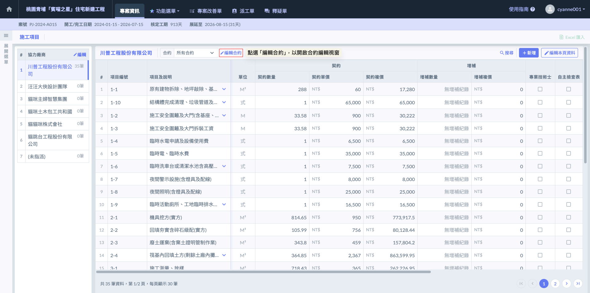

如圖三，開啟編輯視窗後，點選畫面中的  按鈕，系統將自動產生新的空白欄位。您可直接於欄位中填寫該廠商承攬的具體合約名稱。若該廠商同時負責多項不同性質的工程，可重複點選  進行分項登錄。

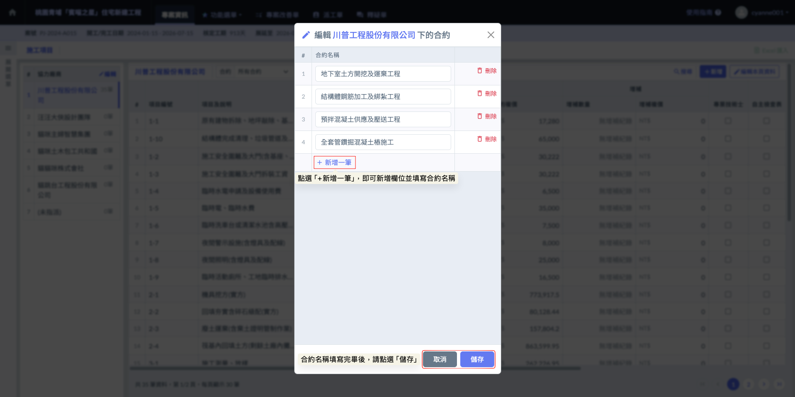

完成畫面如下：

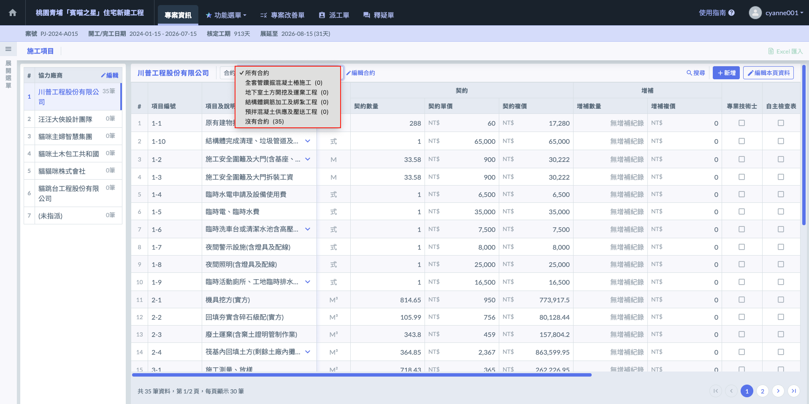

***

### 02｜施工項目

在新建施工項目前，請務必遵循「先選廠商，再選合約」的原則，以確保每一個工項都能精確對應到承攬單位。若專案正處於發包過渡期或資料尚未齊全，系統亦提供彈性的分類處理：



請先選取負責該工程的協力廠商，接著選擇其對應的合約名稱，並在此合約架構下逐一建立施工項目。



若該工項已知必須施作，但尚未選定施工廠商或尚未進行議價發包，可先將其建立於「未指派」分類中。



若已確定由特定廠商施作，但正式合約內容或單價還在跑流程，可先將工項建立在該廠商下方的『沒有合約』分類中。



#### 02 - 1｜新增工項

選定協力廠商後，點選畫面右上方的  按鈕，系統將開啟編輯視窗。在此視窗中，請先選擇該工項所屬的合約，並依序填寫各項施工細節。若您在建立時未選擇特定合約，系統將自動將該工項歸類於該廠商目錄下的 「沒有合約」 分類中。

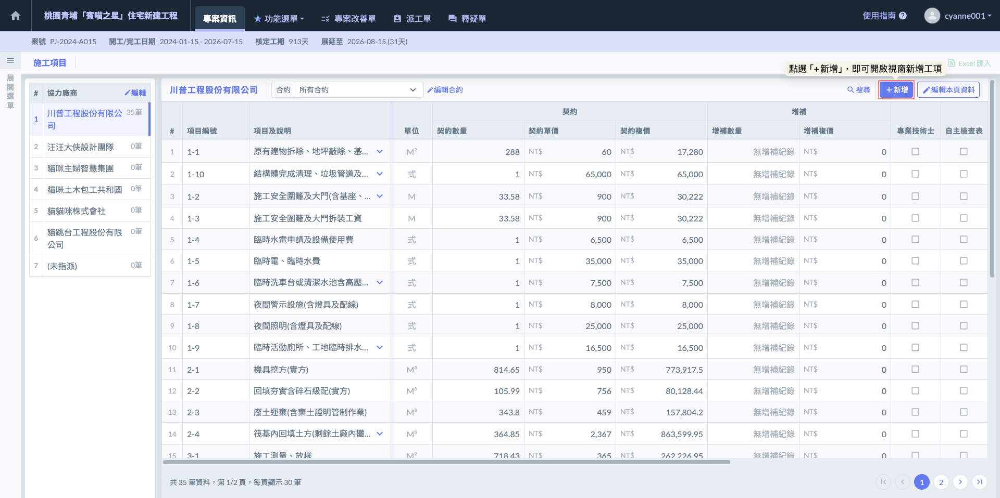

新增工項時，請依序填寫以下欄位：

<table><thead><tr><th width="124.6121826171875">欄位</th><th>說明</th></tr></thead><tbody><tr><td>編號</td><td>
此欄位用於識別工項順序，亦或可以填寫<mark style="color:red;"><strong>工項編碼</strong></mark>。

在建置施工項目時，請務必遵循以下規範：在同一個協力廠商下，所有工項編號皆具備唯一性，不得重複。

</td></tr><tr><td>項目及說明</td><td>請填寫具體的施作內容（如：B1F 柱鋼筋綁紮、3000psi 混凝土澆置）。此名稱會直接顯示在『標準版』施工日誌中，供現場人員選取。 </td></tr><tr><td>選擇分項工程</td><td>將工項歸類至所屬的大項目（如：結構工程、裝修工程）。</td></tr><tr><td>單位</td><td>系統已內建多組營建業常用單位（如：M^3、M^2、T、式、才、口、樘等，多達56種），您可直接從下拉選單中選取，亦可手動輸入所需的單位。 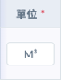   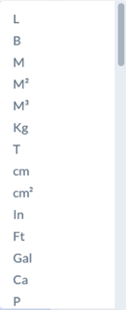       </td></tr><tr><td>契約數量與單價</td><td>

<ul><li>契約數量： 填入該工項在原始合約中的總量。</li><li>契約單價： 填入該工項的單價。</li></ul><blockquote>
系統會根據『數量 × 單價』自動算出契約複價。這些數值是系統後續計算「價金權重」的基礎，關係到施工日誌回報進度時的百分比換算。
</blockquote>

</td></tr><tr><td>專業技術士</td><td>若該工項依法需具備特定證照人員（如：吊車、焊接、高壓電作業）方可施作，請勾選此項。</td></tr><tr><td>自主檢查表</td><td>標記該工項於施作過程中必須執行自主檢查。</td></tr><tr><td>檢驗停留點</td><td>針對必須經監造或業主查驗合格後，方可進行下一步的關鍵節點（如：隱蔽工程灌漿前）。勾選此項可強化查驗程序的強制性，確保品質不漏失。 </td></tr><tr><td>預計施工時間</td><td>

<ul><li>預計開始時間 / 預計完成時間： 由管理員根據施工計畫先行標註。</li><li>預計工作天數： 填入該工項預計施作的日曆天數或工作天。</li></ul><blockquote>
這些時間欄位主要是給工務人員「對時間」參考使用，方便比對合約預定進度與現場實際進度的落差。系統真正的實作數據與完成日期，仍以施工日誌的真實回報為準。
</blockquote>

</td></tr></tbody></table>

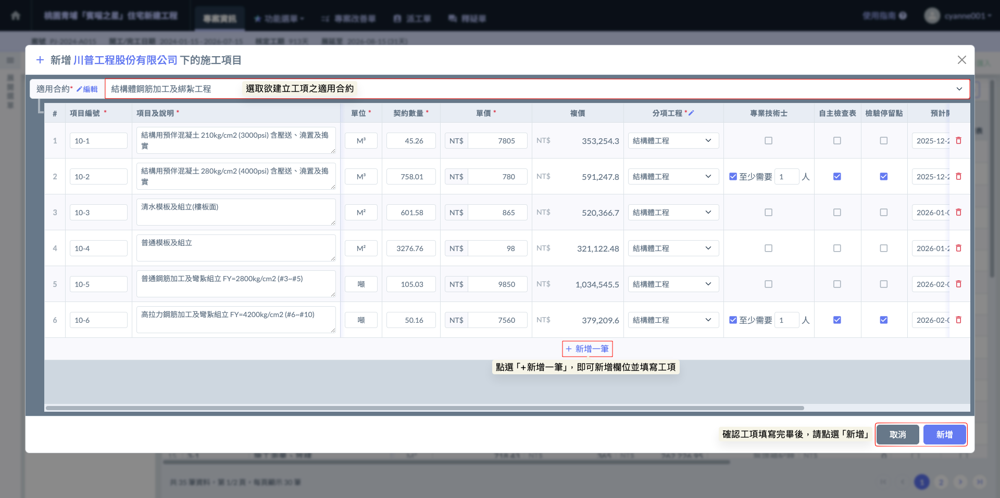

完成畫面如下：

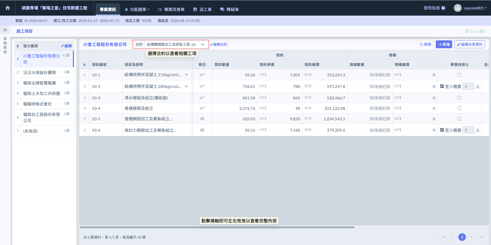

***

#### 02 - 2｜重新發包

為提升管理效率，系統提供了『批次設定協力廠商』的功能。在專案執行過程中，即使施工項目已經建置於某一特定廠商的合約之下，若因**重新發包**、**資料錄入誤植**、或是**工程項目移轉**等實務需求，您即可利用此功能，一次性將大筆施工項目精確移動至其他廠商下。

!!! info
    #### 實務應用與補充說明
    
    * **應對重新發包（退場重發）：** 在工地現場，若發生原分包商能力不足導致中途退場，需將剩餘工項轉交由新進廠商承攬時，此功能可快速完成歸屬移轉，無需重新手動輸入所有工項。
    * **修正建制錯誤：**&#x5728;專案初期規劃階段，若不慎將大量工項建立在錯誤的廠商目錄或『未指派』分類中，透過批次設定功能，可瞬間修正歸屬。
    * **數據完整性：**&#x9032;行批次移動後，該工項原有的各項資料（如：編號、契約數量、增補紀錄、專業技術士/自主檢查表等標籤）設定將完整保留。系統會自動重新掛接至新廠商下，並重新啟動對應的價金權重計算邏輯。
    
    由於工項的編列與移動涉及合約歸屬與金額權重的重大異動，故僅能由具『專案管理』權限之人員操作。

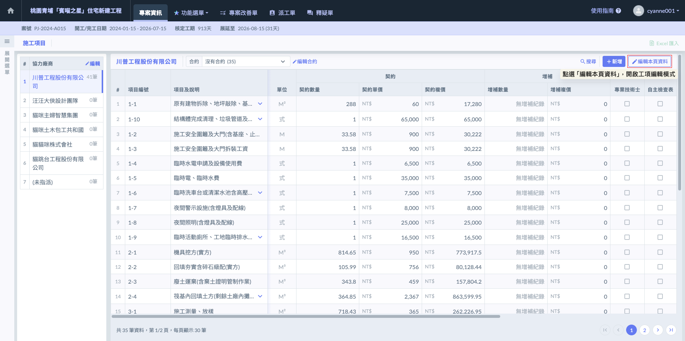

當需要調整大量工項的歸屬時，請依循以下步驟執行「批次移轉」作業：

1. 啟用編輯模式(圖八)：於工項管理頁面右上方點選  圖示，系統即會進入編輯狀態。
2. 批次選取工項(圖九)：在此模式下，您可以開始勾選所有欲轉移或更動歸屬的施工項目，亦可直接將頁面切換至『所有合約』，實現跨合約選取工項。

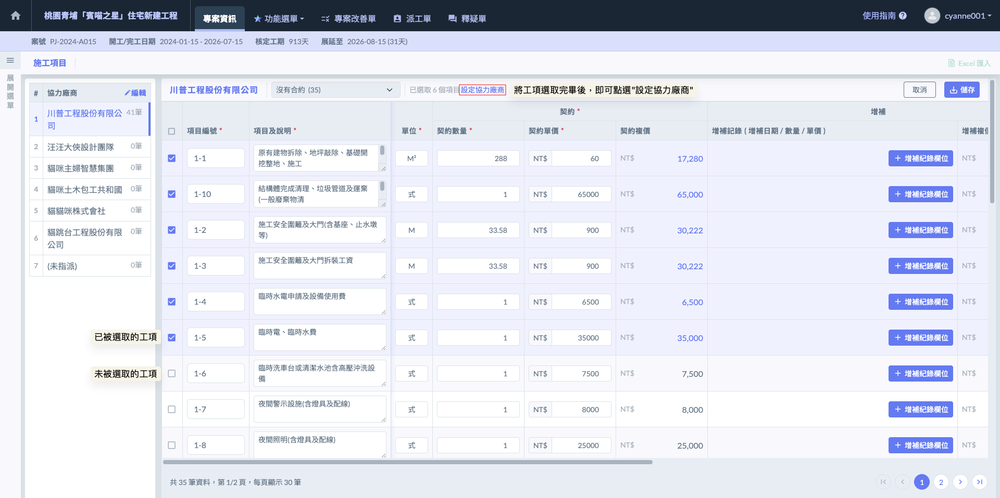

3. 執行移轉設定（圖十）：確認勾選完畢後，點選上方工具列的  圖示，即可在彈出的視窗中選取新的承攬廠商或合約，一次性完成大筆資料的搬移。

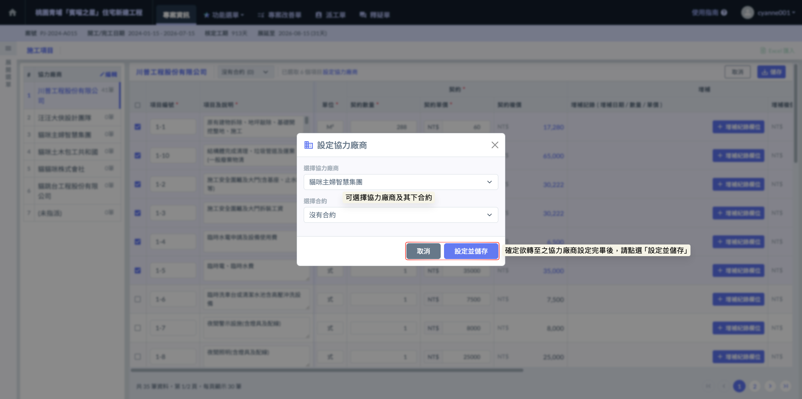

完成畫面如下：

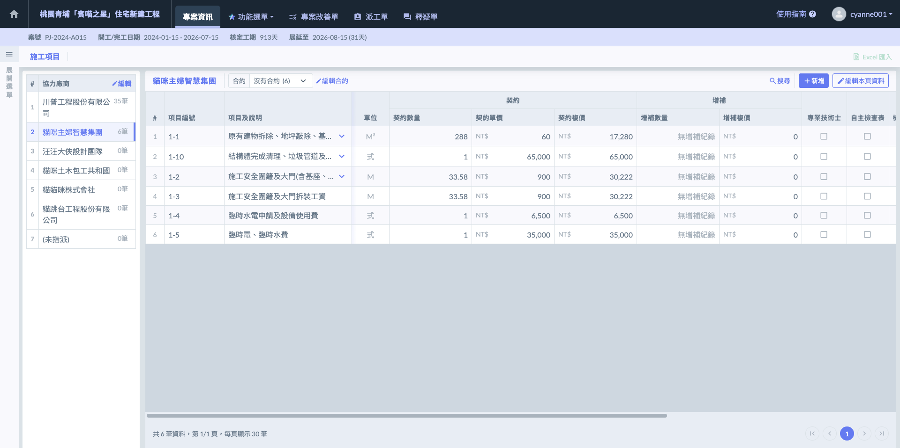

***

#### 02 - 3｜移至其他合約

若您僅需針對單一工項進行廠商內部的情項調整（例如：將工項由「原始合約」移至「增補合約」，或從「沒有合約」歸位至正式合約），可直接採取以下簡便操作：

1. 啟用編輯模式(圖十二)：於工項管理頁面右上方點選  圖示，系統即會進入編輯狀態。

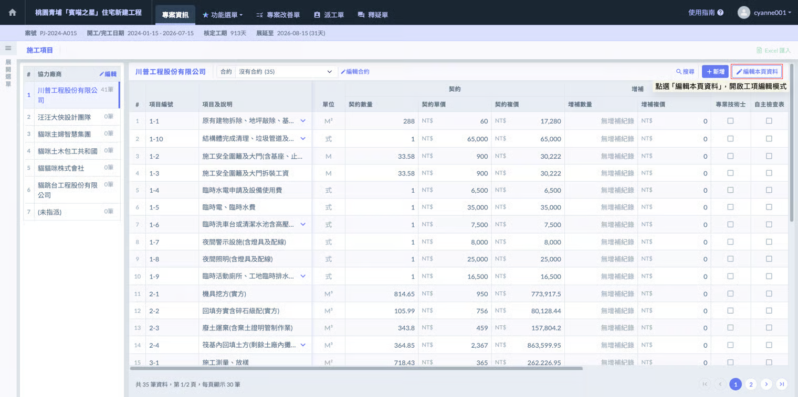

2. 開啟功能選單：在該工項的最右側，點選「⋮」圖示開啟功能選單。
3. 執行合約移轉：從選單中選取  選項。

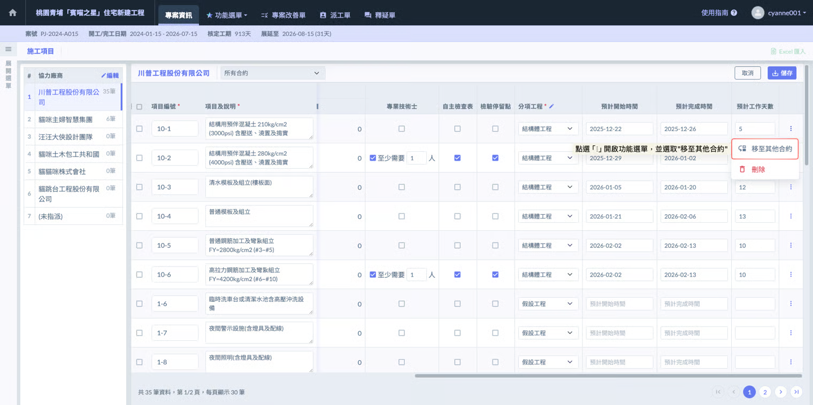

4. 選取目標合約：在彈出的視窗中，選取同一廠商下的目標合約名稱，確認後該工項即完成跨合約轉移。

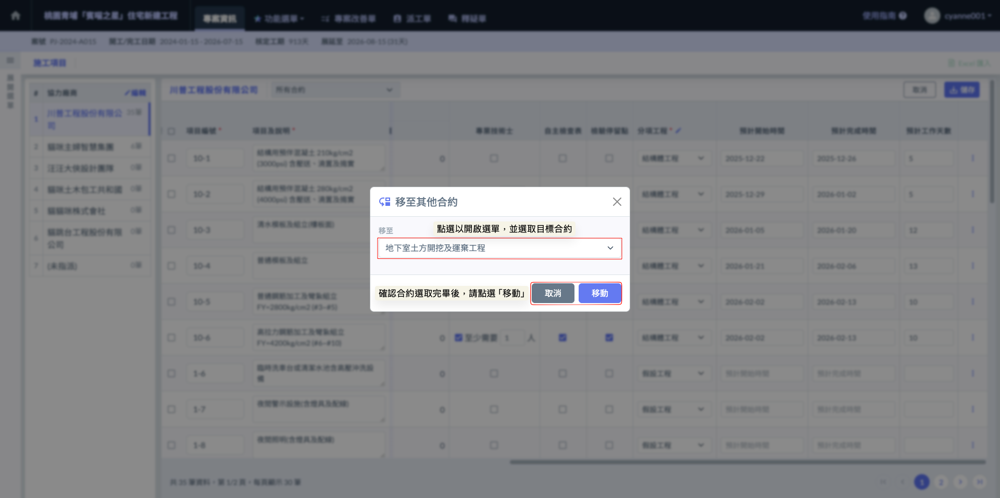

***

### 03｜增補紀錄

工項建置完畢後，若後續因變更設計、追加項或其他合約變更事宜，您可針對該工項持續回報『增補紀錄』。系統支援單一工項建立多筆增補，每筆紀錄皆須詳實附上三個關鍵數據：增補日期、增補數量、增補單價。



系統對於施工進度(%)的計算並非採取全案齊頭式修正，而是具備『時間軸』的動態計算：

1. **分段計算邏輯：**&#x7CFB;統會以『增補日期』作為切割點。在該日期之前的施工日誌進度，仍維持原契約的權重計算；自增補日期當日（含）以後，該工項的進度分母與權重才會根據新的總量（原契約 + 增補量）進行即時變動。
2. **價金權重校正：**&#x7531;於增補的單價可能與原契約不一致，系統會自動將『原契約複價』與『所有增補複價』進行加權計算。這能精確反映該工項在合約總價值中的真實佔比，確保產出的數據具備法律與財務上的嚴謹度。



當您填寫增補紀錄後，整體的預定與實際進度曲線將會產生動態位移：

1. **曲線下降趨勢：**&#x7531;於該次增補之數量追加，導致分母（總合約價值）變大，在已施作量不變的情況下，累計進度百分比（%）會出現****合理下降****。此為營建實務中『合約變大導致相對進度落後』的真實呈現。
2. **權重重新分配：**&#x589E;補後的 S-Curve 將自動依據新的價金權重重新分布。免除了人工手動修正進度表與權重分配的繁瑣與誤差。



!!! info
    #### 補充
    
    在營建實務中，進度計算並非單純的『完成數量 / 總數量』，因為變更設計後的單價可能與原契約不同。
    
    * 系統實務：當使用者在『增補』欄位填入不同的數量與單價時，Jobdone 系統會自動依照原契約與增補內容的『價金權重』進行權重比例計算。無論增補單價如何變動，系統後台會自動導出最精確的總進度百分比，確保施工日誌端的數據能真實反映合約總價值的達成率。

當專案發生變更設計或追加項時，請依據以下步驟在系統中反映數據異動：

1. 開啟編輯模式(圖十五)：在施工項目頁面右上方點選  圖示，進入編輯狀態。

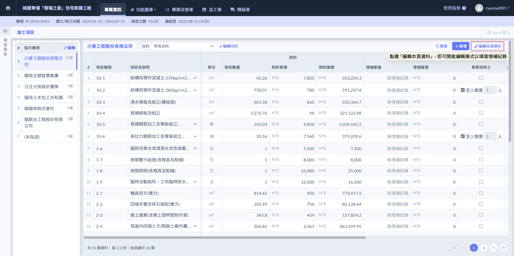

2. 新增紀錄(圖十六)：找到欲填寫增補的工項，在其『增補』欄位內點選 。
3. 填寫數據：在彈出的視窗中，填寫增補日期、增補數量、單價等資訊。若該工項涉及多階段變更，可持續點選  以新增多筆紀錄。
4. 確認與儲存：確認所有增補資訊填寫無誤後，務必點選畫面右上方的  按鈕。

!!! info
    #### 重要規範與實務提醒
    
    * **施工日誌即時連動：** 請務必注意，增補紀錄一旦儲存，系統將立即重新計算進度分母。這會直接影響到施工日誌端呈現的「累計完成量」與「進度百分比（%）」。建議在取得核定公文或正式變更單後再行登錄。
    * **資料的可修正性：** 為因應營建實務中可能發生的單價調整或核定數量差異，日後若有異動，一樣可以回來修正已儲存的增補紀錄。系統會根據修正後的數值，自動重新校正該工項在 S-Curve 中的價金權重。
    * **增補日期生效規則：** 再次提醒，增補對進度的影響是從「增補日期」當天（含）開始生效。若您需要追溯先前的進度權重，請確認日期填寫的準確性，以確保專案歷史進度軌跡的真實性。

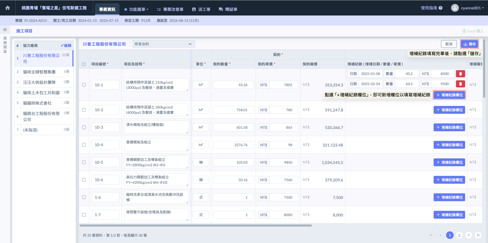

如圖十七，完成增補紀錄的填寫並儲存後，在施工項目列表的『增補數量』欄位中，會出現  圖示。您只需點選該圖示，即可隨時開啟詳細視窗，查看該工項歷次變更的完整數據。

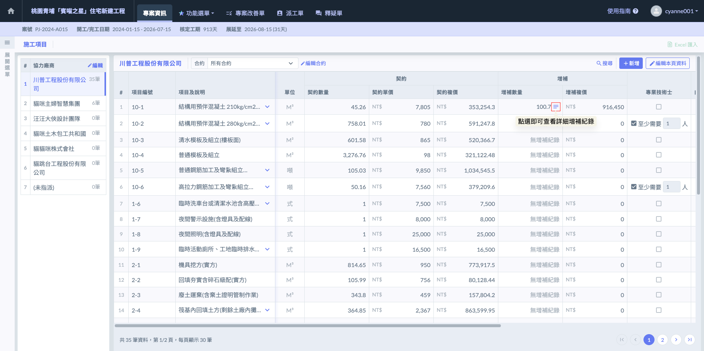

如圖十八，開啟該工項的『詳細增補紀錄』視窗後，系統會完整呈現該項目自開工以來的所有變更軌跡。這是一個動態的履歷表，詳細記錄了每一筆因變更設計或追加減項所產生的數據異動。

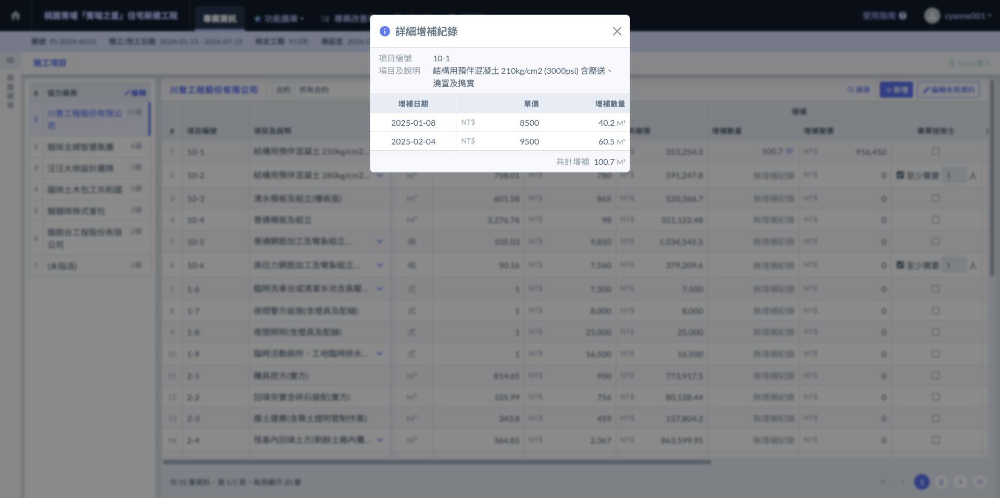
