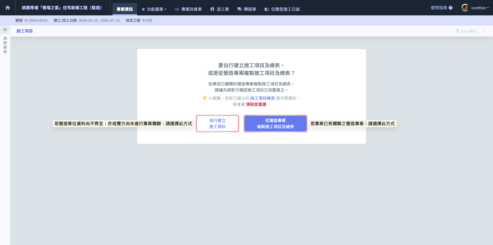
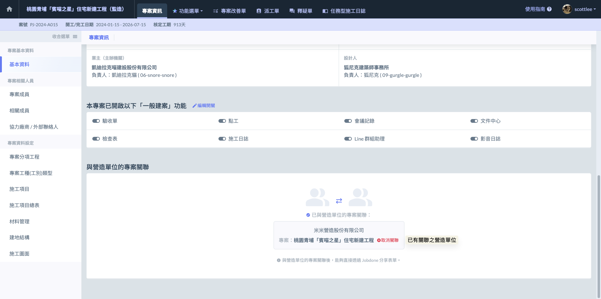
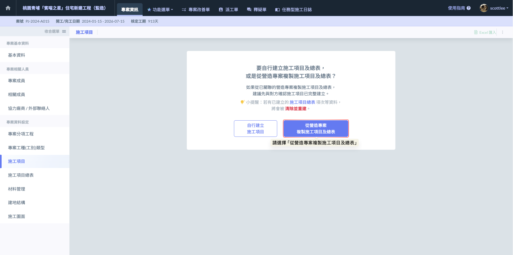
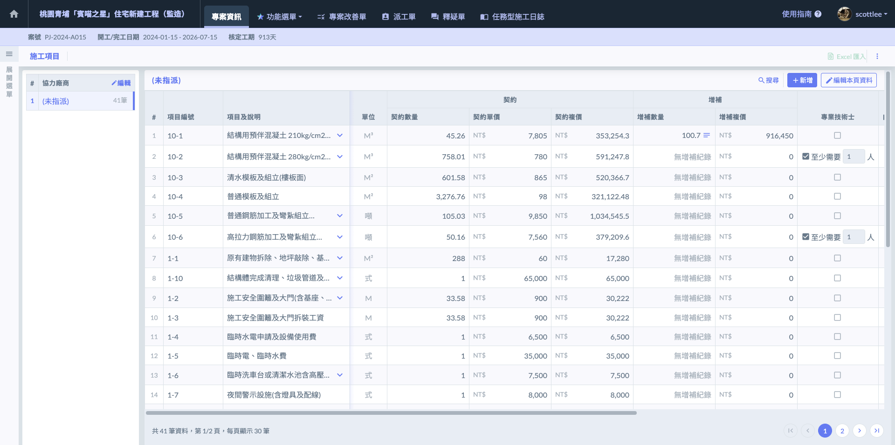

# 監造單位

**【監造實務】施工項目管理與承攬商關聯機制**

在施工項目列表的操作中，針對監造角色，系統提供了兩種靈活的建置策略，旨在解決營建實務中「監造端」與「承攬商端」資訊不對稱的痛點。

作為監造人員，您可以根據專案的管控強度與廠商的配合度，選擇以下任一方式建立工項清單：



監造可依照合約標單，自行手動新增或透過 Excel 匯入承攬商的所有工項。

* 優點：資訊掌握度高，可完全依照監造方的管理邏輯編號與分類。
* 適用情境：承攬商數位化程度較低，或監造方須嚴格控管特定計價細項時。

有關監造自行建立施工項目之操作說明，因其規則與格式同一般格式，故請參閱 ➙ [dan-chun-gong-xiang-ge-shi](dan-chun-gong-xiang-ge-shi "mention")

!!! info
    即使您初始選擇自行建立施工項目，日後確定廠商已成功關聯後，依然可隨時執行『從營造專案複製施工項及總表』功能。這位監造端提供了極大的作業彈性，能確保資料最終與營造端達成一致。




透過系統的『關聯功能』直接連結對應的承攬商帳號。

* 優點：共享數據，免除重複錄入。監造端可直接引用承攬商已建立好的工項、契約數量及單價。
* 實務價值：落實『數據唯一性』。當承攬商回報進度或更新資料時，監造端能同步掌握最新狀態，大幅降低核對成本。



***

### 01｜從營造專案複製 

如圖一，請先確認您的專案已與對應的營造專案成功關聯。若有關聯成功，即可直接引用營造端已建立好的施工項目架構，實現跨單位間的數據同步與協同管理。

如圖二，當您進入『施工項目』功能畫面後，請點選  圖示，系統將執行全自動的架構對接。

系統關聯僅能複製執行當下的『現有施工項目』與總表架構。這意味著數據並非即時聯動，若營造端在未來發生任何異動，監造端需要採取對應的維護動作，以維持數據的真實性。

根據營造端更動的幅度，您可以選擇以下兩種處理方式：



再次複製會覆蓋現有資料。

* 適用情境：營造端進行了大規模的架構調整，例如重新訂定了單價、契約數量等。
* 優點：一鍵快速同步，免去逐項核對的繁瑣。



* **適用情境：**&#x50C5;針對零星工項的新增、名稱微調或單價修正。
* **優點：**&#x4E0D;影響現有的資料、總表層級架構，管理細緻度高。



!!! info
    #### 【重要注意事項】複製工項後的廠商歸類
    
    執行『從營造專案複製到施工項目及總表』後，請務必注意以下資料歸類邏輯：
    
    1. 廠商資訊不會一併複製：系統僅複製施工項目。即便營造端已將工項歸類於各個廠商下，複製過來的工項一律預設為『未指派』。
    2. 需自行設定協力廠商：若您需要按廠商進行管理，請於複製完成後，手動將各個工項重新設定對應的協力廠商及合約。
    
    有關協力廠商及合約設定，請參閱 ➙ [#id-02-2-chong-xin-fa-bao](../cheng-lan-shang-he-yue-ge-shi#id-02-2-chong-xin-fa-bao "mention")

