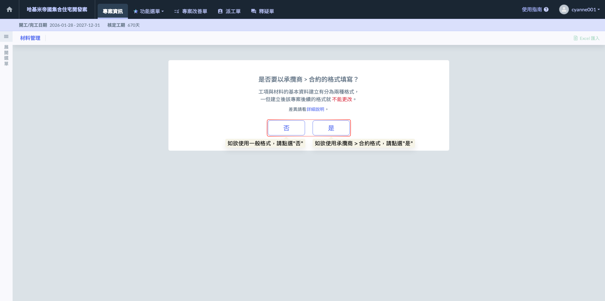

# 材料管理

在營建工程中，材料成本（Material Cost）通常佔據專案總成本的 60% 至 70%，其管理優劣直接決定了專案的盈虧。本說明書旨在引導管理人員透過 Jobdone 系統，將雜亂的材料採購與現場進料轉化為具備「數據分析」價值的數位資產。

營建工程中的「材料管理」絕非單純的數量盤點，而是一個涵蓋「計畫、執行、核對、行動」的循環過程。Jobdone 材料管理模組的核心設計邏輯，是將傳統的 BOQ（工程量清單） 中關於材料的細項數位化，建立起材料的「生命週期追蹤」。

本模組提供一個權威性的「材料管理功能」。不論是預拌混凝土、鋼筋等大宗資材，還是電梯、空調等機電設備，其規格、單價、總量均在此設定。系統透過這些基礎數據，自動計算各項材料在專案中的「價值權重」，並作為後續施工日誌、進料核對與估驗計價的唯一參考基準。

!!! warning
    使&#x7528;**「施工日誌」**&#x6216;**「影音日誌」**&#x7B49;功能時，將會運用到此處資料，務必妥善填寫。

<table><thead><tr><th width="163.8638916015625">功能</th><th>說明</th></tr></thead><tbody><tr><td>材料與施工進度勾稽</td><td>透過材料管理清單的定義，可將資材進場計畫與施工日誌掛鉤。管理人員能即時比對「預計進場量」與「現場回報量」，落實材料供應與現場施作進度的三方校對。</td></tr><tr><td>動態使用概況計算</td><td>當發生追加減（增補）時，系統會動態修正進度分母，確保材料使用概況能符合實際情形。</td></tr><tr><td>多筆增補紀錄追蹤</td><td>支援單一材料項目建立多筆增補紀錄。每一筆紀錄均須包含「增補日期」、「數量」與「單價」，系統會以日期為切割點進行分段權重運算，保留完整的變更設計歷程與審核軌跡。</td></tr><tr><td>雙重管理架構選取</td><td>提供「承攬商合約格式」與「一般格式」供初始化選用。前者可實現細緻的分包商材料計價與責任歸屬管理；後者則採扁平化清單，適用於統籌採購或不需區分供應來源的專案。</td></tr></tbody></table>

**【重要前置設定】施工材料格式選擇說明**

在建立「材料管理」模組前，系統要求管理者必須依據發包策略與管理深度，選定合適的資料架構。此選定後續將****無法進行更改或切換****，請務必審慎評估。



此格式適用於具備明確分包架構的專案（如：大承包商管理各小分包商）。

材料將明確掛載於特定的「協力廠商」及其對應的「合約」下。



此格式適用於架構較為單一、或由營造廠統籌採購管理（自工自料）的專案。

系統移除「廠商」與「合約」欄位，所有材料清單統一呈現。操作直覺、錄入快速。適合不需將材料責任歸屬至特定分包商，僅需控管專案總投入量的場景。



