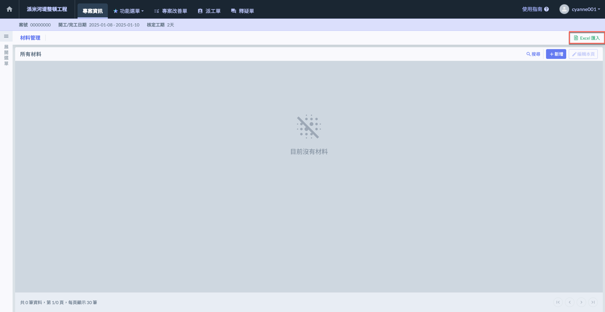
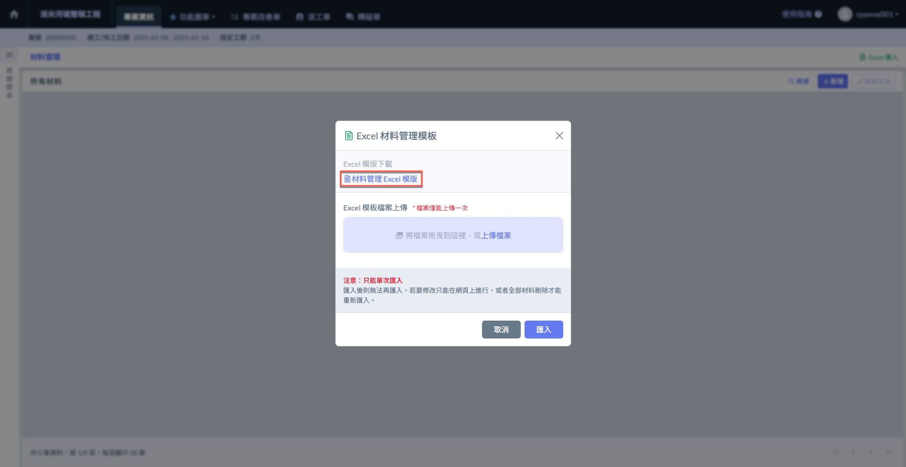
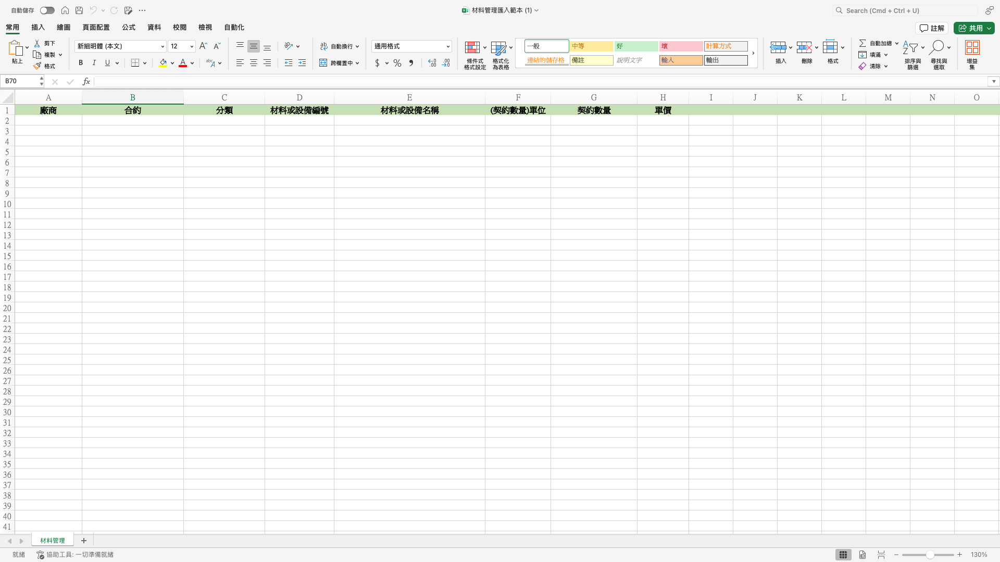
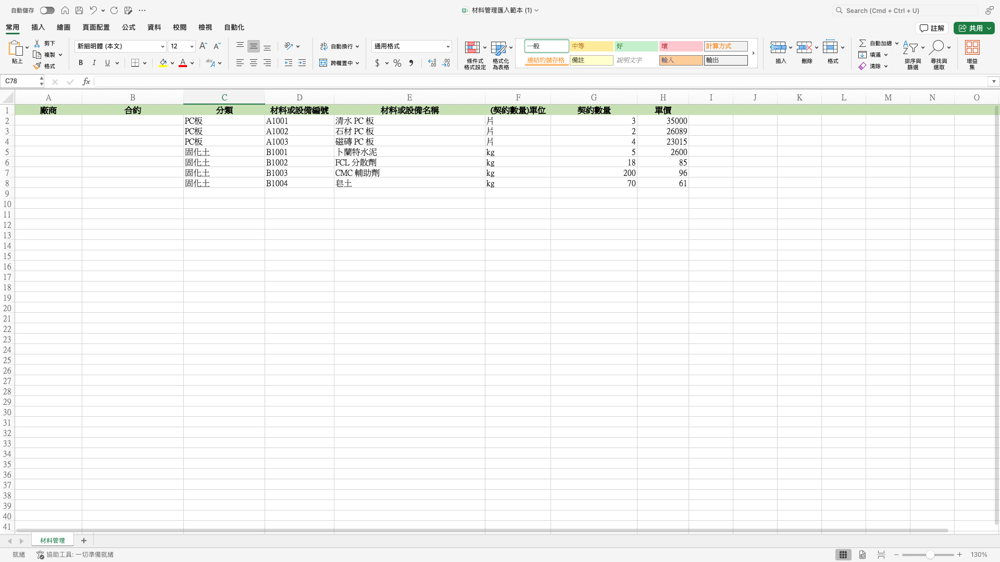
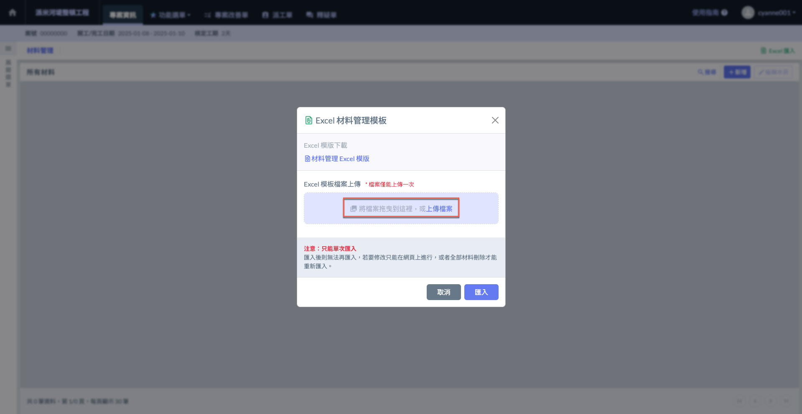
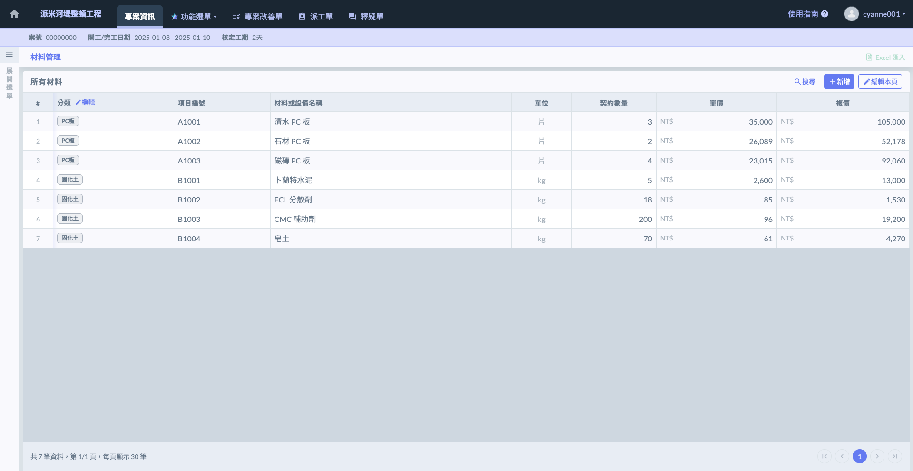

# Excel 匯入

!!! info
    與「廠商 > 合約」之 Excel 材料管理模板 相同，但可**不必**填寫「廠商」及「合約」欄位。



### 下載 Excel 模板

點擊(圖一)紅框圈選處之「Excel匯入」，進入(圖二)頁面後，開始下載Excel材料管理模板。

檔案畫面如下圖所示，依據表格模板填&#x5BEB;**「分類」**、**「材料或設備名稱」**、**「單位」**、**「契約數量」**、**「單價」**

!!! info
    您可直接跳&#x904E;**「廠商」**&#x8207;**「合約」**&#x6B04;位。




### 填寫 Excel 檔案

!!! warning
    由於系統判讀資料之因素，**「務必使用」**&#x4E0A;述提供的模板填寫，並依照格式妥善填寫。




### 上傳 Excel 檔案

系統將在送出時給予提醒(圖二)，上傳成功後，系統匯入&#x65BC;**「步驟二」**&#x6240;填寫之資料(見圖三)。

!!! warning
    Excel 匯入功能僅能在尚未新增任何材料資料時使用，匯入後則無法再匯入。
    
    透過Excel匯入後，若您需要更動/增加材料資料，則需透過手動編輯。
    
    由於檔案僅能上傳一次，若您需要重新匯入Excel資料，則需先將原有資料全部刪除。




