# 一般格式

### 01｜新增材料項目

在一般格式下，由於系統不具備『協力廠商』與『合約』的層級架構，所有的施工項目將會統一在同一個清單介面中呈現。

進入材料管理頁面後，請點選畫面右上方的  按鈕即可開啟編輯視窗。

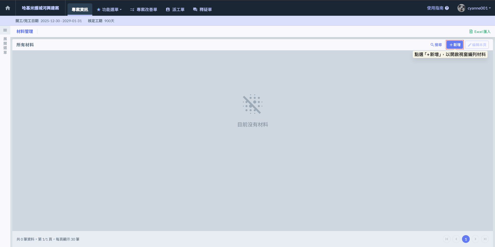

新增材料時，請依序填寫以下欄位：

<table><thead><tr><th width="132.1317138671875">欄位</th><th>說明</th></tr></thead><tbody><tr><td>分類</td><td>依據材料屬性或工程 WBS 結構進行歸類（如：結構材、裝修材、機電設備）。</td></tr><tr><td>項目編號</td><td>唯一編號。 在一般格式下，全專案編號嚴禁重複；在承攬商格式下，同廠商下編號不可重複。</td></tr><tr><td>材料或設備名稱</td><td>建議與採購契約之品名規格完全一致。包含材質、型號、尺寸（如：60*60 霧面石英磚、3000psi 抗滲混凝土）。</td></tr><tr><td>單位</td><td>由選單中選取營建標準度量衡單位（如：M^3、M^2、T、kg、式等）。</td></tr><tr><td>契約數量</td><td>填入採購合約中的原始數量。</td></tr><tr><td>單價</td><td>採購單價（連工帶料或僅材料費）。</td></tr><tr><td>複價</td><td>系統自動計算（數量 x 單價）。</td></tr></tbody></table>

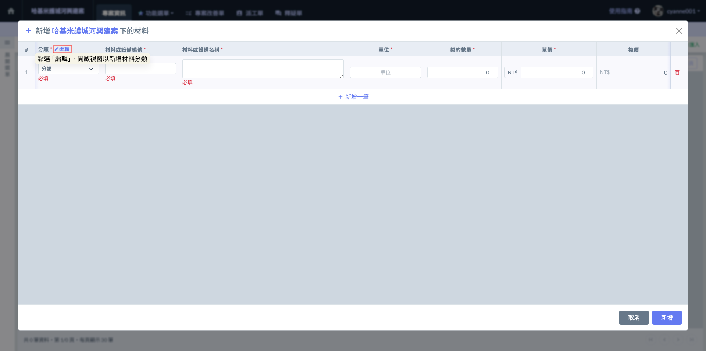

在建立材料清單前，預先設定清晰的分類是落實專案管理的第一步。請依循以下步驟進行設定：

1. 開啟編輯模式(圖二)：點選材料分類區域的  按鈕，開啟編輯視窗。
2. 新增分類欄位(圖三)：點選視窗中的  按鈕，系統將自動產生空白欄位。
3. 填寫分類名稱：於欄位中輸入符合專案需求的材料類別。分類填寫完畢後，請務必點選 。儲存後，您在手動新增材料時，即可從下拉選單中選取這些預設分類。

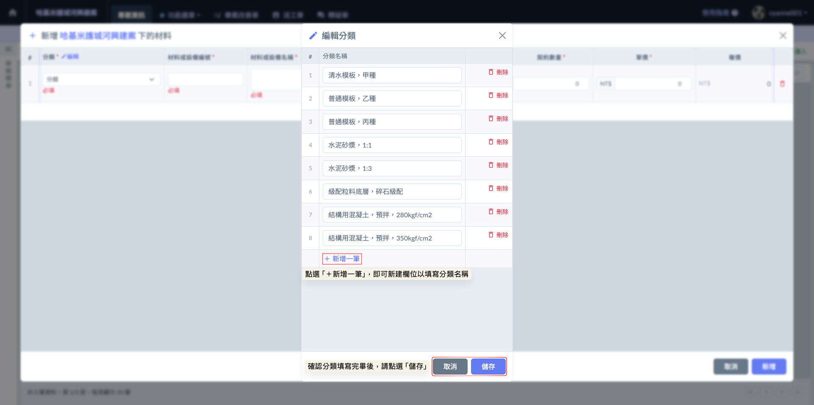

當您完成分類設定後，即可開始細部編列施工材料。請依循以下步驟進行手動建置：

1. 開啟材料新增功能：在材料新增視窗中，點選  按鈕，系統將自動產生空白欄位。
2. 填寫材料資訊：於欄位中依序錄入分類、材料名稱、項目編號、單位、數量與單價。

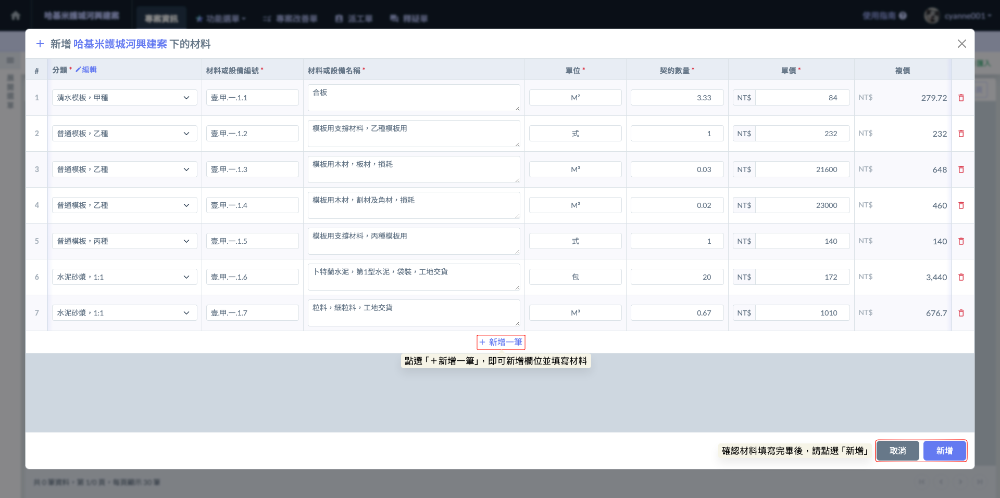

完成畫面如下：

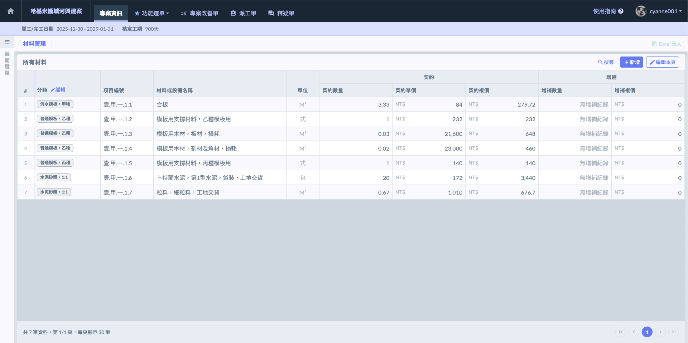

***

### 02｜編輯材料項目

如需修改現有的材料項目內容，請依循以下步驟執行：

1. 開啟編輯模式：於材料管理頁面右上方點選  圖示，系統即會切換至編輯狀態。

2. **修改資料：**&#x5728;此模式下，您可以直接針對各材料的「分類」、「編號」、「名稱」、「單位」等進行即時修正。

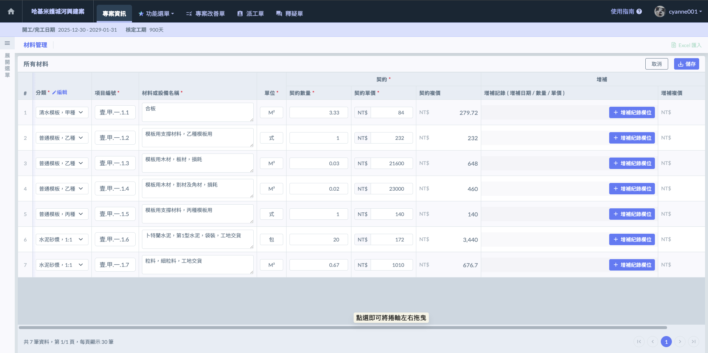

3. **刪除工項：**&#x82E5;該材料已不需使用且尚未有施工日誌回報紀錄，可點選該列最右側的  圖示進行移除。
4. **儲存變更：**&#x4FEE;改完畢後，請務必點選右上方的  按鈕。

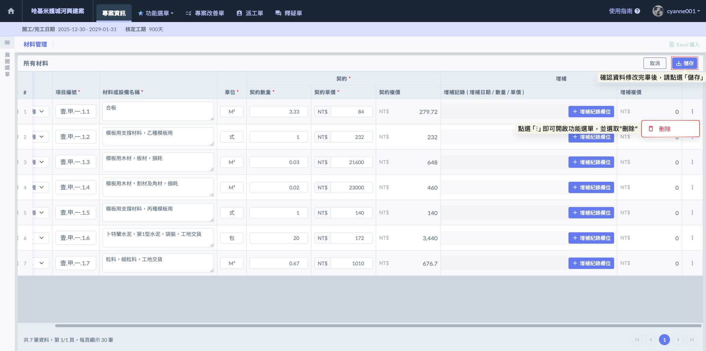

***

### 03｜增補紀錄

材料建置完畢後，若後續因變更設計、材料追加或其他合約變更事宜，您可針對該材料持續回報『增補紀錄』。系統支援單一工項建立多筆增補，每筆紀錄皆須詳實附上三個關鍵數據：增補日期、增補數量、增補單價。

當專案發生變更設計或追加項時，請依據以下步驟在系統中反映數據變動：

1. 開啟編輯模式：在材料管理頁面右上方點選  圖示，進入編輯狀態。

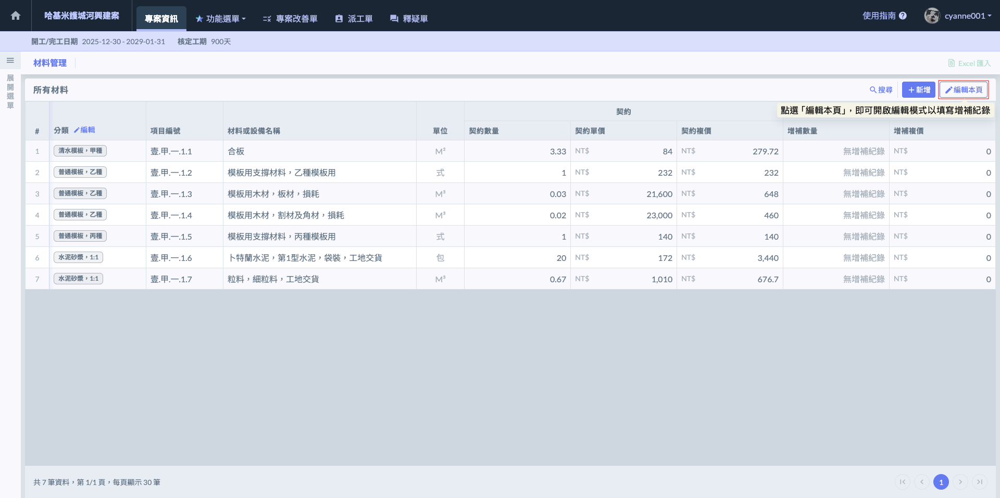

2. 新增紀錄：找到欲填寫增補的材料，在其『增補』欄位內點選 。
3. 填寫數據：在彈出的視窗中，填寫增補日期、增補數量、單價等資訊。若該材料設計多階段變更，可持續點選  以新增多筆紀錄。
4. 確認與儲存：確認所有增補資訊填寫無誤後，務必點選畫面右上方的  按鈕。

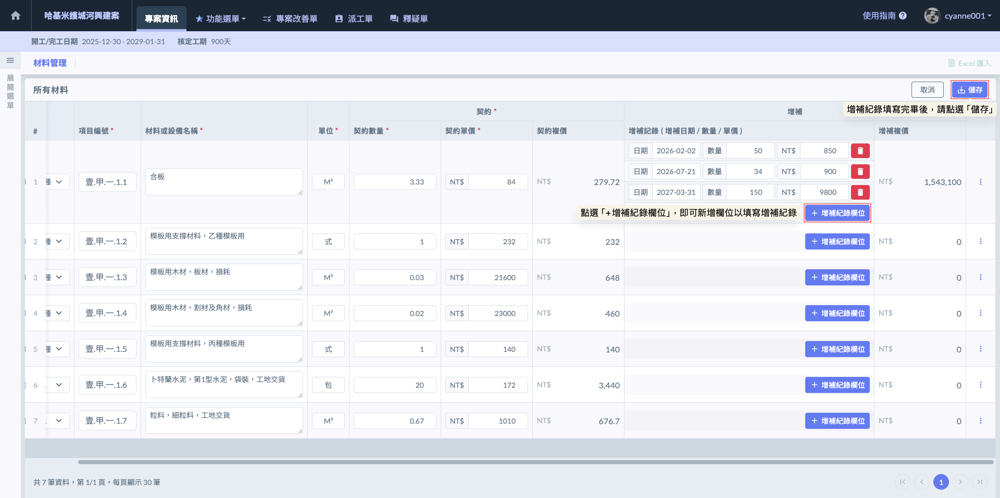

如圖十一，完成增補紀錄的填寫並儲存後，在材料管理列表的『增補數量』欄位中，會出現  圖示。您只需點選該圖示，即可隨時開啟詳細視窗，查看該材料歷次變燈的完整數據紀錄。

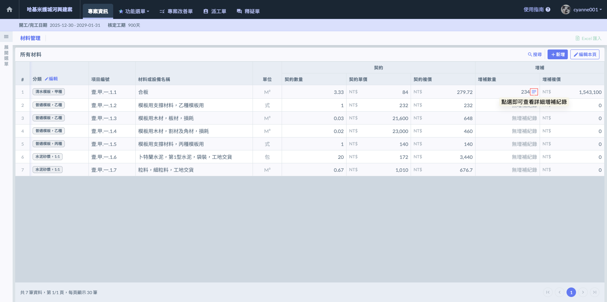

如圖十二，開啟該材料的『詳細增補紀錄』視窗後，系統會完整呈現該材料所有增補紀錄。

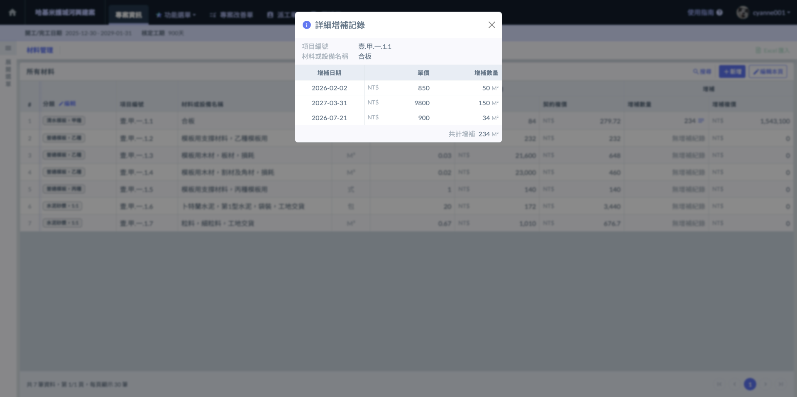
