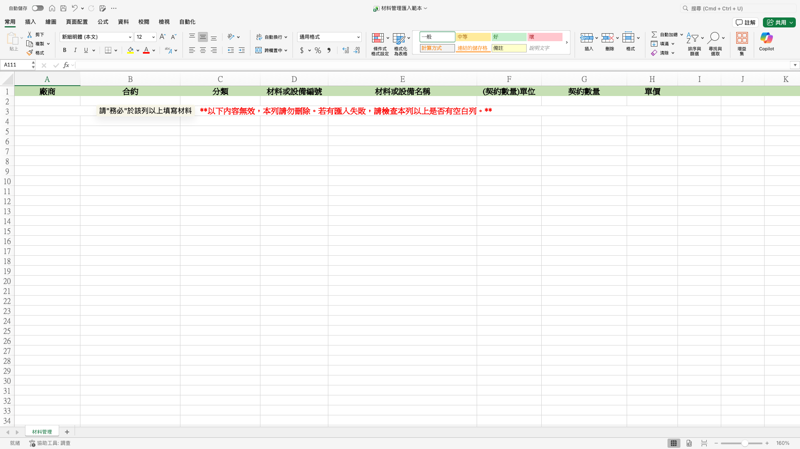
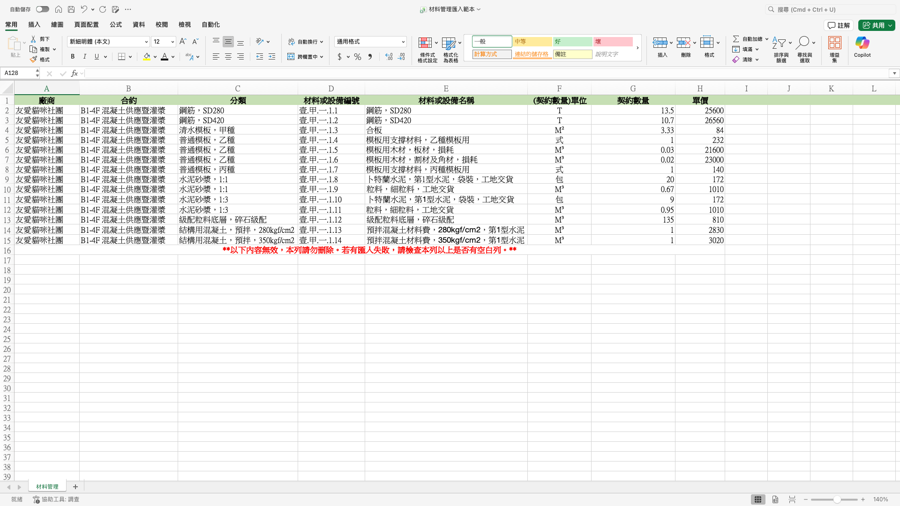
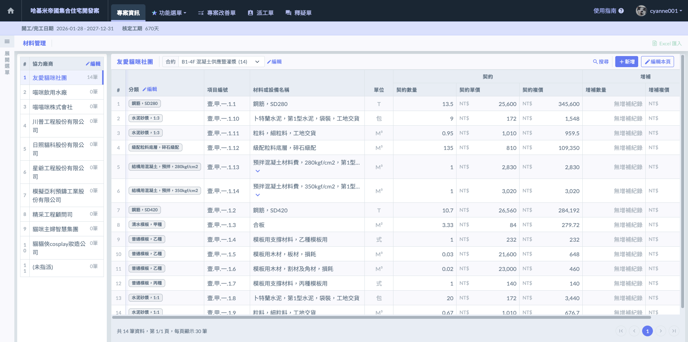

# Excel 匯入



### 下載 Excel 模板

進入材料管理頁面後，請遵循以下步驟執行匯入作業：

1. 開啟下載視窗：點選畫面右上方的  圖示。

!!! danger
    #### 【重要限制】檔案匯入功能使用規範
    
    檔案匯入功能僅限於該專案『沒有任何合約』及『沒有任何材料項目』的狀態下使用。

2. 下載標準模板：在開啟的視窗中，點擊 。請務必使用系統提供的原始模板進行資料填寫，以確保資料格式能精確對應。

**【Excel 模板填寫規範與補充】**

<table><thead><tr><th width="186.06689453125">欄位名稱</th><th>填寫規範與填寫規範與實務建議</th></tr></thead><tbody><tr><td>廠商（選填）</td><td>

此欄位為「選填」，系統會根據填寫內容執行不同的自動歸類動作：
<ul><li><strong>若欄位留白（未填寫）：</strong> 系統將自動將該筆工項歸類於『未指派』分類。這適合用於專案初期 WBS 規畫，或是尚未確定分包對象的工項建置。</li><li>
<strong>若有填寫廠商名稱：</strong> 系統將啟動自動偵測機制，並產生以下兩種結果：
<ol><li>廠商已存在： 若填寫的名稱與專案內已建置的廠商名稱<strong>完全一致</strong>，系統會自動將工項新增至該廠商名下。</li><li>廠商不存在： 若系統偵測不到相同名稱，將會直接以您填寫的名稱「自動建立一筆新協力廠商資料」，並將工項掛載其下。</li></ol></li></ul></td></tr><tr><td>合約（選填）</td><td>填寫該材料所屬的合約名稱，配合廠商欄位。同廠商下可區分不同合約（如：水泥採購、紅磚供應），以利後續針對單一合約進行增補紀錄管理與對帳。 <strong>若未填寫：</strong>系統將自動歸類於該該廠商下的『沒有合約』分類，方便後續再行手動調整歸屬。</td></tr><tr><td>分類<mark style="color:red;"><strong>（必填）</strong></mark></td><td>定義材料屬性（如結構材、裝修材、機電設備）。</td></tr><tr><td>材料或設備編號<mark style="color:red;"><strong>（必填）</strong></mark></td><td></td></tr><tr><td>材料或設備名稱<mark style="color:red;"><strong>（必填）</strong></mark></td><td>須與採購契約或規範之品名完成一致（如4000psi 預拌混凝土、D13 鋼筋）。建議標註規格，方便現場人員進行離線點交時核對。</td></tr><tr><td>單位<mark style="color:red;"><strong>（必填）</strong></mark></td><td>填入營建常用單位（依標案需求填寫，沒有限制）。</td></tr><tr><td>契約數量<mark style="color:red;"><strong>（必填）</strong></mark></td><td>填寫合約原始總量。 僅限填寫數字，不可包含任何文字或符號。</td></tr><tr><td>單價<mark style="color:red;"><strong>（必填）</strong></mark></td><td>填入合約原始單價。 系統匯入後自動計算複價，即為該資材在全案中的價值權重。</td></tr></tbody></table>




### 填寫 Excel 模板

**【重要警告】Excel 模板規範與格式限制**

由於系統必須精確判讀各項資料，請在填寫 Excel 材料模板時，務必嚴格遵守以下規範：



* **勿自行添加欄位：**&#x8ACB;勿在模板中插入任何自訂的欄位、欄位名稱或備註資訊。系統後台已固定讀取位置，多出的欄位將導致資料偏移，進而引發匯入錯誤或數據錯位。
* **勿漏項必填欄位**：標註為必填(****\*****) 的項目（如：分類、材料編號、名稱、單位、數量、單價）絕對不可留白。一旦缺少核心數據，系統將無法建立該材料，甚至導致整份檔案匯入失敗。\
  **禁止公式運算：**&#x8ACB;直接填寫「數值」，切勿在數量或單價欄位中使用 Excel 公式（如：`=SUM(...)`）。



* **禁止公式運算：**&#x8ACB;直接填寫「數值」，切勿在數量或單價欄位中使用 Excel 公式（如：`=SUM(...)`）。
* **禁止特殊格式化：**&#x8ACB;勿對表格進行儲存格合併、更改字體顏色或加上框線樣式。維持模板原始的純淨格式，能確保匯入過程的穩定性。



* **單位一致性：**&#x8ACB;參照系統建議的營建常用單位填寫。
* **廠商名稱精確度：**&#x5982;前所述，若欲將材料新增至已建立的廠商，名稱必須與系統內完全一致。差一個空格或符號，系統就會視為新廠商而重複建立。






### 上傳 Excel 模板

材料檔案填寫完畢並確認格式無誤後，請依序執行以下步驟完成匯入：

1. 開啟匯入視窗：點選材料管理頁面右上方之  圖示。

2. 上傳檔案：於『Excel 模板檔案上傳』欄位，選擇或拖曳您填寫完畢的 Excel 檔案。
3. 執行匯入：點選  按鈕，系統將開始判讀資料並自動建置廠商、合約與材料。

完成畫面如下：

!!! info
    #### 實務說明與最終檢查
    
    * **資料核對機制：**&#x532F;入完成後，系統會自動跳轉至材料清單。建議立即核對總筆數是否正確，以及各材料的『契約複價』是否與原始 Excel 檔案一致。
    * **錯誤排除提醒：**&#x82E5;匯入過程中出現錯誤提示，通常是因『編號重複』或『必填欄位漏項』所致。請修正 Excel 檔案後，務必先將專案內已產生的零星資料淨空，再重新執行匯入，以維持資料的純淨性。
    
    ****透過Excel匯入後，若您需要更動/增加材料資訊，則需透過手動編輯。****



