# 承攬商 > 合約格式

本系統支援「手動新增」與「Excel 匯入」兩種方式編列您的施工材料。

以下針對「手動新增」的操作流程進行說明：

### 01｜承攬商與合約 

若您評估後決定選用『承攬商 > 合約』格式，請務必在設定材料項目之前，先行完成專案內協力廠商的基本資料建置。

若您尚未設定協力廠商，請參閱 ➙ [協力廠商 / 外部聯絡人](../../project_stakeholders/subcontractor)

!!! info
    #### 操作建議與補充
    
    * **資料準備順序：**&#x5EFA;議遵循『建置廠商清單 > 登陸合約內容 > 設定材料清單』的標準作業流程。
    * **合約唯一性：**&#x6BCF;一筆材料項目在系統中僅能對應一個合約。若同一材料由兩家包商供應，則須在個別廠商合約下分別建立，以利後續價金權重計算與材料使用計算。

系統將自動抓取並整合該專案已建置之協力廠商資料庫，即時呈現廠商列表。管理人員只需點選列表中特定的廠商名稱，即可展開後續的合約明細登錄與材料編輯。

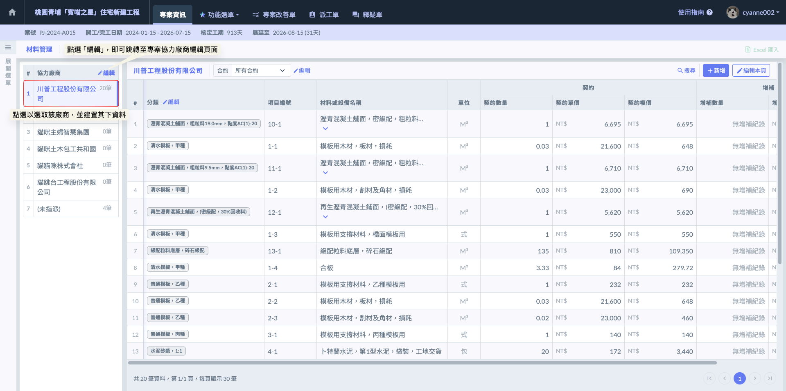

#### 01 - 1｜建置合約 

如圖二，選取目標廠商後，點選合約欄位右側的  圖示，即可開啟編輯視窗。在此視窗中，系統支援單一廠商多個、多個合約的填寫模式。您可以根據實際發包狀況，將該廠商承攬的所有合約項目逐一登錄，確保帳務與材料歸屬精確無誤。

!!! info
    #### 補充與實務說明
    
    * 在營建實務中，同一家協力廠商可能同時承攬不同性質的材料（例如：同一家建材行供應水泥、紅磚與隔熱材）。系統支援在此視窗填寫多個合約，方便管理員在同一個介面完成該廠商的所有發包設定，不需反覆切換頁面。
    * 在視窗內填寫合約時，請務必和對合約名稱，將直接顯示在施工日誌的選單中。若名稱定義模糊（如僅寫「追加」而未寫明項目），將造成現場監工回報時的困擾。
    * 若該廠商有變更設計之追加合約，亦建議在此視窗明確區分。

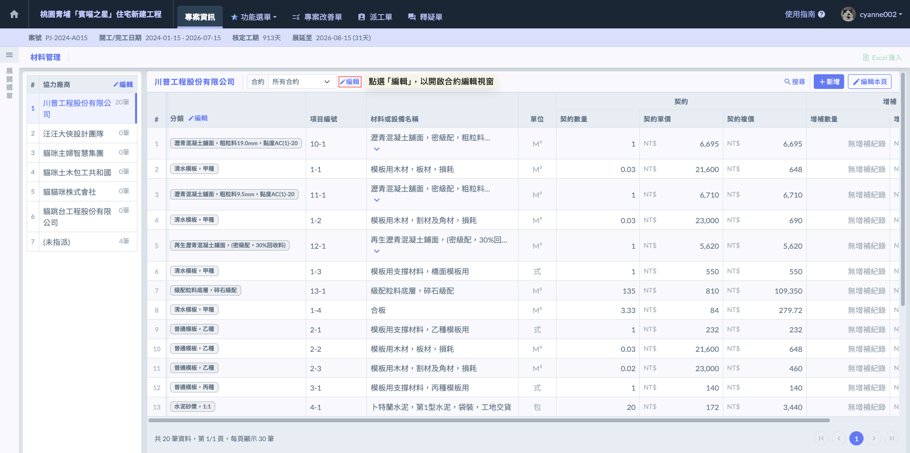

如圖三，開啟編輯視窗後，點選畫面中的  按鈕，系統將自動產生新的空白欄位。您可直接於欄位中填寫該廠商承攬的具體合約名稱。若該廠商同時負責多項不同性質的材料或設備，可重複點選  進行分項登錄。

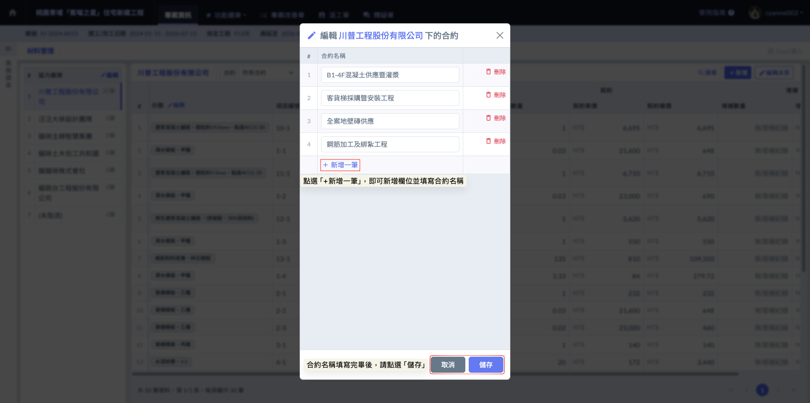

完成畫面如下：

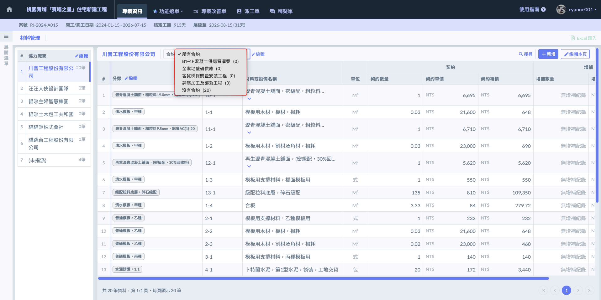

***

### 02｜材料項目

在新建材料項目前，請務必遵循「先選廠商，再選合約」的原則，以確保每一個工項都能精確對應到承攬單位。若專案正處於發包過渡期或資料尚未齊全，系統亦提供彈性的分類處理：



請先選取負責該材料的協力廠商，接著選擇其對應的合約名稱，並在此合約架構下逐一建立材料項目。



若特定材料已知必須施作或採購，但尚未選定供應廠商或尚未進行議價發包，建議先將其建立於 「未指派」分類中。



若已確定由特定廠商負責，但正式合約內容或單價還在跑流程，可先將材料建立在該廠商下方的『沒有合約』分類中。



#### 02 - 1｜新增材料

選定協力廠商後，點選畫面右上方的  按鈕，系統將開啟編輯視窗。在此視窗中，請先選擇該材料所屬的合約，並依序填寫各項材料細節。若您在建立時未選擇特定合約，系統將自動將該材料歸類於廠商目錄下的『沒有合約』分類中。

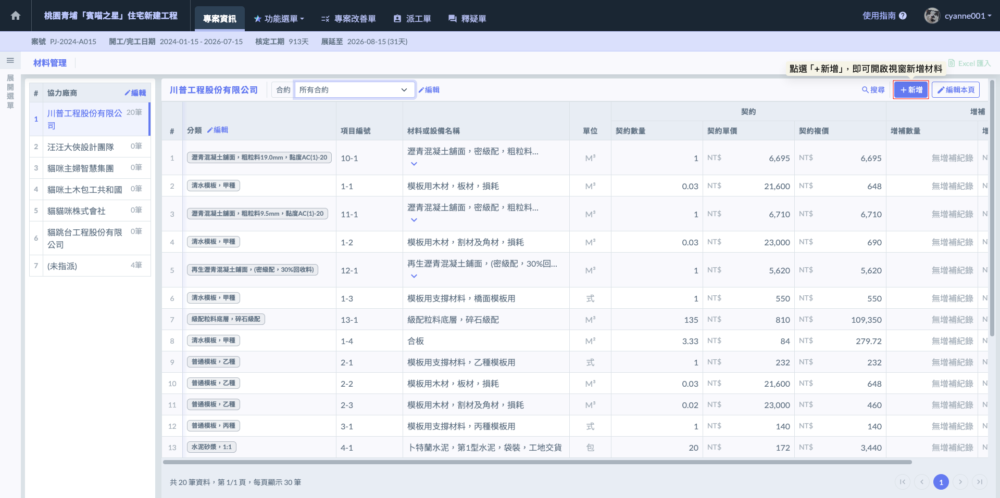

新增材料時，請依序填寫以下欄位：

<table><thead><tr><th width="135.8636474609375">欄位名稱</th><th>說明</th></tr></thead><tbody><tr><td>分類</td><td>依據材料屬性或工程 WBS 結構進行歸類（如：結構材、裝修材、機電設備）。</td></tr><tr><td>項目編號</td><td>唯一編號。 在一般格式下，全專案編號嚴禁重複；在承攬商格式下，同廠商下編號不可重複。</td></tr><tr><td>材料或設備名稱</td><td>建議與採購契約之品名規格完全一致。包含材質、型號、尺寸（如：60*60 霧面石英磚、3000psi 抗滲混凝土）。</td></tr><tr><td>單位</td><td>由選單中選取營建標準度量衡單位（如：M^3、M^2、T、kg、式等）。</td></tr><tr><td>契約數量</td><td>填入採購合約中的原始數量。</td></tr><tr><td>單價</td><td>採購單價（連工帶料或僅材料費）。</td></tr><tr><td>複價</td><td>系統自動計算（數量 × 單價）。</td></tr></tbody></table>

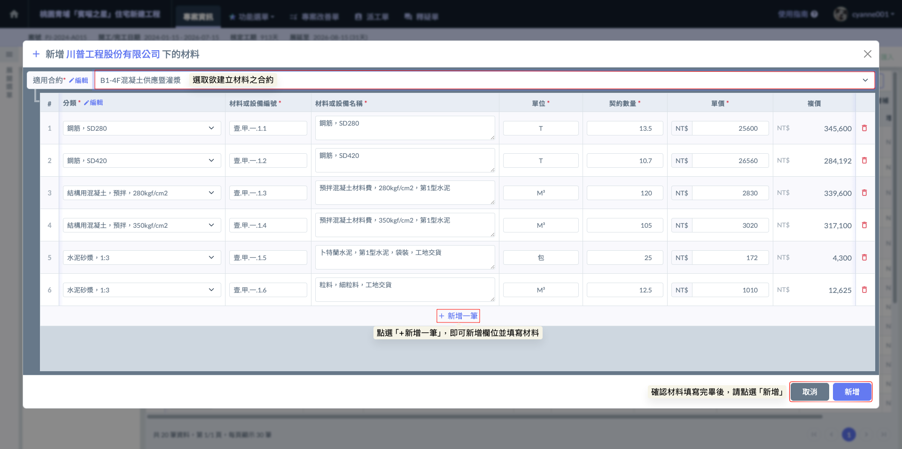

完成畫面如下：

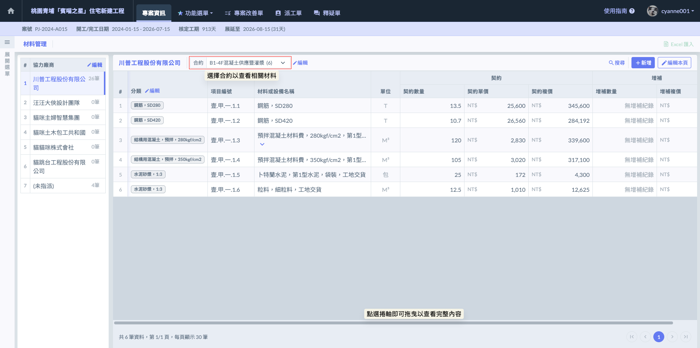

***

#### 02 - 2｜材料發包

為提升管理效率，系統提供了『批次設定協力廠商』的功能。在專案執行過程中，即使材料已經建置於某一特定廠商的合約之下，若因**重新發包**、**資料錄入誤植**、或是**材料項目移轉**等實務需求，您即可利用此功能，一次性將大筆材料精確移動至其他廠商下。

!!! info
    #### 實務應用與補充說明
    
    * **應對重新發包（退場重發）：**&#x5728;工地現場，若發生原分包商能力不足導致中途退場，需將剩餘材料轉交由新進廠商承攬時，此功能可快速完成歸屬移轉ㄝ無需重新手動輸入所有工項。
    * **修正建置錯誤：**&#x5728;專案初期規劃階段，若不慎將大量材料建立在錯誤的廠商目錄或『未指派』分類中，透過批次設定功能，可瞬間修正歸屬。

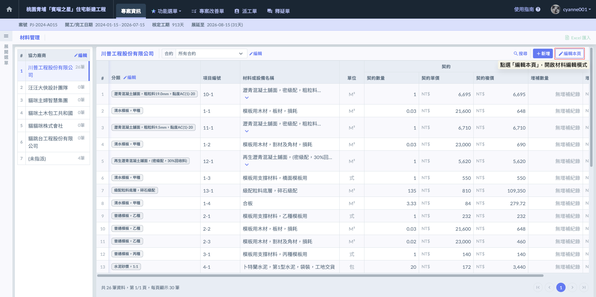

當需要調整大量材料的歸屬時，請依循以下步驟執行『批次移轉』作業：

1. 啟用編輯模式(圖八)：於材料管理頁面右上方點選  圖示，系統即會進入編輯狀態。
2. 批次選取工項(圖九)：在此模式下，您可以開始勾選所有欲移轉或更動歸屬的材料項目，亦可直接將頁面切換至『所有合約』，實現跨合約選取材料。

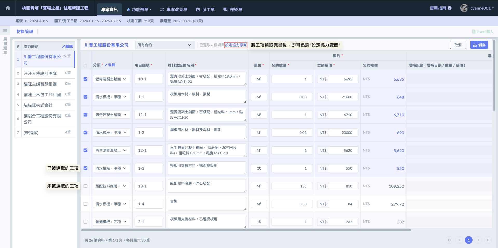

3. 執行移轉設定(圖十)：確認勾選完畢後，點選上方工具列的  圖示，即可在彈出的視窗中選取新的承攬廠商或合約，一次性完成大筆資料的搬移。

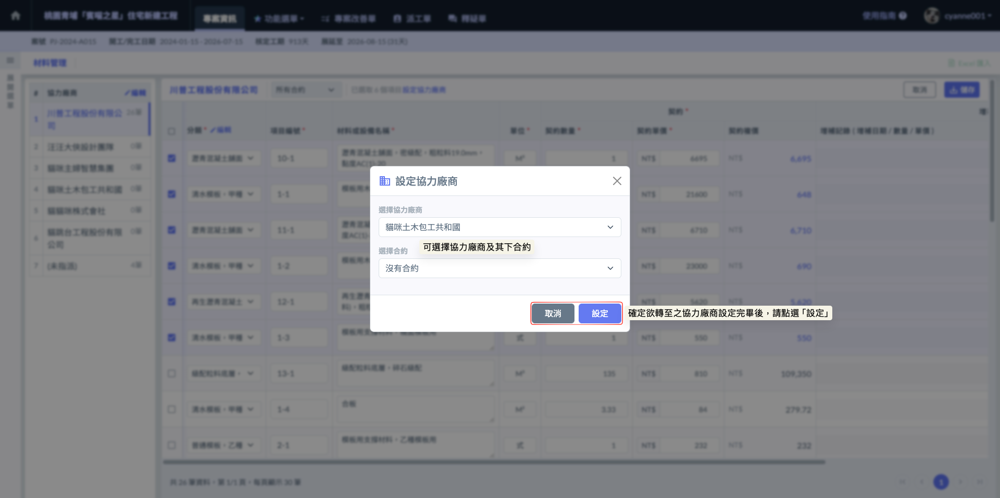

4. 執行儲存(圖十一)：將材料之目標協力廠商與合約設定完畢後，請****務必再次點選****頁面右上角的  圖示。

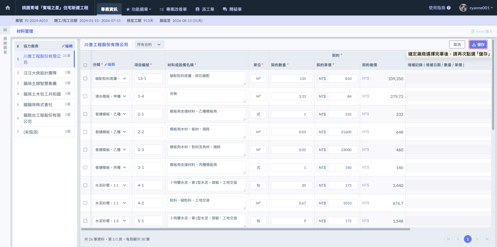

完成畫面如下：

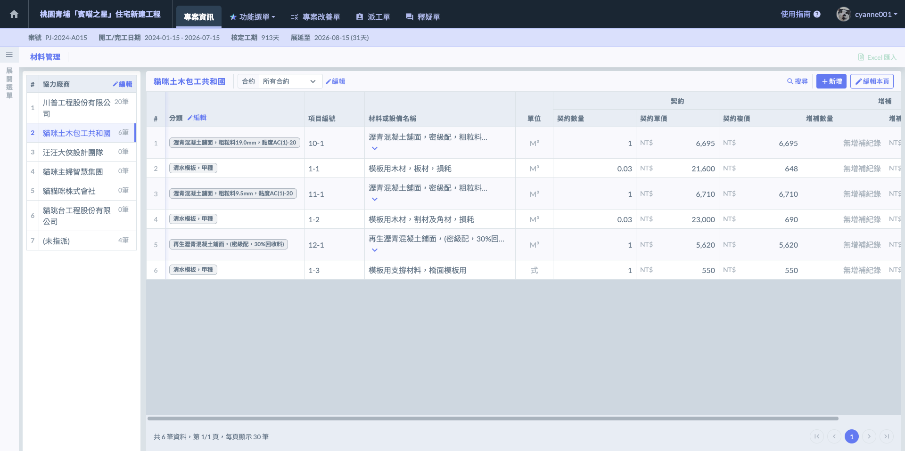

***

#### 02 - 3｜移至其他合約

若您僅需針對單一材料進行廠商內部的情項調整（例如：將工項由「原始合約」移至「增補合約」，或從「沒有合約」歸位至正式合約），可直接採取以下簡便操作：

1. 啟用編輯模式(圖十三)：於材料管理頁面右上方點選  圖示，系統即會進入編輯狀態。

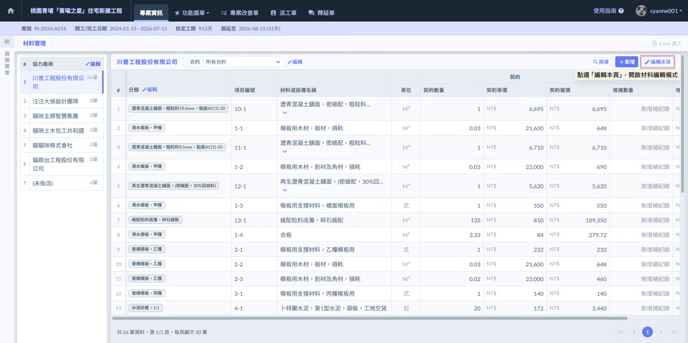

2. 開啟功能選單：在該材料的最右側，點選「⋮」圖示開啟功能選單。
3. 執行合約移轉：從選單中選取  選項。

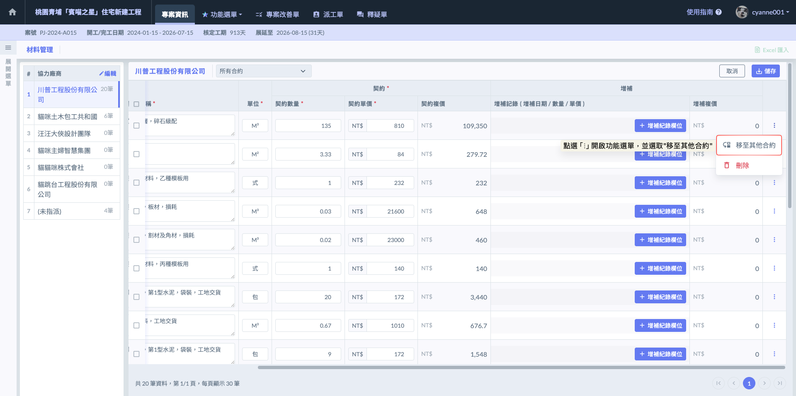

4. 選取目標合約：在彈出的視窗中，選取同一廠商下的目標合約名稱，確認後該材料即完成跨合約轉移。

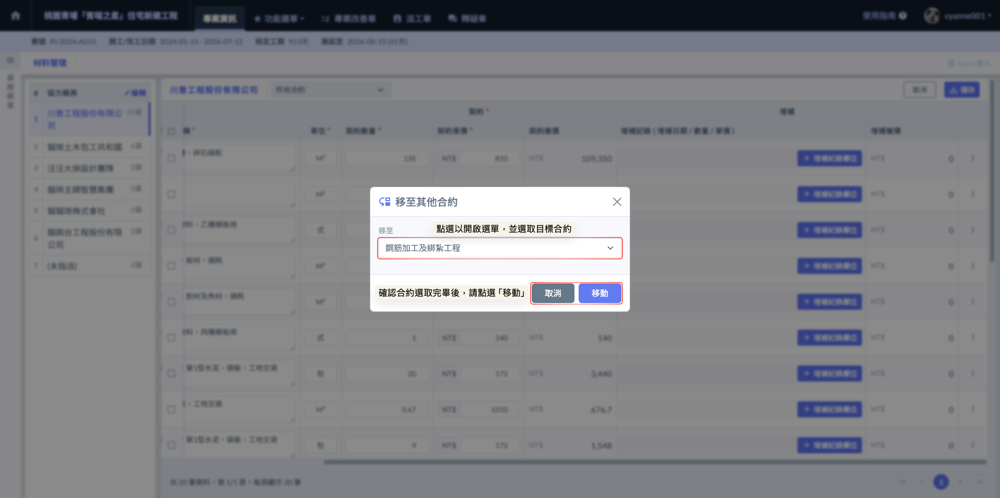

***

### 03｜增補紀錄

材料建置完畢後，若後續因變更設計、材料追加或其他合約變更事宜，您可針對該材料持續回報『增補紀錄』。系統支援單一工項建立多筆增補，每筆紀錄皆須詳實附上三個關鍵數據：增補日期、增補數量、增補單價。

當專案發生變更設計或追加項時，請依據以下步驟在系統中反映數據變動：

1. 開啟編輯模式：在材料管理頁面右上方點選  圖示，進入編輯狀態。

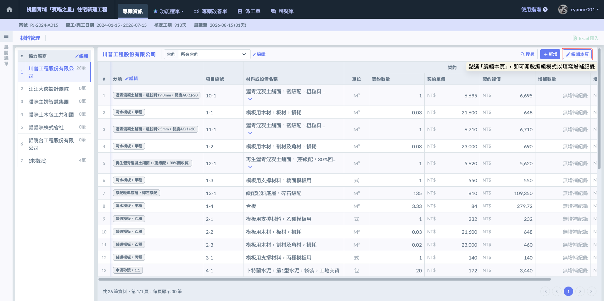

2. 新增紀錄：找到欲填寫增補的材料，於其『增補』欄位內點選 。
3. 填寫數據：在彈出的視窗中，填寫增補日期、增補數量、單價等資訊。若該工項涉及多階段變更，可持續點選  以新增多筆紀錄。
4. 確認與儲存：確認所有增補資訊填寫無誤後，務必點選畫面右上方的  按鈕。

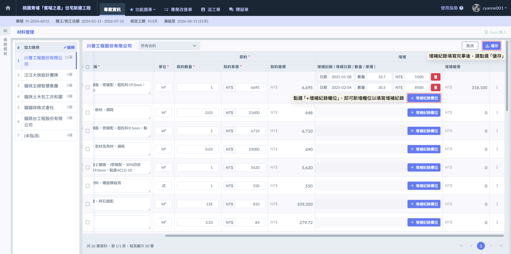

如圖十八，完成增補紀錄的填寫並儲存後，在材料管理管理列表的『增補數量』欄位中，會出現  圖示。您只需點選該圖示，即可隨時開啟詳細視窗，查看該材料歷次變更的完整數據紀錄。

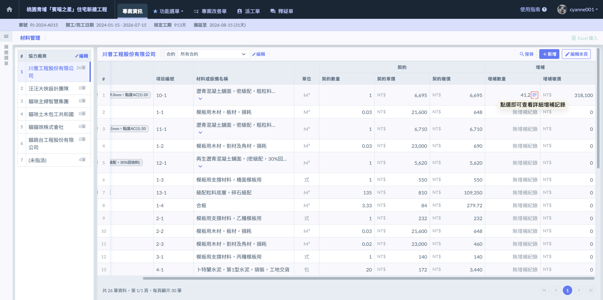

如圖十九，開啟該材料的『詳細增補紀錄』視窗後，系統會完整呈現該材料所有的增補紀錄。

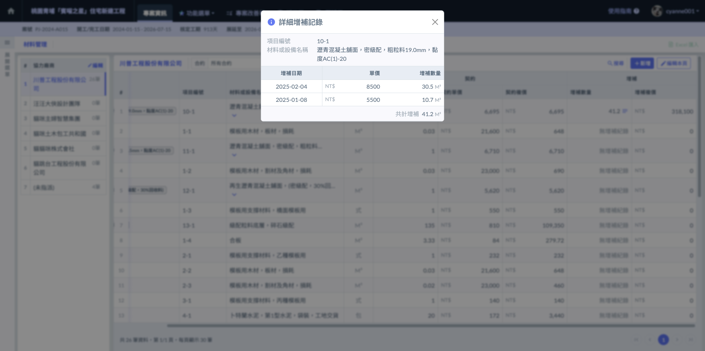
