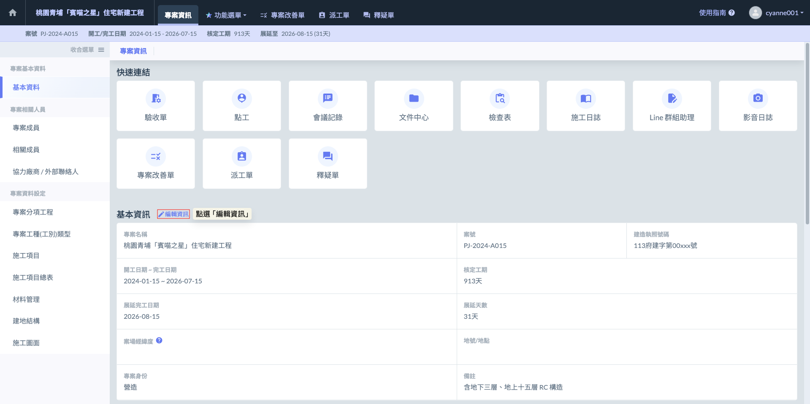
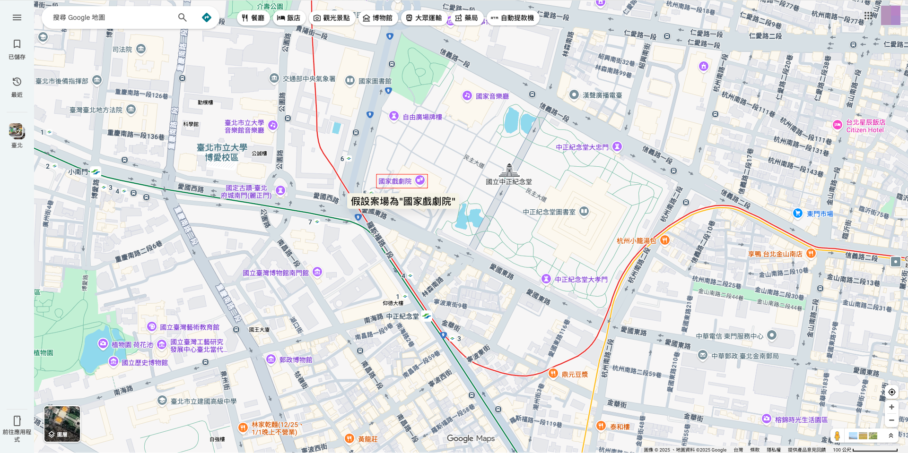
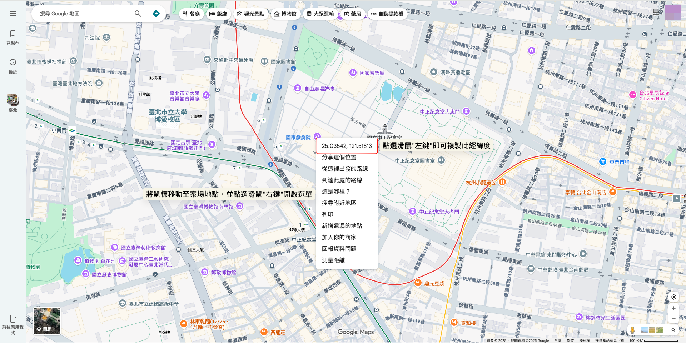
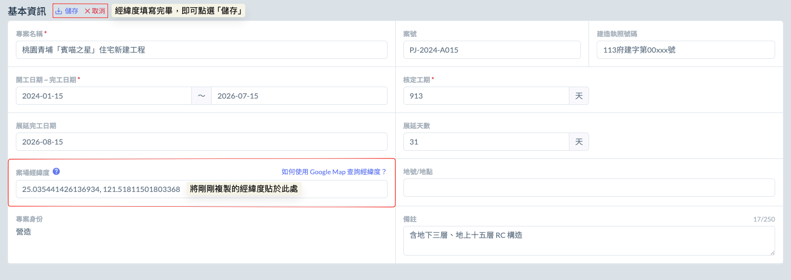
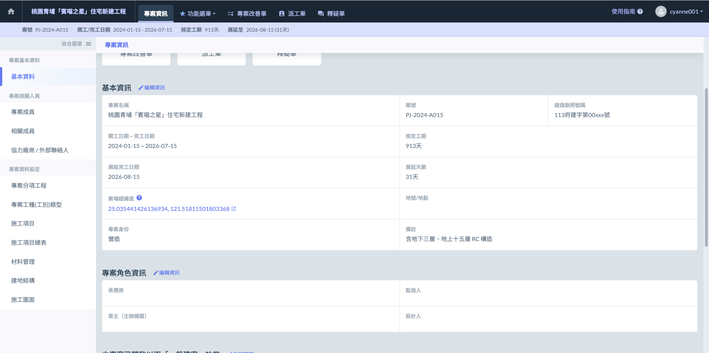
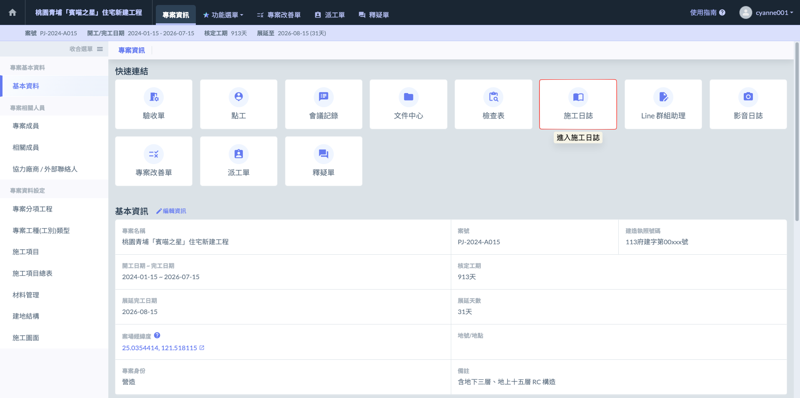
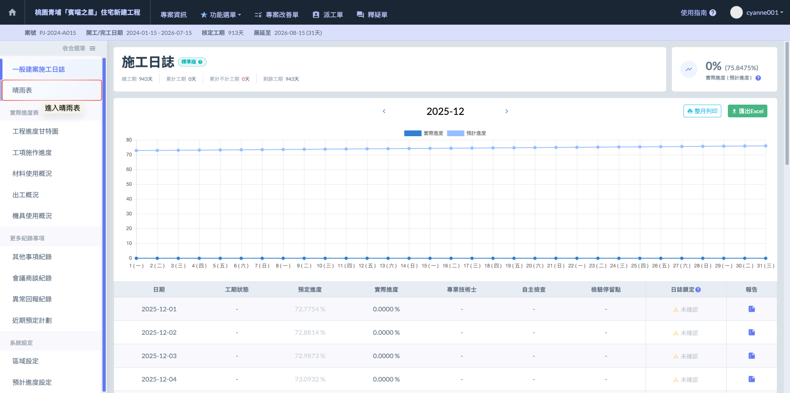
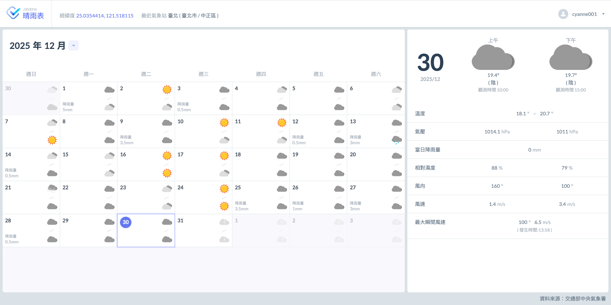
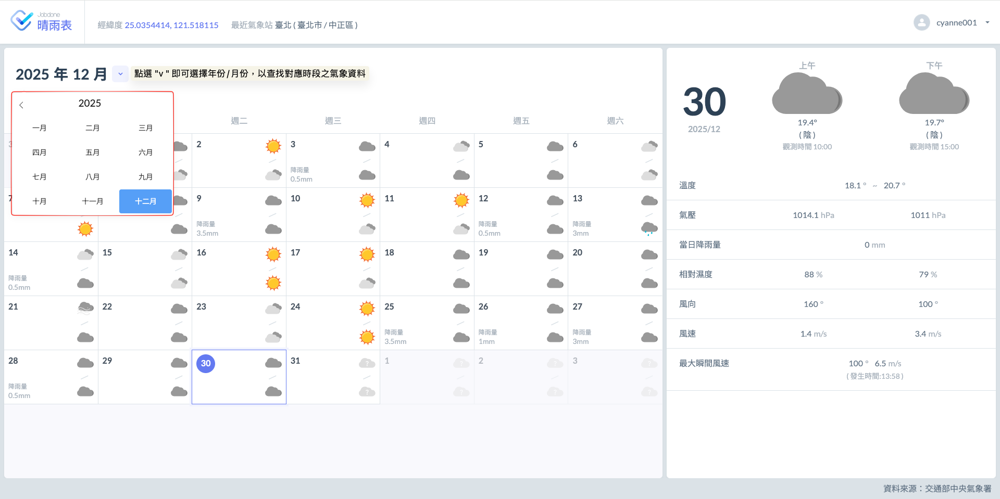

# 晴雨表

Jobdone 內建自動化『晴雨表』功能，系統會即時介接中央氣象署 (CWA) 開放資料進行數據同步。只要於專案資訊中完成 **經緯度座標** 設定，系統便會精準定位最近的觀測站，並將天氣資訊擷取並代入晴雨表中。除了基礎的晴雨狀態，更提供降雨量、溫度等詳細氣象參數，作為施工安排與工期檢討的專業參考依據。

### 01｜使用流程



#### 編輯專案基本資訊

進入專案後，點選『基本資料』區塊旁的  圖示，即可針對各項資料進行調整與更新。




#### 查找案場經緯度

為了讓系統精準同步天氣資訊，請先前往 Google 地圖（Google Maps）找到您的案場位置。

如圖三，於地圖目標點上方按下滑鼠右鍵，即可看見一串十進位的『經緯度數字』。點擊該座標即可完成複製，隨後將其填入專案的基本資訊中，系統便能自動啟動氣象數據對接。




#### 填寫經緯度

將已複製之經緯度資料填入專案基本資訊之<kbd>**案場經緯度**</kbd>欄位中，系統便能自動啟動氣象數據對接。

完成畫面如下：




#### 進入晴雨表

如圖六，當經緯度資料填寫完畢並儲存後，請切換至『施工日誌』功能。

如圖七，進入日誌後，請於左側選單點選<kbd>**晴雨表**</kbd>，此時系統已自動根據座標同步天氣資訊。

進入後，您即可於晴雨表頁面中查看即時的氣象紀錄。




#### 查看晴雨表資訊

晴雨表介面參考如圖八所示，系統將完整呈現中央氣象署的觀測數據，包含每日的**溫度區間**、**大氣壓力**、**降雨量**、**相對濕度**，以及**風向**、**風速**與**最大瞬間風速**等關鍵氣象參數。

如圖九，晴雨表以『月份』為預覽單位。您可透過上方的日期篩選器，點選展開圖示（⌵）來快速選取特定年份/月份；系統將立即切換並呈現該時段所對應的歷史氣象資料。



