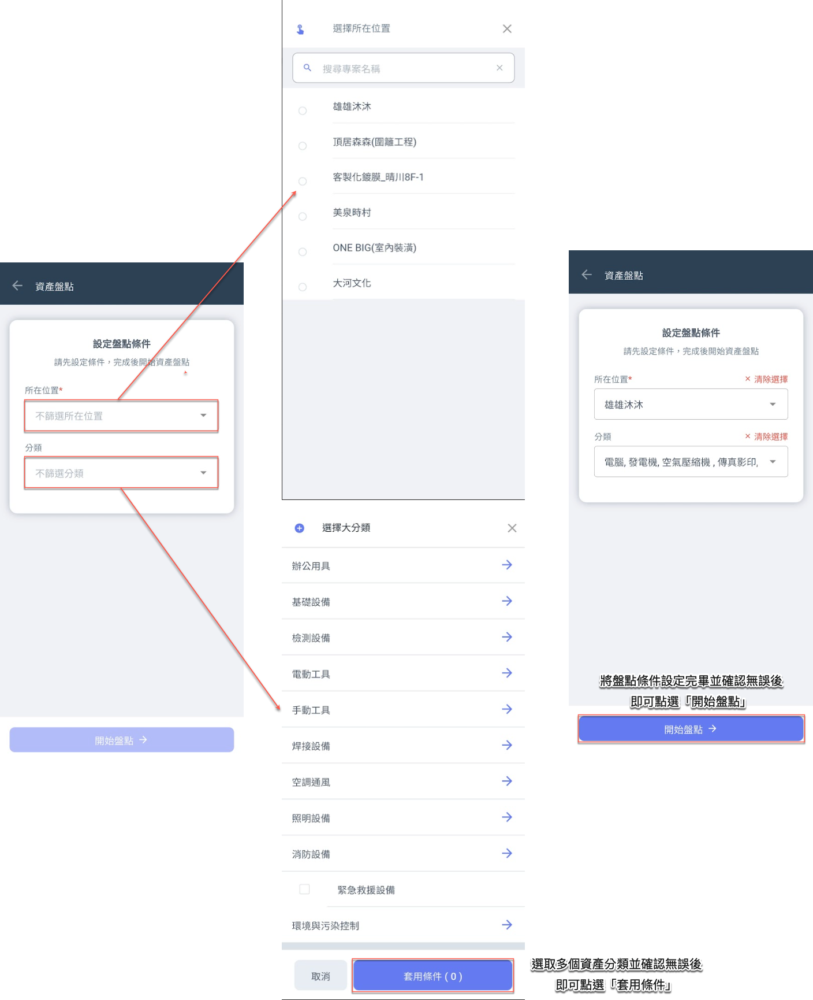
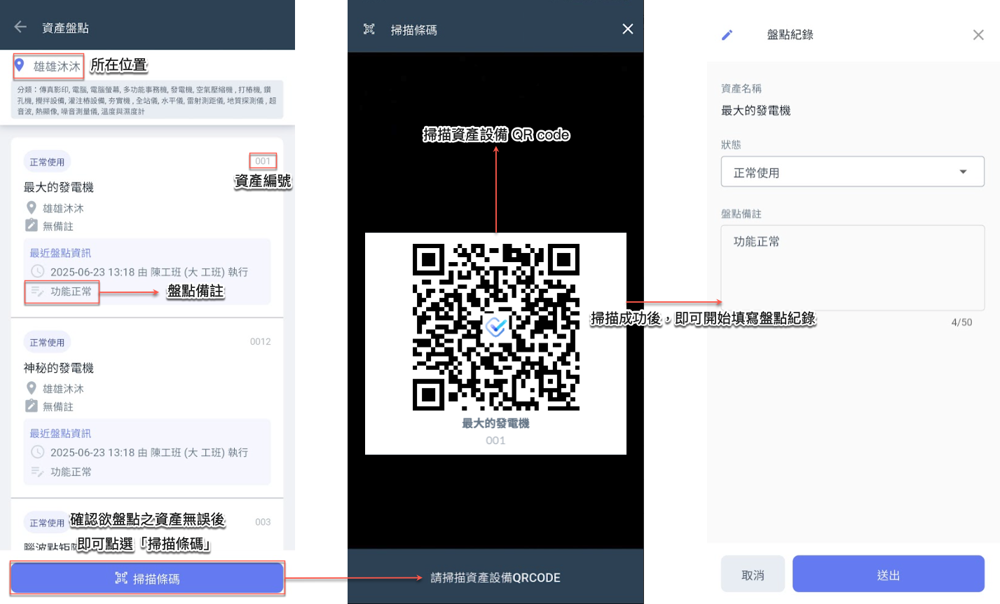
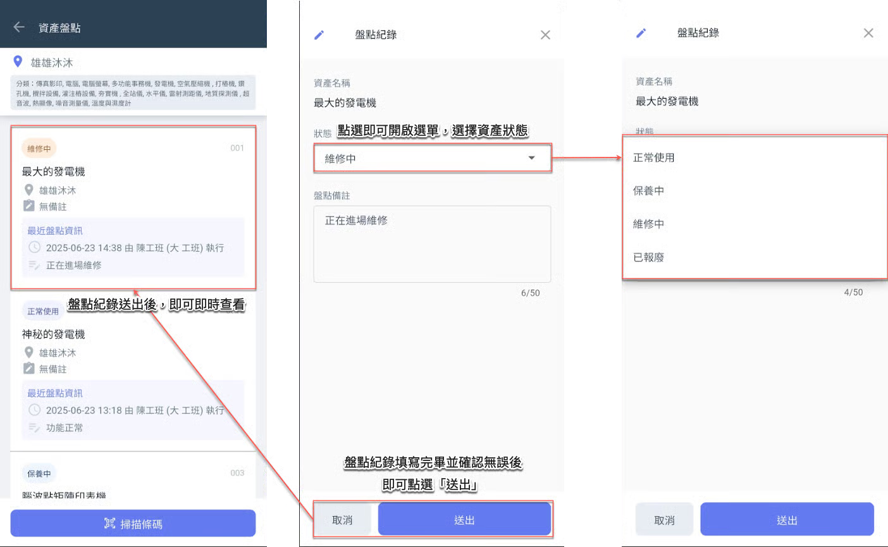
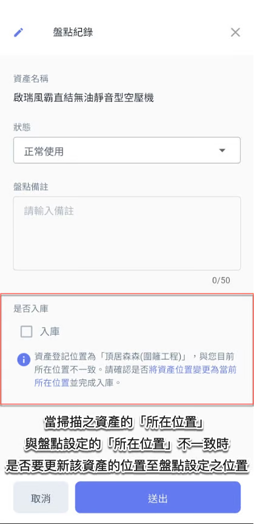

# 開始盤點

---
description: Start Inventory Check
---

# 開始盤點

## 01｜盤點



### 設定盤點條件

進入資產盤點主頁面後，即會進入設定頁面，您需先選擇欲盤點資產的**所在位置**及**資產分類**，以便系統篩選出符合條件的資產清單，進行後續盤點作業。

!!! warning
    資產分類的新增、編輯與刪除功能僅能於網頁版系統中進行操作，App 端僅供查詢與盤點使用。
    
    詳細操作流程，請參閱 ➙ [asset-management](../../dcp/company-configuration/asset-management "mention")




### 掃描條碼

將盤點條件設定完畢並套用後，即可開始逐一掃描欲盤點之資產 QR Code，進行資產盤點作業。




### 填寫盤點紀錄

如圖四所示，若掃描到的資產設備不在所設定的盤點範圍 (所在位置) 內，系統將提示<kbd>**是否入庫**</kbd>，您可依實際狀況選擇是否將該資產納入此次盤點紀錄。



